# 007：IBM《机器学习（无监督学习、深度学习和强化学习、毕业项目）｜machine learning》中英字幕 p07 6_选择合适的K-均值算法聚类数量.zh_en -BV1eu4m1F7oz_p7-

Now that we're familiarized with how K means works， let's ask an important question。

How do we choose K， how do we choose that number of clusters？

Now sometimes there's going to be a specific amount of clusters。

 you know you would like dependent on that specific objective of your clustering task。

 so examples of this may be that your computer has four cores so it naturally becomes that you're looking for four clusters。

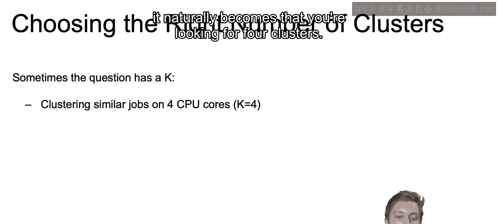

Or the business side of your organization may dictate that there are 10 clusters when trying to determine the different measurements to incorporate into our different sizes。

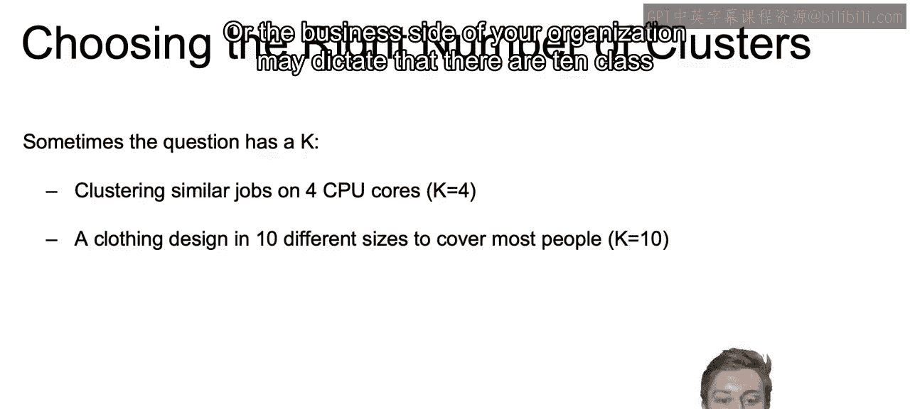

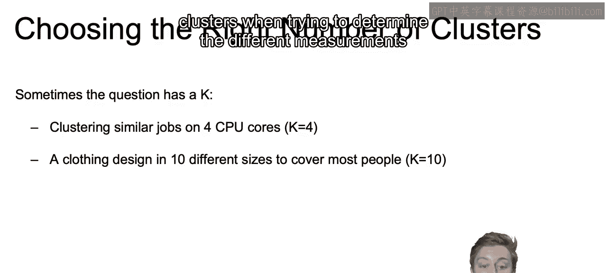

Or a navigation interface for  browsing scientific papers may need to be split into 20 disciplines specifically。

 so you set K equal to 20。

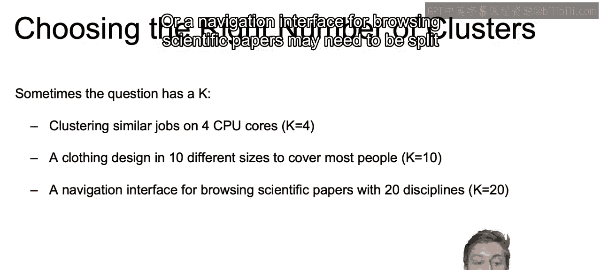

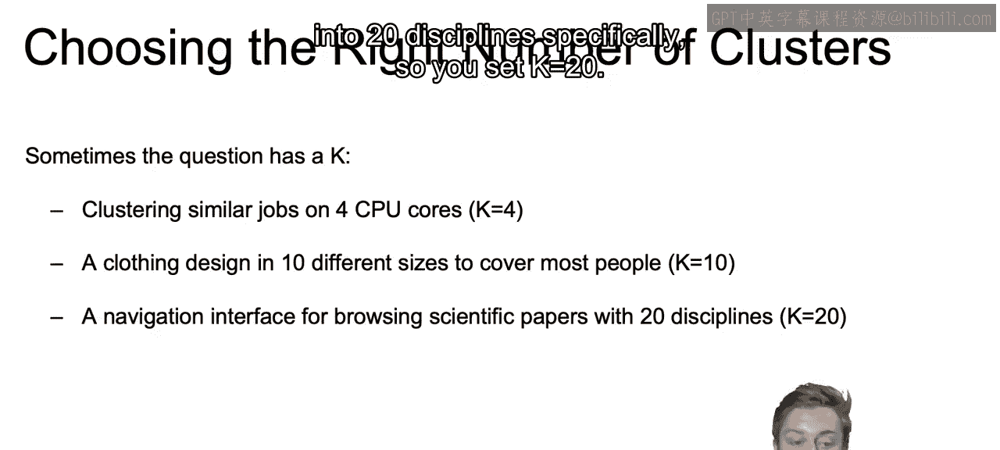

On the other hand， there's going to be times， though， that the number of clusters is unclear。

 and we thus need an approach for selecting the right number of clusters for our problem。

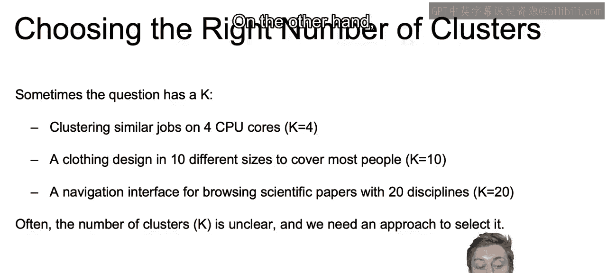

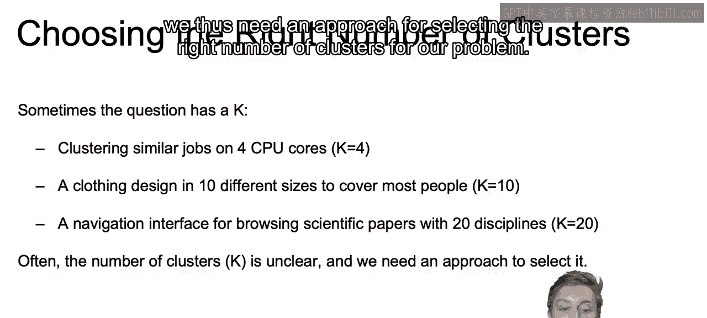

Now， in order to do so we're going to introduce some metrics。

 one of those metrics is going to be inertia， and that's a popular metric to help us accomplish this goal and understand the entropy built into our different clusters。

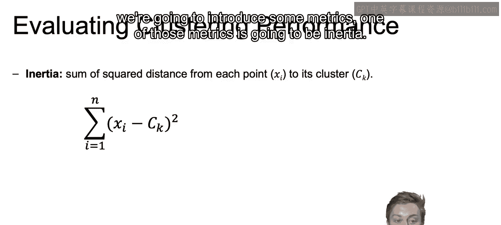

The metric is going to just give us the total sum of squared distance of each point to its cluster centroid。

This way we're penalizing spread out clusters and rewarding tighter clusters to those centroids。

One drawback of using inertia is that this value will be sensitive to the number of points in the clusters。

 If you think about it， no matter what， as we add more points。

 we will continuously penalize our inertia， even if those points are relatively closer to the cents than the existing points。

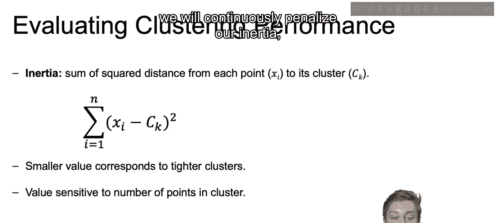

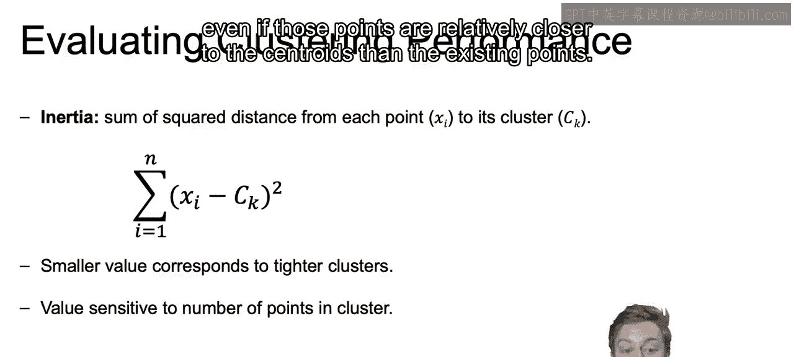

Now， distortion， on the other hand， takes the average of the square distances from each point to its cluster centroid。

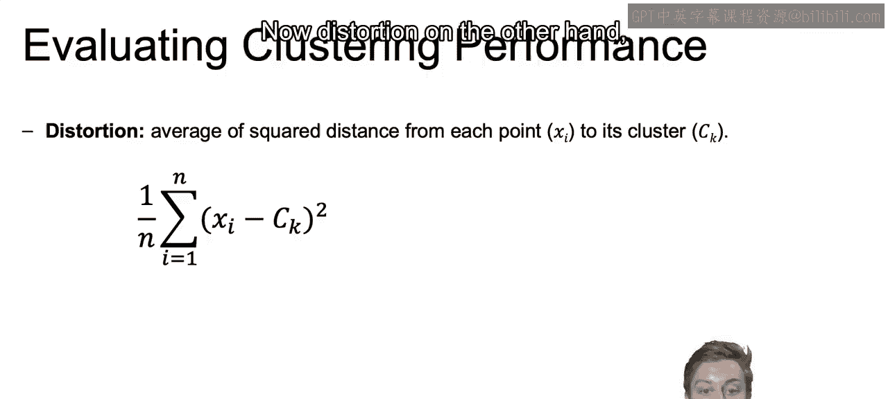

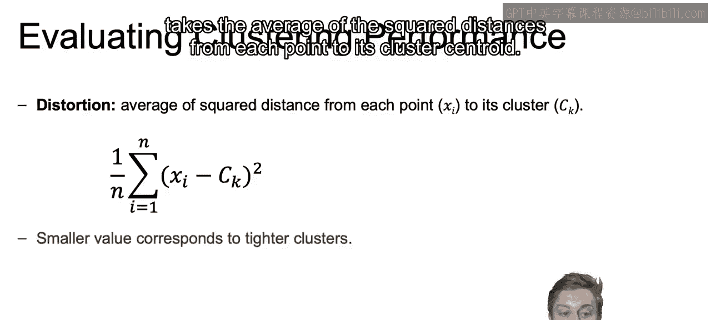

Again， it'll still hold that smaller values will correspond to tighter clusters。

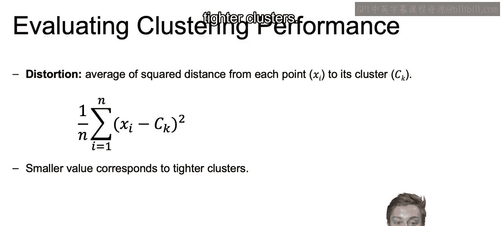

But this time， adding more points will not necessarily increase distortion as closer points will aid in actually decreasing that average distance。

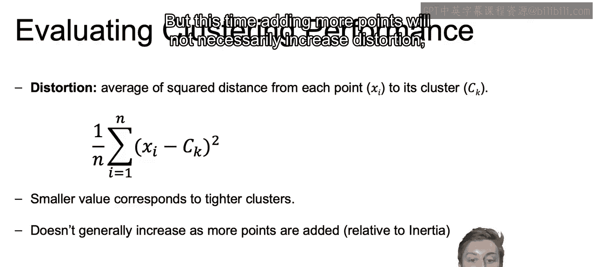

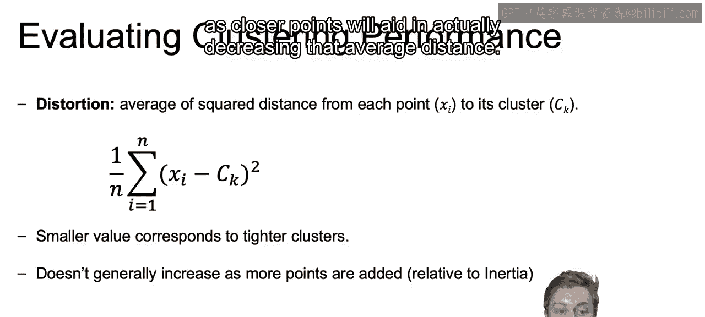

So thinking about inertia versus distortion， both are going to be measures of entropy per cluster。

Inertia will always increase as more members are added to each cluster。

 but this will not be the case with distortion since it will work by taking that average。Thus。

 when the similarity of points in the cluster is more important， you should use the distortion。

 And if you are more concerned that clusters have similar numbers of points。

 than you should use inertia。And generally speaking， these will decrease fairly similarly。

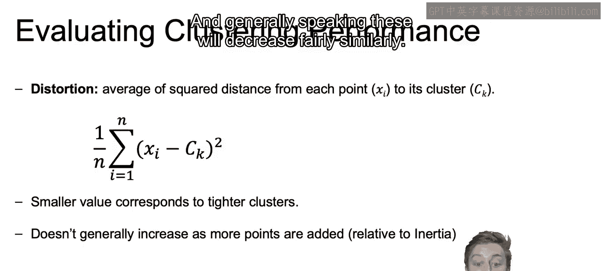

So what can we do in order to find the clustering with best inertia？

What we would do is we initiate our K means algorithm several times。

And with different initial configurations。 And with that， assuming we predeine what our k is。

 we can compute the resulting inertia or distortion。

 keep that results and see which one of our different initializations or configurations lead to the best inertia or distortion。

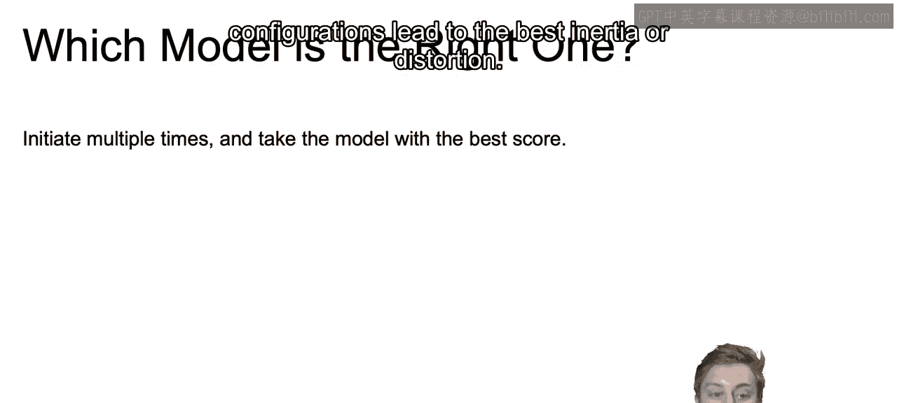

So as an example of this， we're thinking which model is going to be the right one。

 And we see for this K equals 3， and we have our three different centroids that it had converged to。

 We see that the inertia is equal to 12。645。We look at this other converged K means algorithm with k equal 3 again。

 and we see that inertia is equal to 12。943。And then again， we see the inertia is equal to 13。112。

 all these different converged K means algorithms， but with different initializations。

So we would want to pick the inertia with the lowest value between the three。Here。

 we introduced inertia and distortions and showed how it could be used。

 as we just saw to choose the best model given a specific K。In the next video。

 we will extend this to show how this can be used to help determine the correct number of clusters as well。

As well as showing in the next video the syntax used to compute these methods using Python。

 All right， I'll see you there。

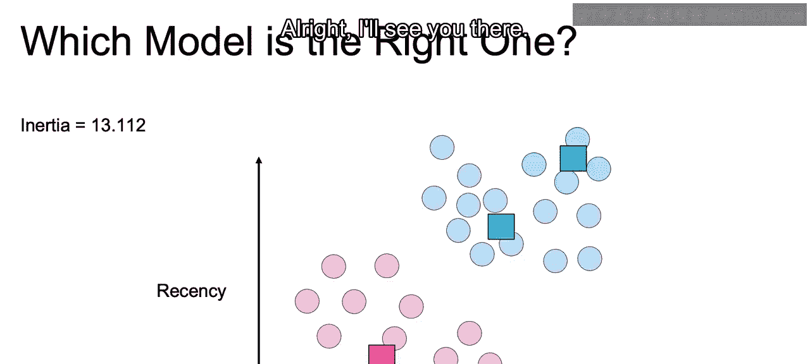

