# 008：IBM《机器学习（无监督学习、深度学习和强化学习、毕业项目）｜machine learning》中英字幕 p08 7_肘部法和应用K-均值算法.zh_en -BV1eu4m1F7oz_p8-

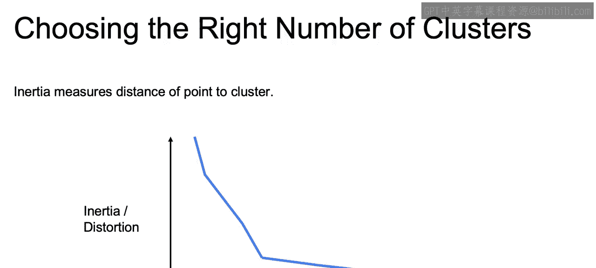

So how do we use inertia or distortion to help choose the right number of clusters。

 as I promised we would do in the last video。

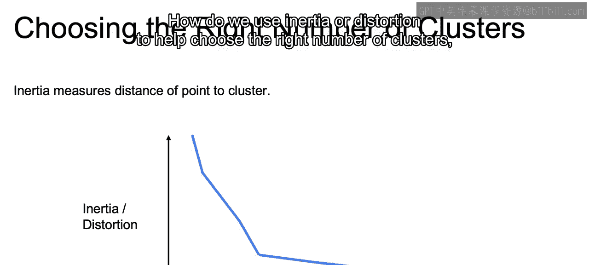

Now we know that inertia and distortion will measure the distance of each one of our points to their respective centroids。

And if we think about this metric。Either inertia or distortion。 Techically speaking。

 we will almost always be decreasing this value as we increase the number of clusters。

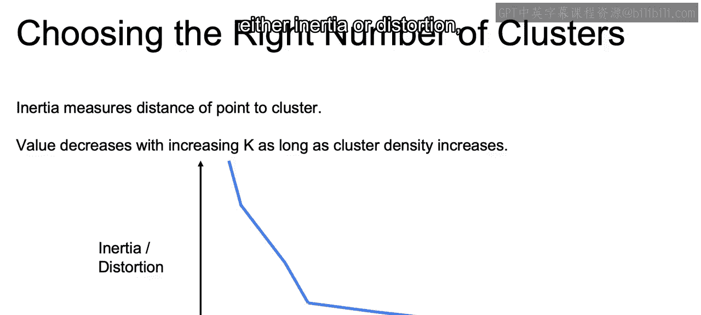

And we can think of this in regards to the extreme if we had a cluster for every single one of our data points。

 our distance to each centroid would then be equal to 0。

 and we would end up with inertia or distortion of0。So in order to accommodate this。

 this is where the elbow method will come into play。We see here that we have an inflection point。

That could be chosen， perhaps as a good K。 And again。

 this is a graph of the number of clusters on the X axis and either inertia or distortion on that Y axis。

And we can see until this inflection point， the inertia or distortion goes down very rapidly。

But after this point， the rate of decrease slows down quite dramatically。

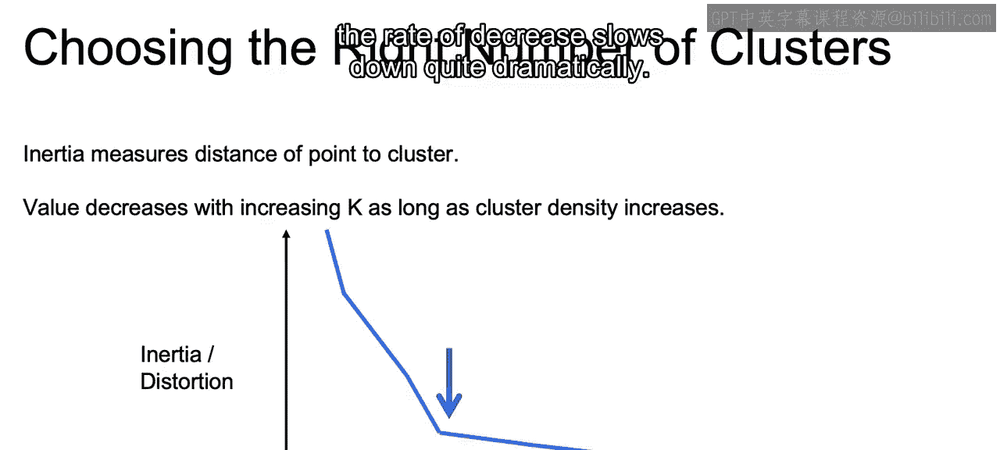

And this slowing down can indicate to us a natural point in our data set where the number of groupings make sense and should serve as a logical choice for K。

And again， this works for both distortion and inertia。

 where inertia penalizes different number of points within clusters and leads to more balance。

 whereas distortion will penalize average distance and lead to more similar clusters。

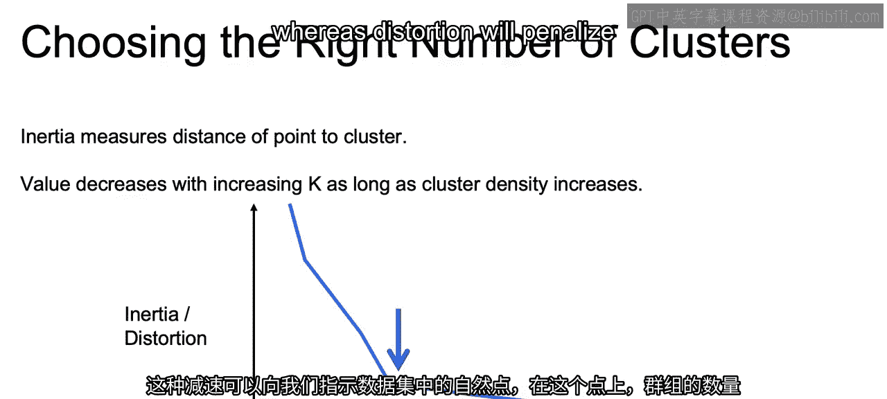

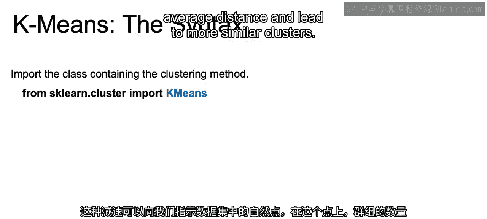

So how do we implement K means in Python， So this will be our first unsupervised learning algorithm that we do in Python。

 We will still use that same first step where we will import the class。For our unsupervised model。

 So from Sk learn dot cluster， we import K means。We're then again going to initiate an instance of this class。

 as well as pass in each of the different hyperparameter for that class。

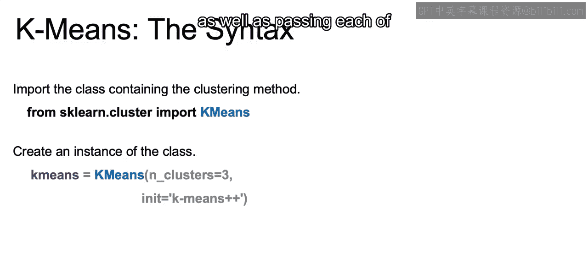

So we pass in the final number of clusters， we are going to have to decide that。

 and then we'll show in just a bit how we can use this to actually use the elbow method。

But we get our N clusters equal to 3。 We're also initiating using the K means plus plus initialization that we discussed earlier。

 where we had the distance squared over the total distance squared。

 This will also be the default for K means。 and you can look at different initialization techniques in the documentation。

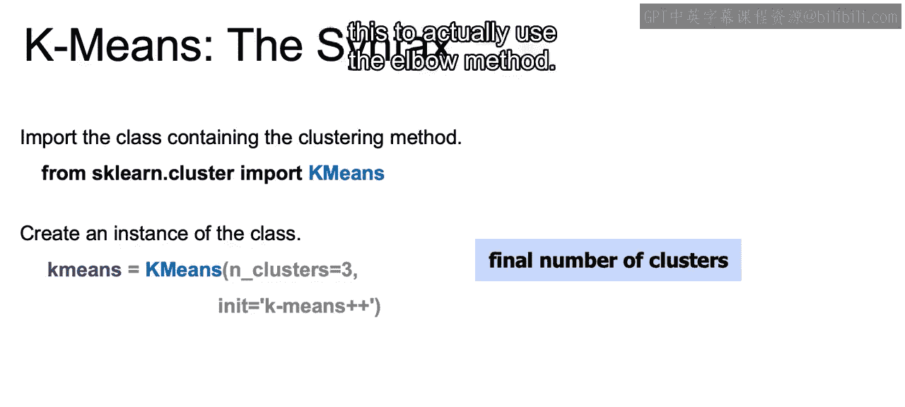

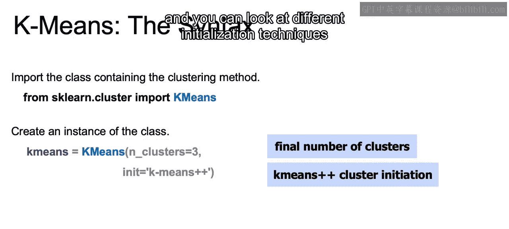

We're then going to take this initiated class and fit an instance of it to the data and then use that to predict the clusters for either new data or even our existing data。

So first step is called dot fit on x1。And then we call predicts。

 And this is all similar to what we saw with the supervised learning as well。 Again， when we do this。

 it is safer to fit and predict on that same data set。

 because we're just trying to find those groupings and we're not overfitting to some type of solution。

 as we did with supervised learning。 So we could predict on X1 as well to see the groupings that come out of X1。

And then just a side note， we can also use batch mode。

 which will just randomly select different batches and use something similar to not similar exactly like K means。

 but just with smaller batches， and this will help speed up the algorithm if you find that K means is too slow。

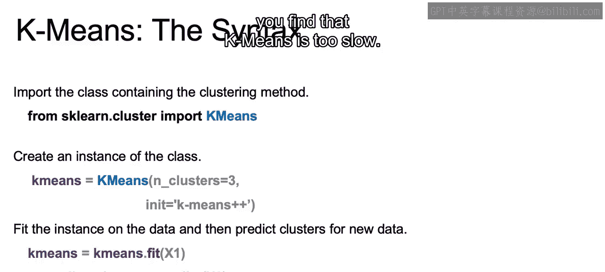

Now， to implement the elbow method。What we're going to want to do is fit K means for various levels of k and then save those inertia values。

So we're going to start off with inertia equal to a blank list。

We're then going to run through a number of different clusters ranging from one to10。

 and we're going to fit the Ka means algorithm for the different number of clusters。

So we do 4K en list clusters， we initiate a new K means。With the number of clusters equal to one。

  two， three， four， etc ce。We call K means dot fit on our data。

And then we append once we fit it to our data， we have this attribute of the inertia for that number of clusters so we can get the number of clusters for each the inertia for each one of these different number of clusters。

 and we append that on and we can then use PLT dot plot and the list of clusters as our x axis。

 the inertia as our y axis in order to find that actual elbow。

Now that closes out our discussion here on K means。

And we will move here into our lab where we'll see how we do all this in practice。 All right。

 I'll see you there。

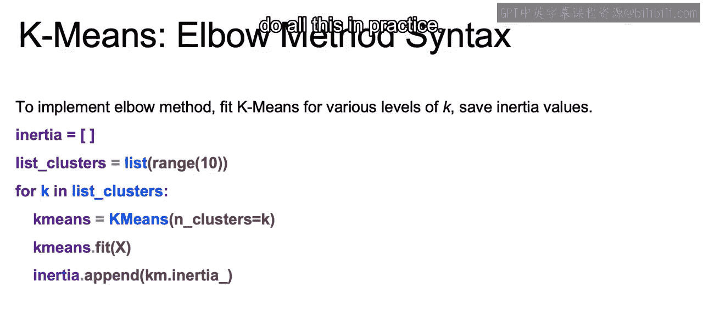

