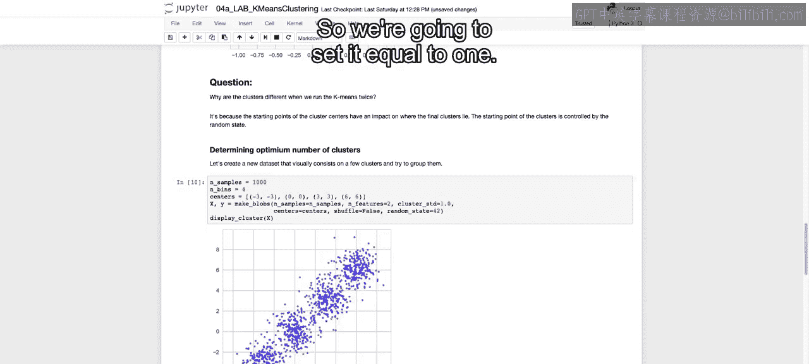
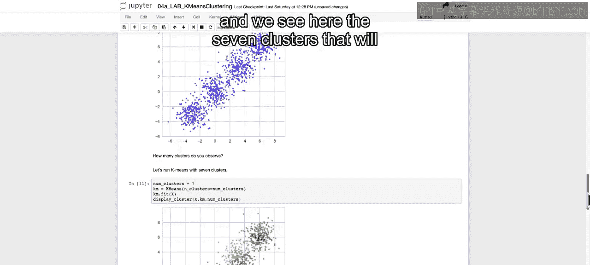
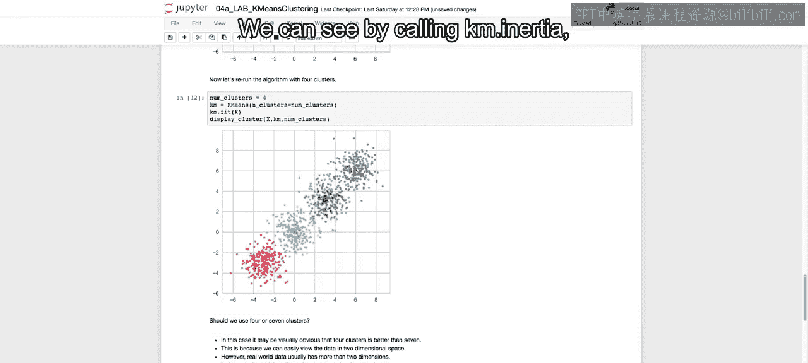
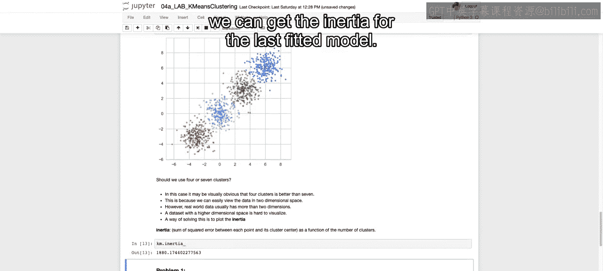
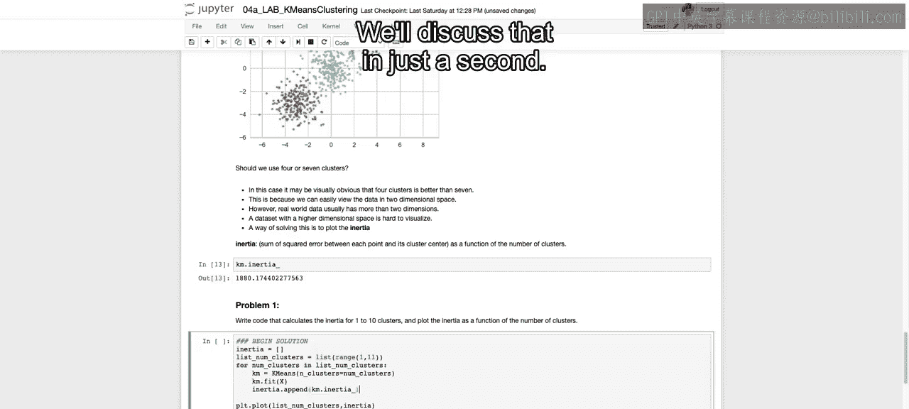
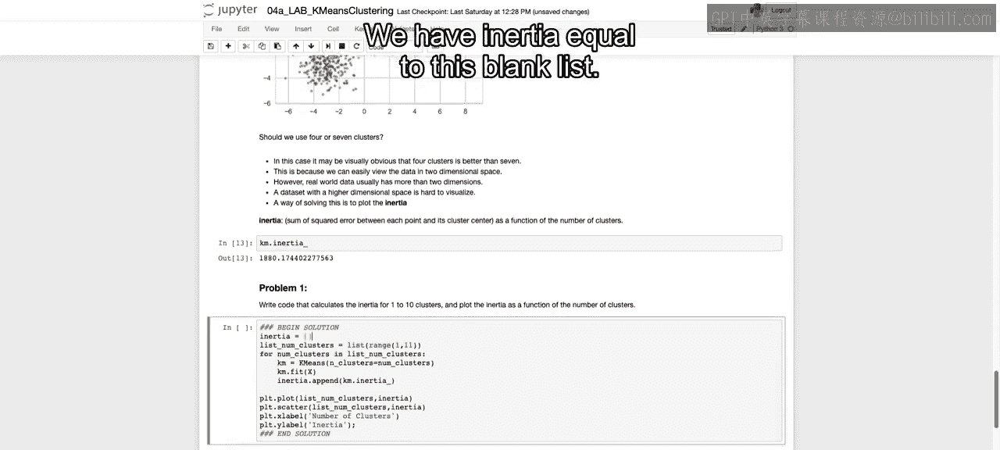
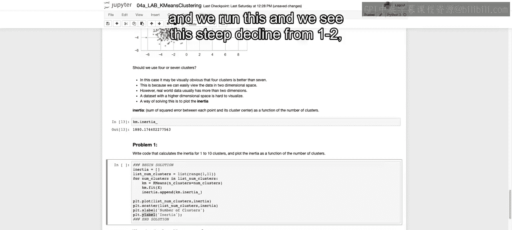
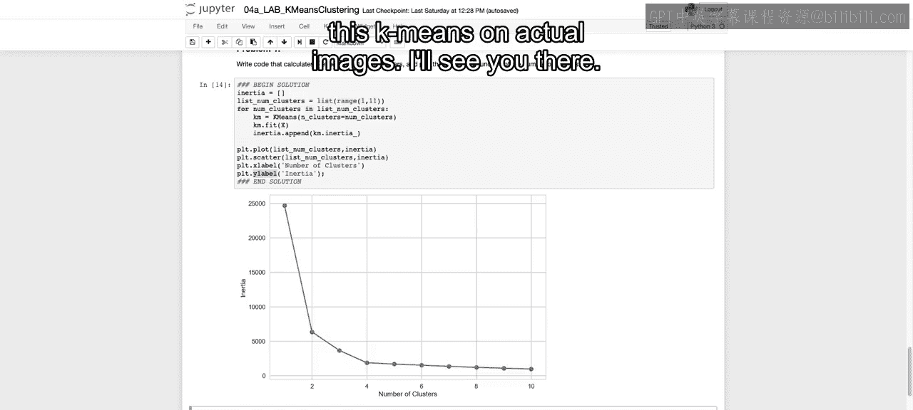

# 010：IBM《机器学习（无监督学习、深度学习和强化学习、毕业项目）｜machine learning》中英字幕 p10 9_K-均值算法笔记本第2部分.zh_en -BV1eu4m1F7oz_p10-

Now， in this video， we're going to talk through how you can actually choose the optimum number of clusters。

 depending on your data set。So we're going to synthetically create our data set here so we know the number of clusters。

 and that will allow us to really understand how we choose those clusters and how that looks when we create that elbow plot that we discussed earlier。

So in order to synthetically create these different blobs， as you see here。

 we're using the make blobs function。We are first going to say how many samples we want。

 so we're going to have 1 thousand different data points。

How many bins we're going to set that equal to 4。 And then we're going to save the centers of each one of our different points。

 So we actually have these centers predefined。 and we set them at negative 3，3，0，0，3，3， and 6，6。

 So you can imagine these are in a straight diagonal line。And then in order to make blobs。

 we're going to say， and that'll output to values we care here about the X。

 We're going to say the number of samples that we want。 We set that equal to 100th。

The other important point that we have here is going to be the cluster。

 underscore STD or the standard deviation of that cluster。

 and that will define how tightly around each one of these centroids we going to plot each one of our data points。

And then again， we set our centers equal to the centers that we have defined above。

 and we are going to set the random say equal to 42 to ensure that we have the same values as well。

So I called display Cussler， which is going to be the same functionality that we discussed in the first video。

 We're going to call it on our new X。And we see here somewhat our four different blobs already visually。

 So if you wanted these to be very clear again。We can use that standard deviation if it's a smaller standard deviation。

 it'll be tighter around those clusters。 And you see if I were to run this。

 that they are really tight around each cluster and very， very obvious。

So that takes a little too far。 we don't want it quite that obvious。

 so we're going to set it equal to one。

We're then going to run our K means and set our initial number of clusters equal to7。

So you say K means we call the number of clusters equals to 7。 We do K M dot fit。

 and we can use display clusters using the function again that we defined earlier。

 which will give us each one of our different plots， color coded。

 as well as their different centroids。We pass in KM， we pass in that number of clusters。

 and we see here the seven clusters that will be。

Cated，1 we call K means with clusters equal to 7， and seems to arbitrarily be splitting in a way。

 Each of these different four clusters into subsets。Now， if we call no clusters equal to 4。

 we run that same code。It seems visually that we have a much cleaner set of four different clusters。

Now， we asked the question here。 And here， it's obvious because we have it plotted in two dimensions。

 and we had these clear， distinct， different blobs。

But should we use four seven clusters in the real world？

Data usually will have more than these two dimensions。

And a data set with higher dimensional space is going to be very hard to visualize。

So way to solve this problem and decide， should we use 4 or 7 is going to be what we discussed earlier。

 finding that elbow by plotting inertia versus that number of clusters。

So we can see by calling K M dot inertia， we can get the inertia for the last fitted model。

 So this will be for the number of pluss equal to 4。

And I want you to think before I run this， which one will have a lower overall inertia。

4 clusters or 7 clusters。 And we'll discuss that in just a second。

So in order to plot this out。We create a blank list， so we have inertia equal to this blank list。

We have that we're going to run through a range of different numbers of clusters ranging from one up to 11。

 including 11， so up to 10。And then four numb clusters in this list。 So for that  one through 10。

We're going to fit a K means on that number of clusters。We're then going to。Take that inertia list。

And depend on for our fitted model， the inertia for that given model，4 clusters equal to 1，2，3。

 et cetera， up until 10。We're then going to plot。As our X axis。

 we're going to use the list nu clusters， which is going to be those values 1 to 10。

 and as our Y axis is going to be these inertia values that we're coming up with that we're pending onto the list。

We call PLT dot scatter on these two。 So this will actually create a line plot。

 This will create our actual markers。 There's other ways we could have done this， as well。

We're then going to set our X label and our y label to number of clusters and inertia respectively。

And we run this。And we see this steep decline。From 1 to 2， then from 2 to 3，3 to 4。

 And then you see that kind of slows down after that4。Now。

 this is obviously not always going to be perfect。 At times， it will be difficult to really say。

 where is that inflection point here， it may even look like two because of such a steep drop off from 1 to 2。

 for that should generally be the place to stop off from 1 to 2。 But you see that at 4。

 it kind of starts to flatten out。And I asked you that question earlier。

 which one will have lower inertia of 4 or 7。 And hopefully， if you've been paying attention。

 you notice。 And as you see on the plot， then Nertia continues to go down as you increase the number of clusters。

 essentially， no matter what。So we see that the inertia continues to go down no matter what。

 but there don't go down as quickly once we hit that 4。 So that's our inflection point。

 And we say that we should probably use four clusters。

Now that closes out this video in regards to looking at this elbow plot of the number of clusters versus the inertia in the next video we'll see a practical application list and how we can use this K means。

On actual images。All right， I'll see you there。

