# 011：IBM《机器学习（无监督学习、深度学习和强化学习、毕业项目）｜machine learning》中英字幕 p11 10_K-均值算法笔记本（选修部分）第3部分.zh_en -BV1eu4m1F7oz_p11-

Now， let's move to a more practical application where we can actually see this in practice as we will take this image of bell peppers。

And then group together the different colors so that rather than working with the multitude of colors within this image。

 we're only going to be working with the number of colors that we create within our clusters。

 And we'll see what we mean as we walk through this notebook book。

So the first thing that we're going to do is read in this image。Now。

 when we call P L T dot I M read and we call this image。

 we are actually bringing it in as a numpy array。 So I'll show this in just a second。

 We can then use PL T dot I M show to actually show that image， which is currently as a nuumpy array。

 We can actually see that within our Jupyter notebook book。And then we're just calling Plt。

ax off because we don't want any axes when we're just plotting an image。

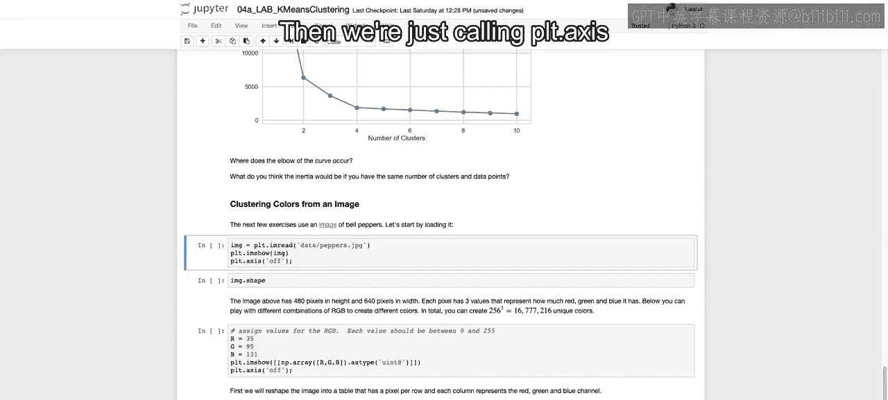

So he run this。

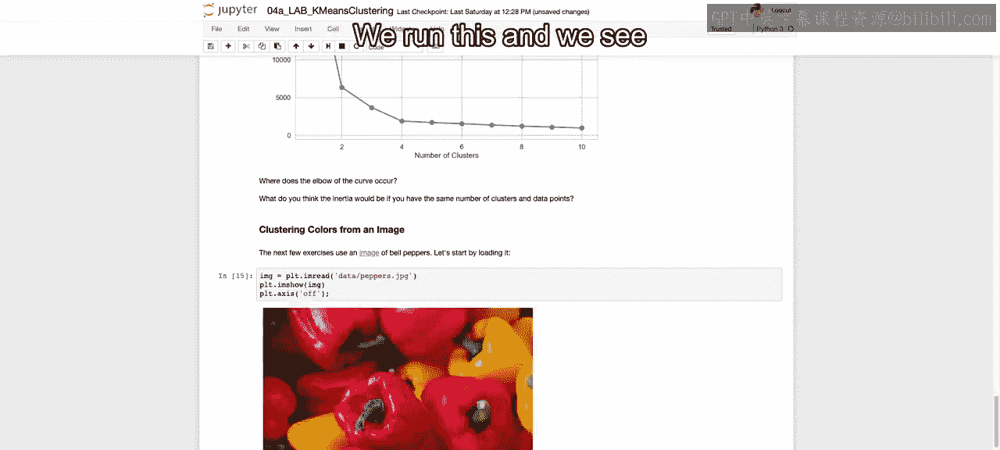

And we see our image with our different colors and our different shades of green， red and yellow。

We then I we call here imaget shape， but quickly， I want to show you what the actual image object looks like。

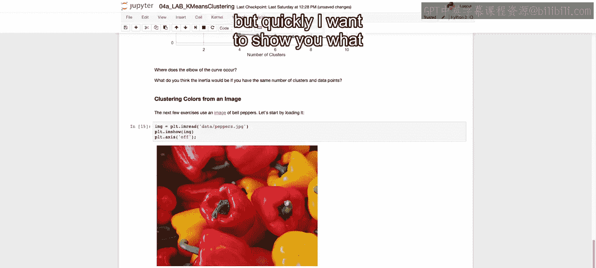

And as I mentioned， it's going to be taking this image that we just plotted out。 and rather than。

Giving the actual picture， we're actually just representing it as an array where each value is going to be how much in the red。

 green and blue scale， each one of these different pixels are。

 And that's going to be for every single pixel。 So we want to see how many pixels we have。

 And we have 480 times 640 different pixels。 And each pixel has three values that represent how much。

 again， red， green and blue it has。

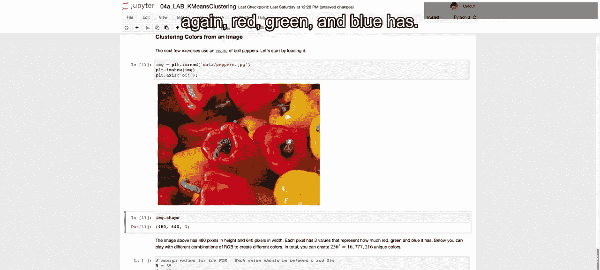

And below to just hone in on how we have this picture representation withinumpre arrays。

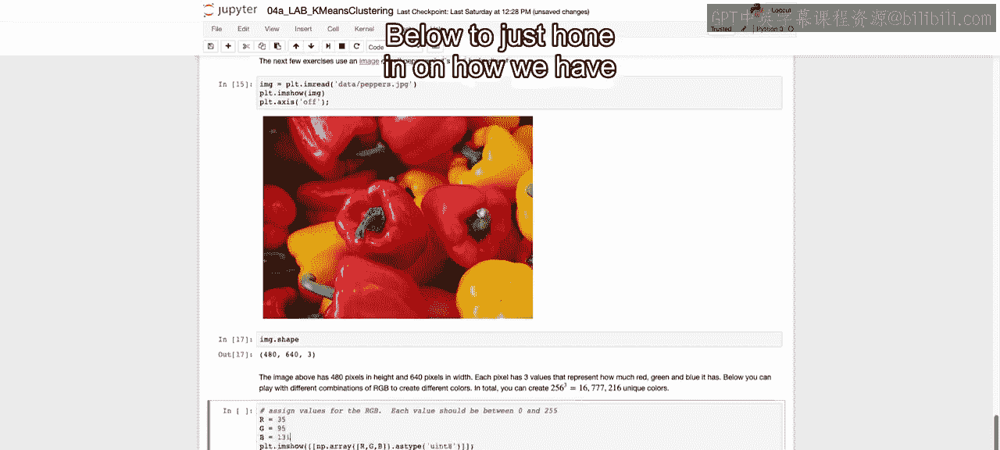

We're going to look using R equals all these R equals 35 G equals 95 b equals 131。

And we will and these are all values between 200，0 and 255。Were going to call P L T do I M show。

 And just for the specific array。 So as if it's just one pixel with a certain amount of coloration。

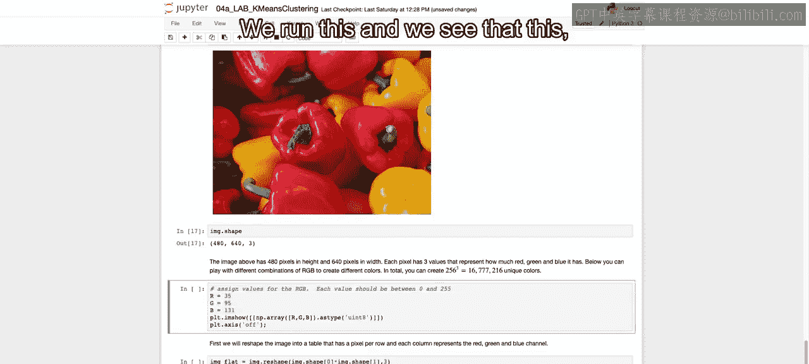

So we run this and we see that this， since it's mostly blue， will output something close to blue。

 If I were to decrease the blue to 13 and increase green to 1，95。 Then you see this very green image。

 And then just so you understand a bit of how coloring works。

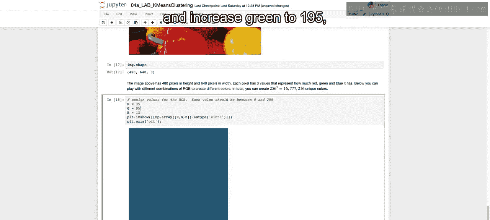

If we were to set this all to 100。 so if all the values are the same should be somewhere gray。

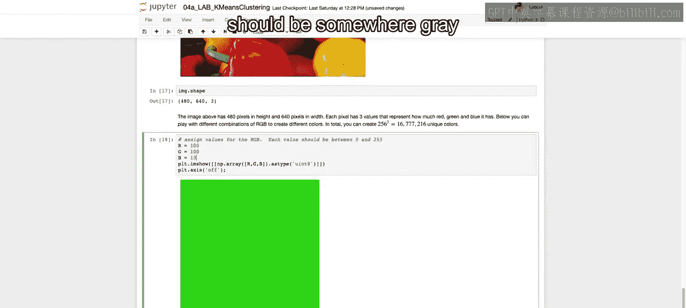

Because it's equal amountuns of each。 And if we set it all to 0。What do you think will happen？

I'll run that here。

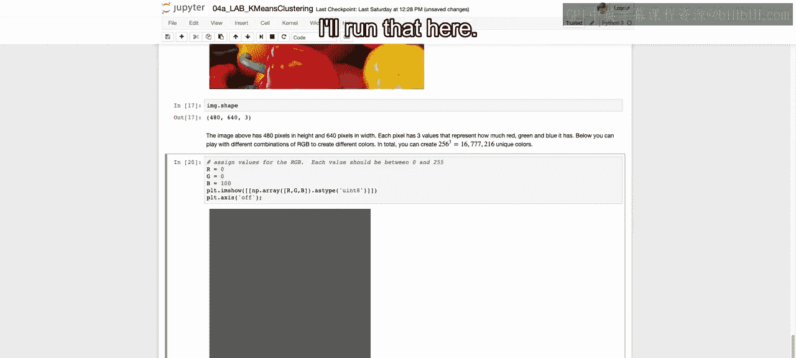

You see that we have black。And then if they are each 255， which is the maximum value。

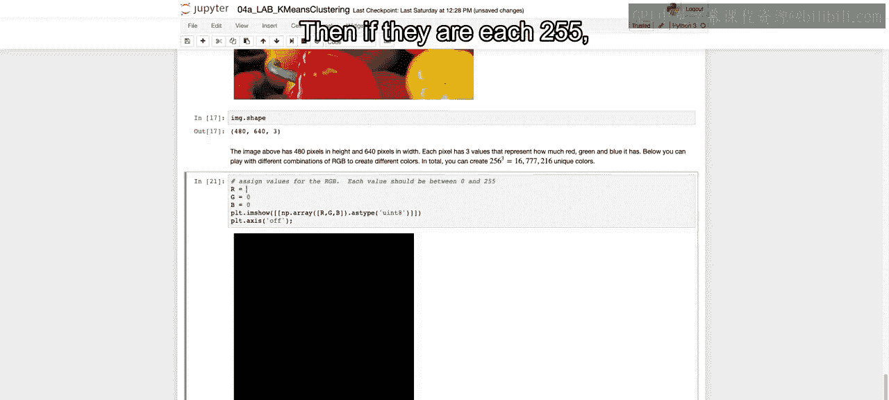

You see that we get white， so just an understanding。

 a quick understanding how each one of these pixels are being created using this nuumpy array。

So what we're going to do next is reshape our data frame so that it's only every single pixel is going to be a row rather than having three dimensions。

 we're going to make this two dimensions， So we're going to take our 480 by 640 pixels multiply 480 times 640。

 So again， each row will represent a single pixel。 and then the other shape will be the RGB and how much of each will be incorporated into that particular pixel。

So we call reshape。We say that thee。First dimension is going to be the first dimension of our original pixel times a second dimension。

 Again， that's it was originally in three dimensions。 We're taking those first two dimensions。

 multiplying those together。 So that's how many rows we have。

 And then the number of columns will be R G B O B3 relating to each one of those three。

And then just to see the first five values， we have。Each one of these rows represents a pixel。

 and each one of these numbers within that row represent either the red。

 the green or the blue respectively。And since 480 times 640 equals 307，200。

 that's going to be our new shape of our new Numpy array。Now we're going to run K means on the。

Image that we had using eight clusters。 So we're going to come up with eight groupings。

 So rather than every single to take every single one of these 307000 values and find eight groups to group these together into different segments。

We're then going to create a copy of that image。And replace that copy's values。

With their respective labels that were come up with these eight different clusters。

So rather than the actual value that was there， we're saying 4 k means where the label is equal to for all those 307。

000 rows， where a label was equal to label 1 out of each one of our unique labels， so one through8。

Replace that with the actual value for that cluster center。So I'm going to run this。

And it will replace all those values and just to show you quickly what that looked like。

Our new values， you see they are all the same here，43，156，43，56， and later on 236，172，8。

 these represent one of the eight different clusters that we had。

 and we replaced those original values that we see up here。

With these one of eight values that we have created using our different centroids。Now。

 to see what that looks like， now that we've replaced this multitude of different hues of different colors with only eight possible colors。

We're going to reshape that to that original image shape。

In order to actually show this as an image using PLT IM show， we have to get it back to 480 times 6。

 40 times 3。We can then call Plt。im show again， turn off the axis。

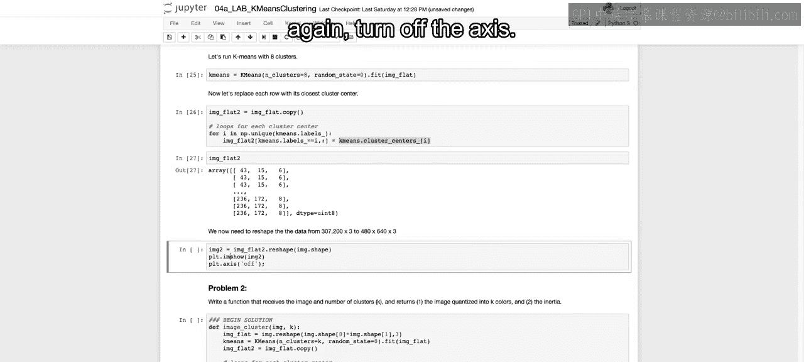

And we see that we can still get a lot of our initial picture with just these eight different colors。

 And we can see the different hues and how it differentiates between the different peppers and how we loss a bit of the granularity。

 But we see these clusters of the red， the white， the green， the black and so on。😊。

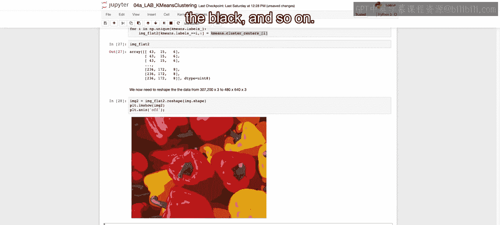

So the next thing that we're going to want to do in order to take this a step further is create a function that will take in any image。

 as well as a number of clusters and return the image using just the specific centroids replacing each one of those different pixels。

 As we just did with8。 we want to do that for any image and for any number of K for any number of clusters。

So to do that， we're going to repeat the steps that we just did。

We're going to set image flat to the reshaped image， given the first two dimensions and then three。

 given the RGB。We're then going to set the number of clusters equal to the K that we have defined here。

We setting random state equal to zero just to ensure that we have the same values as we look at it and you look at it back at home。

We're then going to fit that to our image flat， again， that two dimensions， in our case。

307200 by three。We're then going to create a copy as we did before。

 and we're going to ultimately change this copy。By running a for loop through each one of our different labels。

And if our labels are equal to whatever value it is within our output。

Then we will replace that with that specific cluster。Again， doing the same steps as we did before。

We're then going to reshape that again back to the original image shape so that we can end up ultimately printing it out。

And then we're going to output from this function， both that new image with the replace colors。

 as well as the inertia for that specific K means， depending on what our K was there。

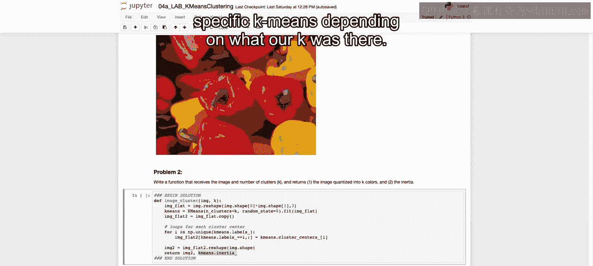

So we've created our function that will output again that new image with the replace pixels。

 as well as the inertia for that fitted model， depending on the K that we use。

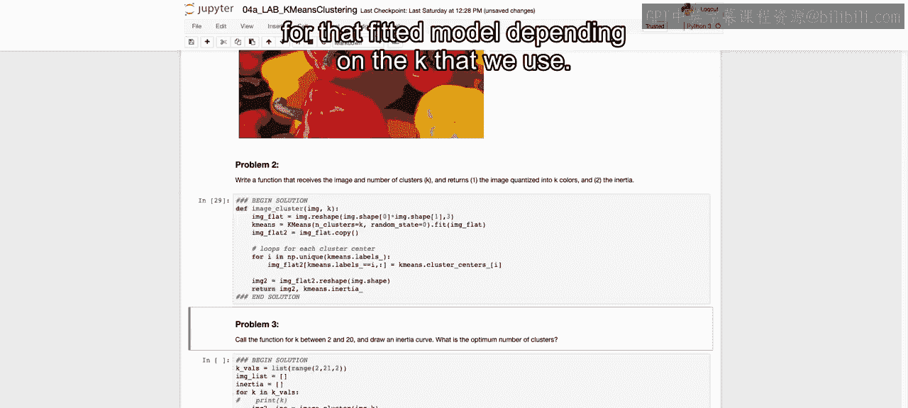

We're then going to call that function for k between 2 and 20。

Counting here by two and draw that inertia curve， as well as later on。

 will also print out many of these pictures。So we're saying k values。

 the K values that we will loop through are going to be 2 through 21， not including 21。

 counting by 2。And then， we're going to。Initiate empty lists for the image list so we can save that image list。

 as well as the different inertias。We're then again。

 getting an output when we call this image cluster function that we defined of both the new image with replaced pixels as well as the inertias。

So we will call this function。Output image 2， as well as the inertia。

 and then append each one of these output values to that list that we initiated here。

So I'm going to run this， and this will take just a second。

 and it will output for us each of these different images， as well as the inertia values。

 And then we'll plot out these inertia values in just a second。 All right。

 I'll see you as soon as it stops running。

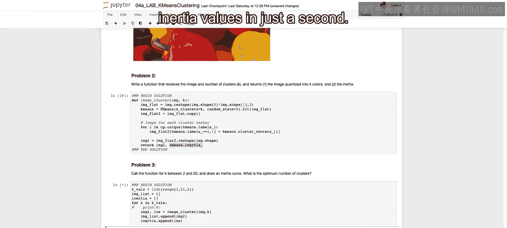

So that should have taken about five minutes to run。

 Now we have from the outputs our different inertia values。

 as well as our images which we'll get to in just a second。

 and we can plot our inertia values versus each one of our different numbers of clusters。

 So we're going to call PLt dot plot to get the line graph on top of that。

 we call PLt dot scatter to get each of the points。 And we。

Get our X label and Y label of inertia and K。And we see here that it kind of curves down and has this smooth curve。

 and it's hard to see an exact elbow。So this is a case where maybe we can't exactly see where that elbow exists and determine using the elbow method。

So we note here and you can dive deeper into this。Metric of the cellhouette coefficient。

 But what it will do is it will tell you the difference between the or the similarity between points within a cluster and other points in the cluster as compared to clusters nearby。

 And again， you can dive deeper， but that will be a different method of differentiating where you should choose where that number of k should be。

Now， the next step that we have here。Is going to be that we are going to plot each one of the images to see given the images that we have。

How each one plots with the different number of colors。 Again。

 we're only going to use the number of colors that we have within the cluster。

 So we're going to run through our values of counting by 2 between 2 and 20。

 So for the range of the length of those values。 So for 10 different subplots。We're going to plot。

A five rows by two columns。 So we're going to have a subplot that will all be。

 It'll be a grid of 10 different axes， where each one will have a different image。And one at a time。

 we will show that image。Given the K values that we are using。

And then we will title that and then also turn off the axis and we can see。

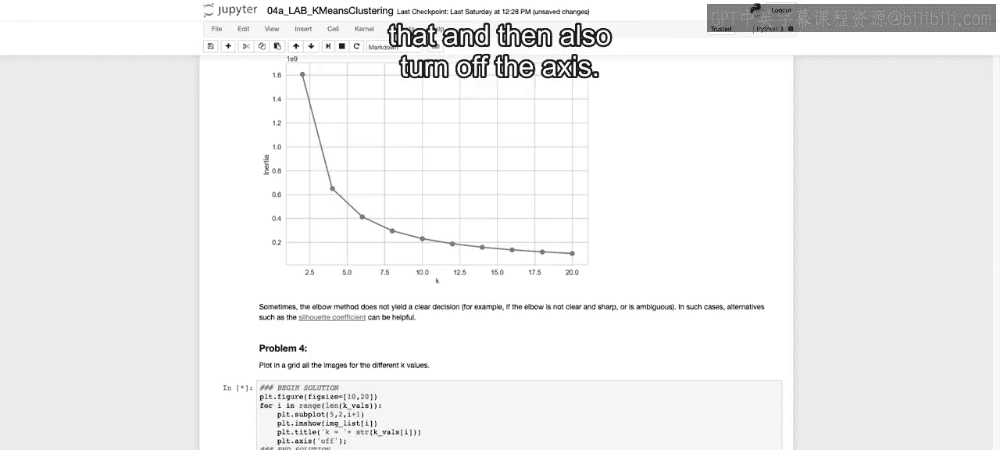

As we increase the number of colors， how much of the image we are able to actually discern。

 given the number of colors we're using。

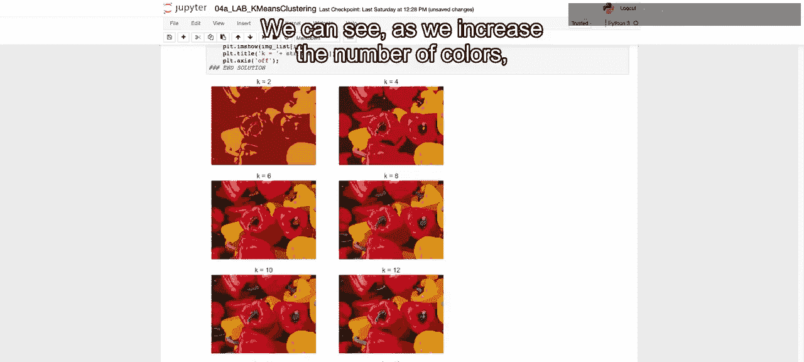

So here at the bottom， when we see that we're using 20 different colors。

 so we have 20 centroids replacing their original values。

We see that we can actually pretty clearly see each one of our different peppers and really discern the original photo well。

Just to give you an idea of how many colors there were originally， we can run NP。t unique。

And that was on the image。Flat。And we will say axis equals0。And let's see the link here。

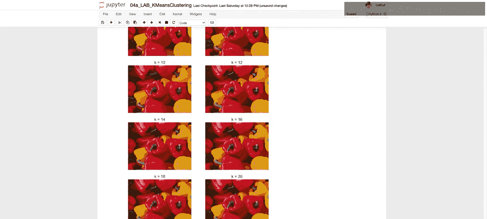

And you see that originally， there was 98452 unique colors to make up that picture。

And we can see how well we can represent that with just 20 colors here。

 So we can see how well we were able to group those 98000 different colors into 20 colors on their own。

😊，That closes out our notebook here in regards to Kamin's clustering。

 and I look forward to seeing you back at lecture。 All right， I'll see you there。😊。

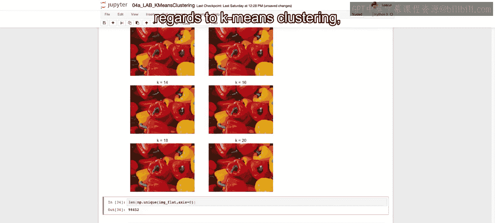

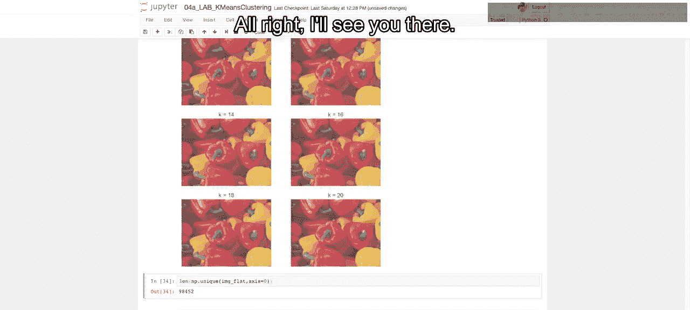