# 012：IBM《机器学习（无监督学习、深度学习和强化学习、毕业项目）｜machine learning》中英字幕 p12 11_欧式距离和曼哈顿距离.zh_en -BV1eu4m1F7oz_p12-

Our clustering methods will rely very heavily on our definition of distance。

So let's take a step back and discuss different distant metrics that are available to us。Now。

 let's go over the learning goals for this set of videos。

In these videos， the main topic of discussion will be different measures of distance between different points。

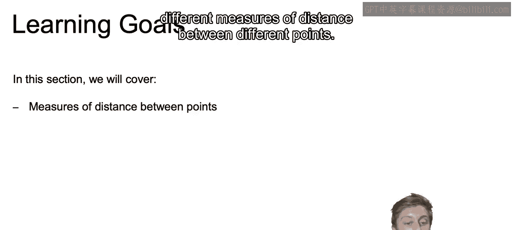

And with that， we will discuss the different applications of these different distance measures and how they relate to clustering。

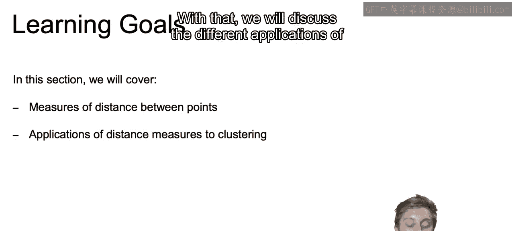

And the different measures that we're going to discuss are going to be the Euclidean distance。

 which is going to be that classic distance that you're probably already familiar with。

As well as the Manhattan distance， the cosine similarity， and the Jaar distance。

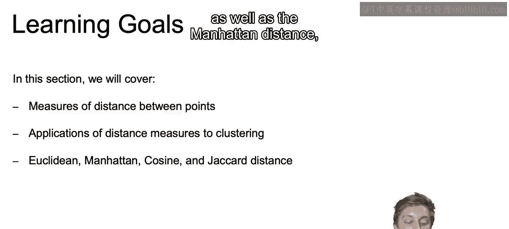

Now， our choice of distance metric will be incredibly important when discussing any of our clustering algorithms。

As these clustering algorithms will all be dependent on some type of measure of how distant or in that same vein。

 how similar one point is with the next。

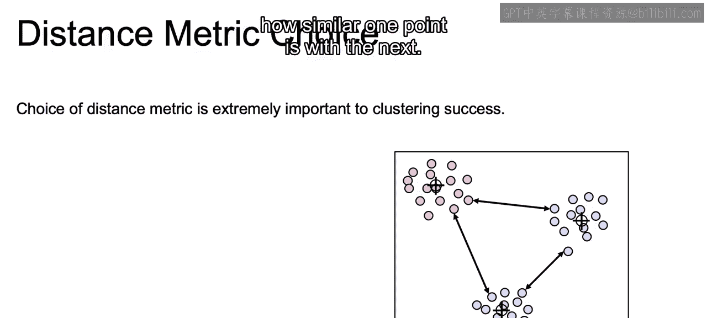

Now there are several choices of distance metrics， and they all have their strengths and more appropriate use cases。

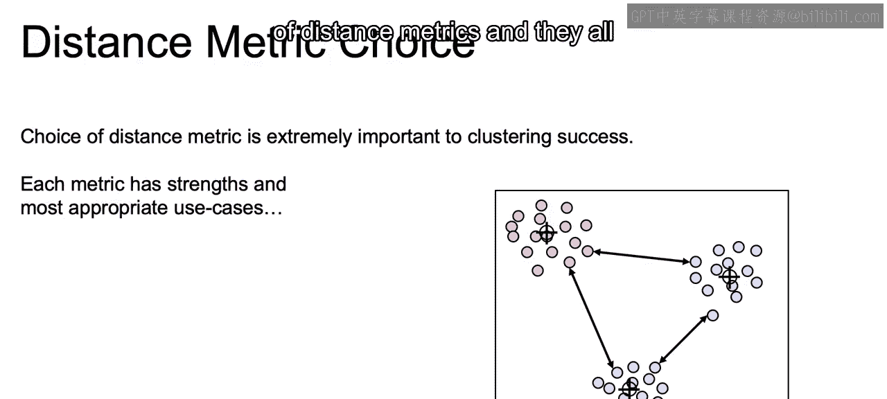

But at times， we may also need to use empirical evaluation to determine which one of our distance metrics works best in achieving our goals。

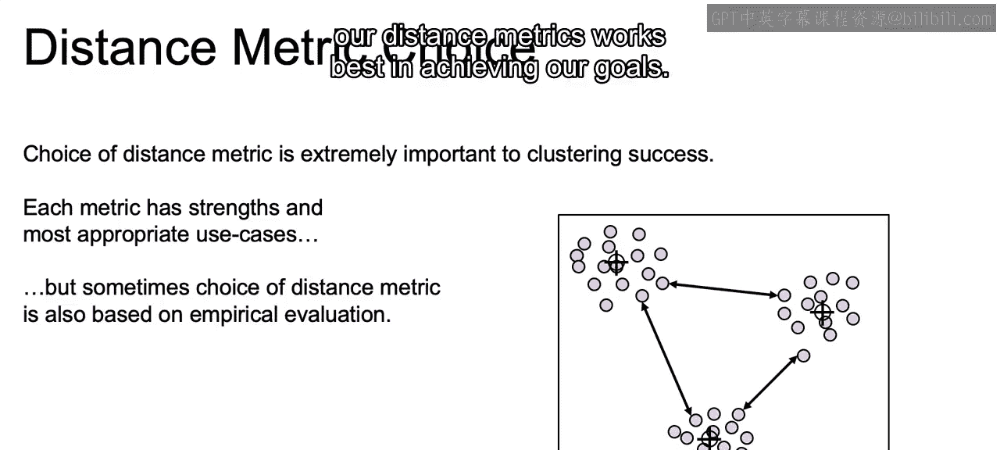

Now， the most intuitive distance metric that we are hopefully already somewhat familiar with。

 and what we use in K means is going to be the Euclidean distance。

Now another name for this is the L2 distance。So in order to highlight how Euclidean distance is calculated。

 we're going to take these two points and calculate the Euclidean distance between them。

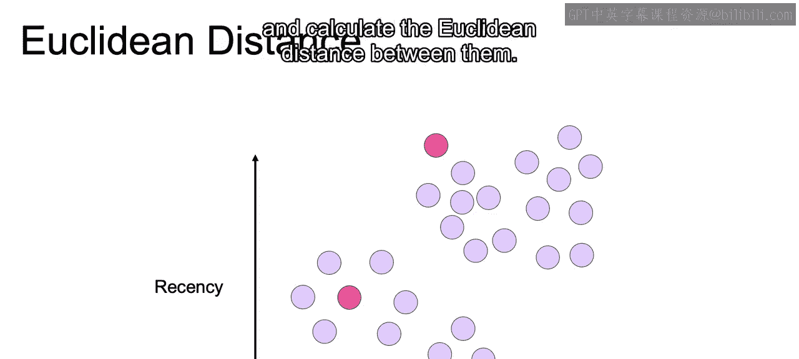

So we remove all the other points so we can just look at these two points and hopefully you remember parts of this from math class back Men day。

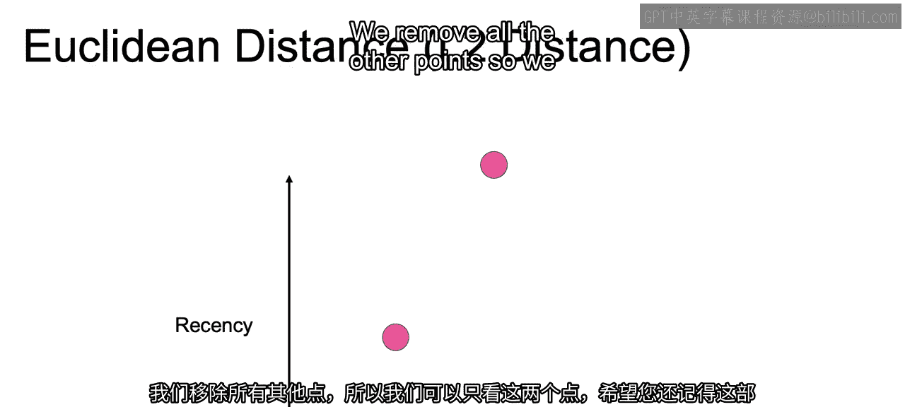

But in order to find this distance， D。We need to first find our change in visits。

 as well as our change in recency or a change in the X axis， as well as a change in the y axis。

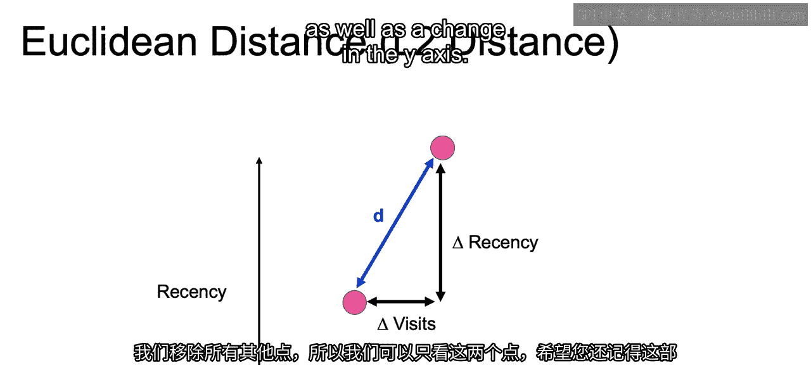

And then if you think back to that math class example。

 they said to think back to from back in the day。How do we think these values。

 visits and recency in their change will relate to our calculation of D。

We would get D by taking the square root of the square of each of these changes。

So that math equation that I was hinting towards was a squared plus B squared equals C squared。

 And again， you take the square root of C squared， and you end up with the formula that we see here。

 And we can move this on to higher dimensions。 Imagine if we had three dimensions。

 four dimensions and so on。 We just take the square of each of those and then take the square root of the sum of all those values。

😊。

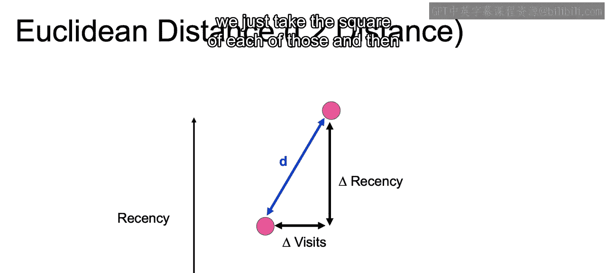

Another distance metric that you may already be familiar with is the L1 distance or the Manhattan distance。

And instead of squaring each term， we're adding up the absolute value of each term。Now， it's larger。

 It will always be larger than the L2 distance unless they lie on the same axis。

 So the same number of visits or the same number of recency。

And we'd use this in business cases where there's very high dimensionality。

As high dimensionality often leads to difficulty in distinguishing distances between one point and the other。

 and the L1 score does better than the L2 score in distinguishing these different distances。

 once we move up to higher dimensional space。Now， these are the two most commonly known distance metrics that hopefully you may know a bit already。

 In the next video， we will introduce some less well known distance metrics that can prove to be very powerful for certain applications。

 All right， I'll see you there。

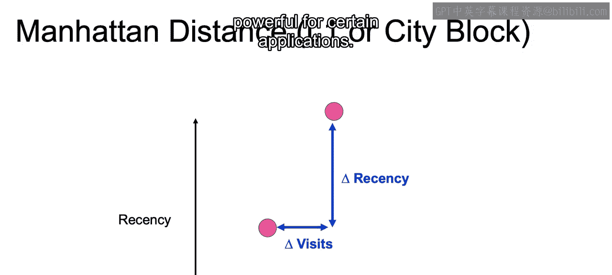

