# 014：IBM《机器学习（无监督学习、深度学习和强化学习、毕业项目）｜machine learning》中英字幕 p14 13_维数灾难笔记本第1部分.zh_en -BV1eu4m1F7oz_p14-

Now， in this demo， we're going to take a brief aside and touch back on the curse of dimensionality。

Distance measures will come into place slightly as we will talk about the Elidean distance for each of these。

 but the focus here is going to be the curse of dimensionality。So with that in mind。

We can talk about the demo objectives， which will be to gain a deeper understanding of why observations are going to be further apart once we move to higher dimensional space。

We're then going to see an example of how adding dimensions will ultimately degrade certain model performance when we're working with classification。

 and then we're going to start to learn how to fight that cursive dimensionality within your different modeling projects。

So the main point is that in higher dimensional space， points will tend to be further apart。

And this is going to impact our data analysis intuitively。

 if we think back to the clustering examples that we've already gone through and we're talking about how distant each one of the different points are from one another and saying what the nearest neighbor really is。

 Can we really say it's a neighbor， if it's a certain distance apart。

 if we're moving an incredibly far distance apart Once we move to these higher dimensions。

So this notebook will show why higher dimensional space does lead to this sparse data。

 leads to data points being naturally further apart from one another。

So we're going to start off with a circle inside a square。

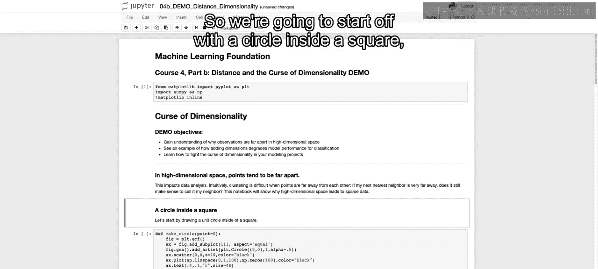

And the idea is that we're just going to have a square that's going to be the diameter of the circle。

 that's going to be the。Length， the width and height of our square right squares。

 width and height are automatically going to be the same。

 We're going to have a unit circle so the diameter is going to be2。

 and then our width is going to be 2 and our height's going to be 2。

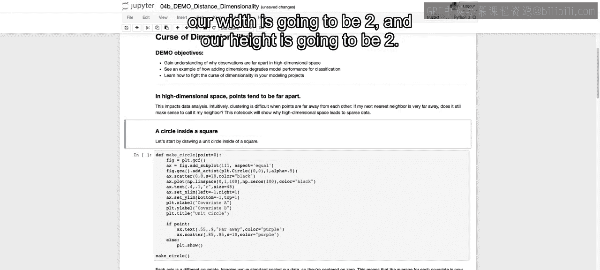

And the point is that that circle should touch the borders of our square。

 and we want to know using that circle within the square， how much of that is empty space。

And then we're going to move to the next step。And create a sphere within a cube using those same dimensions。

1 by one or two by two radius of one。And we're going to see how just moving to higher dimensions。

 using those same points， we're going to have a larger proportion of the space not covered by that circular object。

And then generalize that to higher dimensions and discuss how as we move to higher dimensions。

 just the fact that we're moving to higher dimensions leads to there being more empty space within our square or that square moved into higher dimensions。

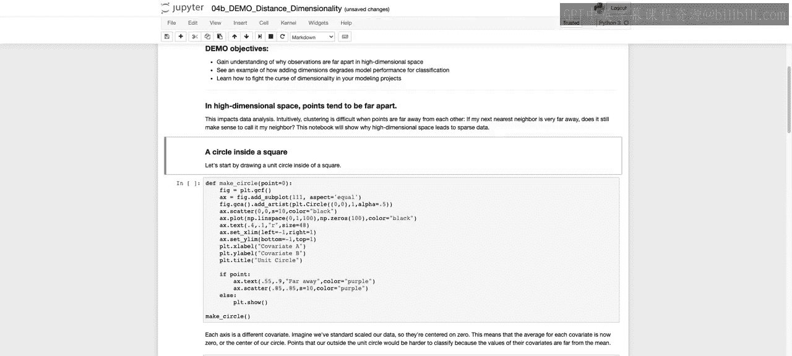

So the point is to bring in that concept， but I'd be remiss if I didn't also walk you through a lot of the new code that we're going to be talking about as we go through some more complicated plots。

This way， when you're back home， you will be able to go ahead。

 create these plots on your own and understand what went into the code。

 as well as once we get to the next couple of cells。

 being able to start to even plot in three dimensions。So with that in mind。

 I'm going to create an empty cell above so that we can walk through all the different code that's within this function。

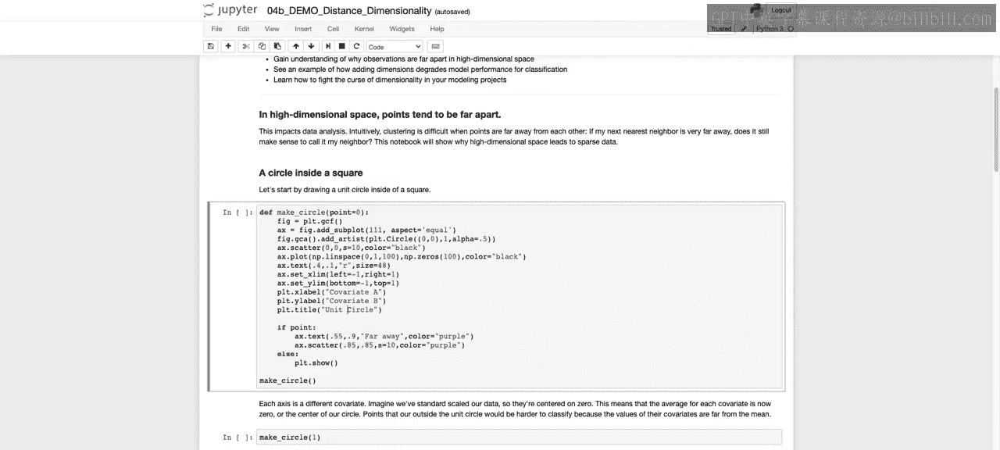

So to start off。We're going to。Initiate our figure。And then so Plt。

gcf is going to be a way to get current figure if that figure doesn't exist。

 it will initiate a new figure。And then taking that figure。

 we're going to add on our subplot and that's going to be our axes。And we're just saying one by one。

 if you think about subplots， that could be two by one or two by two， if you say two by one。

 you'd have two rows with each on a bounding box and then one column。

 and we're saying which one do we want to select， we're just selecting that first one。

And then we're saying aspect equals equal。 And this can be similar to what we saw in the last notebook that we had when we wanted to draw that circle and the importance of actually ensuring that our X axis and our y axis are on the same scale。

 If one of those are on the wrong scale， then it looks like we have a rectangle rather than a square or an oval rather than a circle。

😊。

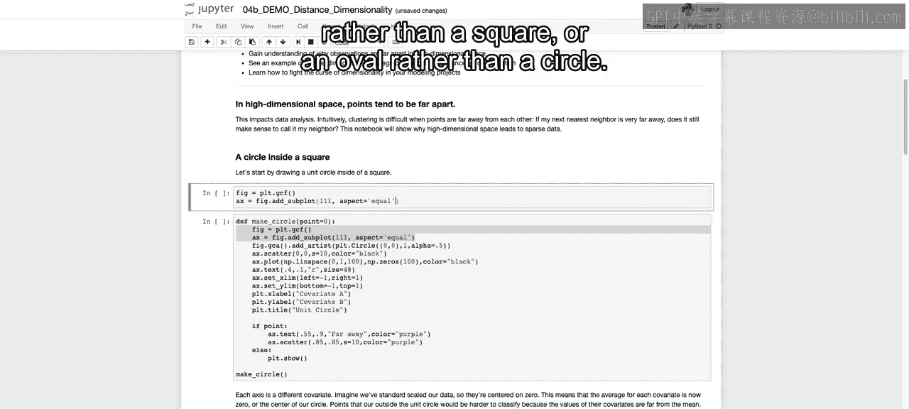

So we run this and we see that we now have our bounding box going from zero to1。

Now I'm going to skip over quickly and we're going to come back to it this building end of the circle。

Because this is going to be the circle， like we mentioned， centered at00。

And then going from zero to 1 and then from zero to negative one as well。

 and our box currently only goes from zero to 1， not from negative one to one。

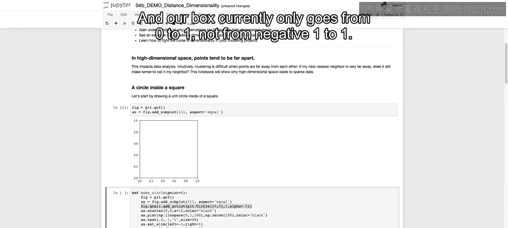

So I'll bring this back into play once we walk through this code where we increase our X limit and our Y limit。

So then we're going to add on this scatter plot。Which is just going to be that single dot because it's 00 is the point that we're bringing in。

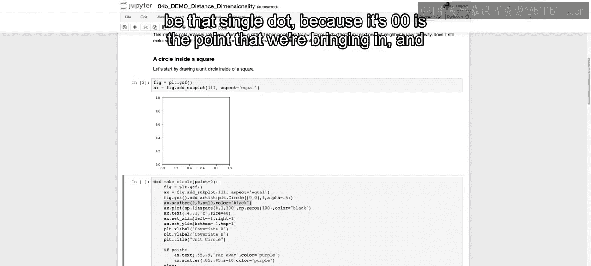

And we are saying that。We have the size equal to 10 and the colors equal to black。 That's at 0，0。

 And now we've changed the scale a little bit to ensure that that's in the center。 But again。

 it's still not at negative 1，1。

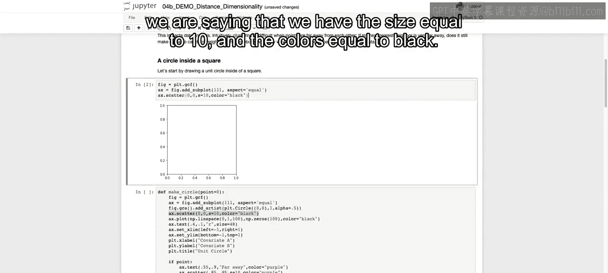

We're then going to add on a straight line， and this is going to represent the radius of our circle。

 so it's going to go from0 to1。And we're going to have a10， sorry， different points。

So it goes from zero to 1， counting by 100， and then that's going to be each one of our x values。

And then for the y values， we're going to stay at 0。

 And this will allow us to create that straight line that we see here。 again。

 this mess with the axes a bit。 So the plot looks a little bit funky。

 But we'll see in just a second what this looks like once we increase those。 In fact。

 I'll do that right now。 Let's change the X limit and y limit。

 We're going to add this on to our graph。😊。

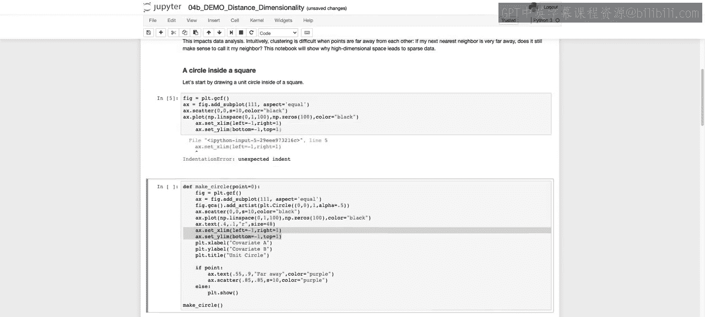

We have to make sure that we have。No extra tabs there。 And now we see it goes from 0 to one。

 and it goes from。The0 to1 is the line， and we're able to see negative  one to 1 on our x axis and negative  one to 1 on our y axis。

Now we can go through some of the pieces that we skipped over， so coming back first to the circle。

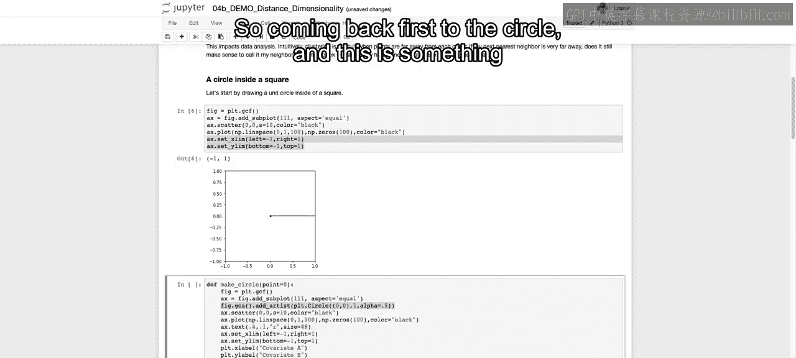

And this is something that's probably the most new。For those that are watching through this video。

 what we're doing is we're getting the current axes， which is just our bounding box。

And then we're calling this add artist， and then artist object is essentially anything that you have within your plot。

 that's going to be your ticks， that's going to be your numbers， that's going to be your lines。

 those are all artist objects。When we call PLT。 circlecle。

 that's going to be a subclass of that artist object， and it won't show up unless we call add artist。

And you can Google and look at the discussion on ad artists and how it works in regards to creating your。

Mate plot lid plots and different ways that you can use us。

 But the idea is that it will take things at our subclass of that artist object and be able to add it on。

 So we're adding on this circle。 This circle is going to be centered at 0。With a radius of one。

And then we're saying alpha equals 0。5， that's just how opaque our circle is the same way that we saw alpha earlier。

So we run this and now we have a circle on our plot。So we have our circle within our bounded square。

We're then going to add on an R。So we're just adding text， so a dot text。

And we're saying that we want an R， we can say the size of that R and where we wanted to lie at 0。

4 comma 0。1， so we have that R there at 0。4 and 0。1。

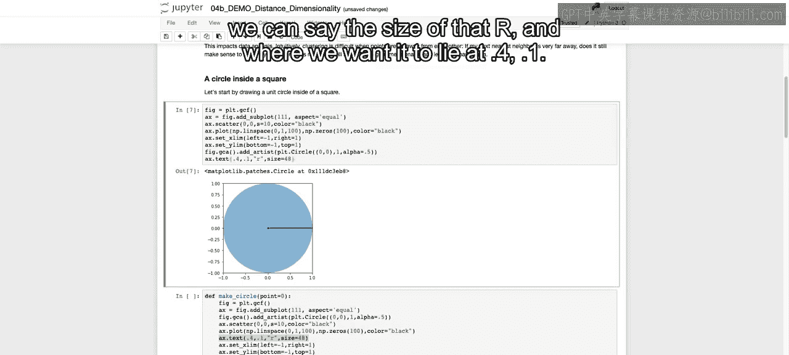

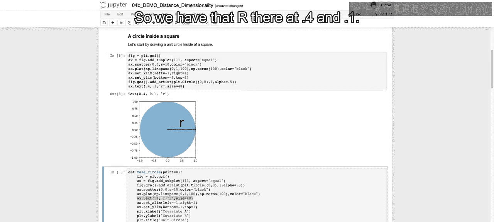

We've already set our X limit in Y limit and hopefully already familiar with sending your Y label。

 your X label， and your title， but we'll throw that in。

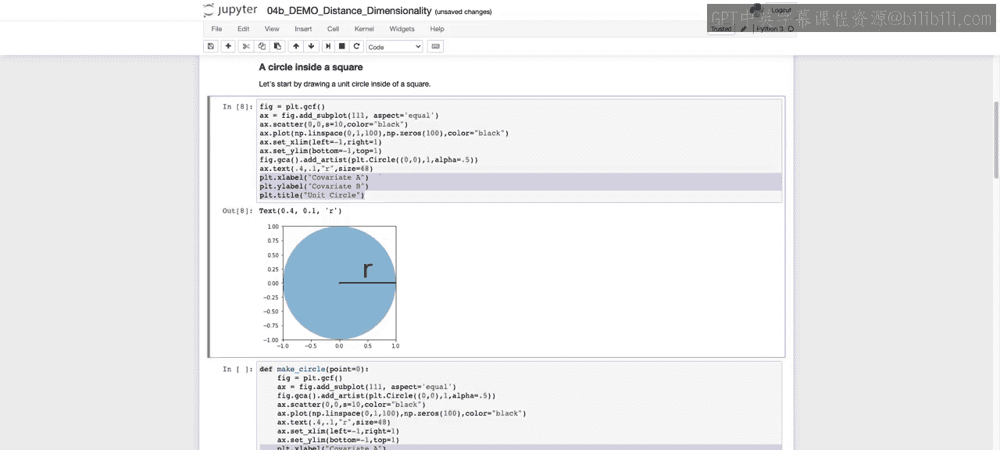

So we have all that within our plot。 And then it's saying when we say point equals 0 here。

 I want to ensure that no one's misled。 the way that it's being used is that point is equal to false。

False in Python or 0 and Python will always be equal to false。

 whereas any other number will be equal to true。So if the point is true。

 so if it's not zero as it is by defaults， then we're just going to create a dot。Sorry。

 we're going to create a dot here。That's at 0。85。85， and we're just going to write on top of that。

That it's a far away point。Just to highlight what we're signifying as a far away point。

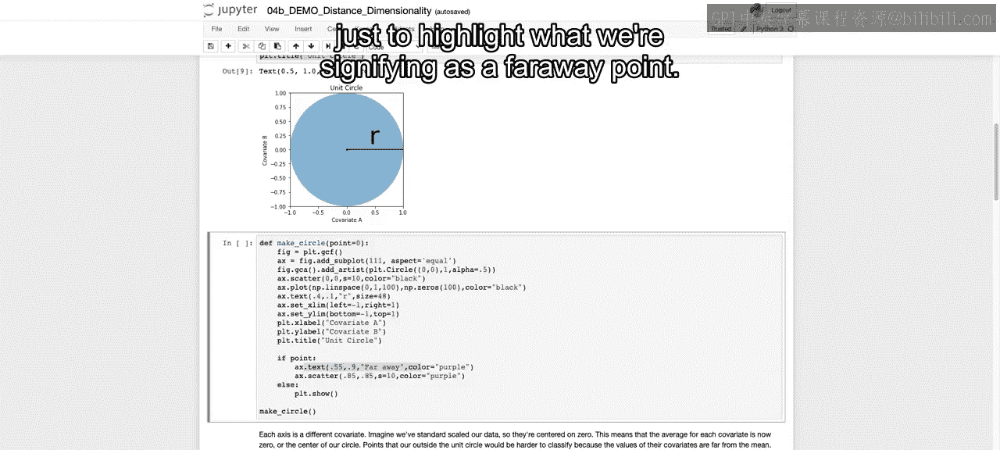

So the idea is that each axis in this example is supposed to be a different covariate and are supposed to imagine we've standard scaled our data。

 so they're centered on0， and this means that the average for each covariate is now0 or the entire center of our circle and points that are outside the unit circle would be harder to classify because these values are far away from our mean。

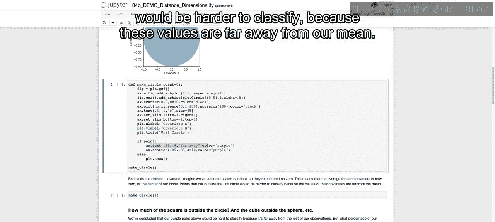

So this is just saying that values that are outside the circle。

 so taking this idea of a circle within a square and moving it to the idea of how it would apply when we're talking about creating our different machine learning models。

Is that we are now identifying that anything outside that circle is pretty far away from the mean as we have standard scaled our data and that means it's over a single standard deviation away。

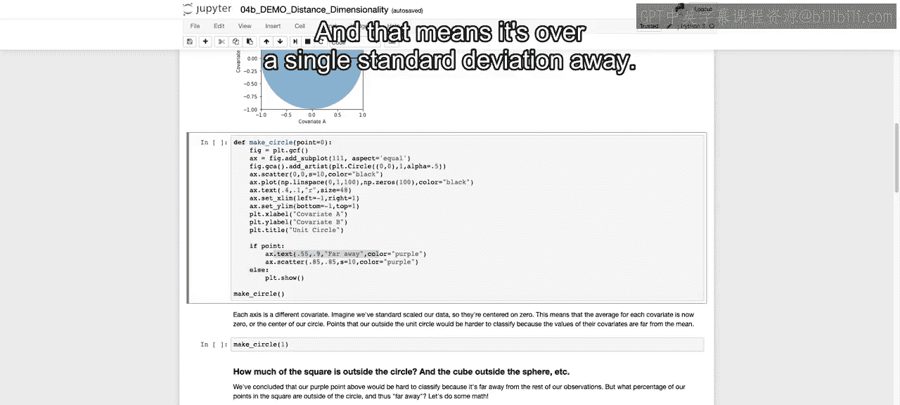

So we're going to run this。And we see our unit circle when we call make circle on its own。

 very similar to what we have above。

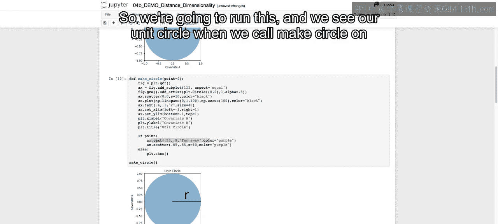

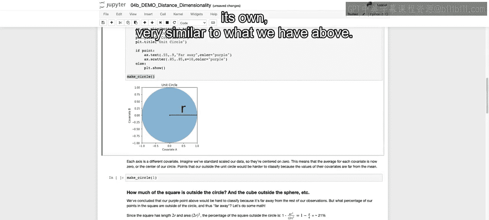

And then when we call make circle and we call one rather than point equals 0。

 it's going to add on that far away point， and that far away point will be the same， no matter what。

 it has nothing to do with the number you pass in。 Again， it's just true versus false there。

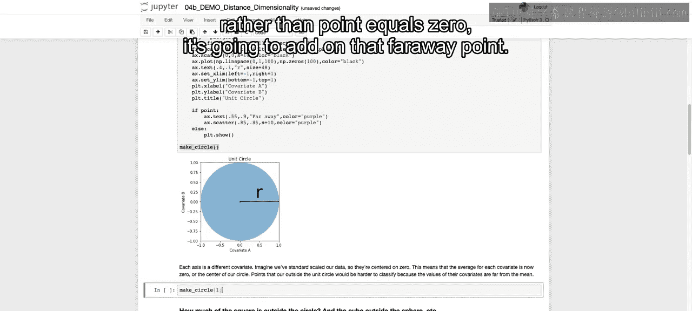

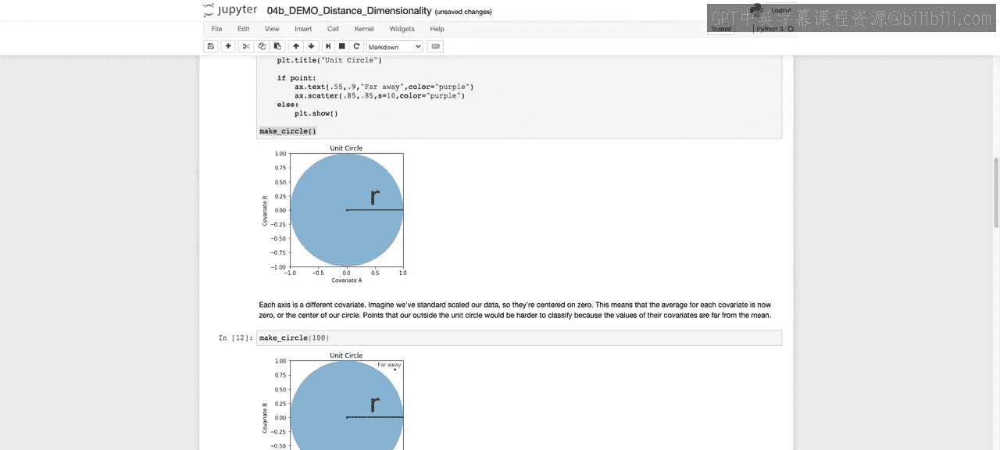

Now。The point that we want to make here。Is how much of this square is going to be outside that circle。

 again， thinking back to how this relates to our modeling。

 if we have standard scaled our two different covariates。

 which means that being one unit away from the mean。

 means that we're a standard deviation from the mean value for each one of our different covariates covariate A and covariate B。

 which we ultimately be using for predictions。How much of our points are going to be far away？Now。

 since the square has a length of 2 R， the radius being 1 and the area of the square is going to be2 R squared。

 just taking the formula for creating a square，2 R times 2 R。

The percentage of square outside the circle。Is going to be one minus pi r squared。

 which is your area of your circle over 2 R squared。

And that's just going to be the area of the circle over the area of the square。

 so it's 1 minus pi over4 once you cancel out the R squares。

And you have that 1 minus5 over4 means that approximately 21% of that square is outside the circle。

So I'm going to pause here。And in the next video， we're going to extend this out to a cube and also walk through how you can create 3D graphs using Python。

 All right， I'll see you there。

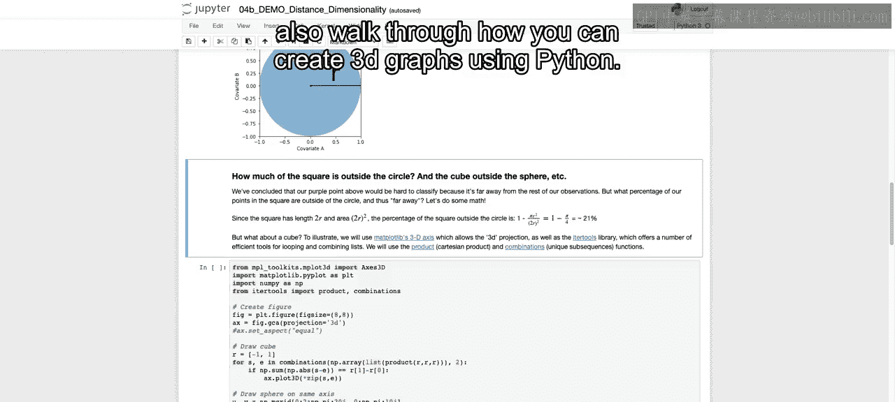

