# 019：层次链接类型.zh_en -BV1eu4m1F7oz_p19-

So with the idea of using the average distances of all the points within their respective clusters。

How do we go about actually finding our stopping point？

So let's say we're at this stage and we have five clusters as we see here。

 and each one of those clusters are color coded as we move forward。

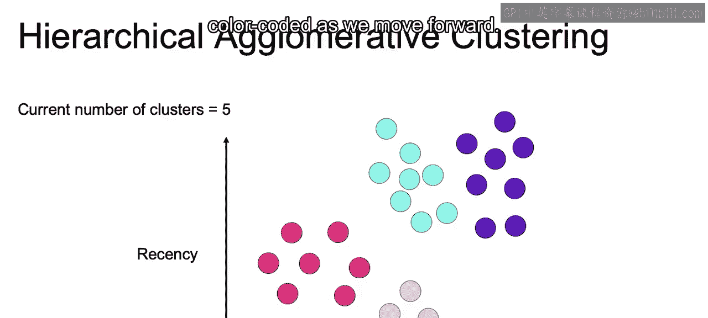

So at this stage， we can say that the average cluster distances for each one of our clusters。

 which we have marked here with the same colors that we just saw in that two dimensional plot。

And with that， so we have each of the average distances and with that we have our gray dotted line。

 which marks a point where we are going to stop once all of these average distances are above that line。

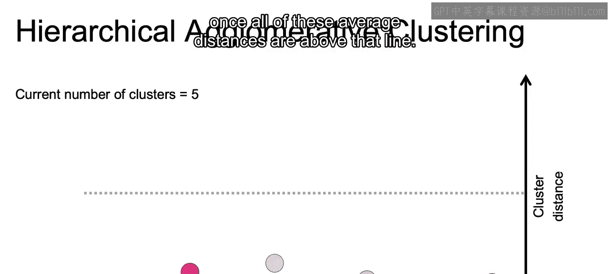

So in the next iteration。We find that light， purple and magenta clusters are going to be merged。

Therefore， that average cluster distance for that particular cluster should go ahead and increase。

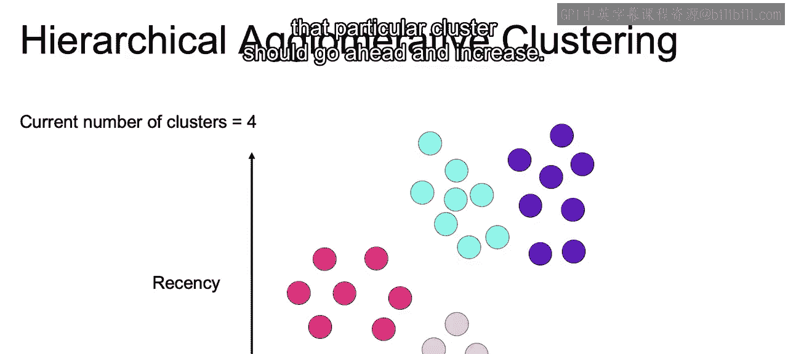

So we can visualize this change in that average cluster distance as followed。

For that new combined cluster， we now have this average cluster distance that we see that is higher than the previous two。

 so before we had the light purple and the magenta。

 we merge those to that higher version of magenta and we see that we have a higher average cluster distance。

And now we only have four remaining clusters， and as a whole。

 they're a bit closer to that limit set to that gray line。

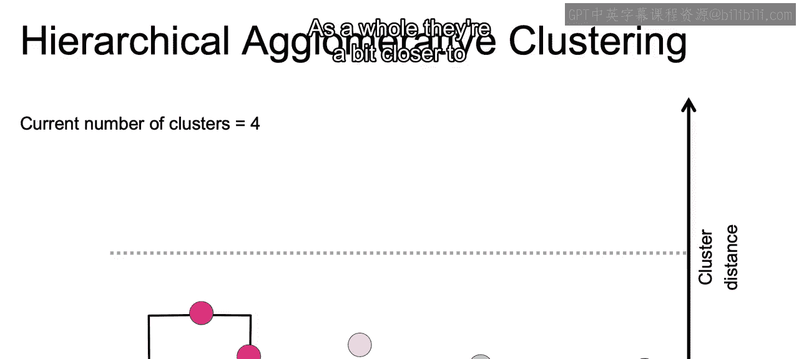

In the next step， we can have that purple cluster is going to merge with the teal cluster in that top right corner。

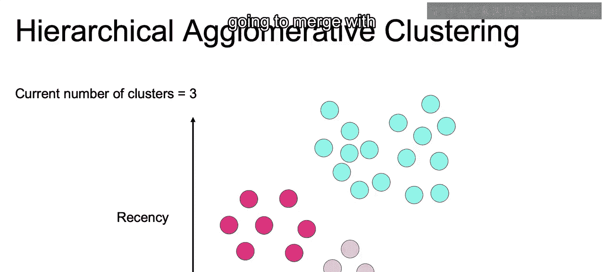

Ands the new cluster forms。Combining that teal and purple is now above that threshold。

Now we don't stop at this point， though， we are only going to stop once the minimum is above that threshold。

 so the minimum average cluster distance is still not above that threshold。

 we still have the pink and magenta below that threshold。

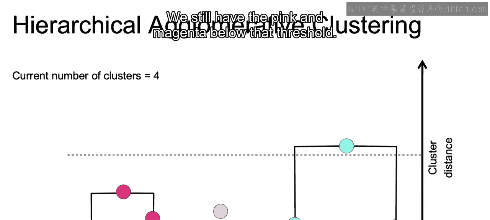

Now， in this next step， once we move to two clusters。

 magenta cluster and the pink cluster merged together to create this new pink cluster。

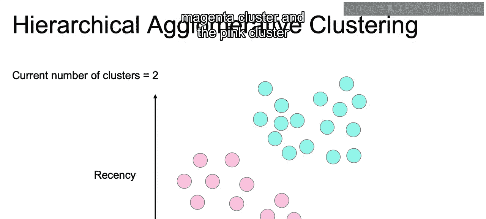

And finally， once we merged these two。All the cluster distances are above this threshold。

 There are big enough。To therefore claim that the algorithm has finally converged。

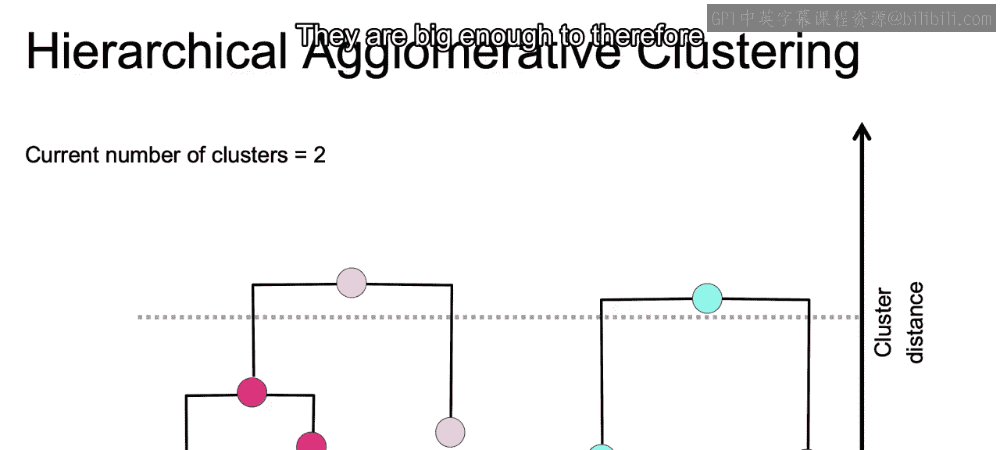

Now we mentioned earlier that we would want to merge clusters at some point that are closest to one another。

But that idea of which cluster is closer is a bit of an ambiguous concept。

Especially when there are going to be multiple points belonging to each one of these different clusters。

Now there are several methods to measure that distance between these clusters。

 and these different methods are called the different linkage types。

The first example that we have here is single linkage。

 and that's going to be the minimum pair wise distance between our different clusters。So。

Given that we have our different clusters that we have here on our data。

 it's going to be the distance between the two closest points。

 say one from the teal cluster and one from magenta。

 and we can see the blue lines that connect each one of these。

 according to which is going to be the minimum distance between a certain points in the magenta and a certain point in the teal。

And we take that distance between those specific points and declare that that will be the distance between those two clusters。

 and then we tried to find for all these pairwise linkages， which one is the minimum。

 and then we would combine those together as we move up the hierarchy。Now a pro。

 and we will talk through many different type of linkages。

 a pro to the single linkage or the minimum pairwise distance between clusters。

Is that it can help in ensuring a clear separation of our clusters that have any points within certain distances of one another so it has clear boundaries。

But a con of this single linkage will be that it won't be able to separate out cleanly if there's some noise between the two different clusters。

So it'll be very easy to be skewed by certain outliers falling close to certain clusters。

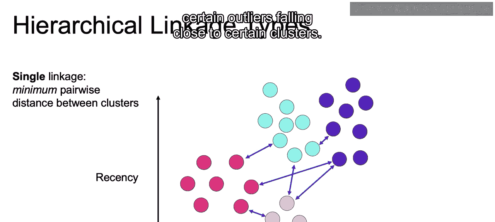

Now another linkage type is going to be called the complete linkage。And with complete leakage。

 instead of taking the minimum distance， given the points within each cluster。

 we would take the maximum value。 So taking the furthest distance from each cluster。

 and from those maximum distances， decide which one is the smallest。

 And then we can move up that hierarchy to reducing here from four clusters down to 3。Now。

 a pro of this method is that it will do a much better job of separating out the clusters if there's a bit of noise or overlapping points of the two clusters。

 unlike with the single leakage。But acon this is that it content to break apart larger existing clusters dependent on where that maximum distance of those different points may end up lying。

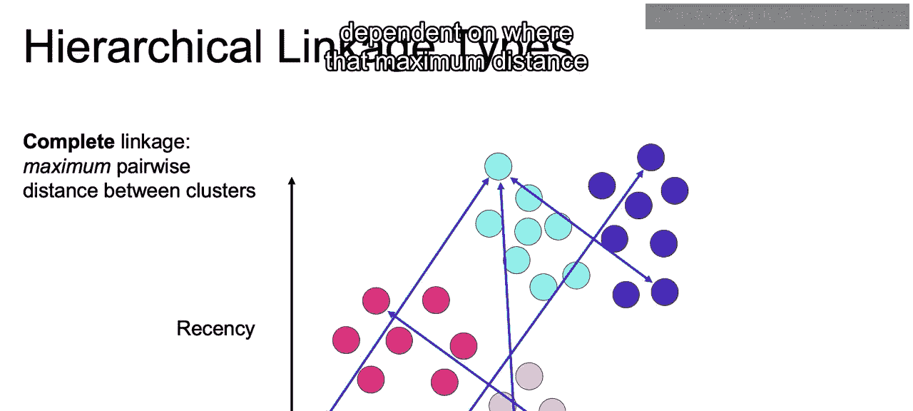

Alternatively。We can also take the average of all the points for a given cluster and use those averages or those cluster centroids as we've been introduced to to determine the distance between our different clusters。

Now， the pros and cons of using the average can kind of be seen as an average between the pros and cons of using the single and complete linkage and that it may also break up those larger clusters and also may be a bit drawn towards a noise but also do a better job than either the single linkage or the maximum linkage in regards to the cons of each。

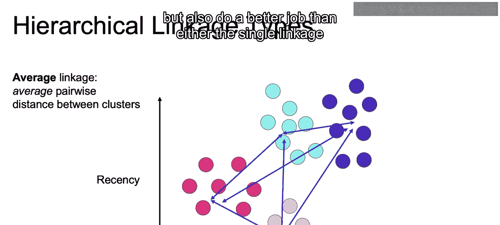

And then finally， we have the ward linkage， and the ward linkage is going to compute the inertia。

 So if you recall， the inertia is going to be the distance squared between each one of our different points and their centroids。

And picks the pair that's going to ultimately minimize that inertia value。

So trying to minimize that sum of squares of the distances to their cluster centroids。

 so in that sense you can think of it as something similar to K means in trying to come up with the new。

Combining of the different clusters。And again， the pros and cons of war will be similar to the average and that they will。

Balance out both the pros and cons of the min in max linkage。

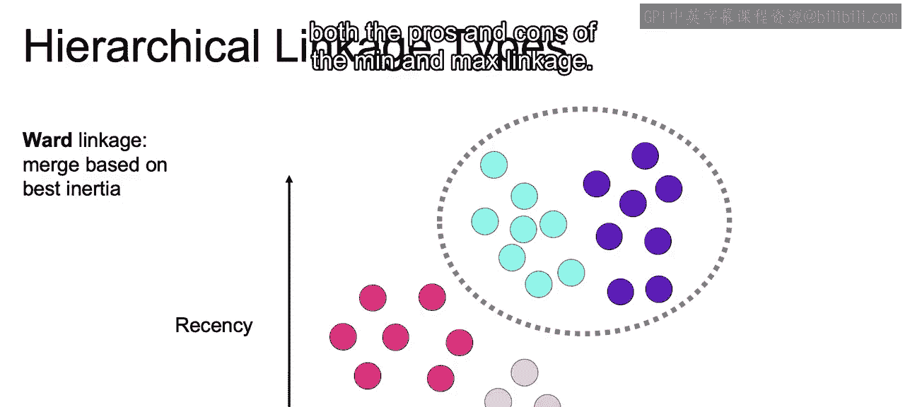