# 020：IBM《机器学习（无监督学习、深度学习和强化学习、毕业项目）｜machine learning》中英字幕 p20 19_应用层次聚合聚类.zh_en -BV1eu4m1F7oz_p20-

Now， in order to do this in practice， to do this in Python。

 it'll be very similar steps to what we've seen so far。

 We will start by importing our class here called a glloorative clustering。

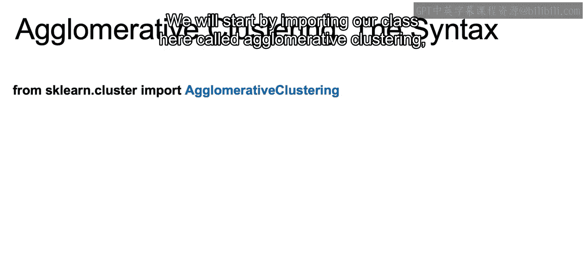

We're then going to create an instance of the class。

 so we say ag equal to a glamor of clustering with our different hyperparameter。

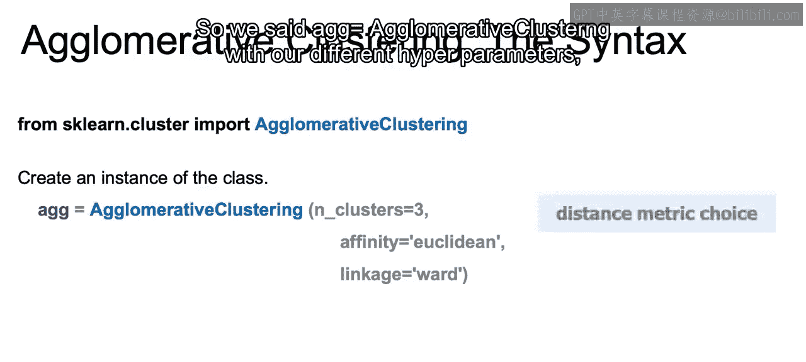

We can choose。The number of clusters here， we set the number of clusters equal to three so that it'll keep building up until we get to three clusters。

We then have the option to choose our distant metric， and here you see we chose Euclideium。

 affinity equals the Euclidean， we use the Euclidean distance。

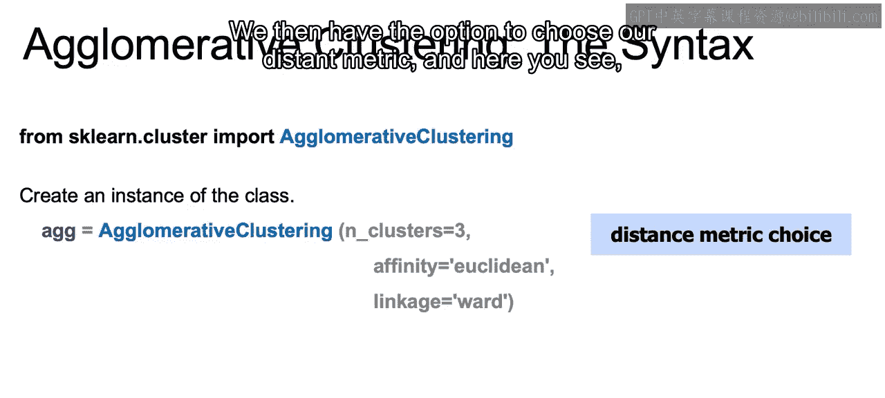

And we can also define what our linkage will be going through the different linkages that we just discussed are available。

 we can choose which one we'd like to use for our current clustering algorithm。

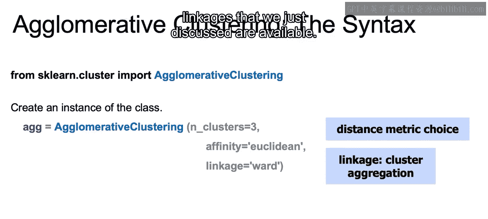

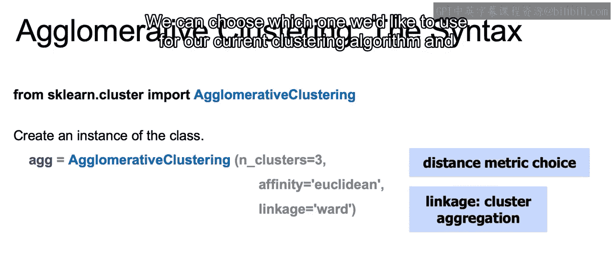

And then as before， we would fit the instance on the data and use that to predict clusters for new data。

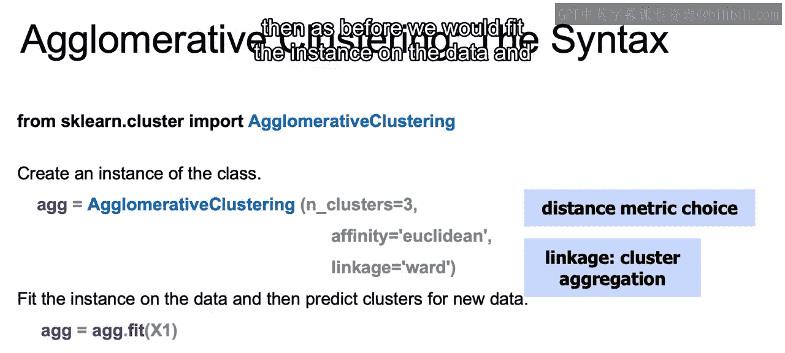

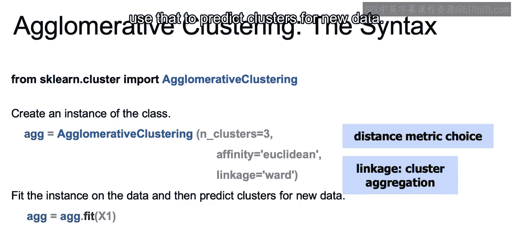

Now let's recap what we went over here in this section。

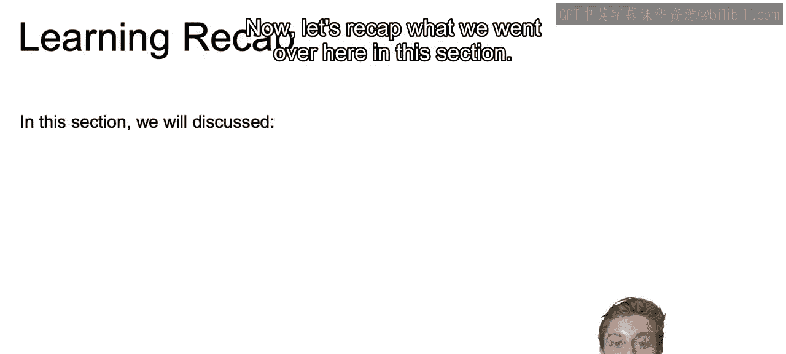

In this section we introduce the hierarchical aglomerative clustering method and how we can use it to slowly build up to larger and larger clusters。

And this method becomes very useful in business practices when you may want to also see these subgroups that build up to these larger groupings。

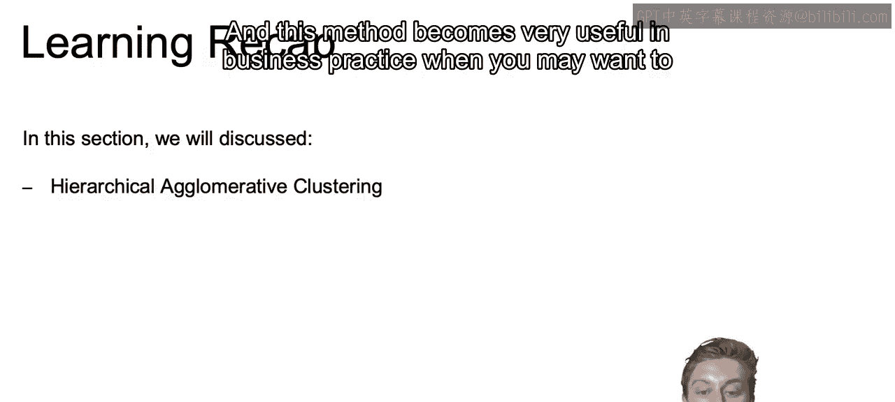

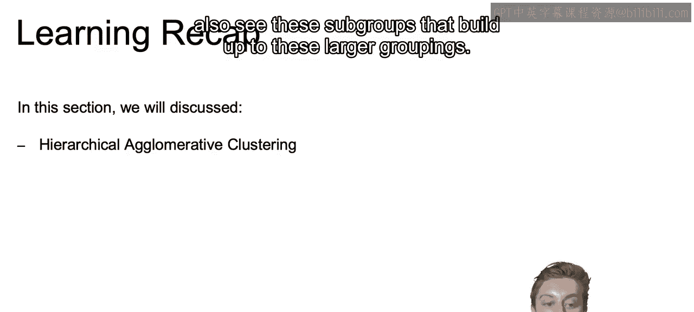

We then discuss stopping conditions and how you may either have a predetermined amount of groups in mind or a predetermined amount of clusters in mind。

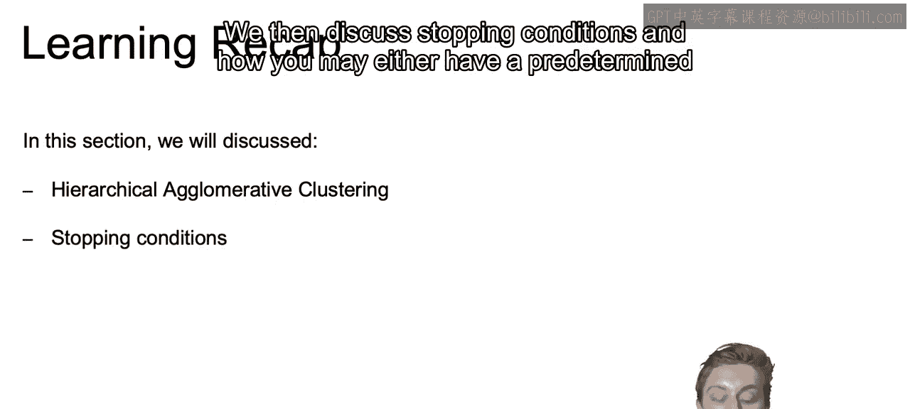

Or you can say to continue up until you reach a threshold of minimum average of our cluster distances。

And finally， you went over different linkage types。

 including single linkage using the closest points to determine distance between clusters。

 complete linkage using the furthest points determine the distance between clusters。

Average linkage and ward linkage， which finds the combined clusters that most reduce the amount of inertia。

That closes this video on hierarchical aglomative clustering。

 and in the next video we're going to dive into our next clustering algorithm DB scan All right。

 I'll see you there。

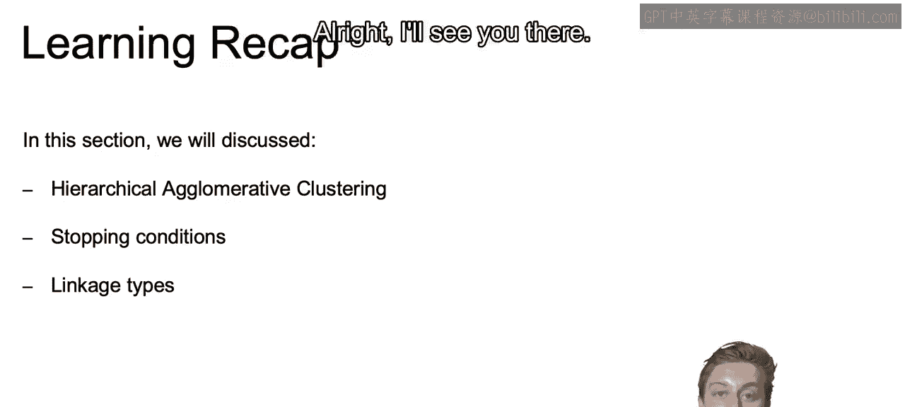

