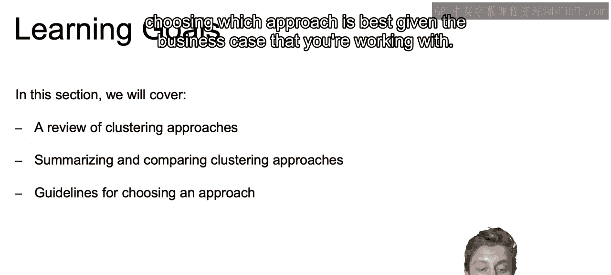
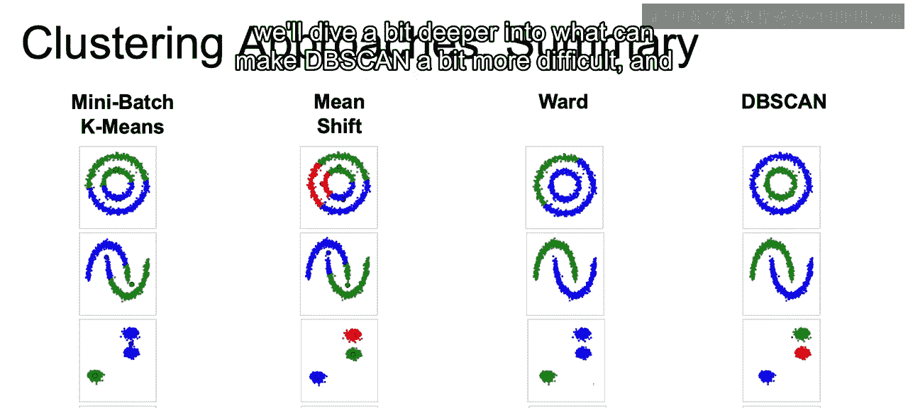
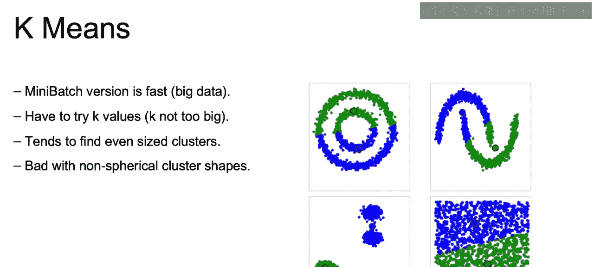
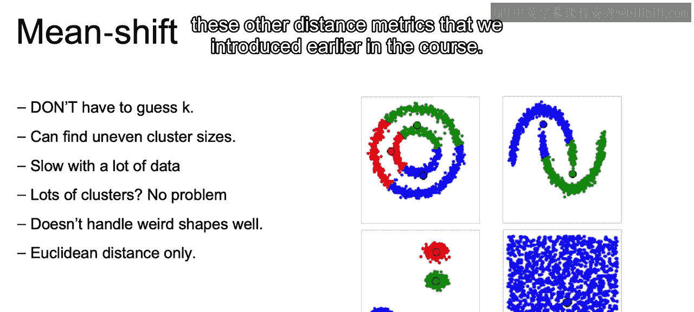
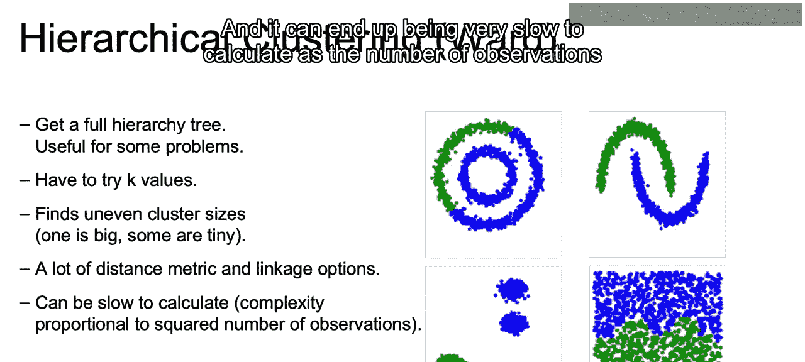
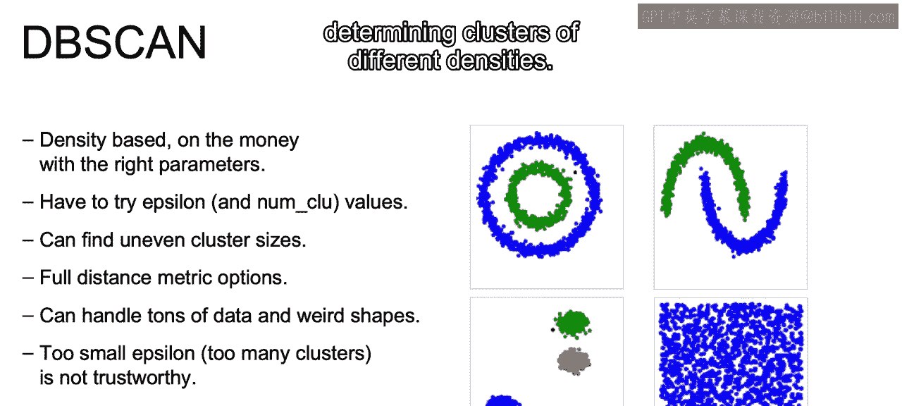
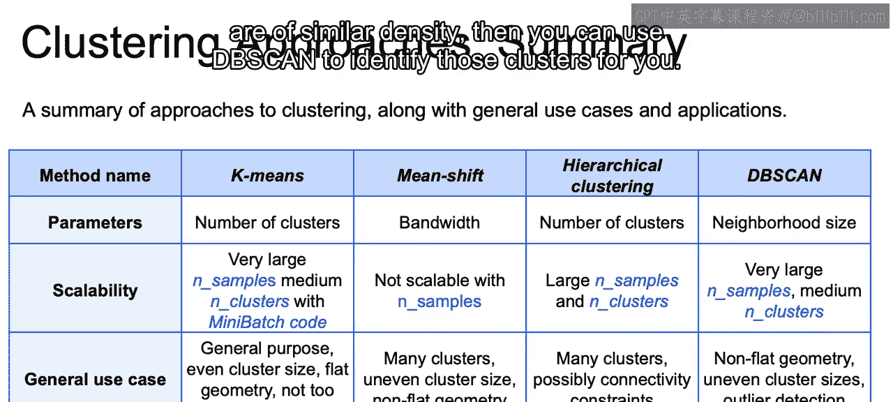

# 024：IBM《机器学习（无监督学习、深度学习和强化学习、毕业项目）｜machine learning》中英字幕 p24 23_算法比较.zh_en -BV1eu4m1F7oz_p24-

In this video， let's briefly bring together the different clustering algorithms that we've introduced。

And discuss some of the pros， the cons， and the use cases for each one。

So what will we cover here in this section？In this section。

 we'll go over a review of the clustering approaches that we went through throughout this course。

We'll then summarize and compare each one of these different approaches。

As well as providing some guidelines for choosing which approach is best。

 given the business case that you are working with。

So let's review the clustering algorithms discussed in this course so far。First， we have k meanss。

And recall that with K means， we were going to have to predetermine that number of clusters that we're looking for。

And once we do so， our clusters will depend on coming up with some mean value that is trying to reduce the distance from our centroids or that mean of that cluster to each one of the different points within that cluster。

With that in mind， we will get the results that we see here for the shapes given and we see that it doesn't do a perfect job of getting shapes that aren't necessarily spherical。

 and we're going to dive a bit deeper into the pros and cons of each in just a bit。

 but this is just a recap and an intro to what we're working with with each of the models that we had introduced。

So next， we have the mean shift， which does not require us to set that number of clusters as we had to do with Ks。

 but rather we'll iterably move towards those densesest points given a window and we'll get the results that we see here under mean shift。

And notice that for both K means and mean shift， they are going to heavily favor more of a spherical shape and may not have quite the flexibility to find different shapes。

Next， we have ward。 And what we mean here by ward is the aggglomative hierarchical clustering with ward as the linkage type between our clusters。

Recall that ward linkage specifies distance between clusters as the new combined inertia of those clusters。

 And since we are linking closest clusters when we work with hierarchical clustering。

We have a bit more flexibility in combining clusters of different shapes。

But some noise can throw this off， as it did in our two circles example above。

 And while we can set means of how we want clusters determineds。

They do not quite get determined on their own accord， as we saw with mean shift。

 or as we will see in this next one with D B scan。So finally， we have Db scan。

 which we'll find those points which are closest to one another in order to create those clusters。

And this will both create its own clusters。So you don't have to predetermine the number of clusters。

And be able to identify clusters of different shapes。 Now。

 this may seem like D B scan should always be the one to go with。

But we'll dive a bit deeper into what can make DB scan a bit more difficult and at times not the ideal candidate。

So let's dive deeper starting with K means。With K means if we use mini batch to find our centroids and clusters。

 this will find our clusters fairly quickly， so it will run with fairly low complexity compared to the other models。

If we don't already know how many clusters we are looking for。With K means。

 we're going to have to search through our K values and use something like our elbow method that we introduced to determine that number of clusters。

It'll generally be a bit more skewed to finding even sized clusters when we work with K means。

And it's not going to work well with non spherical cluster shapes。

 as we'll be looking at distance from the centroid in every single direction as we move towards that mean。

 and therefore， we'll only be able to find more spherical shapes。

 which is why it doesn't do a great job with these different shapes that we have here。

Next， we have mean shift， and with mean shift， we do not have to guess Ka that number of clusters will be determined for us。

Also means shiftiff will do a fairly good job of finding uneven cluster sizes。

 It'll simply be moving towards that highest density。

 given a specified bandwidth so we can find uneven clusters。 They don't have to be even in any means。

 such as what we saw with K means。Now it can be slow with a lot of data。

 we said that k beings with the mini batch can run very fast。

The mean shift can tend to be a bit slow if we have a lot of data。

 as it's going to be searching for points for highest local density for every single point。

It will do a good job of finding a lot of clusters if they exist in the data set。

 So if you think that there are a lot of clusters， this may be a good choice。

It will not do a great job of finding weird shapes， as again。

 we are looking for closeness in every direction within a certain window so tend to go towards more spherical shapes。

And it will be limited to using the Euclidean distance within its formulation。

 so we don't get to use these other metrics， these other distance metrics that we introduced earlier in the course。

Now we move to hierarchical clustering here with ward。

And the strength of hierarchical clustering really comes into play when we want to get a full hierarchy tree and see how some groups may be subgroups of others。

Now， you do have to come up with some means of deciding the number of clusters on your own。

 whether that's choosing the numbers directly or with a minimum average distance threshold。

 as we saw in our course on hiarchco clusterluing。It will often find uneven cluster sizes。

 as we can easily have a tiny cluster of one or two points that are far away from the rest。

There are going to be many different distance metrics and linkage options that can be chosen。

 which may make it difficult to fine tune this type of model。

And it can end up being very slow to calculate as a number of observations increases。

 So this also will have fairly high complexity。

Now with DB scan， it seems you can often get the best of both worlds if you choose the right parameters。

But finding those correct parameters can prove to be a difficult task。Now， with D B scan。

 it will be able to find clusters of uneven sizes as long as it reaches the n clue amount that was predefined。

 it will create a new cluster， assuming again， that you have， if N clue is equal to 4。

 as long as you have four points within that epsilon radius， you will create a new cluster。

It will work with distance metrics of your choosing。

 so you're not limited to just Euclidean distance。DB scan will be able to easily move along a cluster in small steps。

 thus being able to find clusters of uneven shapes。

Now there is a danger if you choose too small of an epsilon， that you will have too many clusters。

 which is probably not ideal or tworthily for most business cases。And finally。

 the main disadvantage is that it can have a great difficulty determining clusters of different densities。

Now to bring it all together， I would say take a look at this page if you're ever trying to decide which one of the different clustering approaches to use。

If you look at the parameters for K means， you just need to choose the number of clusters means shift bandwidth。

 which may be a little bit difficult to fine tune。For hierarchicalical clustering。

 you choose the number of clusters， but you can also visualize the clusters that are created as they grow one on top of the other。

 so it becomes a bit easier to choose that number of clusters。

And then the neighborhood size could be fairly difficult to choose when you're working with DB scan。

Now the scalability of each。With K means， you can scale to very large number of samples。

 so very large data probably want a medium amount of clusters， not too many clusters。

 and this is both using mini batch which will help speed things along。

Mean shift will not be quite as scalable with the number of samples。

 so as we increase the number of samples， it tends to take quite some time the complexity increases。

With hierarchical clustering， you can use large， so not very large like kines。

 but large number of samples， as well as a large number of clusters。

 and then DB scan again will scale quite large number of samples and a medium amount of clusters。

Now we have here the different general use cases。But I want to skip more to the applications。

 All I want to highlight for the general use cases is that again with DB scan。

 you can also use it for outlier detection， unlike the others。

 it'll do a good job of determining those outliers。Now in regards to the applications。

 we have that' 4K means， you can find few clusters of roughly the same size。

 I would say this is a quick and dirty way if you know the number of clusters that you're looking for。

Then this may be a good way to get started in your clustering of your data set。With mean shifts。

 you can identify the number of clusters on its own。 So if you don't know the number of clusters。

 this is a good choice， often used in video， and also again， if you don't know those clusters。

 this is a good for a business case， especially if DB scan may be difficult to fine tune or if you have clusters of different densities。

And then hierarchical clustering will be good for business cases where you may want to find the subgroups as well。

 so if you don't just want the groups but the subgroups that build into those groups。

And then finally， DB scan that's often used for computer vision applications。

 but also for business cases where you don't know the number of clusters。

 and they are of similar density， then you can use DB scan to identify those clusters for you。

So just to quickly summarize， what we went through here were different clustering techniques where clustering is just unsupervised learning。

 meaning we don't have labels。But we can come up with groupings of our data to see if theres different segments of our data that can be clumped together。

And we discussed several approaches that were possible， such as K means。

 hierarchicalicalglomative clustering， Db scan， mean shifts。

 and all this can be implemented using S Kler。 And if you're interested in learning more about the different hyperparameters that can be pass through or even more clustering methods。

 I would suggest looking at the link and feel free to dive deeper and experiment with everything that you have there available。

😊，Now， just to recap。In this section， we had a review of the different clustering approaches that we've discussed throughout this course。

We summarize and compared each one of the different clustering approaches and then finally provided some guidelines for choosing which approach is appropriate for the given business situation。

That closes out our section here on clustering。 And in the next videos。

 we will move on to dimensionality reduction。 All right， I'll see you there。

