# 025：IBM《机器学习（无监督学习、深度学习和强化学习、毕业项目）｜machine learning》中英字幕 p25 24_聚类笔记本第1部分.zh_en -BV1eu4m1F7oz_p25-

Welcome to our lab here。 on different clustering methods。😊。

We have here the same data set that we used earlier on。

 in that we will be looking at the wine quality and the data contains various chemical properties of the wine。

 such as acidity， the sugar levels， the ph levels， the alcohol levels。

 and also contains a quality metric，3 through 9 with 9 being the highest， and a color。

 either red or white。And we're going to be using these chemical properties。

 So everything besides quality and color in order to cluster our wine。And with that in mind。

 we can see actually， to see whether or not our clusters will relate to the cluster of either red wine or white wine。

 And we'll see that in practice later on in this notebook book。

First thing that we want to do is import all the necessary libraries。

 we're also going to change our directory here to data。

 and we're going to pull in our data winequalitydata。 csv。

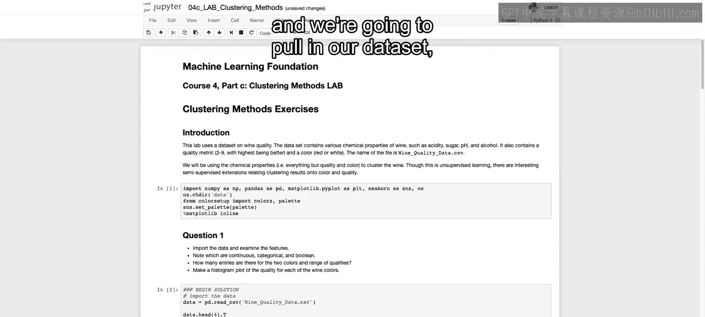

We call data dot head， and we take the first four rows。 And you see here that we transpose it。

 And this is just for a bit of readability。 So really fixed acidity， volatile acidity。

 Those are going to be our column names。 And we get a quick peek at each one of our different columns。

 And what may stand out is the different scales of each one of these different features。

 as well as the fact that color is going to be a string。 So the rest are numerical。

 and this one is a string。 And this will come into play in just a second。😊。

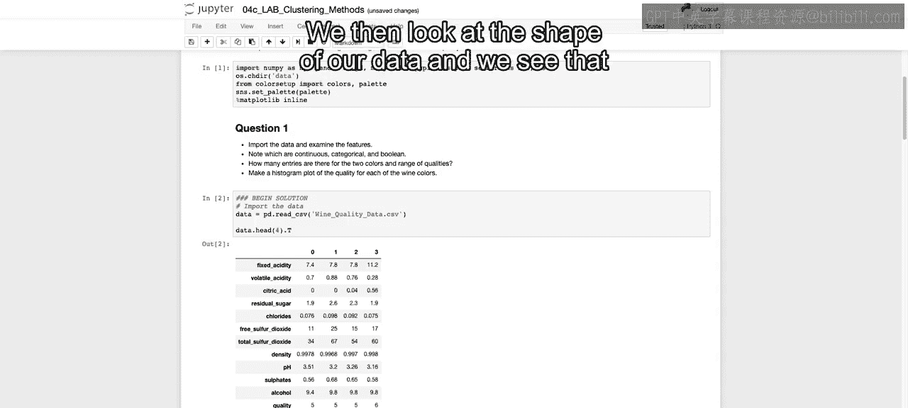

We then look at the shape of our data， and we see that we have 6497 rows， with just 13 columns。

And then we're going to look at the data type， like I just mentioned for each one of our different entries。

 And the reason why this is important is because 4K means to work。

 as well as most S K learn algorithms。 We're going to need for our data to all be numerical。

Otherwise we won't be able to pass it through。So when we check this out。

We are fortunate to see that all of our values， again。

 are not going to be using quality or color when we create our clusters。

 All the other values are going to be floats。 They are not going to be objects like we see with color。

 or even imagestegers。😊。

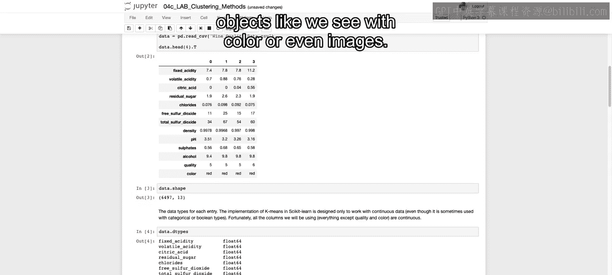

We're then going to check the value counts for our different wine colors。

 as well as for our different qualities。 Again， those qualities ranging from 3 to 9。

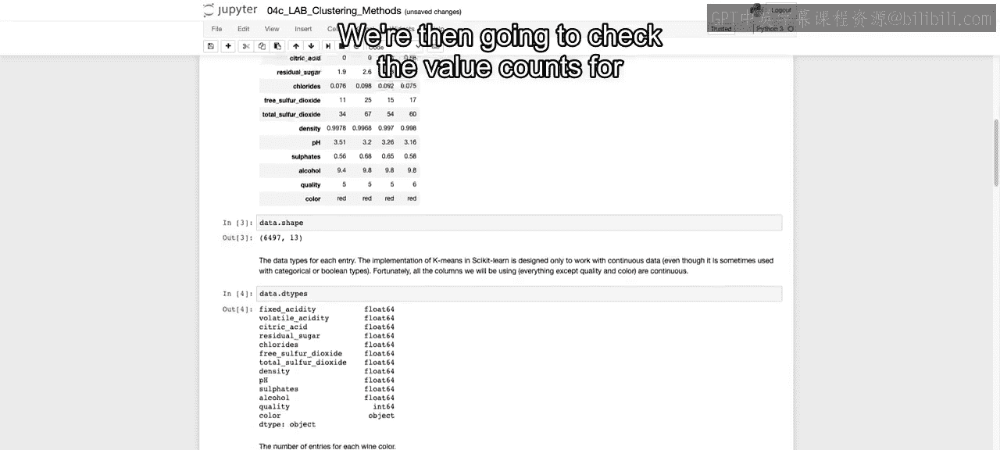

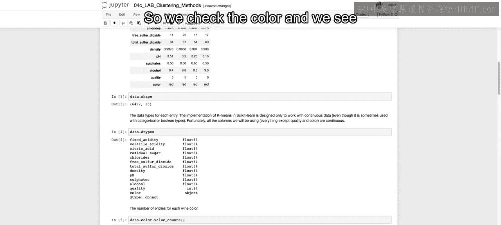

So we check the color， and we see the majority of our data set is going to be white wine。

 We can even call， as we've seen earlier。Normalize equals true。 and we can see that。

A bit over 75% of our data set is going to be white wine， whereas of 24。6 is going to be red wine。

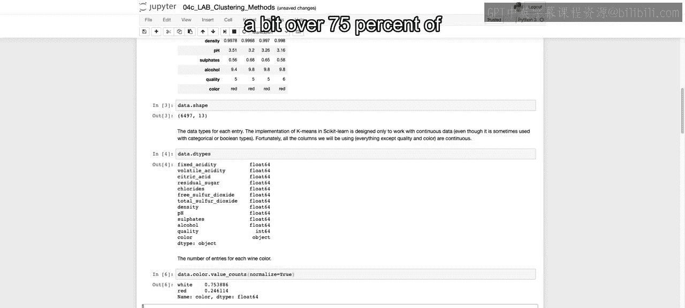

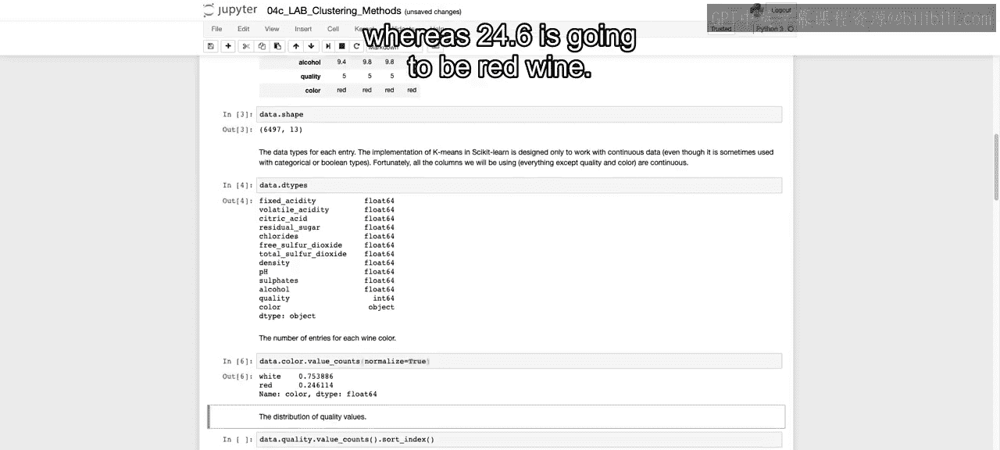

And then we can check this out in terms of the value counts for the quality。

 And we see that the majority of our quality is going to center around that 5。

6 and 7 value with very few， very low quality and very few， very high quality。

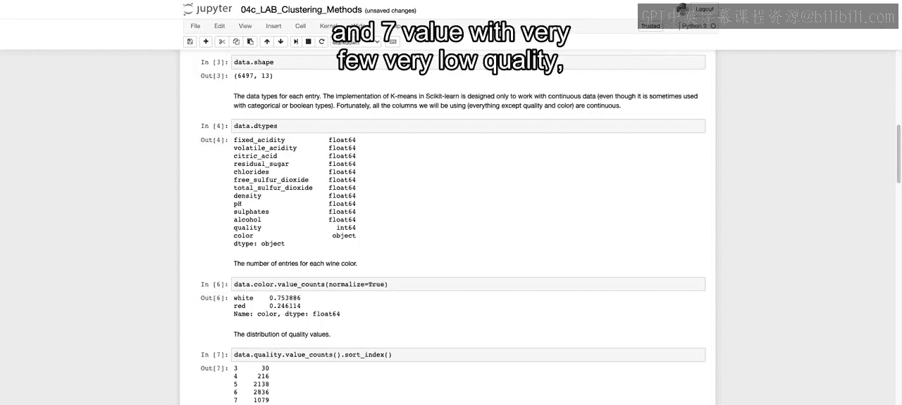

Now we want to look at a histogram breaking down the quality by red and white one。

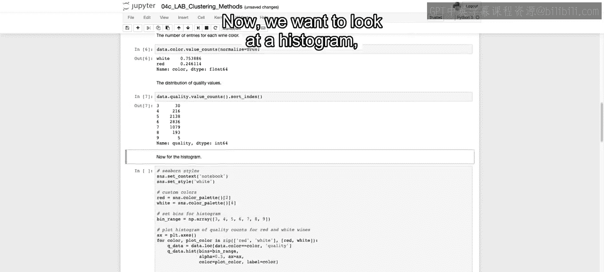

Given our data set。So we're going to。First。Initiate these colors red and white。 Now。

 these are just going to be objects pointing to a certain color。 So from S M S thats seaborn。

 we're going to pull our color palette。 and we want red to be associated with the second value or the third value because it's Python indexing and then the whites objects pointing to the color palette and the fifth value。

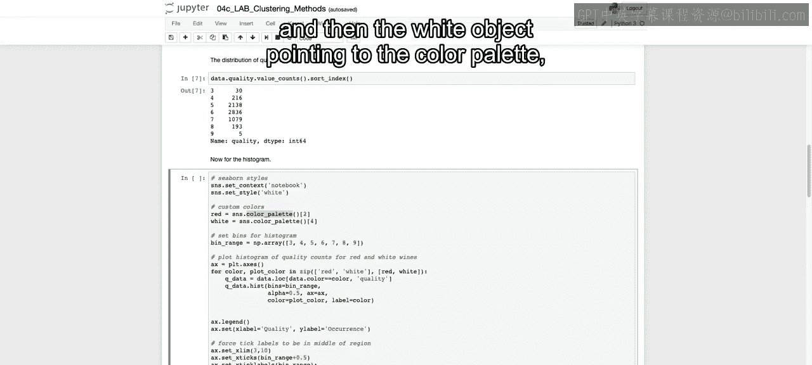

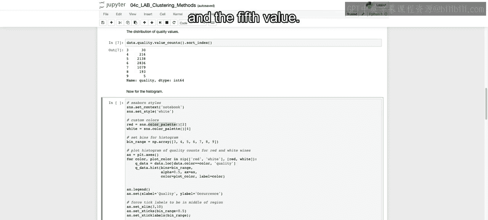

We're then going to。Explicitly tell our histogram what our bin range is going to be。

 We don't want to combine any one of our values。 We saw that 9 up here could end up being very low。

 especially when we split it between red and white wine。

 and we want to ensure that we have a separate bin for every single one of our different quality values。

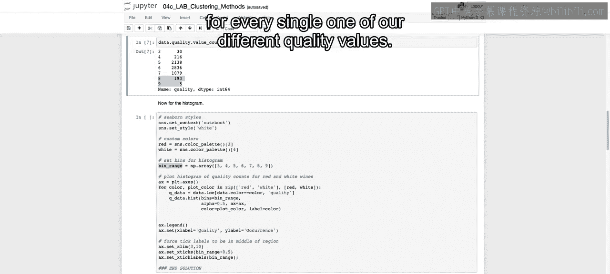

With those different objects created。

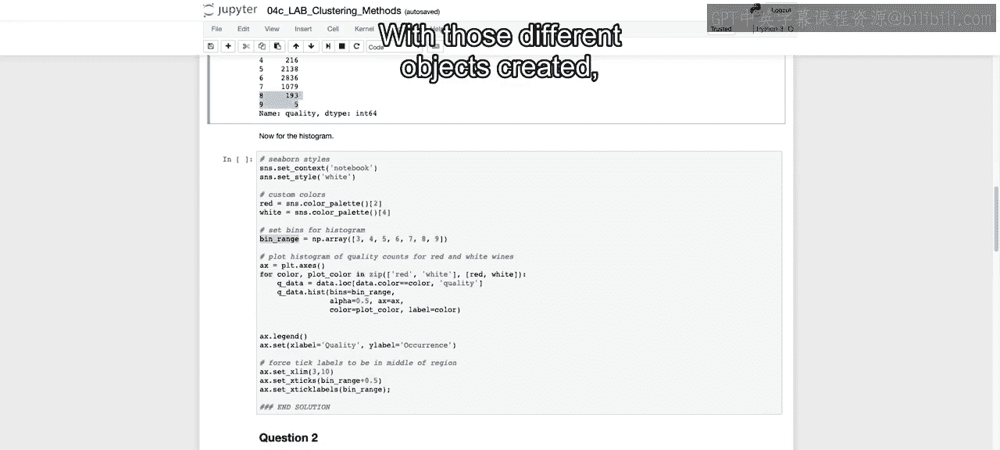

We're then going to initiate our axis， so our bounding box using PLt。axxes。

And then we're going to zip together this list of red and white。

 which is just the string of red and white。As well as the red and white colors that we initiated up here。

So red will associate with red in that first iteration through the for loop。

 and white will associate with this white in the second iteration。

And that will be color for the string in plot color for these different objects that we have here。

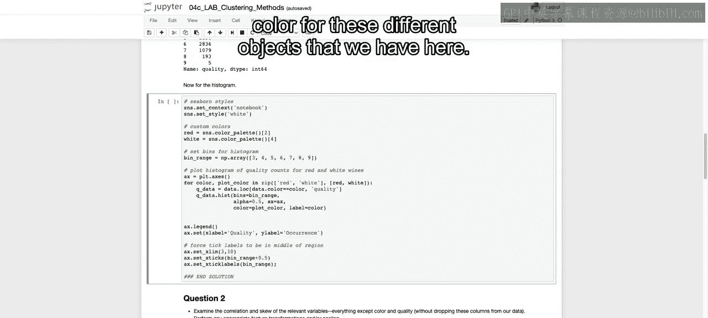

We are then going to take a subset of our data。So we say data dot Lo。

 and we want to locate where the color is equal to the color that we have specified。

 either red or white。 And then we only want the column of quality。

 We're just taking a histogram of the of the quality。We then call Q data， that's our subset。 hist。

And we say， again， we want to use just the bins that we specified above。 So 3，4，5，6，7，8， and 9。

 We set alpha equal to 0。5， because we want it to be somewhat see through。

 as we will be plotting one histogram on top of the other。We then set。

 where do we want to plot this x equals x， that axes that we initiated earlier。

And then the color that we're going to use is going to be that plot color。

 which is either going to be this red object or this white object that we had defined up here。

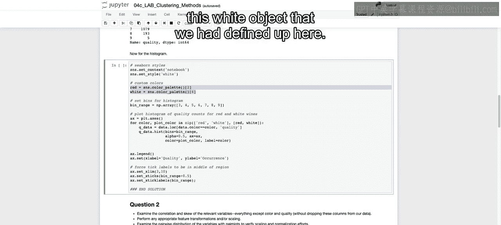

And then we're just going to create a label for our legend later on。

 labeling the white as white and the red as red， using this string。

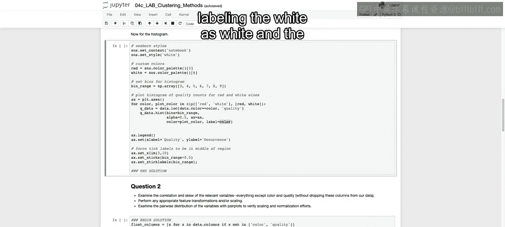

We then won our legend。 We want our X label， and Y label。We set our x limits。

 our x ticks are going to be in between each one of these values。 So at 3。5，4。5 and so on。

 and our labels are just going to be the different bin range values，3，4，5， and so on。So you run this。

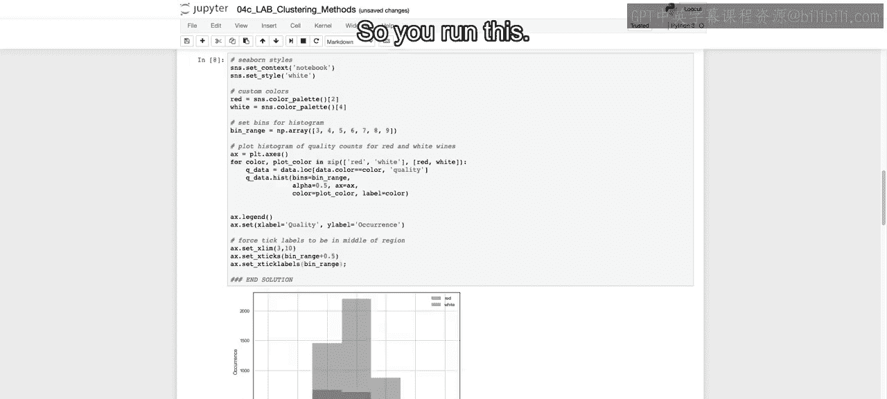

And we can see here our different breakdown of red and white wine。 and see that。

Red is slightly more centered around this 5，6。嗯。Ands the white wine has a higher peak at that 6。

 So more values of 6， but otherwise， somewhat of a normal distribution。

 whereas red is going to be a little bit flatter with kind of a bimodal 5 and 6 in regards to the red wine quality。

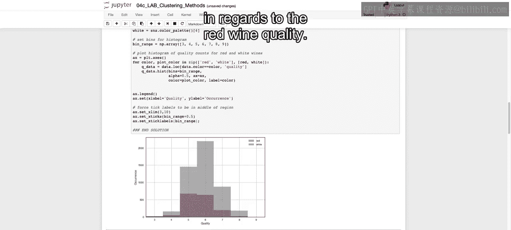

We're then going to， in question 2， examine the correlation and skew of our relevant variables。

 So everything except for color and quality。 We're not going to drop these。

 but we do want to exclude these when we look at our cross correlations between each one of our different values。

And that's because we're going to be using our cluster algorithms without either of these two values。

And then on top of that， we're going to perform any appropriate feature transformations or scaling。

Now， what's important is we have to recall that we are using distance metrics when to use our K means or any one of our clustering algorithms。

And something that wasn't mentioned throughout lecture is the importance of width distance metrics。

 And this should have already clicked as we were thinking through what we've done with each one of our supervised learning models。

If we are using distance， it will be of utmost importance that each one of our features are going to be on the same scale。

 We don't want any one of our different features being more heavily favored or causing further distance than the other one。

 So we just want their variation to be changing what our clusters will look like。

 rather than their actual magnitudes or their built in values。

And then we're going to finally examine the pair wise distribution of the variables with pair plots to verify the scaling and the normalization efforts that we went through。

So we're also going to make sure that there's a normal distribution that just makes things a bit cleaner so that we don't have a heavy skew in one direction when we take each one of our distance metrics。

So we're specifying here that our float columns are going to be all of our columns。

 except for color and quality。

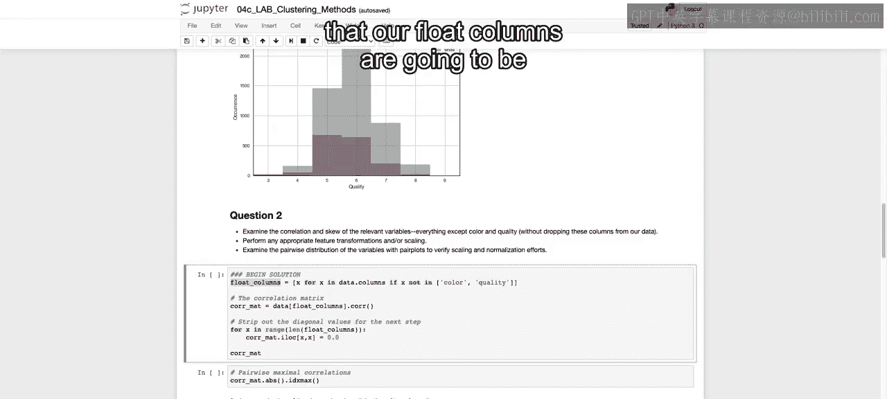

We're then going to create our correlation matrix by just specifying that we only want those columns。

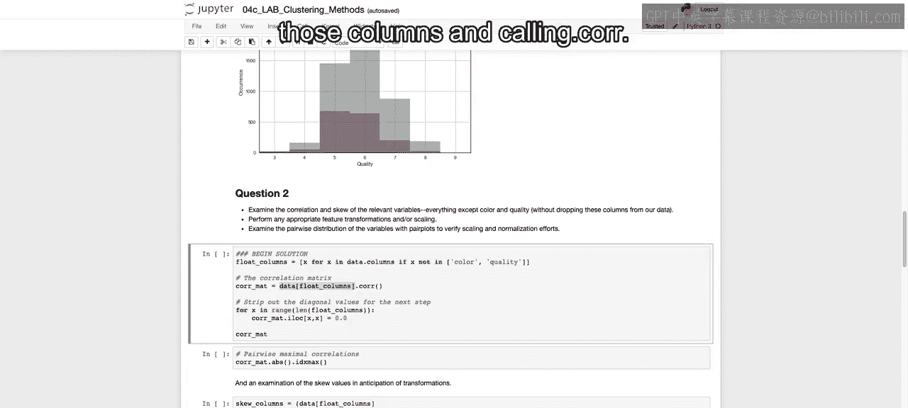

And calling dot Cor。And then finally， just to make sure that we are not getting。

 we're not seeing each one of our different correlations with themselves。

 which would obviously have a correlation of one。 Every value with itself will have a correlation of one。

 we're replacing them across that diagonal。 So4 x and range of the length of our float columns。

 So however many columns are doing。 We're going to replace the diagonal。 So the I lo。😊。

And if you think each these values being the same。That we are going to be zeroing out each one of the different values in our correlation matrix along that diagonal。

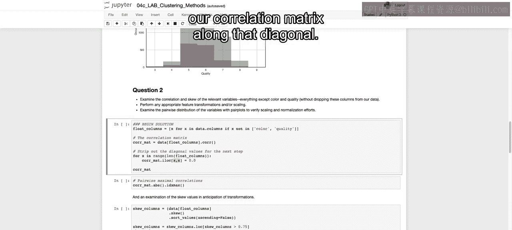

So let's see what this looks like。Again， you see that 0，0 for fixed acidity。

 and this will come into play because we're going to look at the highest correlation between each one of our different features。

And we can see here it's a little bit difficult to quickly visualize what those highest values are。

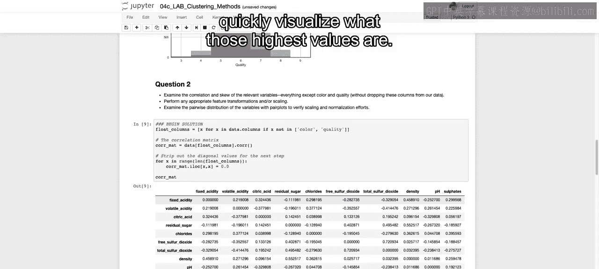

So to get that pairwise maximal correlations， we're going to call coremat dot abs sorting the absolute value。

 because whether it's negative or positive correlation， we want to see if they're highly correlated。

And then we call dot IDX max。

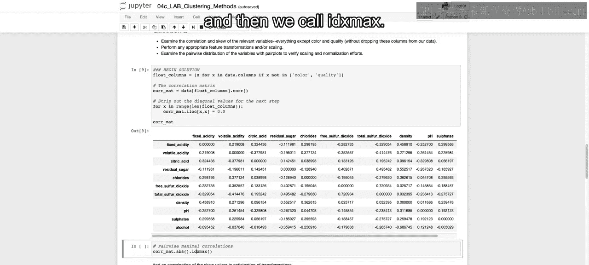

And we see that fixed acidity is most highly correlated with density。

 and we could also even just call dot max if we wanted to see what the maximum values are。

And we see some high correlations between certain values。And the reason why this is important。

Is if you recall when we discussed earlier in the lecture， as well as in the last lab。

If we have high correlation between different values。

 then we start to reach that problem of high dimensionality。

 and we know that that causes a problem whenever we're working with distance metrics as we are with most of our clustering algorithms。

So we're not going to do anything there。 The There are some fairly high correlations。

 but not high enough for us to exclude certain values。

But that is the reason why we'd want to start to investigate how high the correlations are between each one of our different values that we're going to use for our unsupervised model。

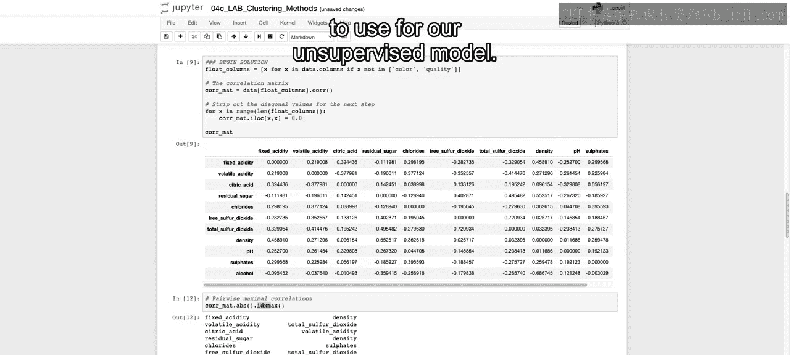

We're now going to look at the skew of each one of our columns。

So we can just call for those float columns。We're looking at the skew， we just call dot skew。

 And recall that 0 means no skew。 positive value means a right skew。

 A negative value means a left skew， meaningan it's not normally distributed。

 right skew means heavy right tail。 left skew means heavy left tail。

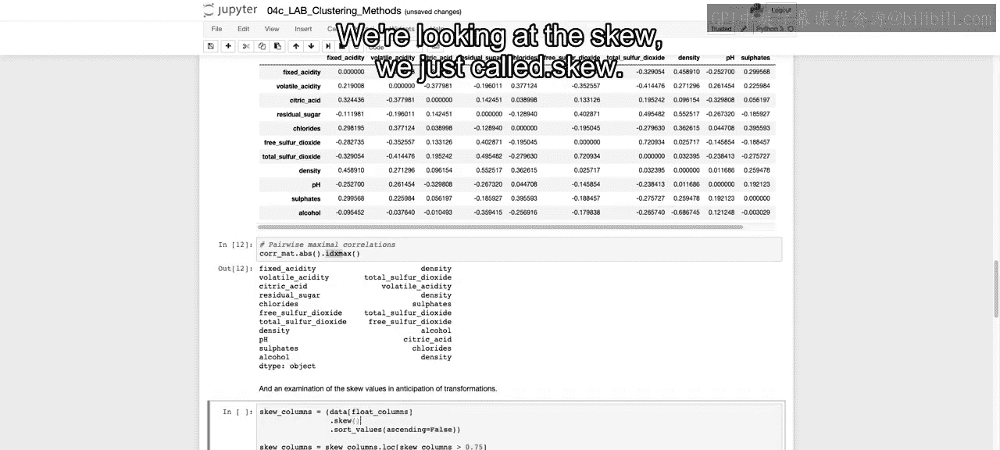

And then we're going to sort those values from highest to lowest。

 and then we're just going to take those that are above 0。75。

So we look at that and we see that each one of these values。 we are saying that above 0。

75 has a heavy skew in order to help to correct that skew。

 we're just saying four call in each one of these skew columns。

 only taking the index values because we don't care about the actual values。

 We just care about each one of these column names。

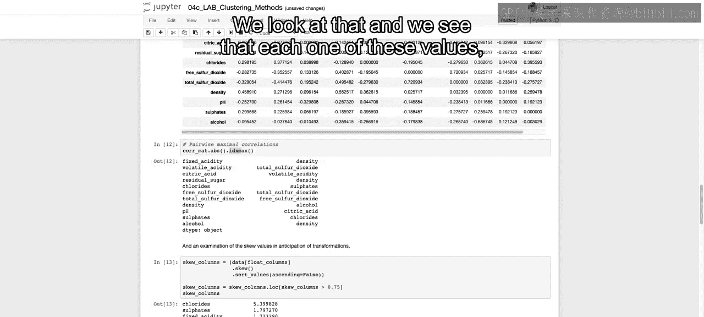

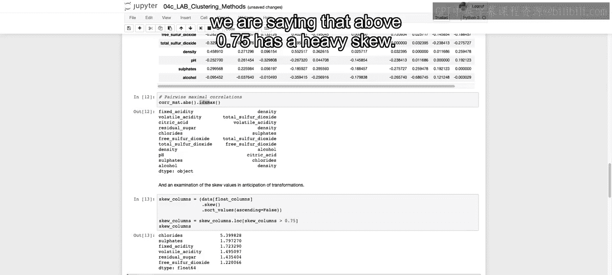

We're going to change that data to the log version of itself。

And that will help normalize our features。

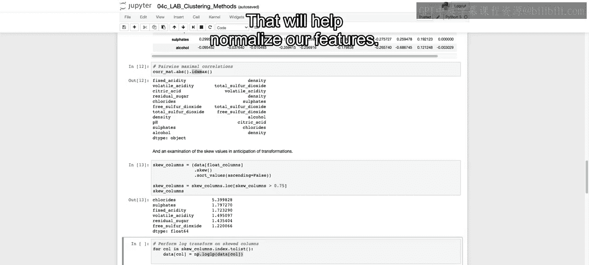

So we run this and we've replaced all of our different columns。And then on top of that。

 as I mentioned before， it's of utmost importance that all of our features are on the same scale。

So in order to ensure this， we are importing our standard Scalar， as we've done before from Scalar。

 pre processing。We set SE to that standard Scalar object。

We call fit transform on all of our float column data。

 So we're going to replace all of our data float columns。

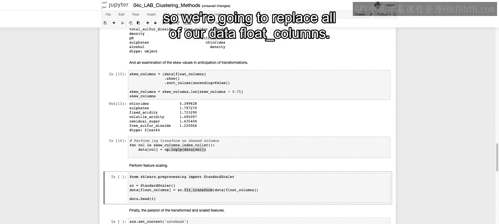

And then we're going to investigate this briefly and see that our values are now all are on a similar scale。

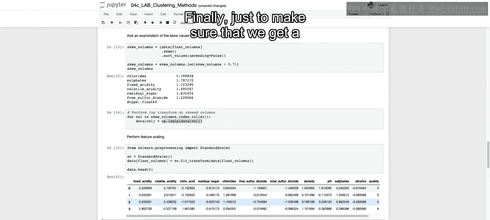

Finally， just to make sure that we get a visual of what these actually look like。

 we're going to run the pair plot。

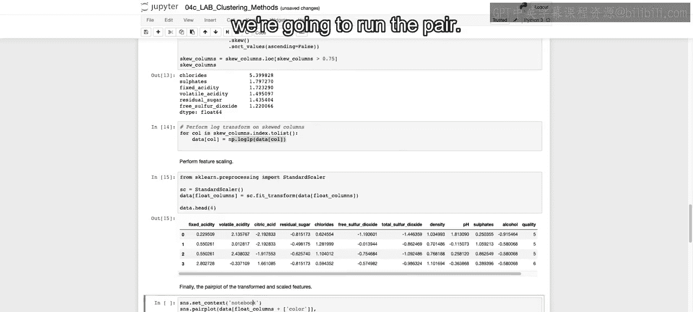

In order to run our pair plot， we want all of our columns。All of our float columns， as well as color。

 And the reason why we want color is because we are going to break apart our scatter plots。

 as well as our histograms and our pair plots will show by color to start to investigate。

 investigate that natural differentiation between our difference。Features and the color values。

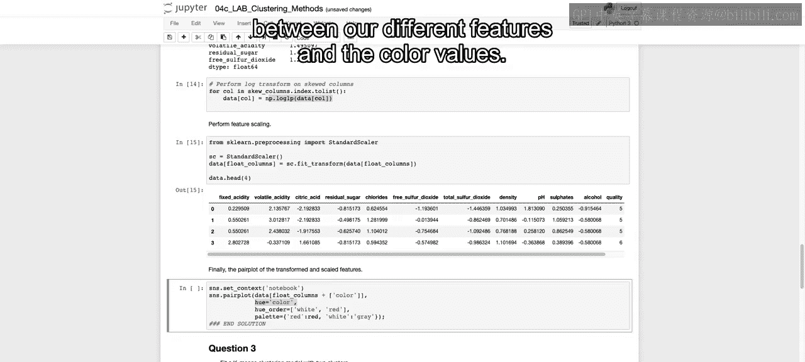

We're just ordering it white than red。 And then we're just saying our palette here。

 We want red to be equal to the red that we defined earlier。 And then for white。

 we're going to use gray as the coloring for it。Now I'm going to run this。

 and pair plots generally take a bit of time to run。

 So I'm going to pause the video real quick and we'll come back once it's already ran。

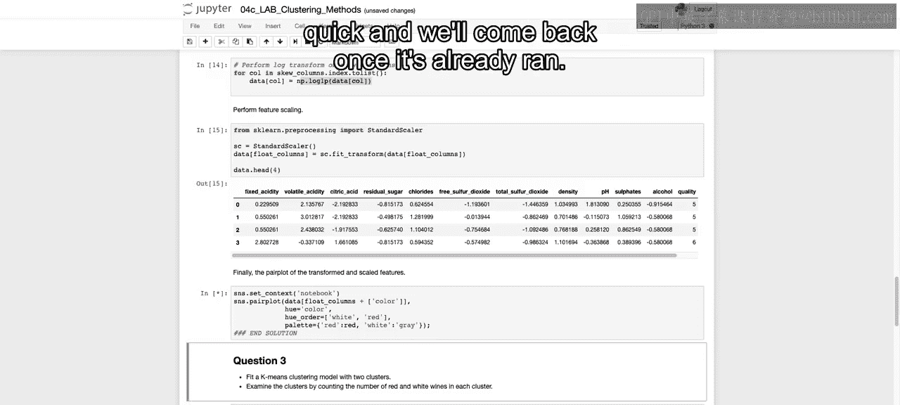

Now， we ran this parapo， and we did that to see the relationship between each one of our different features。

But on top of that， because we're also looking at the breakdown between red and white。

 we can look at these two features。 And again， we have more than two features or two dimensions to work with when we create arcanes。

 But even with these two features， we can begin to see that there is somewhat of a clustering between the red and the white wines。

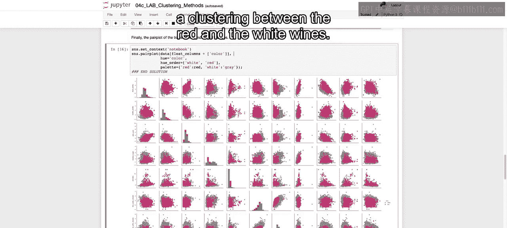

So we can see that there probably will be a pretty clean classification given our data that will show us which wines are red and which are white without actually having those labels available。

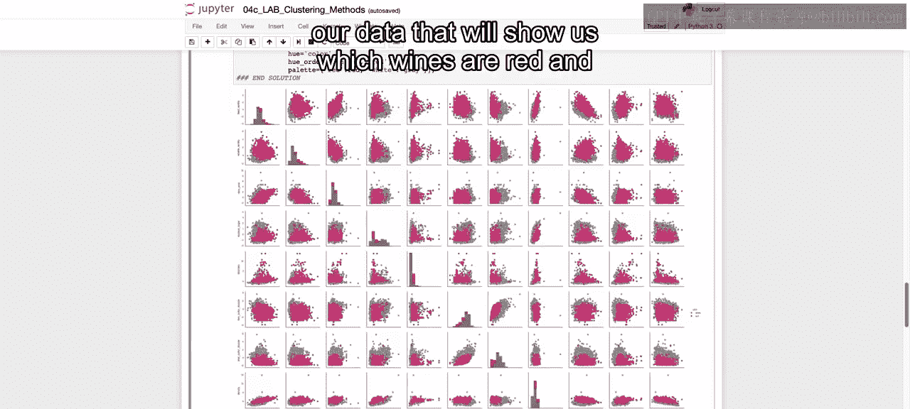

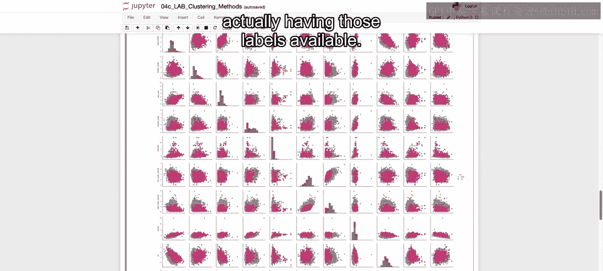

Now that closes out this question number two in our video here in question number three。

 we will start to fit a K means cluster and see what kind of clusters we actually come up with without the labels to our data。

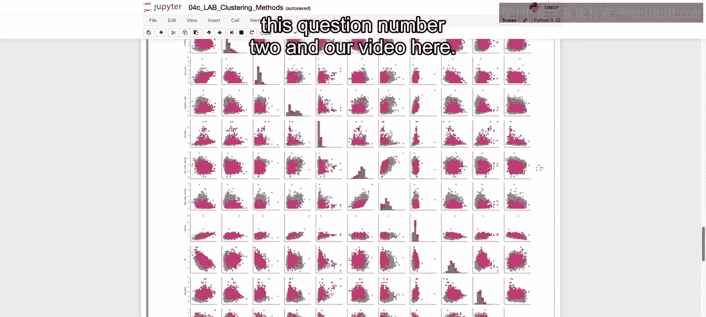

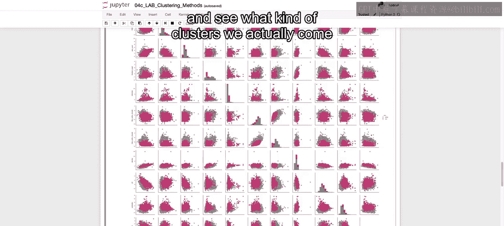

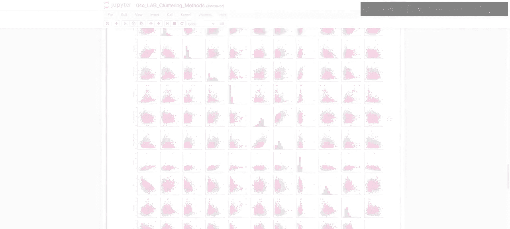