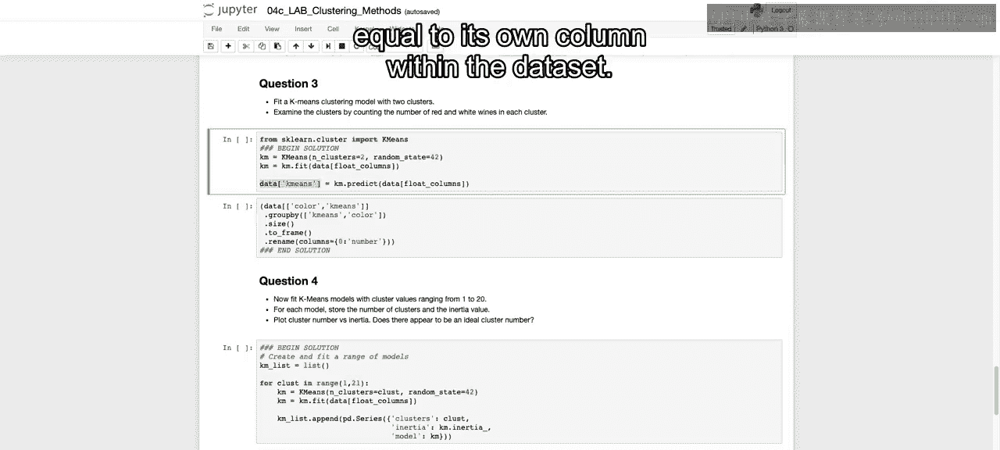
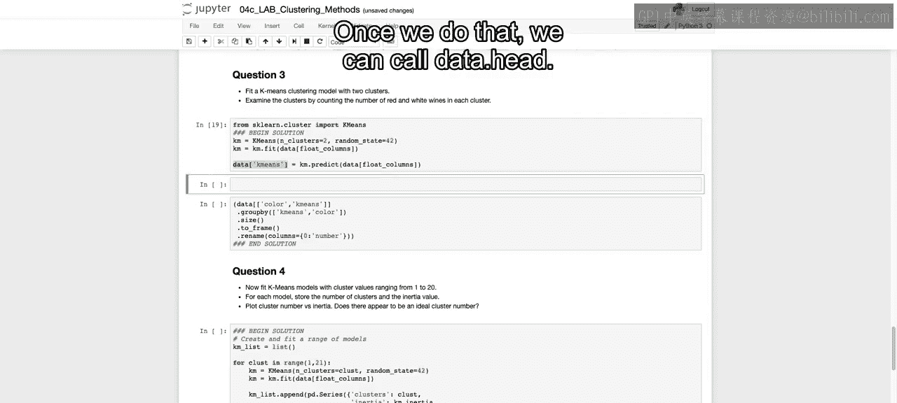
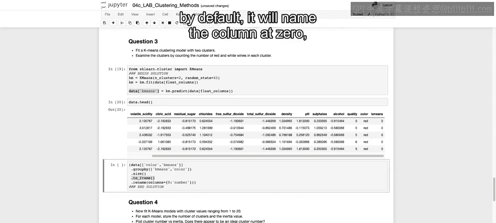
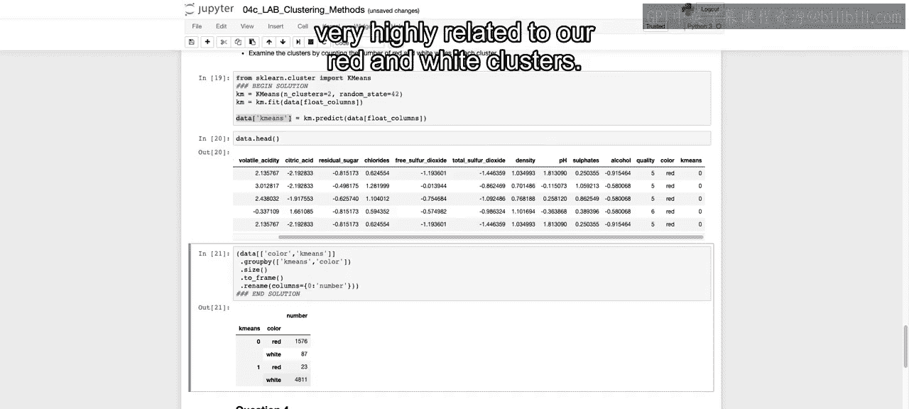
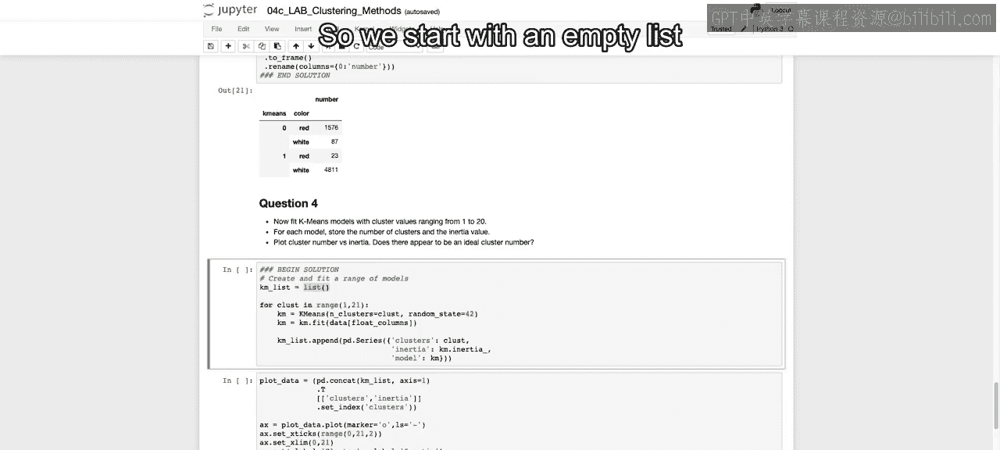
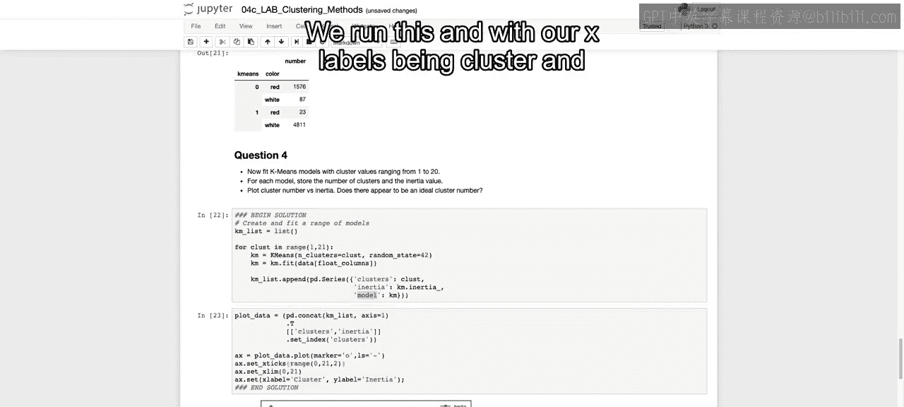
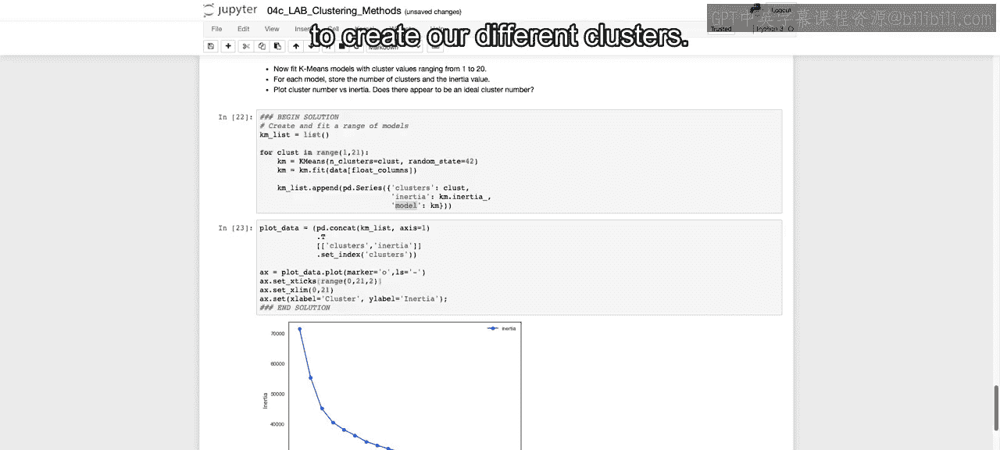
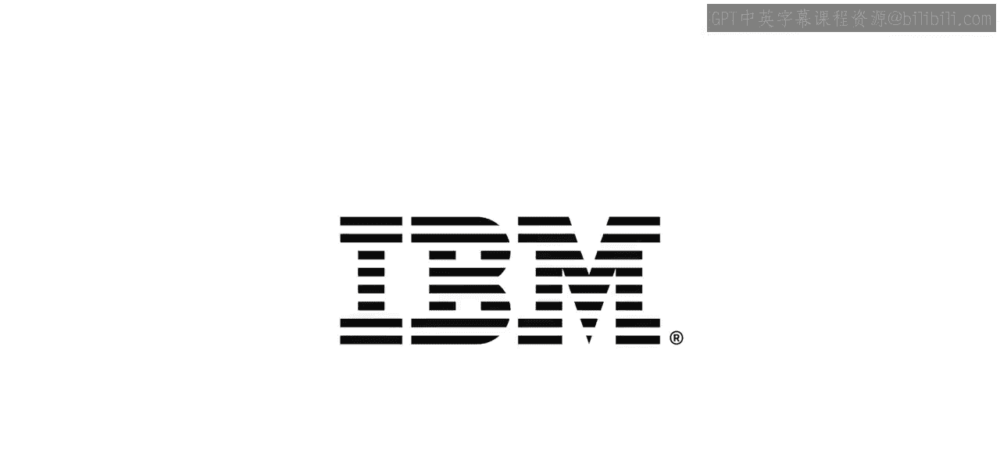

# 026：IBM《机器学习（无监督学习、深度学习和强化学习、毕业项目）｜machine learning》中英字幕 p26 25_聚类笔记本第2部分.zh_en -BV1eu4m1F7oz_p26-

Now， for question number 3 here。We're going to continue by fitting our first K means clustering model。

 and we're going to use two clusters， and we're going to use two clusters not identifying the red and white。

 We're not going to have that included in our data set。 And we're going to examine the clusters。

 according to the red and white wine， to see if it automatically clusters。

 according to this red and white differentiation。So what we do is we import from Skar dot cluster。

 our K means model。We're then going to initiate our model and say that we want two clusters。

 Re what K means We need to say how many clusters we want。And then we call KM dot fit。

On just our float columns。 So not including both the quality column or the color column。

We then call Km dot predict on those same columns， and we set that equal to its own column within the data set。

And we'll see why we do that in just a second。And once we do that， we can call data dot head。

And we can see all the way here at the end that we create this new column that's either 0 or  one。

And we're going to see how that relates to this color column to see if all the reds were identified as 0 and all the whites as one。

So in order to do that， we're going to only take the subset of columns of color and K means K means being the one we just defined。

We're then going to group by each one of these objects， so we're aggregating by both of them。

And then dot size is just going to give us the count of that breakdown。

Now it's going to be a pandas series。 So we're just changing it to a data frame。

 and we're renaming that column at first by default， it will name the column as 0。

 So we're just calling it number。

And we run this。And we can see that for 0， the majority of them are going to be that red wine。

With only 87 white being identified as0。 and for white wine， only 23 were identified for one。

 Only 23 were identified as red， and 4811 were identified as white。

So we can see that it did a pretty good job without any labels separating out our data set into two different clusters that are very highly related to our red and white clusters。

Now we're going to fit a Ka means model with clusters ranging from 1 to 20。And now with this。

 we are assuming that we don't know the number of k that we want。

 We don't know how many clusters we want。And for each model。

 we're going to store the number of clusters， as well as the inertia value。

 And then we're going to plot that cluster number versus the inertia and see if we can find that elbow that would identify that this would be the best number of clusters given our data set。

So we start with an empty list， and then we range from values from 1 to 20。

We call K means， and we initiate with that number。We then fit it on our float columns。

 and then we take our K M list， and we keep app on this panda series that will have the clusters。

Which is just that for loop at that point， the inertia for this fitted model。

 And then we can also save the model as well。 Just the full on model。

 if we want to access that later。So I'm going to run this and this is going to take just a second to run。

 so again I will pause the video and we'll come back when it's done running。Okay， that is now Ram。

 and we now have our。K means list of our different clusters in their inertia as well as their models。

That list， if we think about our panda series， recall that that's going to be each one of our difference。

Indices for that series。So we're going to concatenate each of those series together using access equals 1。

 and then we're going to transpose it so that our different column names are going to be clusters。

 inertia and model， and we'll have that for each one of our different clusters ends。

They are different inertias， their respective inertias for each of those different cluster values。

We're then only going to take clusters and inertia， so once we have those as our columns。

 we're only selecting those two columns。We're setting our index to clusters。

 those are going to be that number of clusters， and that will allow us to easily call plot data。

Which is now our Padas data frame that we have created here， dot plot。

And say that we want a line connected by each one of markers connected by lines。

Markers being Os here。And then we just want our x stick to go from0 to 21 or to 20。

 and then our x limits to go from0 to 20。We run this and with our X labels being cluster and our Y labels being inertia。

 And we try to see if there's any strong elbow。 It doesn't seem like there's quite that。

 maybe a bit of that at。

4 perhaps where it starts to decline how much it's going to be really declining as quickly。

 So maybe you choose 4。 But probably the best fact。

 this is if you know that there's some type of clustering here。

 as we did with either the quality of the wine。 and we knew that they were six different values there from3 to 9。

 or if you knew that there's red or white wine， you choose that as one of your case。Now。

 that closes out our discussion here with K means in the next question and in the next video。

 we are going to start to discuss using a glloorative clustering to create our different clusters。

 All right， I'll see there。😊。

