# 027：IBM《机器学习（无监督学习、深度学习和强化学习、毕业项目）｜machine learning》中英字幕 p27 26_聚类笔记本（选修部分）第3部分.zh_en -BV1eu4m1F7oz_p27-

Hi and welcome back for question number 5 of our notebook here。In this question。

 we're going to fit in a gllomative clustering model with just two clusters。

We're then going to go ahead and compare the results of a gllomative clustering to that of K means。

 Then also compare that against the red and white wines and see if the numbers and the groupings seem to be the same。

We're then also going to visualize the dendrogram， and the dendrogram is going to be that subgroup building up to those larger groups that we saw during lecture when we talked about a gllomative clustering。

 So we're going to see how we can do that in Python as well。

So the first thing that we want to do is import a gl of clustering。

 We're going to create our object here and pass in the arguments。

 We're going to say that we want two clusters or we're specifying the number of clusters equal to2。

If we want， we can also pass in the distance threshold as an argument here。 If we do do that。

 if you want to do that back at home， you just have to make sure to set the number of clusters equal to none。

 You have to do number of clusters or the distance threshold。 you cannot do both。

Here we'll do a number of clusters。We want it to compute the full tree。

 if you did a certain amount get cut off to save computation time。

 So if you want to save computation time， you could set this to false。

 but this will run fairly quickly and where it'll allow us to see everything that built up within archery。

And then we're setting our linkage toward。 And again。

 that linkage means that we're finding the clusters that reduce the inertia。

The most between any other groupings。So once that has been initiated。

We're then going to fit it to our data just using the float columns as we did before。

And we're going to add that in as another column within our data， so we had K means before。

 and now we're also going to have the Gm data set。So I run this。

 and this will take just a second to run， but not too long。 now we have our data。

 and we can then use the same method that we saw before。

 So we're going to take our data and take the subset of the colors。

 The glam column that we just created。 The K means that we created earlier。First。

 we're going to group by color and alom and see the counts。 So we run this。

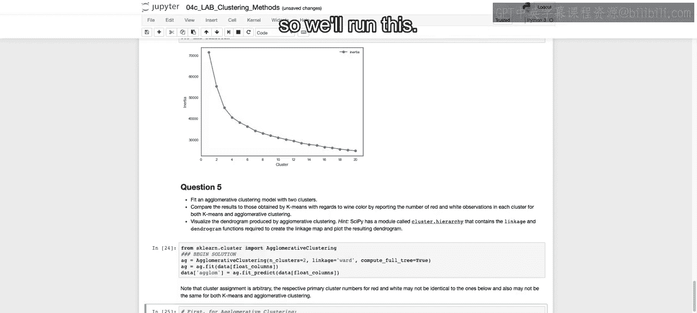

And we see again that the red and white wines were able to group them appropriately。

 So we' able to see that for red， only 31 were of a glm class 0 and 1568 were of a glam class 1。😊。

Whereas the majority of white was。Classified as a glam class 0 here。

 So we have the zeros and ones very highly related。

 very highly correlated with our red and white wine。

And that was a similar story when we worked with K means， as well。

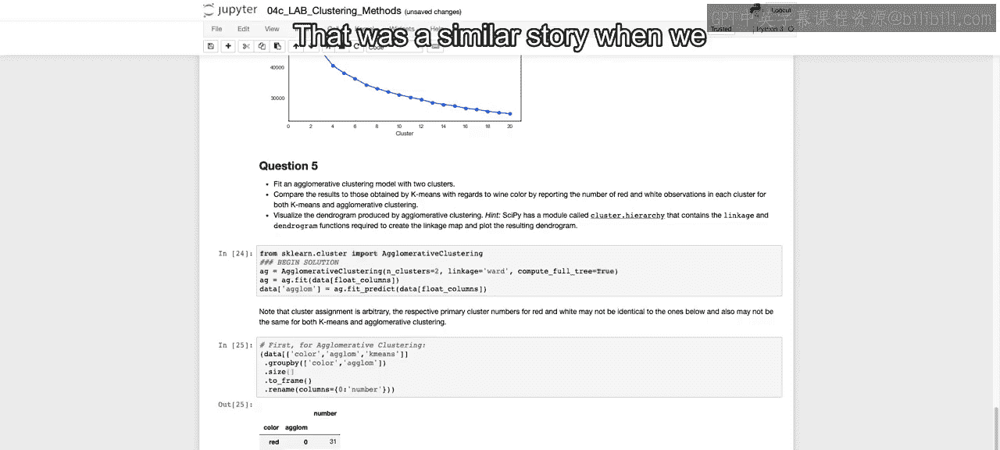

Now the numbers are a bit flipped， so it doesn't really matter whether's 01 that's arbitrary。

 but the fact that they are separating them out into specific classes。So we see 1576 verse 23。

 1568 31， maybe not quite as well there， and the Gaiglom maybe didn't do quite as well for the white wine either。

 but still did a good job of classifying each of these two separate classes。

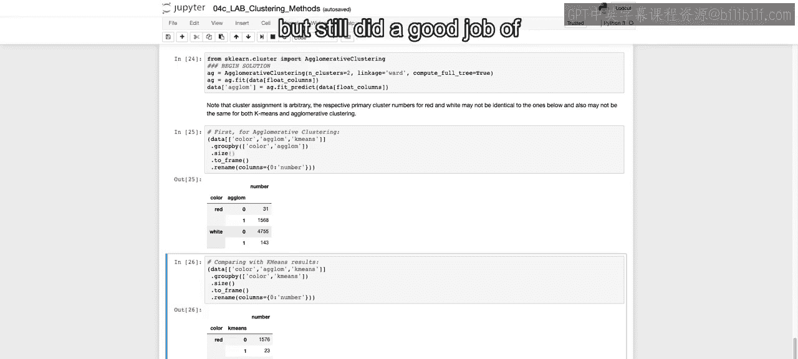

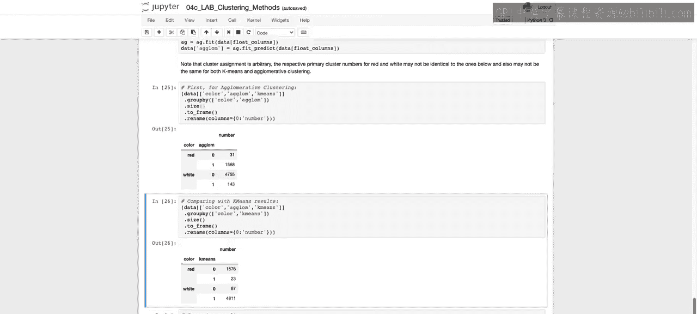

And then if we want to look at both of these in total， this will be a little bit difficult to read。

 given that trade off between 0 and1 and also just having this multi index。

 I would suggest just looking at these top2 that we just discussed。

 But if you want to dive deeper and C 4 red wine when we had a glum。

 how much of the K means were an agreement。 And these would be agreement， both 1 and 0，1563。

 And you can break it down accordingly and take a deeper dive into where the mismatches may have happened。

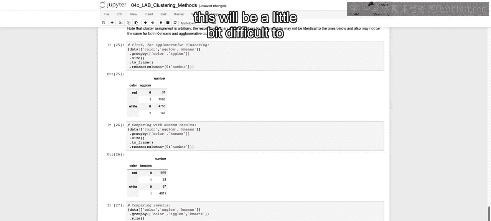

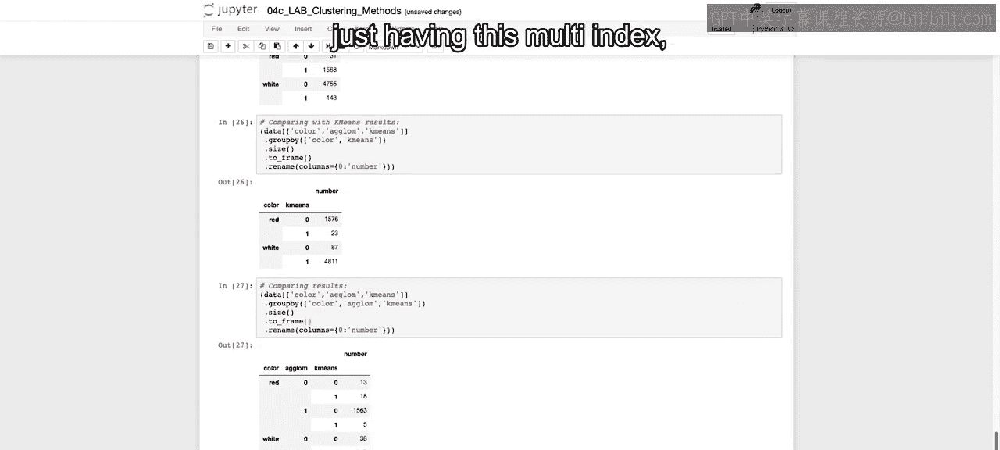

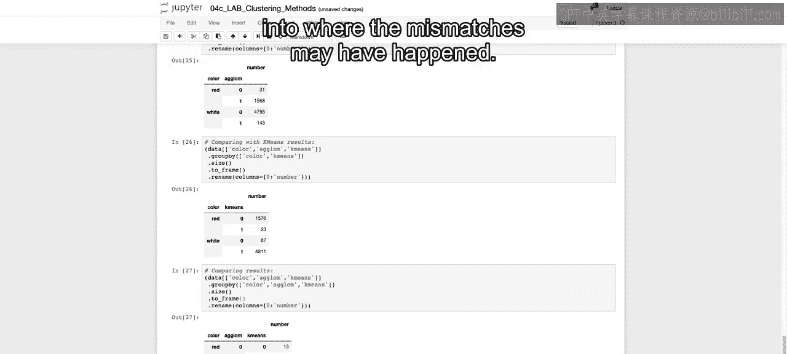

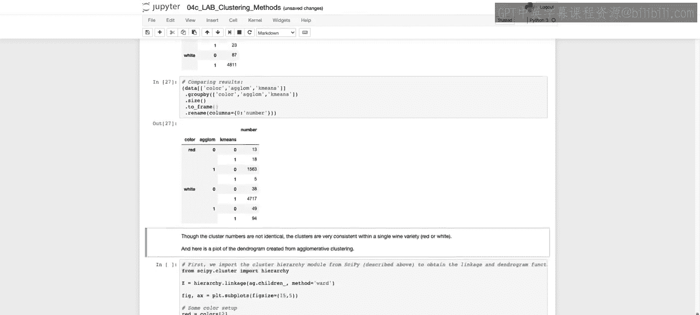

So again， though the clusters are not identical， the clusters are very consistent within a single wine variety。

 either red or white。Now we're going to plot out our dendrogram。

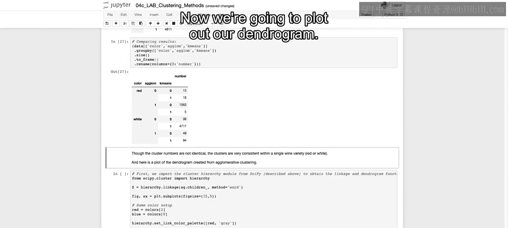

And I don't want to walk through all a different pieces of code。

 this is just for plotting out denjoograms， that's all you will really need in order to use this moving forward。

But your。Fitted model should have these children which will help us identify the breakdown of our model。

We use this hierarchy dot linkage that we imported from sippi dot cluster。

 which will allow us again to create what we need to pass into our dendrogram that we're going to use。

We're going to initiate our figure and our axes， we're going to create the colors that we want to use。

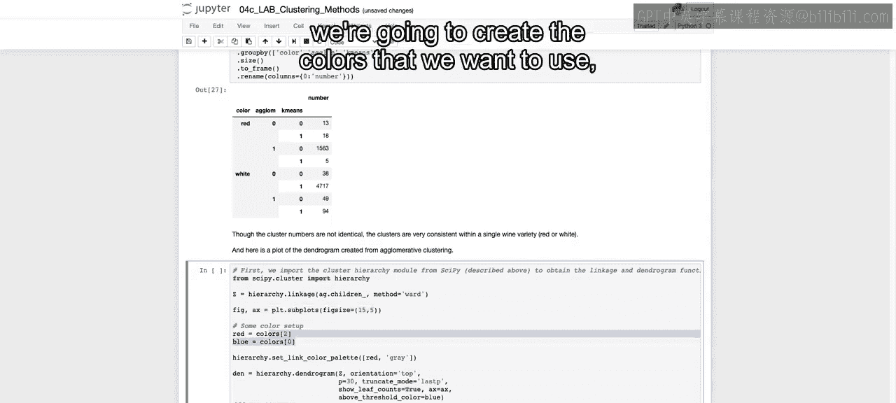

And。Set the link color palette。 So how we're going to link each of these。

 and you'll see this red and gray come into play in just a second once we plotted out。

And then we call hierarchy， which is what we imported here。

 dot dendurogram to plot out our dendurogram。Now， Z is equal to that hierarchy linkage object that we。

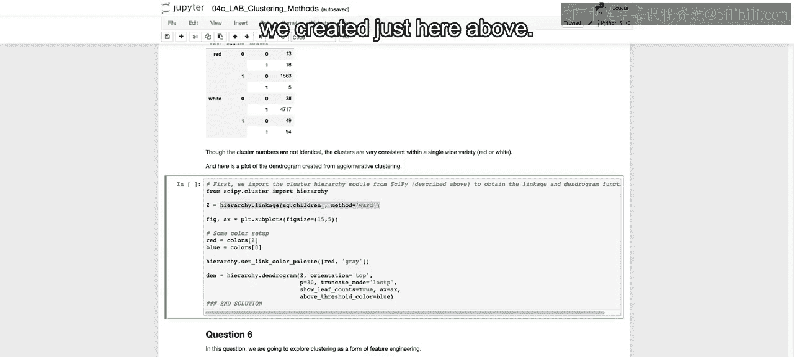

Created just here above。Some important arguments。 First。

 let me run this so we can see what this looks like before going through the arguments。

So we see the den brm， and we see how it broke down from side to side。

 And we also see this went down a certain amount of levels。

 This in't go all the way down to the bottom。 If we wanted to see all the way down to the bottom。

 we can change that。 and it would take some more time to plot。

But we see also the number we said show leaf counts equals true。

We can see the number that shows up in each one of these different subgroups。

 so how many rows showed up in each of these subgroups？Now， if we wanted to see less data。

 we could set this P equal to something like 10。And I run this again。

 And now you only see if you counts the bottom。Lines that we have here。 there's only 10 lines。

 so it's breaking it down so you can see up until there are only 10 subgroups left。

And that's dependent on using the last P。 You can also write here level。

 And you can say how many levels down you want to go。🎼So just to highlight。

 this is about two levels down。If we were to run this just one level down。

 we can see that just breaks out into these two subgroups。 Again。

 I changed the P and the trunncate mode at the same time in order to see how much of that dendrogram we actually want to visualize。

Now， we're going to stop here。 And in the next video。

 we're going to discuss how you can actually incorporate these different clusters into creating your different models。

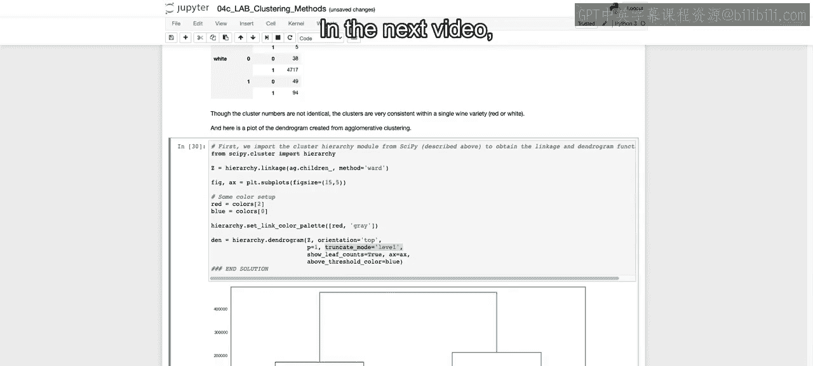

Seeing the performance of each and then closing out this video with another walking through of the performance with different levels of。

 say， different types of clusters。 All right， I'll see you there。😊。

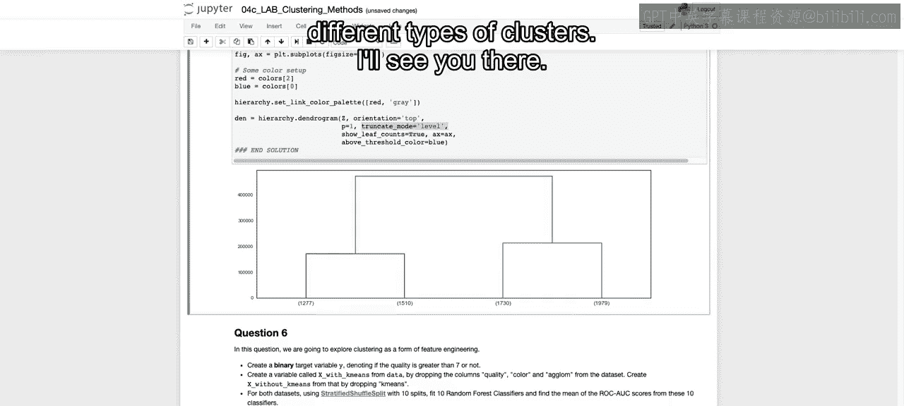

