# 028：IBM《机器学习（无监督学习、深度学习和强化学习、毕业项目）｜machine learning》中英字幕 p28 27_聚类笔记本第4部分.zh_en -BV1eu4m1F7oz_p28-

Now， in this question， we are going to explore the idea of using clustering as a form of feature engineering。

So the first thing that we need to do is create a variable that we're going to try and predict as when we're doing our feature engineering。

 this will now be for supervised learning。So we are going to create a binary target variable Y。

 which is just going to denote whether or not the quality is greater than 7。

 So greater than 7 will be equal to 1，7 or less will be equal to 0。

We're then going to create a variable called x with K means。

 And that's going to be from original data。 So it's going to be a panda's data frame。

And we're going to take that data and everything that we've worked with so far。 If you recall。

 we added on a glm as a column as well as K means as a column。 So we'll drop quality color and a glm。

 which will leave that K means。 So we have all of our float columns plus that K means column。

And then we're going to create another pandas data frame， which is X without K means。

And that's just taking what we just created from X with K means and dropping K means column。

And then for both data sets， we will use stratified shovel split with 10 different splits。

We will fit 10 different random forest classifiers。And with that。

 compute that R O C AU score of these 10 classifiers。

 Find the average of each and see which performed better。

 The one with k meanss or the one without k meanss。

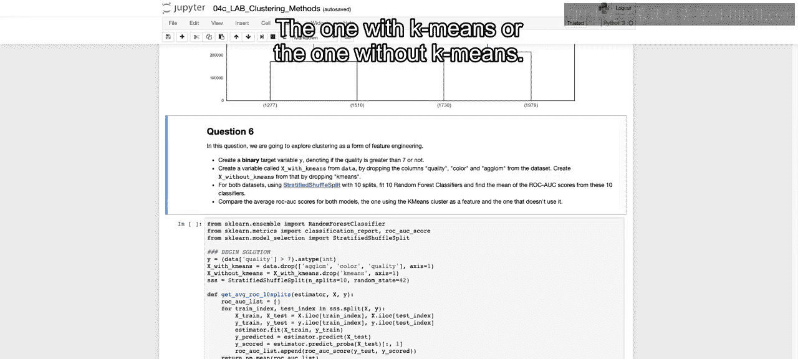

So in order to do so。We're going to have to first import our random forest classifier。

We will also import our ROC AUC score， as well as our stratified shfel split。

So hopefully you recall all of that from the course when we did supervised learning。

We're then going to。Create our target variable， which is just when the quality is greater than 7。

 We set that equal to 1。 So if we say just this part， the quality greater than 7。

 that will return either true or false。 Se it as type int converts that true to 1 and the false to 0。

We then initiate our objects X with K means。Which is just going to be our data set that we currently have worked towards。

But dropping a glam， color and quality。 So we saw the canamines in our float columns。

And then X without k means will take that x with k means that we just defined。

And drop the K means column。 So now we have these two different pandas data frame。

 One is just the float columns， which is x without K means。

 and one is the float columns with that K means column as well， which is x with K means。

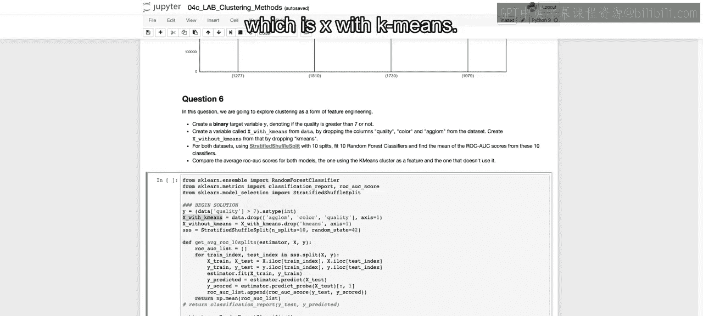

We're then going to initiate our stratified shuffle split object。

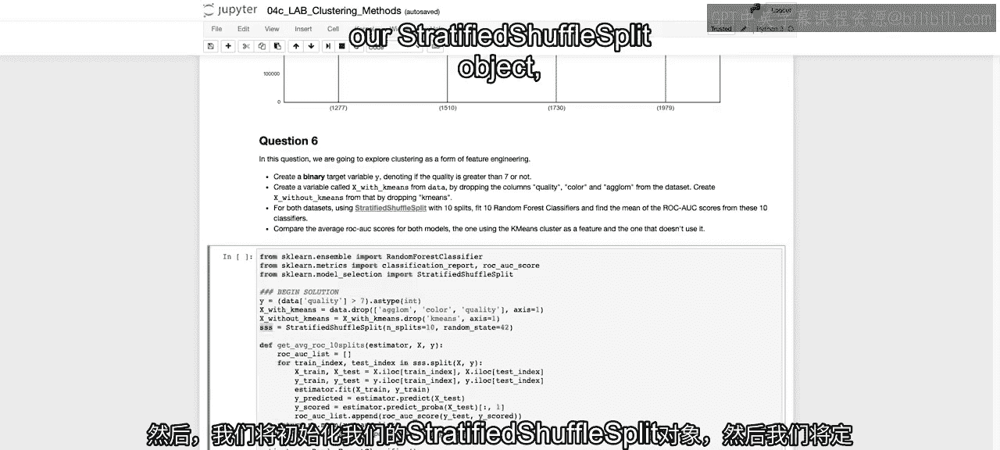

And then we're going to define this function， which will allow us to pass in an estimator。

 And that estimator， a spoil alert here will be random force classifier。

 but we'll see how we'll use this again for logistic regression as well。

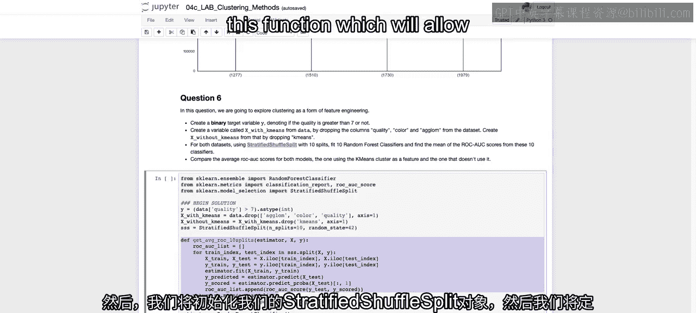

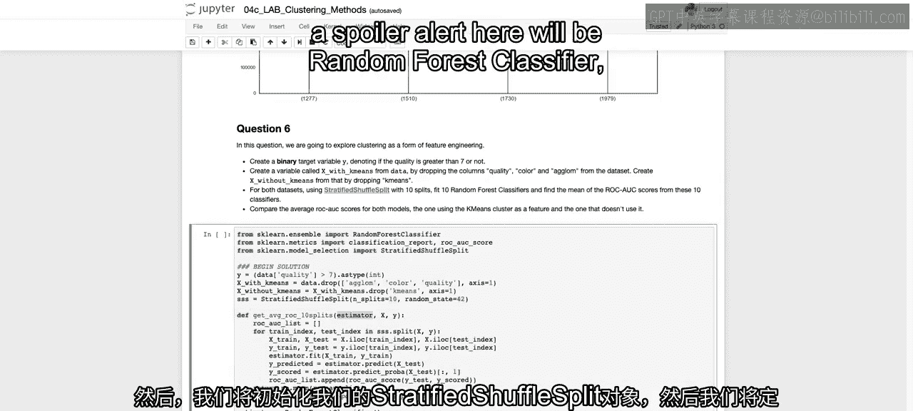

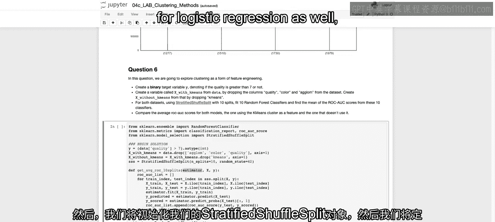

And then an X and a Y， so our different features and then our outcome variable。So first。

 we initiate an empty list of RC AU， and that's because if you recall。

 we're going to create 10 different values and then take the mean of each of those values。

 So we'll append each of those values to this empty list。We take。Train index and test index。

F values in our SSS dot split， for our X and Y， depending on the X and Y that we passed in here within our function。

And because this SSS。Is defined to have 10 different splits When we run this for loop。

 we are running through four different 10 different iterations。

Of different stratified shuffel splits。 So different splits of our data that have ensured that there's a stratification。

That's a certain amount of data quality greater than seven shows up in each one of our different train and test sets。

So then we set X train and X test。Using those train indices and test indices。

 and we set why train and Y test with those train indices and test indices。

We can then call that estimator that we defined up here that we're passing into our function。

And called dot fit on our training set that we defined。

And then we can come up with our actual prediction。

 which is going to be estimator dot predict on our test set， on our holdout set。

And we can do the same for our predicted probabilities。 if you recall， if we want that ROC AU score。

Then we need the predicted probabilities to actually create that。

So we get the probabilities that's going to output the probabilities for both of the classes。

 we only want the positive class， so we're taking all rows， but only the first column。

 not the zero with column。And that's going to be our different scores。

And then we can call for each one of our different iterations。

 the R O C AU score for our actual values。 That's the Y test。

As well as the scored values that we just computed。

And we will continuously append that to our empty list so that we get all 10 different。

All 10 different ROC values。We then take the mean of that list。

 and we will have the average for the different ROC scores across those 10 different splits。

So now that we had that function defined， that will output that average across the 10 list。

We could set our estimator here to random force classifier。

 so we have estimator equal to this object。

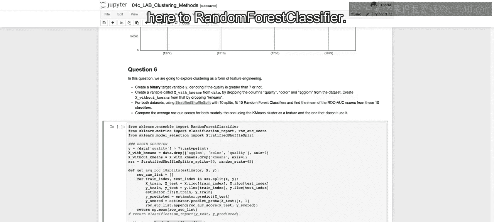

We pass that in to our function that we just defined。Along with x with ks。

 so this is with the column of kians。And that's going to be our X， as well as our target column y。

And then we're going to do the same thing， running that function to getss。The same estimator。

 except on x without K means。 So with our data set without that extra column。We run this。

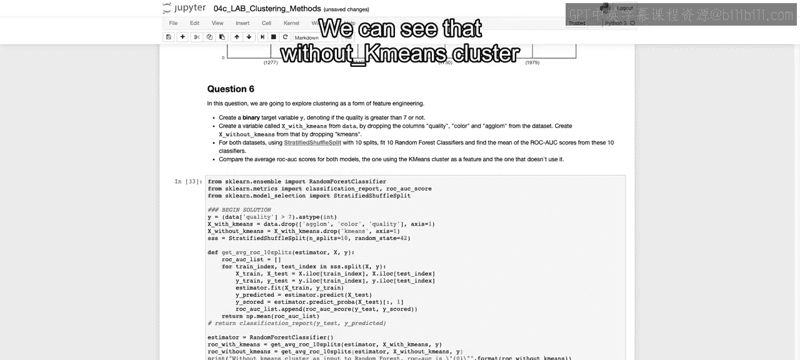

And we can see。That without came means cluster。Actually did worse than with Ca means cluster。

 So we performed better when we had our camem means cluster as input into our random forest。

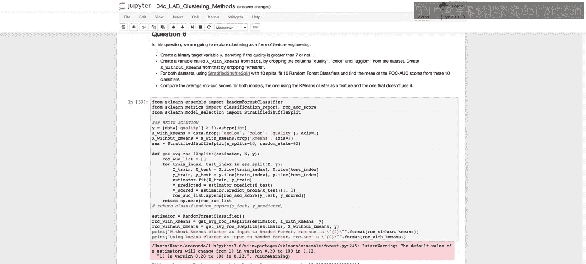

Now， what I'd like to do is explore the idea of changing the number of labels that we will incorporate when we create this new feature or this now new set of features if we think about this in regards to one hot encoding。

So we're going to say 4 n equals 1 through 20。 We fit a K means algorithm with n clusters。

 So first one two clusters， three clusters， so on。And we then have to one hot and code it because otherwise 19 label number 19 will be thought of as greater than label number 5 or label number 10。

So instead we want those each1 hot encoded so that there's no ordinal value to each one of those different values。

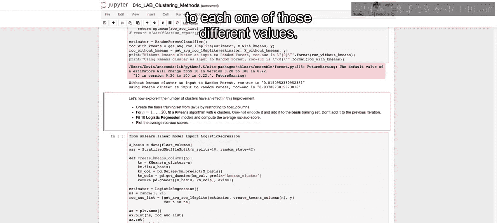

And once we have our one hot encoded version of that column。

 we're then going to fit a logistic regression model and compute that average ROC AU score。

And then we're going to plot that average ROC AU score for each one of our different numbers of clusters。

So I'm going to run this while I explain it because it may take a little bit of time。

But the way that we start off is that we're going to set x basis equal to just those float columns。

We're then going to initiate our stratified shuffel split with only 10 splits， as we did before。

We're then going to define this new function， create K means columns。 So as I mentioned。

 we can't just create that one column with multiple labels。We have to one hot。

 encode code those labels。So we say KM equals K means with the number of clusters equal to whatever n we pass in。

We're then going to fit on just our float columns。And then when we call K M dot predict on our x basis here。

 we're actually outputting each one of these different labels。 So if the number of n was equal to 20。

 we'd have values 1，2，3，4， all the way through。19， actually starting from 0 up until 19 to have our 20 different clusters。

We then take that column that we just created。And we call PDD dot get dummies on that column。

And now we create if there is 19，19 different columns。And having a one or a0。

 if that column happened to be。A one， a two， a three， so on and so forth。

We then concatenate just those float columns。To those new K means columns that we defined。

 so that may be。Up to 20 columns that we're adding on。And then once we have this data frame。

 the idea is that we will be able to pass that in as our data frame and then fit our models。

So we initiate our estimator as logistic regression。We say the ends。

 the number of clusters that we want to run through are1 through 20。

We're then going to get our list of ROC and AUC values。

By calling that get average ROC 10 splits that we define just above in the cell above。

We pass into that the estimator。Our X value is going to be this create K means outputs。 So remember。

 this output will actually output a panda's data frame that's going to concatenate onto that original data float columns are new labels。

 one hot encoded。And then using that same target variable for each n in our different ends that we have defined up here。

We're then going to plot that out， we initialize our plot。

 and then we just plot the ends versus the different ROC AUCs that are output given the model。

 given the function that we're running here。So we've already ran this。

 let's look down at the results。

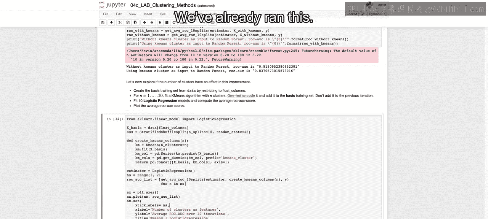

And we see it jumps around quite a bit as we add on and reduce some of those clusters。

So that closes out。 And this is just after over 10 iterations。

 that closes out our section here on the different clustering methods。

 gives you an introduction to how you can also use these different clustering methods to actually do some feature engineering。

And with that， we close out our section on clustering。 and in lecture。

 we will move on to dimensionality reduction。

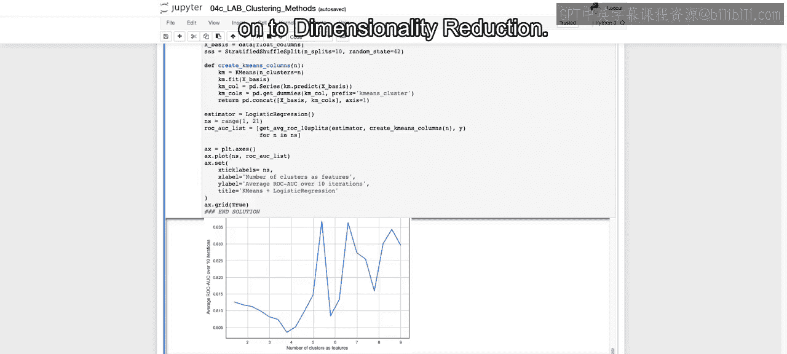

All right， I'll see you there。

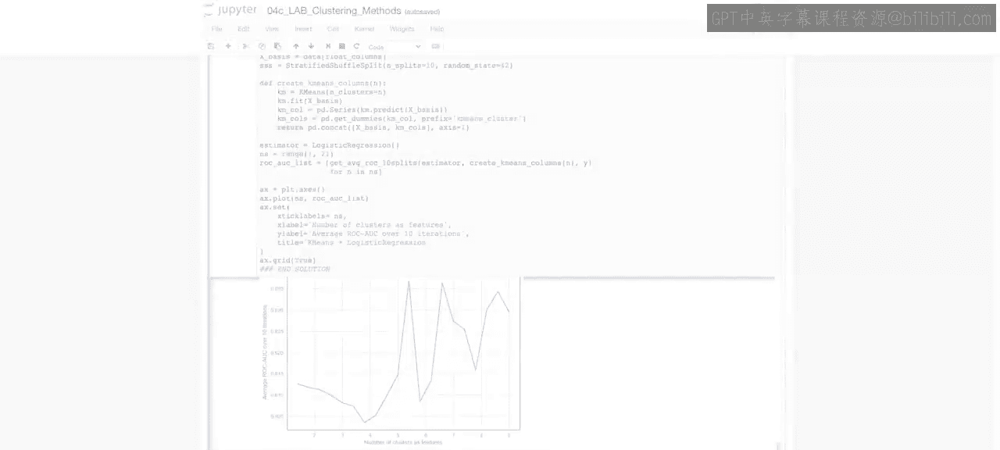