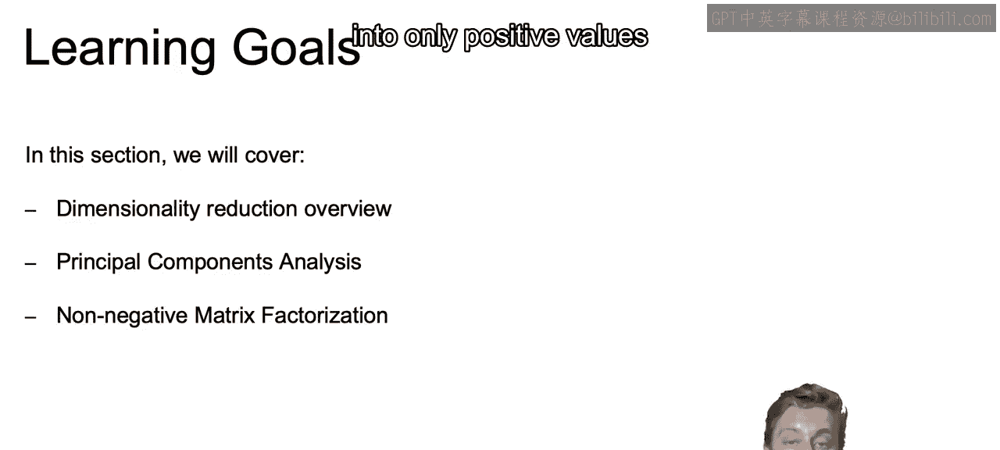
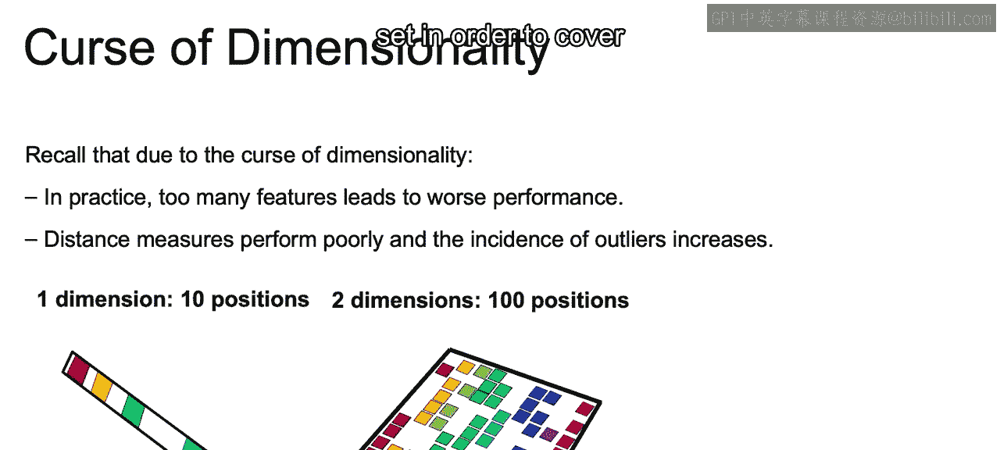
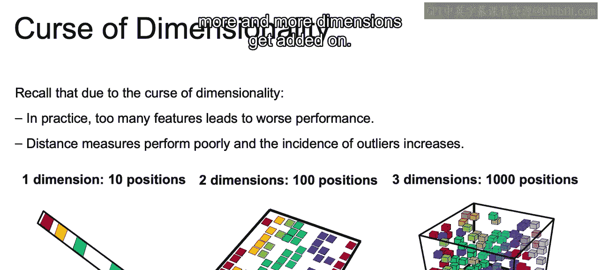
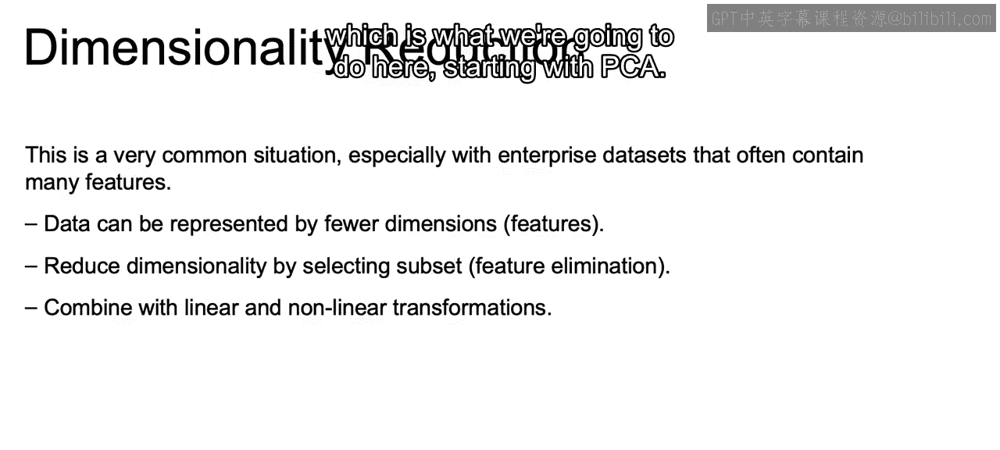
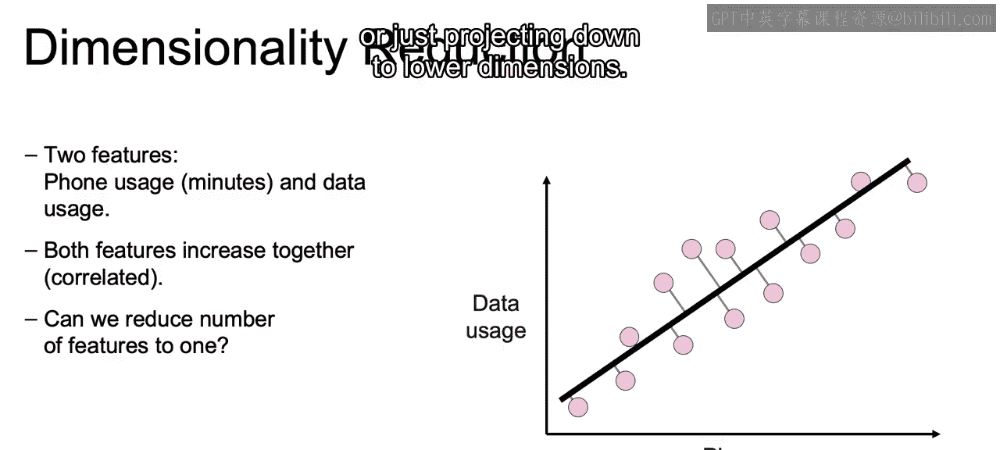
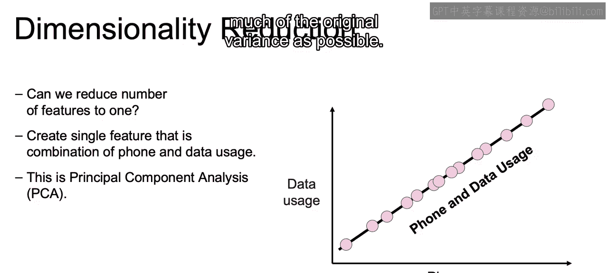

# 029：IBM《机器学习（无监督学习、深度学习和强化学习、毕业项目）｜machine learning》中英字幕 p29 28_降维度简介.zh_en -BV1eu4m1F7oz_p29-

In this set of videos， we are moving away from cluster strength and moving on to a different class of unsupervised learning。

 namely dimensionality reduction， or finding ways of representing our data set in lower dimensions。

Now let's discuss the learning goals for this section。In this section。

 we're going to have an overview of dimensionality reduction and how we can go about solving the problem of the curse of dimensionality by coming up with a lower dimensional representation of our data that maintains the majority of information that's important to us within that original data set。

We'll then discuss principal component analysis or PCA and how we can use that to come up with new features in lower dimensional space。

 solving our problem of thecursive dimensionality。And then we're going to discuss non negative matrix factorization and how we can use it to come up with a means of decomposing our original data into only positive values and reduce the number of dimensions again。

Now， we should recall from earlier in the course， as well as working through our notebook on the curseive dimensionality that due to the curseive dimensionality。

In practice， too many of these features may lead to worse performance for our different models。

And our distance measures that we're using perform poorly as well as the incidence of outliers increasing as we increase the number of dimensions。

And the reason why this is， if we think about just working with one dimension that has， say。

10 positions， then in order to fill out this entire space， we only need six observations。

 We would only need 6 rows to cover 60% of this space。If we increase this to two dimensions。

Each one with 10 different positions。Then we would need 60 different observations within our data set in order to cover 60% of the possible positions。

And then if we increase it to three dimensions and beyond。

 we can see how this number in order to cover the same amount of space that is available。

 increases exponentially as more and more dimensions get added on。

So this is a very common situation within business。

 within enterprise data sets that often contain many， many features。

Data can be often represented by using fewer dimensions or fewer features than your original data may have。

And ways to accomplish this would be either reduce the dimensionality by selecting a certain subset that you deem are the most important features within that larger data set that you're working with。

Or you can combine with linear and nonlinear transformations。

 which is what we're going to do here starting with PCA。

So how does PCA or this idea of creating new features out of the many features？Actually work。

Here in this example， we'll start with two features。

And we see that we have phone usage and data usage as our two features。They look very correlated。

 one with the other， and visually， it looks like the points lie very close to a line。

So the question is， can we reduce the number of features from the two that we have down to one？Now。

 what if we considered this line？And project the points on that line and got those projections instead。

So here are the different projections。And this will entail a linear transformation of our data to create this new single line。

 and if we think about this going out to higher dimensions， if we go into higher dimensional space。

 we can imagine projecting from 3D down to 2D or 100 dimensions even down to 10 dimensions in general or just projecting down to lower dimensions。

Now with our linear transformation， the points are going to now lie on this line that we see here。

We have now created out of those two original dimensions。

 a one dimensional feature space that is the combination of phone and data usage。

We can think of this transformation as a scaled addition of each of the two columns。Thus。

 what ended up happening is we now have one column created as a combination of those two original columns。

This is going to be the idea behind principal component analysis or PCA。

We replace the columns by some linear combinations of those original columns。

And these linear combinations are not going to be arbitrary。

 They're going to be intelligently selected in order to preserve the underlying meaning of our data。

 And what we mean by that in a second we'll see is trying to maintain as much of the original variance as possible。

