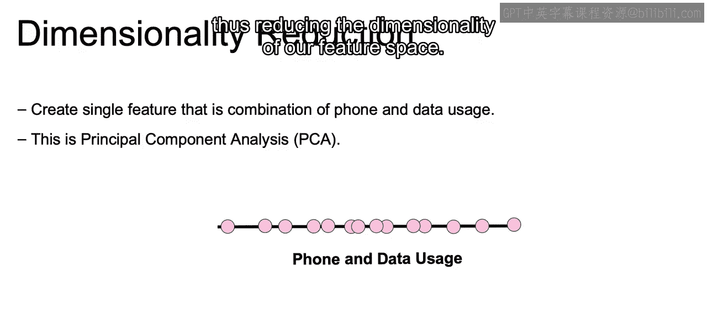
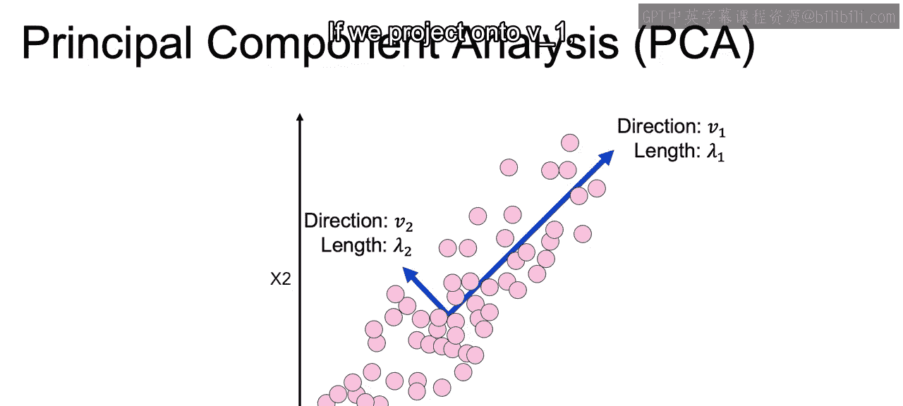
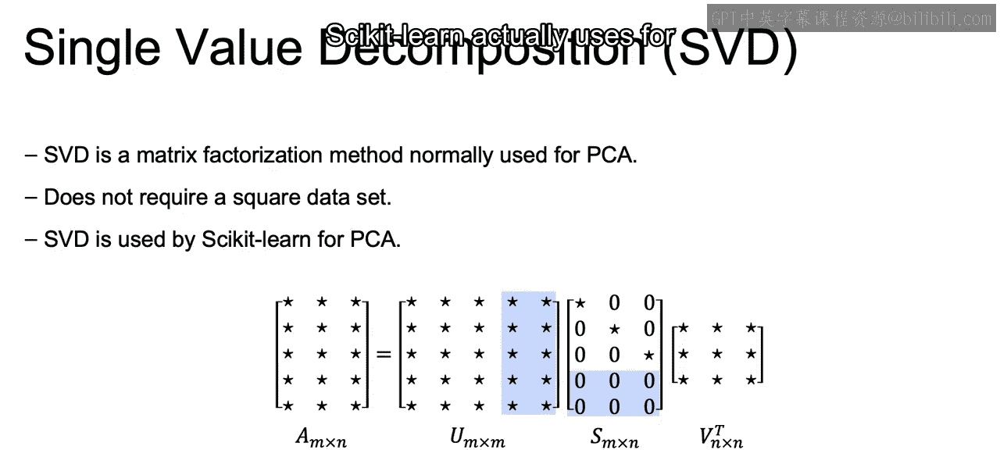
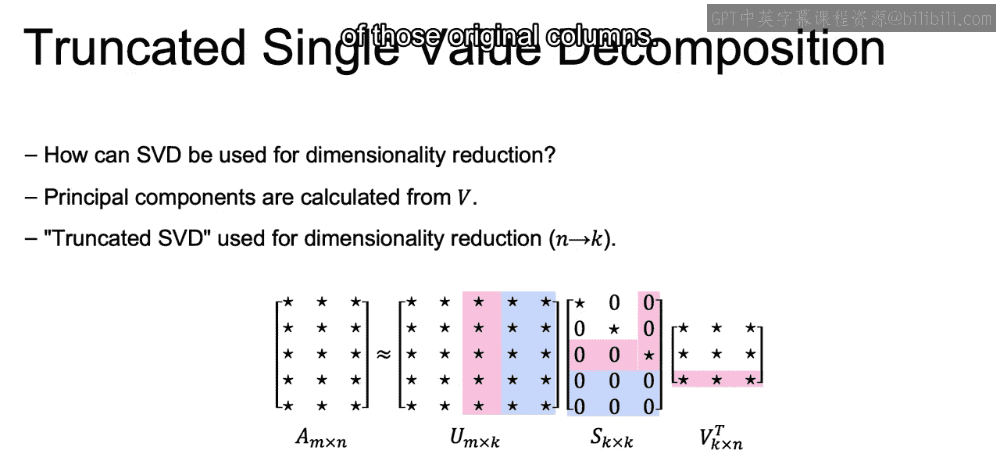
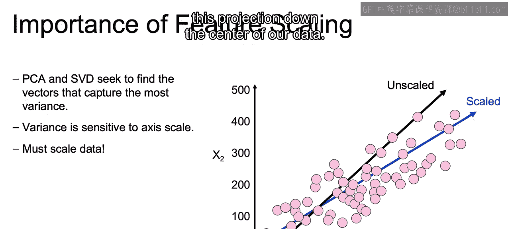

# 030：IBM《机器学习（无监督学习、深度学习和强化学习、毕业项目）｜machine learning》中英字幕 p30 29_主成分分析降维.zh_en -BV1eu4m1F7oz_p30-

And now， looking at what we had before compared to what we now have。

 we have successfully created a single feature out of the two features we originally working with。

 thus reducing the dimensionality of our feature space。😊。

So now let's focus on how principle component analysis or PCA finds these lines on which to project our data。

 so let's say this is the data set we're now working with。

And we can see pretty clearly that the data is distributed in a certain way on a certain axis that we can see visually。

Now linearar algebra has tools that can determine exactly where our axis is。

 where we have the most variance。So using linear algebra， we can find this primary vector。

 so this is called the primary vector that the data set is distributed on。

 and mathematically it's going to be called the primary right singular vector。

And this is going to account for the maximum amount of variance in any direction for our data set。

Now， excluding that primary right singular vector， this is going to be the second axis for the data set。

It's going to be another right singular vector， secondary behind that primary one that we just highlighted。

Once we have this decomposition of our data into orthogonal vectors or perpendicular vectors。

 each one of these vectors as we move forward will be perpendicular or orthogonal to one another。

 we can then determine a meaningful projection of our data。Here。

 since the vector's lengths are disproportional， it'll make sense to project onto that V1 that we saw。

 and we wouldn't lose a lot of information if we projected our data down to V1。

This is because there's not much variance in V2's direction and if you were to project onto V2。

 you'd see that the scale would be very small， if we projected down all our the same way that we did in that last example down to V2。

 we'd be scruunging up our data much more so than if we project onto V1 if we project onto V1。

 we're able to maintain a lot of that original variance。

So in order to find these singular vectors。The mathematical theory that enables us to find this is called the singular value decomposition。

Now， the data set that we work with does not need to be square。

 as we see here our original data set a is going to be an M by n matrix with M and n not being equal。

We can decompose a。Into the matrices US and V。And U and V here can be thought of as just rotations in space。

 one in the N space， M by M space， one in the N by N space。

And they code the information of V1 and V2's directions only， but not the length。

They are going to be more of auxiliary or technical matrices where the real geometric idea is going to lie with S Now the matrix S is going to store the actual lengths of those vectors。

 so recall those longer vectors will tell you which ones should be your primary vectors in regards to where to project your data down onto。

So S， as we see here， given where the stars are。Is what's going to be called a diagonal matrix？

Meaning only the non zero entries， only non zero entries in that matrix are across that diagonal。

And these values。Are going to be sorted from largest to smallest。

 and they will tell us which vectors are actually important。So here in this example。

 we're working with a5 by3 matrix originally， and then we decompose that into U being5 by5。

S being phi by3 and v transposed or V originally being 3 by 3。

And this singular value decomposition is going to be what PsyitLn actually uses for PCA for a principal component analysis。

So let's say our data set when decomposed， looks like what we have here。

We have three singular values。Those three values across the diagonal say they are9，5 and2。

9 being the top left down to five and2， and that'll tell us that the first two left singular vectors are more important than the third again。

 the larger the value， the more important it will be。

So most of the variance in the data is in the direction of the first two principal components。

And those principal components are going to be calculated from the V that we have here。

Those will actually provide for us if we were to even plot this out the values of V。

The points from the origin to wherever it is here in three dimensions of the。

Where that principal component will point to。And again。

 that first principle component being the one that accounts for the most amount of variance。

And if we want to bring it down。From n dimensions down to K dimensions， which is our goal。

 so we're working with an A N by N matrix。And we want to change that to an A。

Or a new matrix that's not necessarily a， that's going to be M。

 we're going to keep the same amount of rows by k， where k is going to be less columns than n。

 which is currently3。All we'd have to do is take that decomposition。

And see where we can remove one of those columns here we use the singular values from V。

We can multiply that A by our V transposed。And we will get a new matrix if we see that v is going to be k by n。

 if we take the transpose it's n by K。So a M by n matrix multiplied or taking the dot product of an n by K matrix。

 we can then end up with a new matrix that has dimensions of M by K。

 and that will give us a new data set using this singular value decomposition。

That is now an M by K reduced amount of columns that's going to be a combination of those original columns。

Something to keep into account when we're doing principal component analysis。

Is that since we are talking about lengths here a lot？

The algorithm will be very sensitive to scaling。So it will be important to scale prior to applying RP PCA。

If we think about every single difference， one of our different algorithms that we use so far in this course。

And the effects of the distance。We'll notice that having unscaleed data would allow one of those axes have more weight to provide where the maximum variance may actually be。

 so if our data is not scaled， we can end up with this projection that we see here when in reality we'd want this projection down the center of our data。

Now in order to do PCA。Using SKLarn， we import from SKLarn。key decomposition PCA。

We're then going to create our instance of the class here。

 so PCA inst equals PCA and we have to say how many components do we want to reduce our original data frame down to？

So if we're starting off with 10 columns here we want to reduce it down to three columns。

 that's what the end components is going to signify。

So we can pass in that final number of components that we actually want。

We can then take that initiated instance of PCA。With the number of components equal to3。

 and we can call fit transform。The same way that we have for many of our different standard scalers。

 we were able to call fit and transform an old output a new data set now with a less amount of columns。

So for example， we can transform our customer churn dataset。

 which has around 20 numeric features to one with only three features。

 with those three features being a combination of those original 20 features that we had。

Using that singular value decomposition that gave us that V matrix to show us how to reduce the number of dimensions。

Now that closes out our discussion here on linearar PCA in the next video we will discuss how can move beyond linearity All right。

 I'll see you there。

