# 031：IBM《机器学习（无监督学习、深度学习和强化学习、毕业项目）｜machine learning》中英字幕 p31 30_降维笔记本（选修部分）第1部分.zh_en -BV1eu4m1F7oz_p31-

Welcome to our notebook here on Diality Reduction。In this notebook。

 we're going to be using the Portuguese wholesale distributoror data set。

 that data set is going to contain the annual spending on fresh products on milk products。

 grocery products and so on。And then the last two which we're actually going to end up dropping are going to be channel and region and the reason we drop those is because we want to focus on the numeric values here and these are technically going to both be categorical values and it's just as easy if we wanted to to 10 and encode them。

 but for this we're just going to drop those two columns。

We're then going to import our necessary libraries as we do at the start of each one of our notebooks。

Then here for part1， we're going to want to import our data and check each of the data types。

 we're then as mentioned going to drop the channel and the region columns as we won't be focusing on these throughout our examples here using PCA。

We're then going to convert the remaining columns to floats if that's necessary。

And then we're going to copy a version of the data that we just created using the dot copy method。

To preserve it， and we'll be using that later on and we'll see how in a bit。So first things first。

 we import our data using pandas。readcsv。

We look at the shape and we see that we have 440 rows and eight columns and recall the number of columns is going to be important as our goal here with PCA is to reduce that number of columns that we're working with when we create our models or whatever it is that we want to do with our data。

 maybe want to visualize and we want to reduce the two columns。So we see our first。5ive rows。

 and we see here that we still have that channel and region which we said we don't want to include。

 so we're just going to call data do drop and we drop the channel and region from axis equals 1。

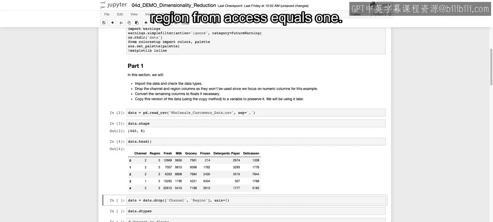

And we look at the data types， we see that they're each integers。

 and we're just going to convert those each to float。

 callingt dot as type float for each one of the different columns。

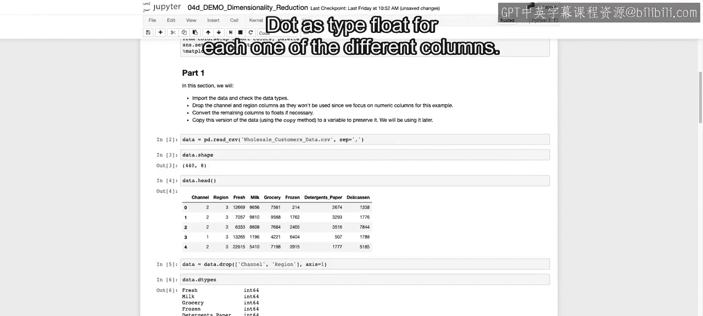

Now we have them all as floats and then as mentioned。

 we're going to want to save this original data for later， so recall here we have our data。

 which is our data frame that we've just created and then data Rige is going to be a copy of that which we're not going to touch for a bit。

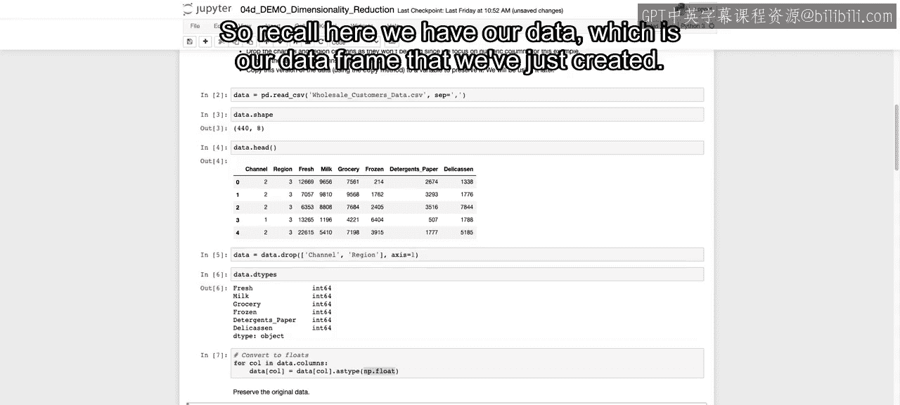

Here in part two。We need to again， ensure that our data is scaled and relatively normally distributed。

 it'll be easier to work with with normally distributed data。

 and then as mentioned in the lecture we saw how important it is to scale our data to ensure that no feature has extra weight when trying to come up with the different principal components。

So we're going to examine the correlation between each one of our different features。

And recall this will be important as when we are doing PCA。

 what we will be looking for is if two features are very highly correlated。

 they're not adding any extra information and we want to remove or reduce those or combine a few to end up with less features overall。

 so if they're highly correlated， we can probably remove some without losing much variance from the overall data set。

We're then going to perform any transformations and scale our data using whatever scaling method you prefer。

 whether it's Minmac Scalar or the standard Scalar。

We're then going to view the pairwise correlation plots using our pair plot just to visualize all the relationships as well as now seeing if we have normally distributed data。

 looking across that diagonal of the pair plot。

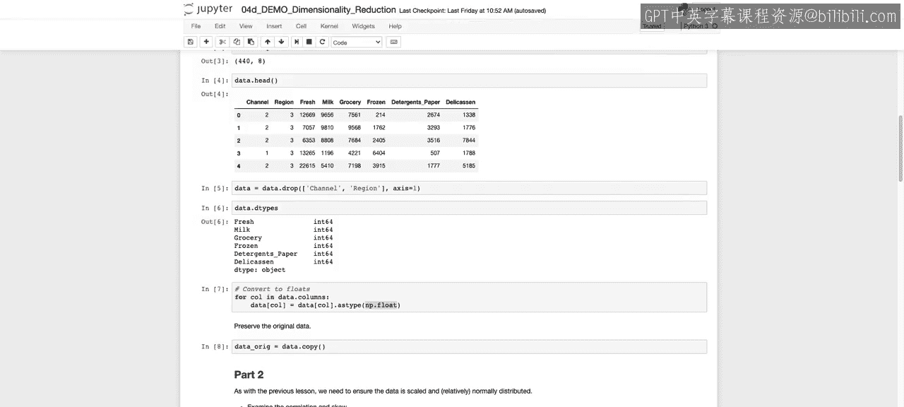

So the first thing that we want to do is call data。

cor so we can see the correlation between each one of the different features。

So this will give us for each feature， the correlation with all the other features in a square matrix in a square data frame。

And just to ensure that we can get the highest correlation， which feature the highest correlation。

 And because one feature with itself will always have a correlation of1。

 we're going to replace that diagonal value which are going to start off as all ones with all zeros。

 So we're saying4 x in the range of formatmat dot shape0。

 It's a square matrix we could have called shape 0 or shape 1。

 So that's going to be for every single value in our matrix。

For every single numeric value for the range of our matrix， we're going to take the diagonal value。

 so 00，1，1，2，2， and replace that one with a0。

And we can see now our correlation matrix has a correlation between fresh and milk and grocery。

 and then for fresh and fresh， it's just a zero across each one of the different diagonals。

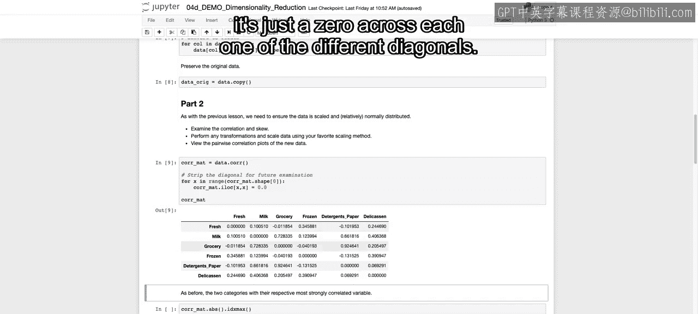

Now， we're going to call the absolute value on that full correlation。

 as we don't care if it's a positive or negative， just the strength of that correlation。

 And we're going to call I D X max to see which feature is most highly correlated with each of the other features。

 So we' saying， what's the max index value。 So for fresh， it's frozen for milk， its grocery。

 so on and so forth。

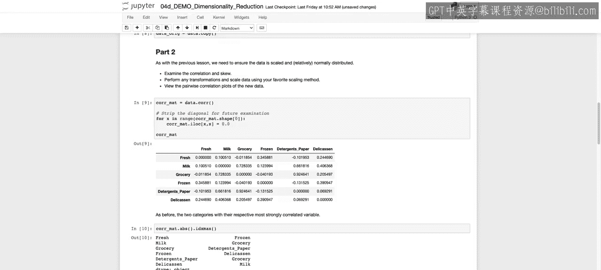

We're then going to examine the eew。For each one of our different values and then take the long transformation if necessary。

 for those that have higher s。Recall that the s is going to be a value with 0 being no skew。

 positive value being a right skew and a negative value being a left skew。 The higher that value is。

 the stronger the sw。So we call data。 skeew to see the skew of each one of our different columns。

We sort them from largest to smallest， and those are going to be our log columns。

 and that will now be a panda series。 And then we're just going to take those log columns that are greater than 0。

75。

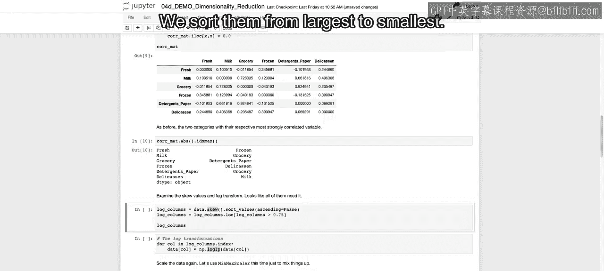

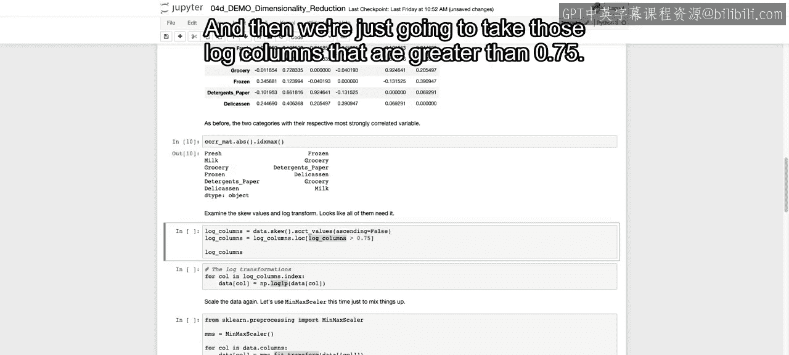

Those that have a higher sw， and we see here we have these values that tend to have a higher skuw。

And for those， we're going to take the log transformation of each。

 hopefully creating more normally distributed data。

 So for call in each one of these log columns index。

 So these are this is our log columns that we just defined is that panda series。

 If we call the index。 we get each one of these delication， frozen， milk and so on。

 which is going to also match up with each one of our different data columns。

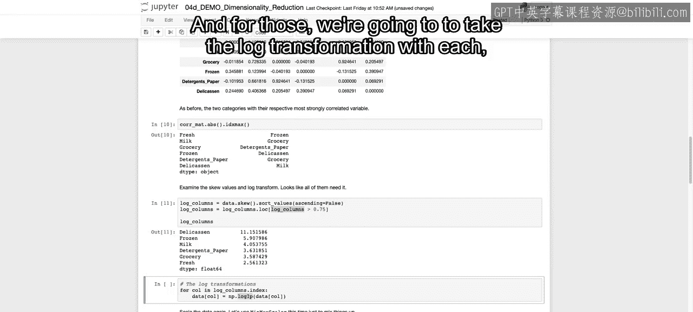

So we're going to place those columns in place with the log transformation of those columns。

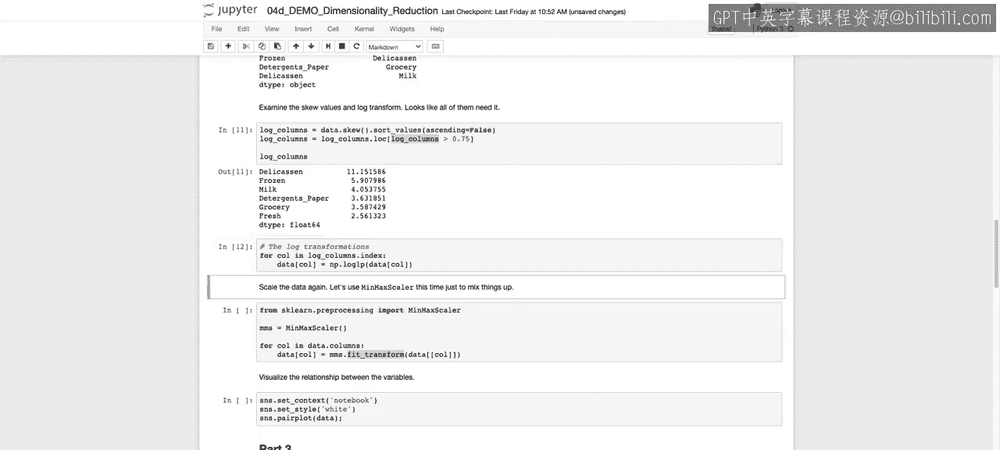

We can then also call the Minmac Scalar， so we import from Scalalar do preprocessing the Minmac Scalar。

 we want to ensure that all our values are on the same scale。We call min max Scalar。

 we initiate the objects， and then we say four column in each one of our columns。

 we're going to fit and transform on that column， so we're going to replace it again in place to standardize that data So all values are between 0 and 1 by using the min Mac Scalar。

 which we recall is just subtracting the minimum value and then dividing by the max minus the min。

So that'll ensure all our values are between  zero and1。

The next thing that we want to do is we're going to visualize everything that we've just done。

 so we're going to see each of the relationships and hopefully see those high correlations with each one of the different scatter plots that we'll see with the pair plot as well as saying hopefully more normally distributed data。

 which we see for the most part throughout each one of our different columns and we see， for example。

 milk would and grocery have a pretty high correlation if you look just three columns in and two columns down。

 you see that high correlation。

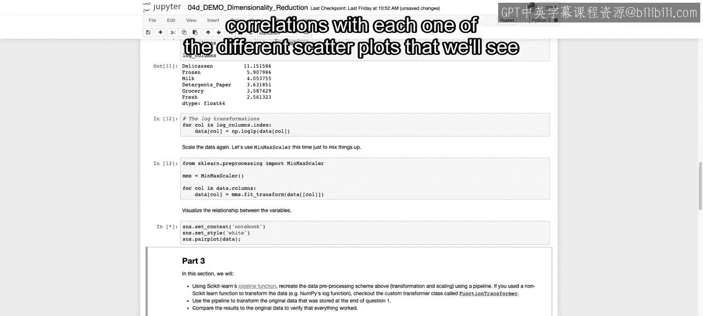

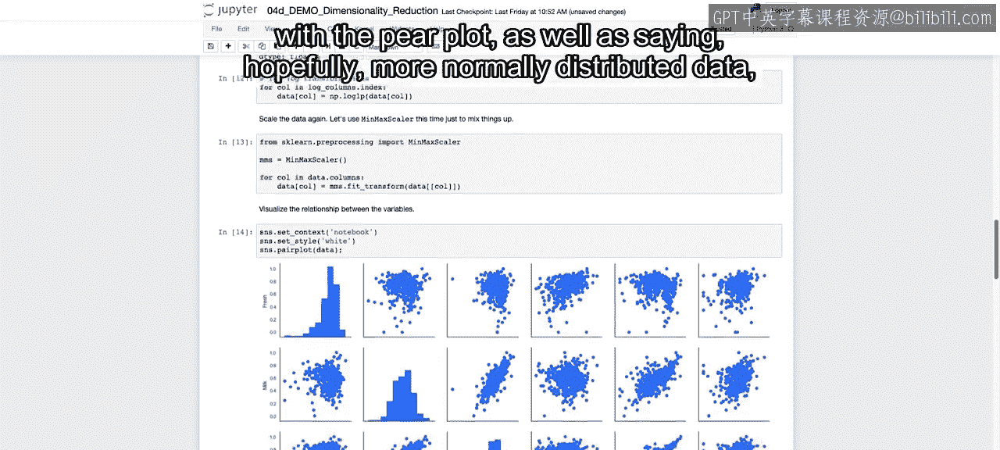

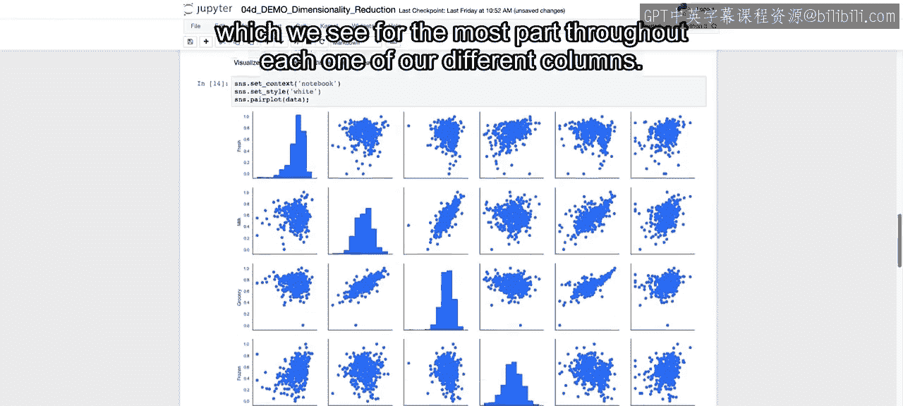

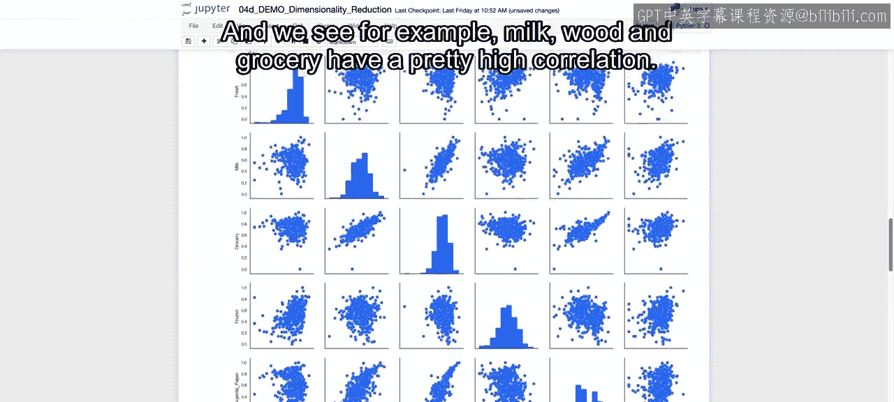

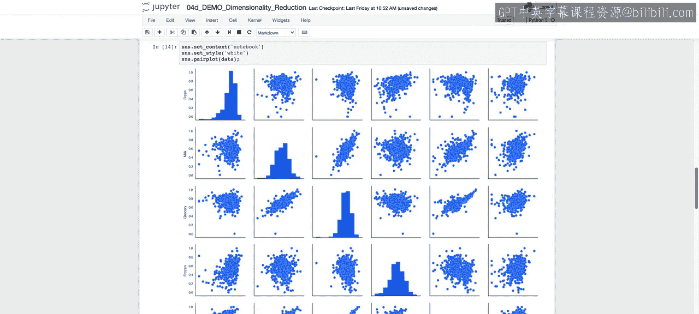

Now， in part 3， we want to introduce how we can do this all in one step。

 and this will be especially useful if we want to incorporate this into some supervised learning model later on and be able to pass in different parameters throughout。

So we're going to pass in our pipeline function， and we saw that during our course on supervised learning。

But what's important when using the pipeline function is that each one of the functions that are passed in。

 each one of the different pieces of that pipeline have to have a fit and transform method to it。

So we want to take the log and then take the in Max Scalar。

But the log doesn't have that fit transform that's built in with each one of our different SK learner objects that we've been working with。

So Minmac Scalr has a fit transform， but log transformer does not。

So in order to ensure that we have a version of taking that log transformation that has the fit and transform methods that we can pass into our pipeline。

 we're going to call this function transformer。And this function will take whatever function it is that you want to pass in。

And convert it so that it has a fit and transform method available to it。

So now we have a log transformer object。Which is going to be a log transformer with a fit and transform method。

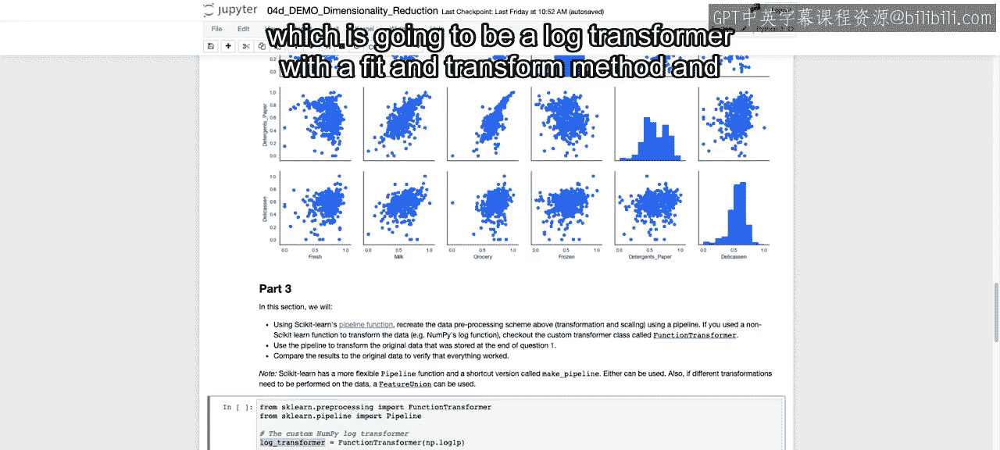

And once we do that， we can pass it into our pipeline。 So first， within our pipeline。

 we need to pass in that list of tus where the first value of that tuple is going to just be that name if we want to pull it out later。

And then the next value is going to be the actual function that we want to call。

 So here we call that log transformer that we just created and then Minmac Scalar。

We pass in this list of tus into our pipeline， and then we can just call pipeline do fit transform on our original data。

 If you recall， we made a copy and we didn't change our data at all for that copy of the data。

And we can call fit transform and get the output down the line of both taking that log transformation and that MinNAC Scalar。

And we run this。And then that data pipe should equal that data that we just transformed。

 So we're going to check that using nuy dot all close。

 which is just going to check that each value within each of our arrays are exactly the same。

With a bit of possible rounding error， many decimal points down the line。 So we run this。

 and we see that it's true that all of our values are the same。

 and we see that our pipeline work just as well as taking each one of these different steps separately。

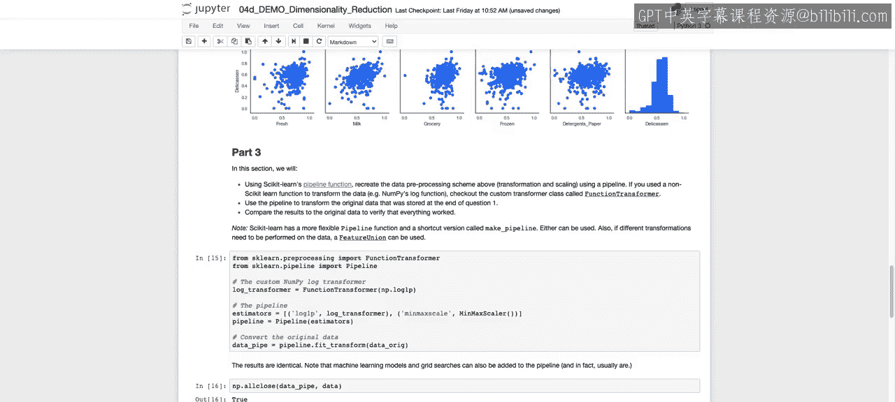

Now， that closes out part 3 in part 4， we're going to start working with PC A on this transformed data that we've been working with and see how much of the variance can we explain with different numbers of these principal components。

 All right， I'll see you there。

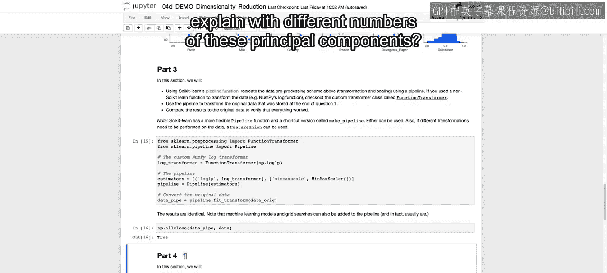

