# 032：IBM《机器学习（无监督学习、深度学习和强化学习、毕业项目）｜machine learning》中英字幕 p32 31_降维笔记本第2部分.zh_en -BV1eu4m1F7oz_p32-

Now， for part 4， as we will be working through here in this video。

 we're going to perform PCA on that data that we work through in the last video。

And we're going to perform PCA for the number of components ranging from one to five。

 so we start off with six columns and no matter what we're going to try and reduce the number of columns that we'll ultimately be working with。

We're then going to store the amount of explained variance for each one of the different numbers of dimensions。

 So for one dimension， how much variance was explained ver2， so on and so forth。

 And if we were to do number of components equal to 6。

 then we would have explained 100% of the variance。

 So we're saying how much of the variance going to explain at each one of the different steps。

We're also going to store the feature importances for each one of the number of dimensions。

And something to note is that PCA won't explicitly provide this feature importance。

 but the components properties。Which we'll show you how to use in just a bit。

 Will show you how each one of those principal components was composed as a combination of each one of the original features and the larger those values are。

 given that we've standardized our data， The more impact each one of those features has had on that principal component。

 and therefore， we can assume that that is a more important feature。

And then we're going to plot both that explained variance as well as these feature importances。

Now I'm going to break this down step by step， so I'm going to actually create a cell above。

 but before I do that， just to show you where we're starting off。

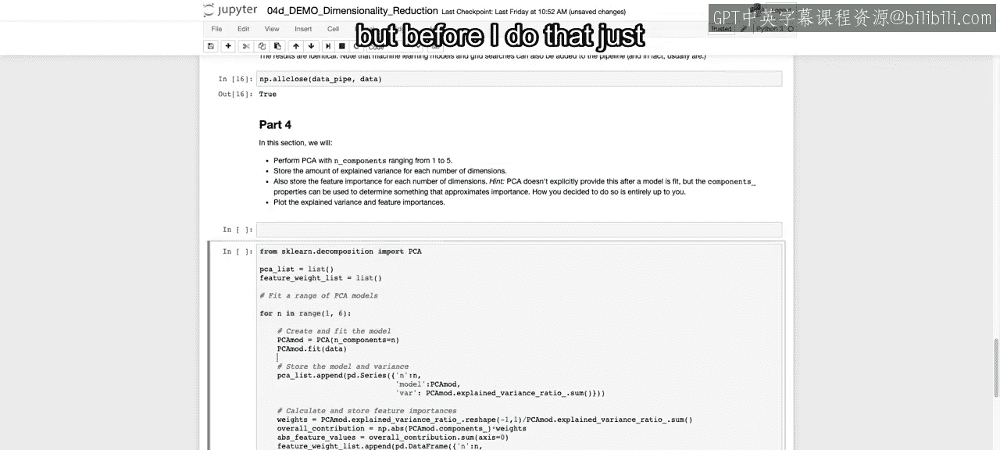

We're going to import from ecalar。 decomposition。We're going to import PCA。

 We're going to initiate an empty list of the PCA list and the feature wait lists。

 which we're going to use to store are explained variances and the feature importances。

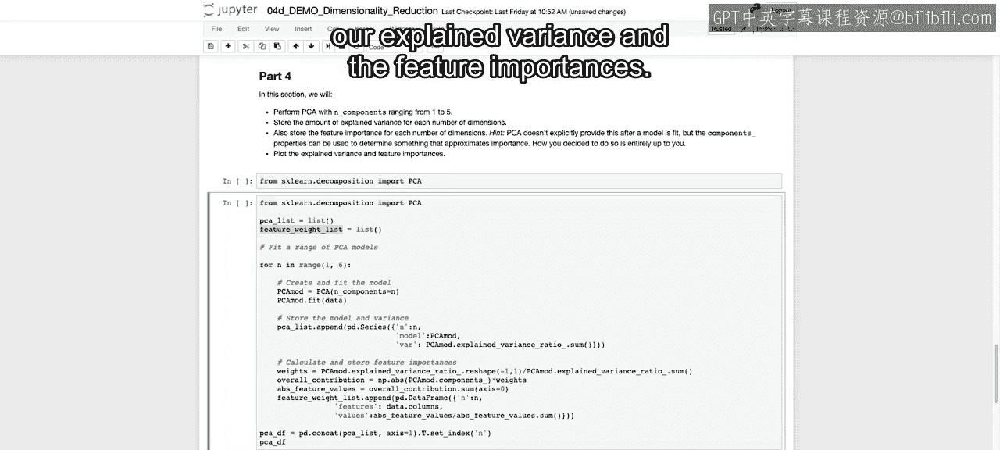

And then for n and range 1 through 6。 So one through 5， if including 5。

So that's what we want to range through。We're going to initiate a model。

A PCA model with a number of components equal to wherever we are within that range。

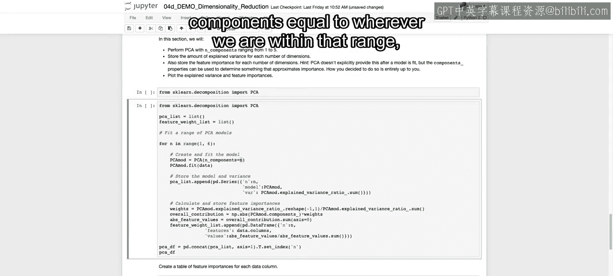

And then we're going to fit it to our data that we have now done the transformations to to ensure that it is on the same scale and mostly normal data。

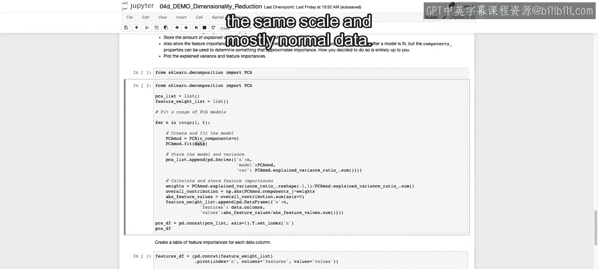

We're then going to take the explained variance of each and append that to PCA list。

And then after a few steps， which I'll walk you through in just a bit。

 we're going to take each one of the feature importances and append it to the feature waitlist。

And then after we do this for the and in range one through six。

 we have this for each one of our different numbers of principal components。

So let's start off by looking at just this step here。So we're going to create a panda series。

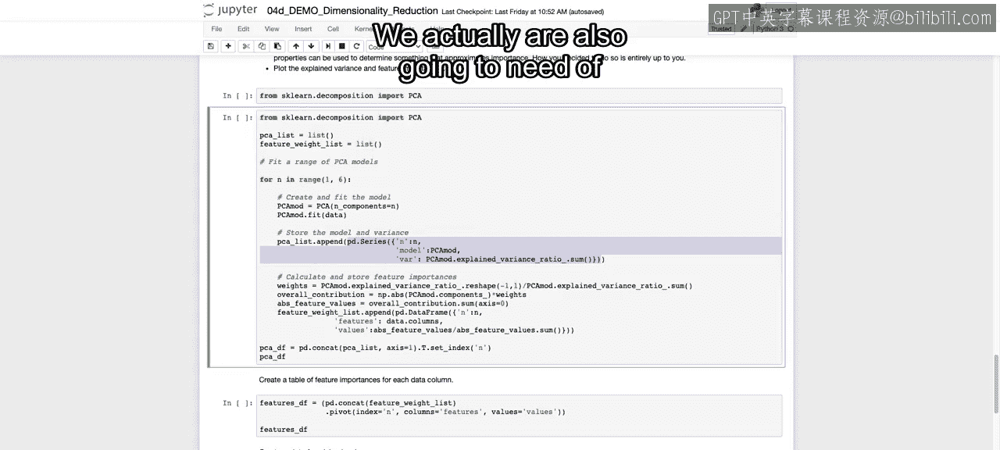

We actually are also going to need， of course， to initiate our model。

 What I'm going to do since I'm pulling this out here is going to set n equal to two as we discuss all the steps。

 And you can imagine that this is going to do it for n equals， of course，1 through 5。

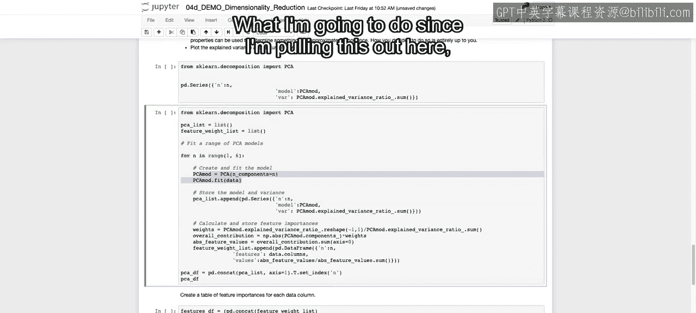

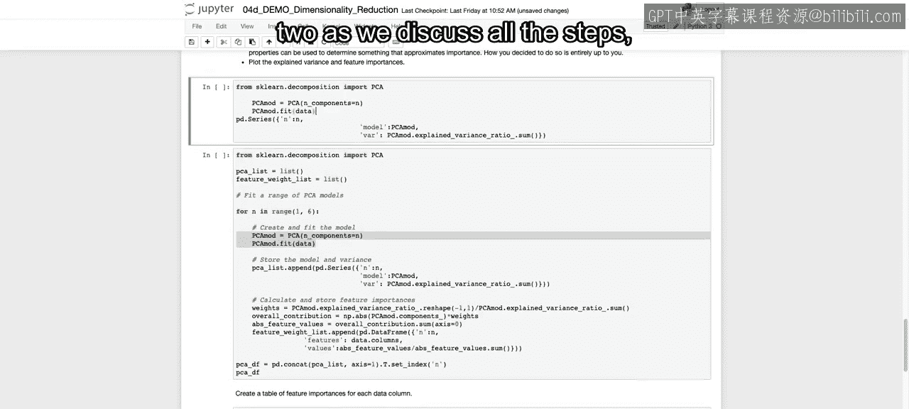

So we set n equals2， and then let's see what this series is that we're going to be outputting。

 it should be n， which is the number of components， which we set to two。

 the actual model as well as the explained variance up to that point， so for using two components。

 how much variance was explained by using two components。

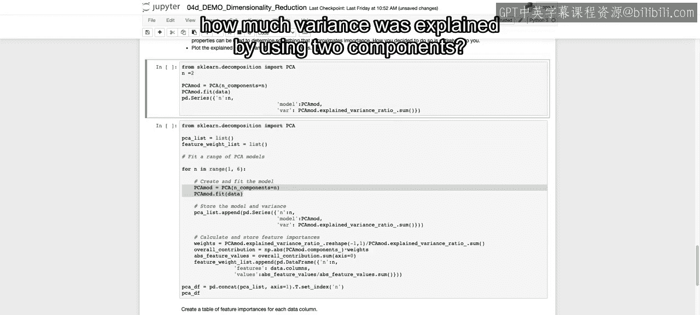

So run this。And you can see that it explained 72% of the overall variance。Now。

 just to see how the explained variance ratio actually looks， let's pull this out。

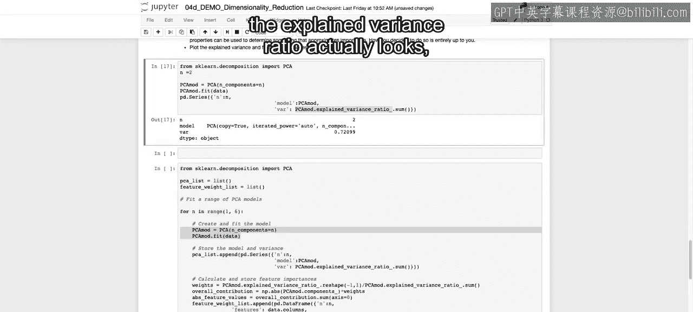

And we can see that it says if you set n equal to2。

 it shows you how much of the explained variance ratio was covered with the first principal component。

 which was about 45%。And how much was done by the second component， which was about 27%。

And the first one should always have more than the second。

 which should always have more than the third， right。

 Our first principal component should be the component that explains the most variance。We are then。

 so we will have there for each of our number components the amount of variance explained。

 so that is covered。 Our next step is going to be to find the feature importances。

So the first thing that we're going to do here。Is we're going to。And let's add this on over here。

Set some weights and the idea of the weights is that we have the breakdown of each of our principal components。

But we want to add more weight to the more important principal components。

 so the first one should be more important than the second one and so on and so forth。

So what I'm doing here is I'm taking this explain variance ratio that we output here。

And then we're just setting it if we're working with two components。

 we're setting it as a proportion of one， sort of saying。

44% and 28% were adding those up and we're saying out of one。

 what proportion is 44 and what proportion is 28？So just to look at what that means。You see。

 we take that original amount。With 45 and 27， and we just divided by the total of 45 plus 27。

So that we see that the weights are 62 for that first component and 38 for that second component。

 and we're going to await our components according to how important these different principal components are。

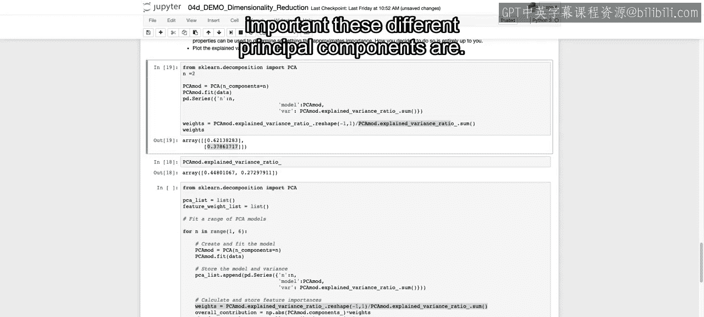

So this will become clear in just a second。The next thing that we're going to see is this PCA dot components。

So what was important here？For the PCA components is this is going to be the breakdown of。

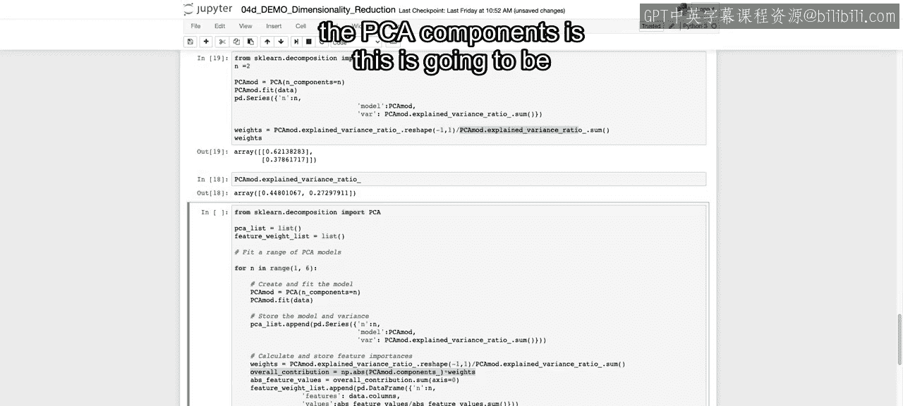

How each one of the components is actually comprised。So let's first strip away。

Everything besides PCA components。

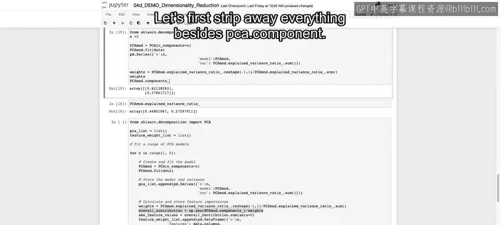

And we can see here that we have。For the first components。

How each one the different features that we had。 So we have six different features。

 how they each created a linear combination to come up with our first components。

And then the linear combination that came up with our second component。So again。

 the idea is the larger these absolute values are， the more they contributed to each component。

 and the more important that feature is。So what we had here before。

Is we took the absolute value because we don't care about whether it's positive or negative。

 we just care about how much it affected that principal component。

And then we're waiting it according to these weights。And if you recall。

 the weights are going to be how important each one of the principal components are。

So this first one is going to be multiplied by 0。62。

And this second one is going to be multiplied by 0。38。So that we don't put on too much weight。

 So we see here that we use 70% of whatever feature this is， this is the fifth feature。

And then we use 70 per here in the second feature。 in the second PC A for a different feature。

 We want to ensure that these do not get equal weights。

 This should get a higher weight than this one， since this is part of the first principal component。

 So that's why we multiply it by the weights。 And then we can see what the overall contribution is。

 Let's just copy and paste that。

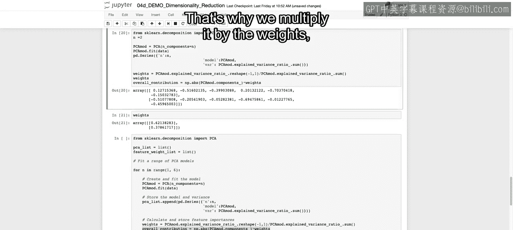

And we can see the overall contribution。For each one of the different components。

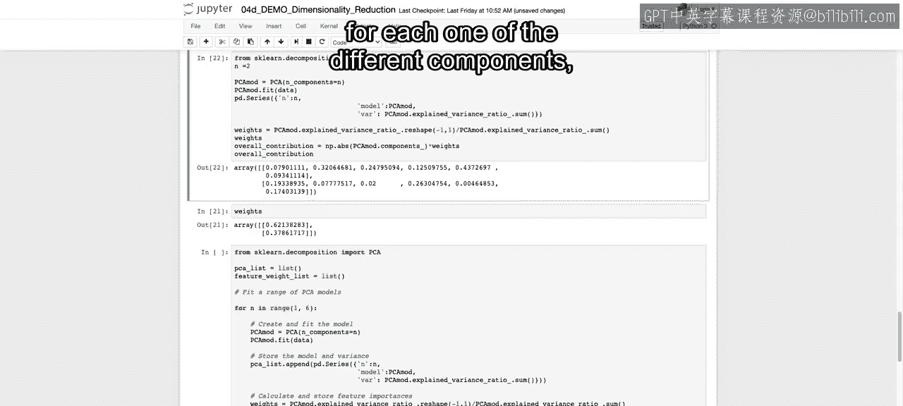

And then we're going to take the sum。Access equals zero。

So that we can see now that we've weighted each one of them。

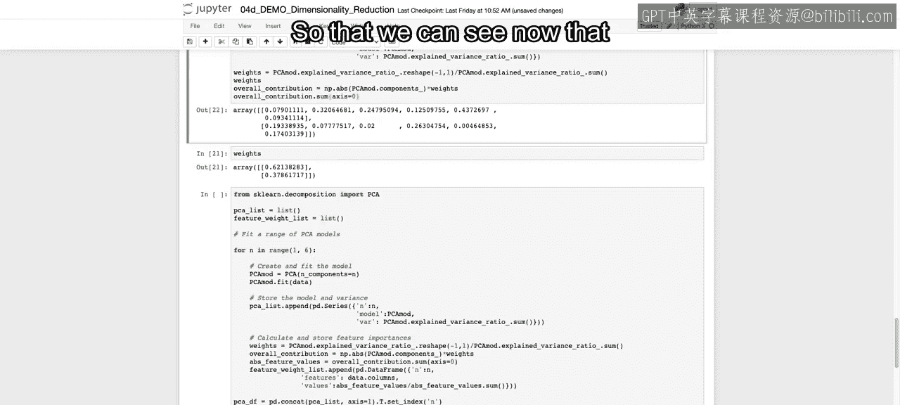

How much each one， these different features。With their weights。

 we're able to comprise these principal components that we have。So we see here that's。

Whatever feature it is， the fit feature was the most important in the first two components if you add up the weights of the first two components。

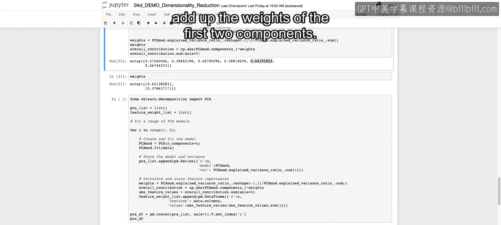

We're then going to divide that value down here。 So we have the absolute features values。

 We're going to divide that。By the total sum of these values to ensure that each one of these values is a proportion up to one。

So that we can see， again， these each represent how much weight each one of our original features。

Played in coming up with our two principal components。

 we're going to normalize that over one to see the proportion of one of each one of these features。

 how much they comprise， how much did they contribute to coming up with these principal components。

And that's going to be the values that we have here。

And then we are going to have a data frame that has the number of components。

 and then it's going to have each one of the different columns so that we can line that up with each one of these values。

And then we're going to have for each one of those different values。

 what is the aligned column that I went with， and that's going to be our values here。

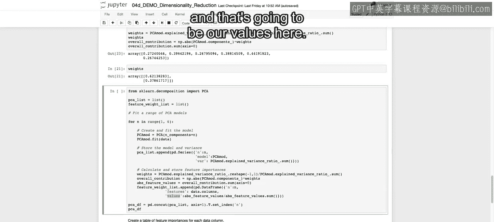

So I'm going to run this and the first thing that outputs is the number of explained variants for each one of our different principal components。

 so we see the first one covered 45%， the first two covered 72， then 83， 92 and 98。

 so we see once we get to five we've covered 98% of our overall variance。

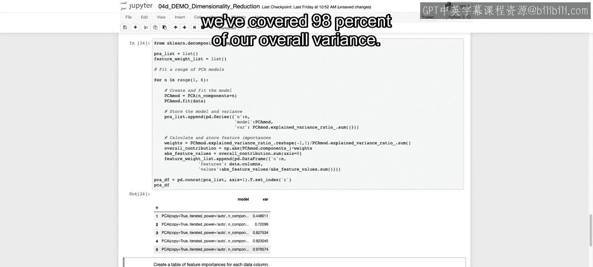

We're then going to concatenate if you recall， let's look actually at this feature wait list that we created。

This is going to be a bunch of data frames， so let's just look at the first one。

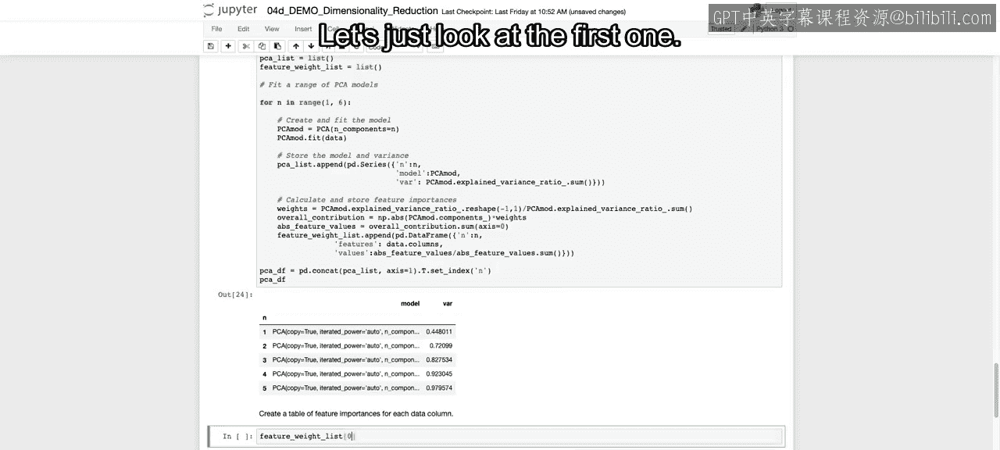

And we see this is going to be for a number of components equals to one。

 How much each one of these different features contributed to that principal component。

We set this equal to one。We can see for the first two。

 how much it contributed to each one of the different principal components。

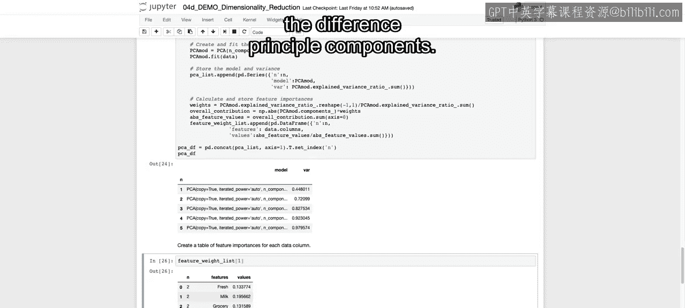

We're going to concatenate all these different data frames together so that we have one long data frame。

And then we're going to pivot that。And set the index equal to this n so that we don't have multiple ones。

 twos， but well sum up all the ends。We are also going to set our columns equal to the different features。

And then we can just have our values as the values。

 And now we have this data frame that we have here。

 where we see when the number of features is equal to one。

 the contribution of each one of these difference features， when the number of features。

 when the number of components is equal to two， the contribution of each of the features and so on and so forth。

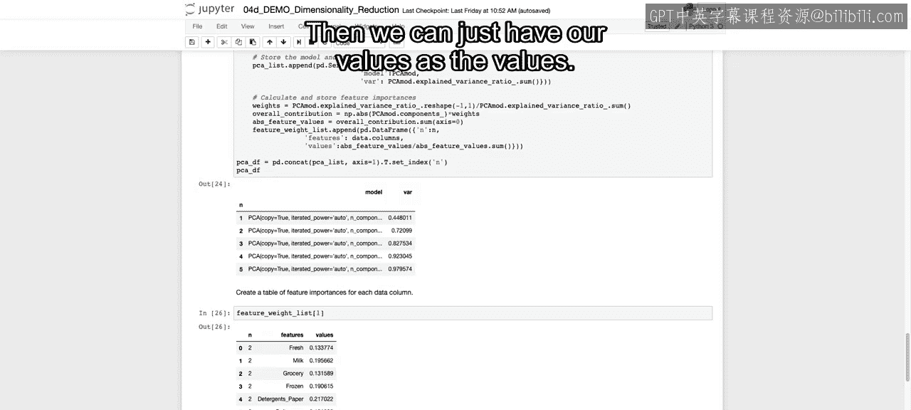

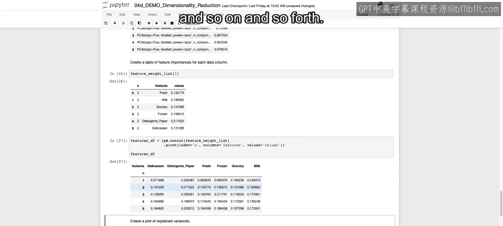

Now we're going to plot。The overall variance， just using a bar plot。

 So this is plotting what we had up here。 that PC Df， which is just that overall variance。

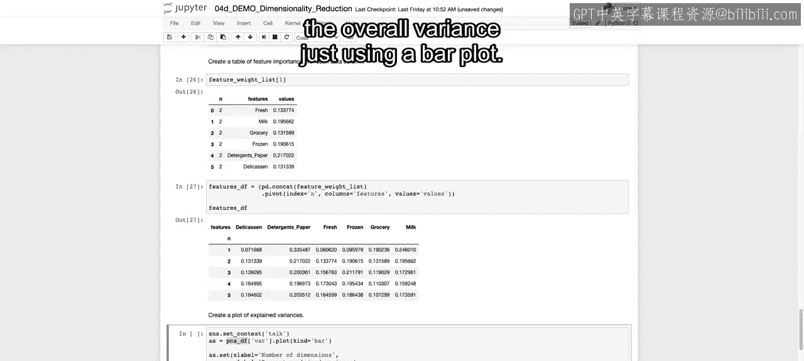

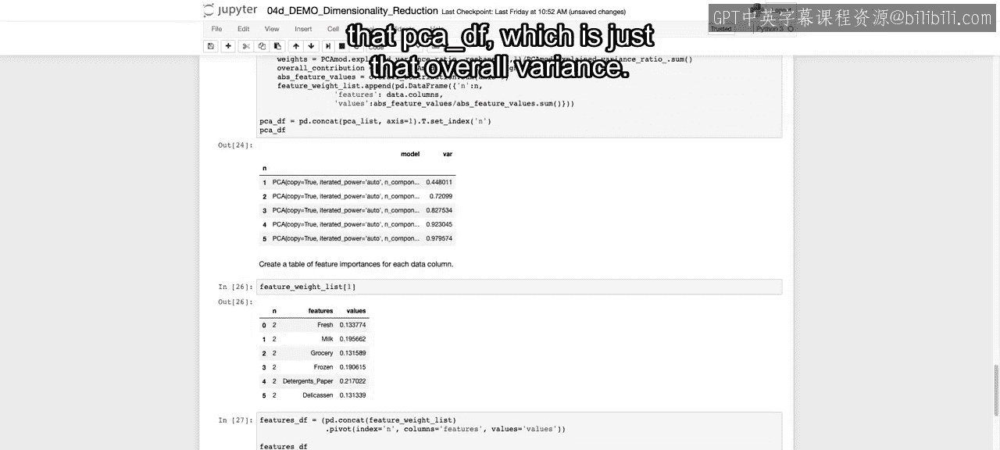

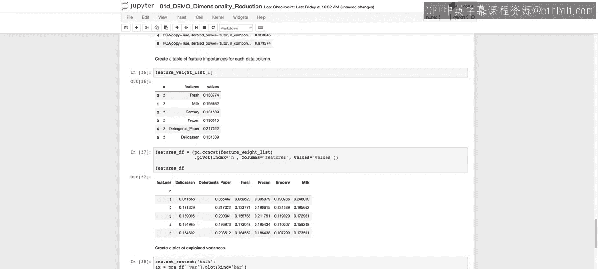

And we just set our X label， our Y label， and our title。

 And we see that how much of the overall variance was explained once we add on each one of these different principal components。

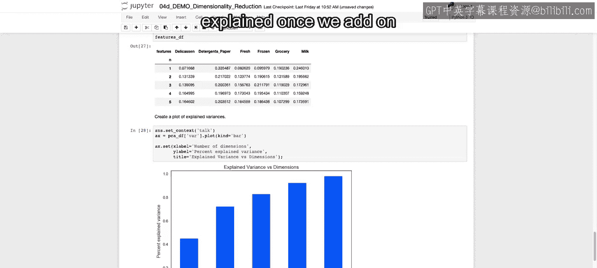

And then finally， we have plotting the features D F。 And we're going to see。

 as we have each one of the different number of。

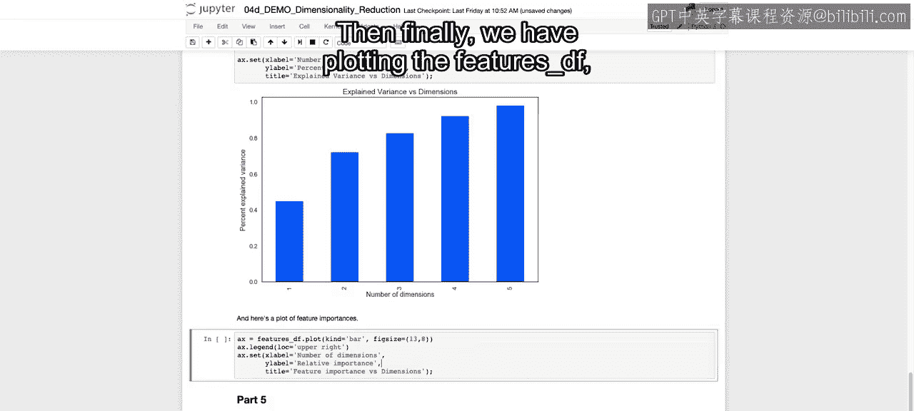

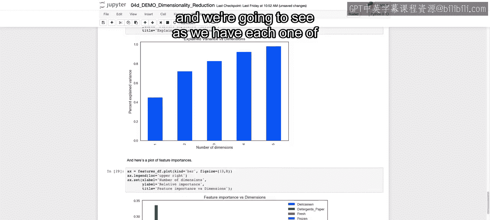

Dimenssions that we're working with。How much does each one of the different features contribute to all of our principal components so we see here for detergent's paper at first it explained most of the variance it was the most important feature。

 it tends to balance out as we add on that number of components。

Now that closes out our section here on Que 4， showing you how to see use PCA。

 see the explained overall variance， as well as getting a hint at the actual feature importances as we create each one of our different principal components。

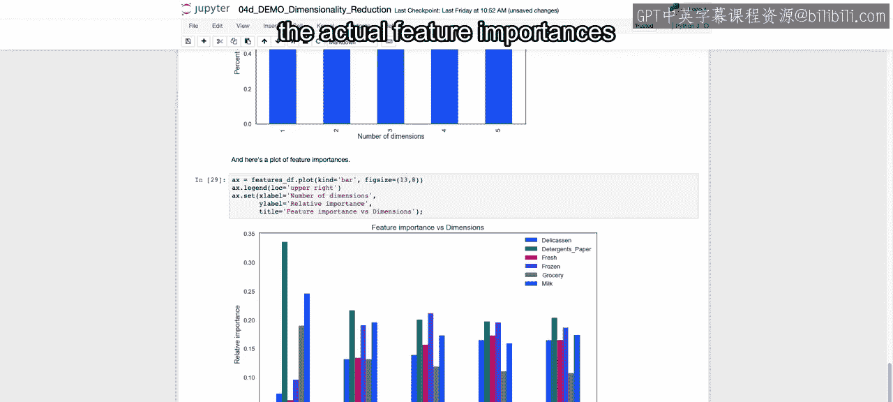

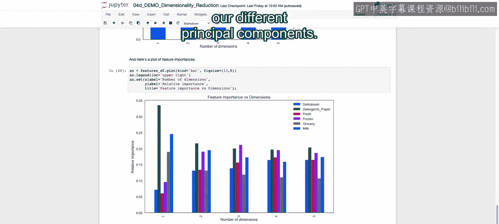

In the next section， we will discuss how we can actually use grid search to fine tune our PCA model。

 especially when working with kernels。 All right， I'll see you there。

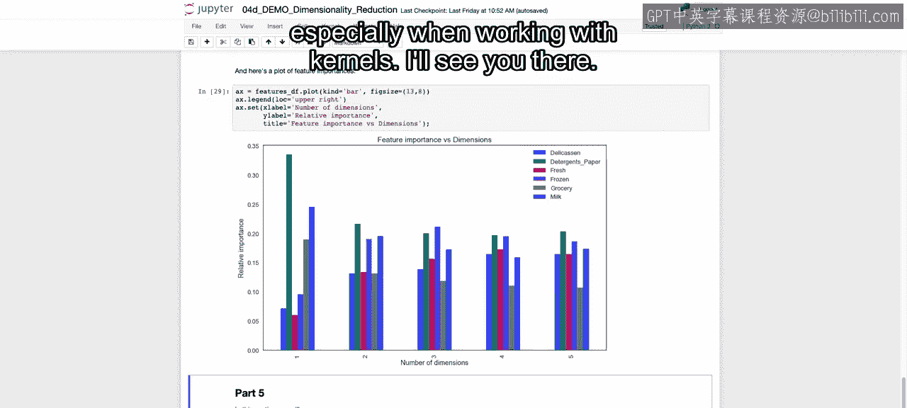

