# 033：图像处理.zh_en -BV1eu4m1F7oz_p33-

In this video， we will use an example to see how PCA can be used to reduce the feature space of an actual image in practice。

Now， the learning goals for this section will be just to show how dimensionality reduction can be used in a real world application。

And with that， bring together an example， using dimensionality reduction to take one image and compress it down to smaller amount of features and see what that compressed image would actually comprise of when doing PC A。

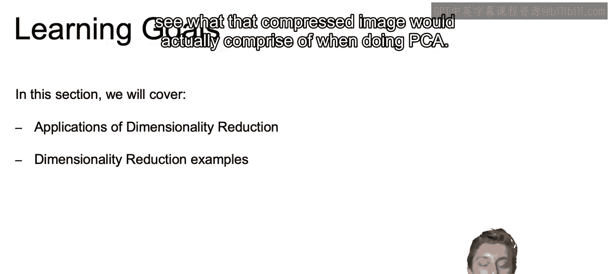

Now， we're going to walk through how we can use dimensionality reduction in real life practice。

So frequently， we want to use dimensionality reduction when we end up with a lot of different features。

 when we have high dimensional data。And this can happen often with text data Feature are usually going to be the word existence flags or the word counts per document。

 and as we saw with the nonne matrix factorization notebook we just went through。

 this can end up creating quite a lot of features very very fast。 and thus a lot of dimensions。

 So you want to use it often when we're working with NLP。Or as we see here。

 if we're working with images， especially if we're working， say， with colored images。

 the features can be the brightness value for R G and B values。

 So the brightness of each one of those different colors per pixel。

 So it means that we can end up with quite a lot of features。

 on the order of the number of pixels that are present within our image here。

 We're working with black and white。 So it'll just be the brightness per each one of the pixels without the RG B values but still can end up with quite a lot of pixels。

😊。

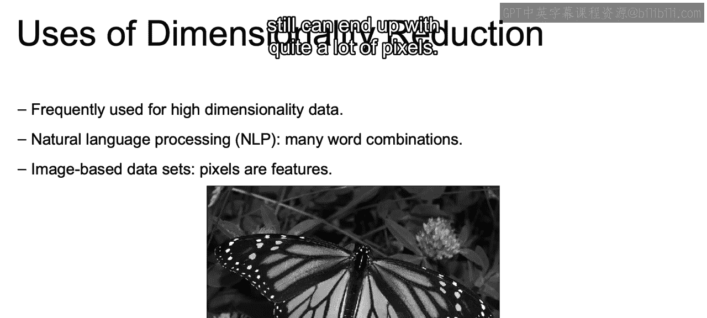

So in this example。We're going to see how PCA is going to be used for image compression。

We're going to reduce this image's dimensions， but hopefully retain most of the image。

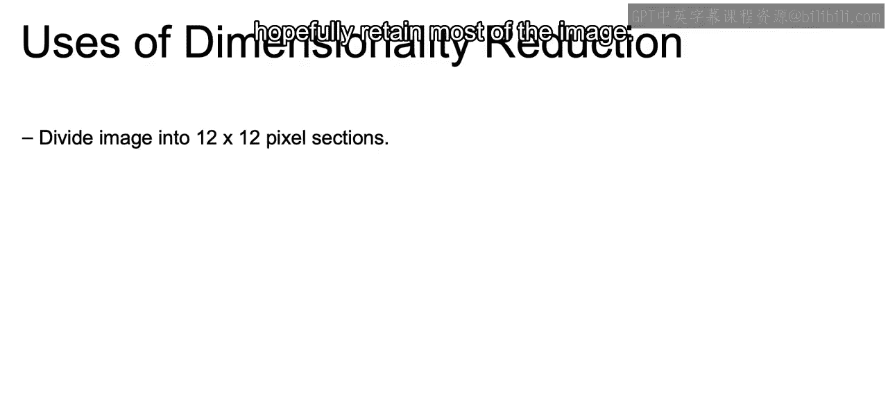

So to see this image as a data set， we put on a grid on top of this image。

Where each square is going to be 12 by 12 pixel sections。

 So each one of these different squares will have 1 44 pixels per square。

 and each one of those squares will represent a single observation within the full data set of this image。

Something to note is that this grid is just for visual representation， but in our example。

 we would imagine that there are more squares than what we see here。

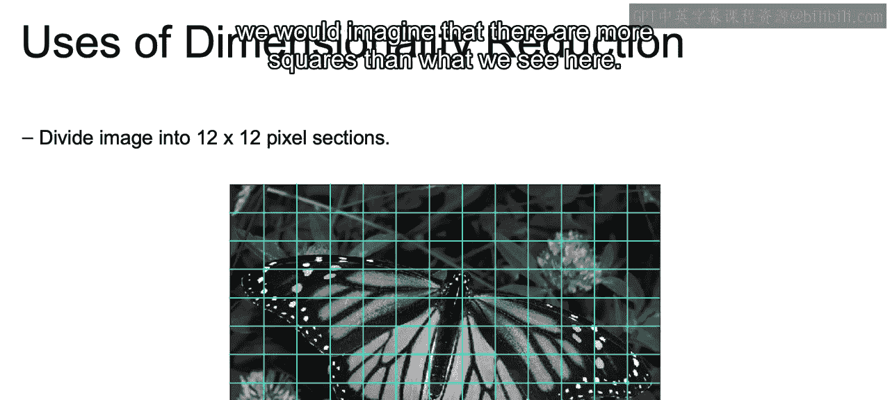

So each square， again， is a single observation that is 12 by 12， So a total of 144 pixels。

This is going to be a black and white image， which means that every pixel contains only one numeric value indicating the brightness of that pixel。

And putting those 144 pixels side by size， we can end up with just one row vector。

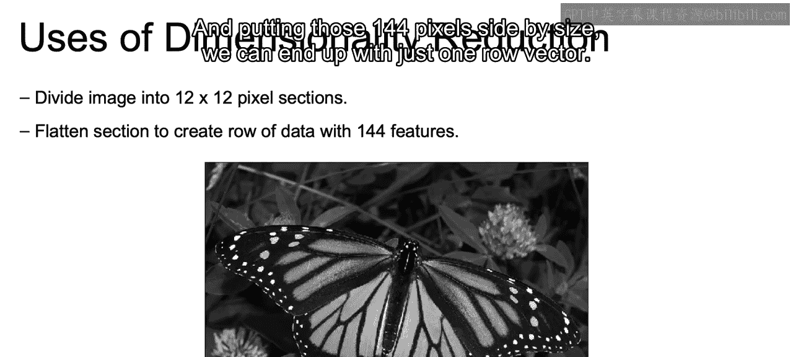

So we see here we take that 12 by 12 and we unravel it to have 144 different features。

For each one of our different squares。And each row in our data set will be each one of the individual squares in our original image。

We can then perform PC A on all of our data points。

 So we see here again that we have each one of our different rows representing a single square。

 So we end up with a matrix。 That's the size of the number of squares。Times 144。

 which is the number of features we now have。Where you can apply PCA to this matrix to try to reduce the current dimensionality so that we end up with a new matrix that still has that same number of rows。

 which is going to match up with the number of squares。

Times M where M is going to be some value less than 144。

And those new columns will be projections of some special combination of those original features that will create our principal components that will describe the most amount of variance。

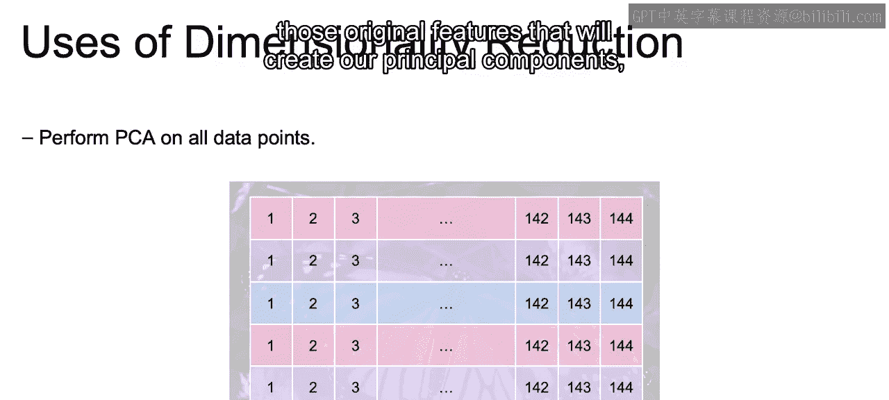

So to see this in action， we see here reducing from 1 and 44 down to 60 dimensions。 So each square。

 rather than being represented by those 1 hundred and 44 different values are now represented by these 60 different values。

 We can still see quite a clear picture of our original image。We reduced down to 16 dimensions。

 and we still don't lose much from the original image in regards to visually looking at one next to the other。

So after PCA。You will get these top 16 components， and these will be the 16 most important principal components。

 And every original 12 by 12 grid in this image before is now some linear combination of these 16 components that we have here。

 Once we reduced down to 16 in regards to our dimensions using PC A。

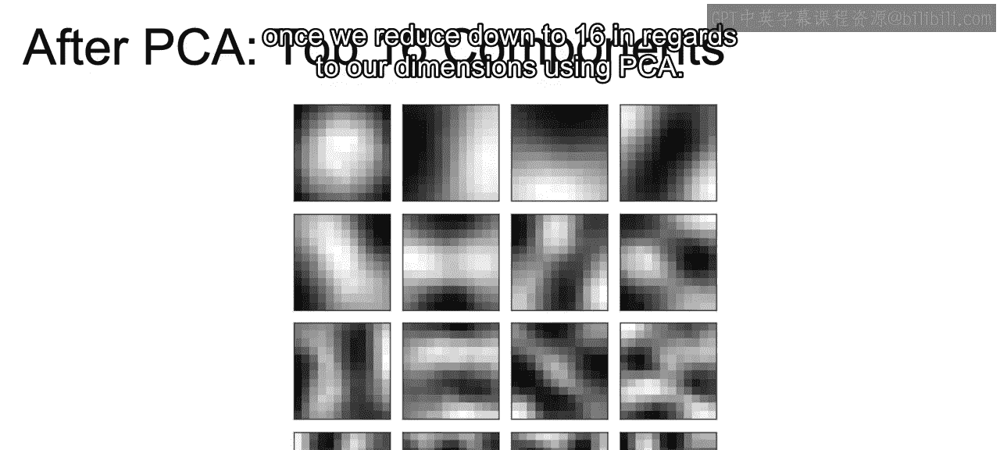

We can reduce this further down to just four dimensions。

So here we're reducing the dimensionality severely。

 But since we're keeping the four most important principle components。

 the image is still somewhat recognizable。And here we have the L2 error between that original image and the compressed image with various levels of dimensionality。

Where we're just seeing the distance of what that original image looked like compared to the values that we're working with now with the compressed version。

And we can see that for quite some time we don't have that high of a relative error as we continue to reduce that number of dimensions。

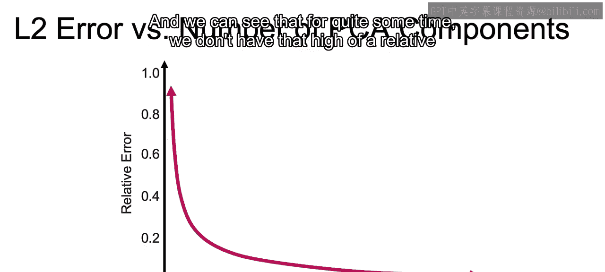

Now we see here just the top four principal components。 And again。

 we were going to be able to from that original 144 create the some combination of those to come up with these four principal components。

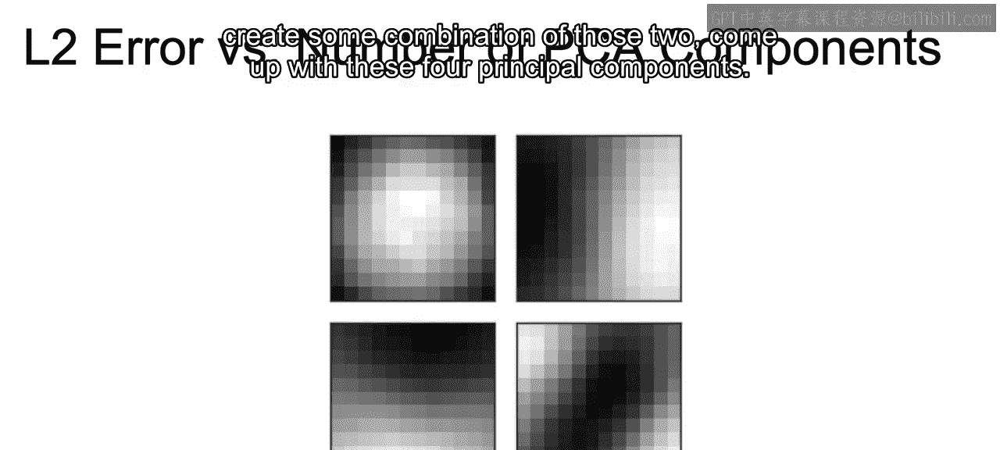

And something to note， as we recall when we are working with PCA in the PCA notebook。

 is going to be the top four of our original top 16 or even of our top original 144 components。

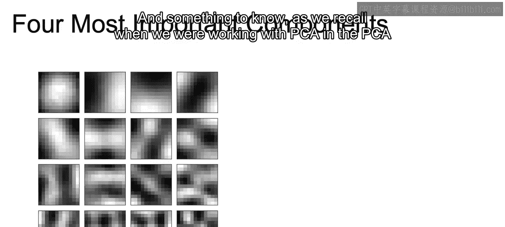

So reducing to 16 and then selecting from the top is the same as just reducing down to our top4。

So no matter what we always have， the first most important principle component first， the second one。

 second， so on and so forth。

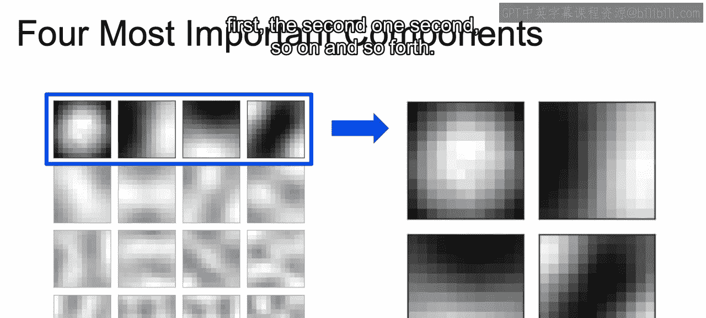

And then here we can see what that image actually looks like， reduced down to one dimension。

 So you see that now we're only working with one dimension and each one of our different squares is just going to be a different weight for each one of those different original squares that we are working with。

And we can still see somewhat of a fuzzy image here。

 So we can see here how PC A is actually compressing our original image and the amount of data that we have to store in order to represent that image。

Now， just a quickly recap。In this section， we discuss the applications of dimensionality reduction in the real world。

Using the example of working with that butterfly image。

Using PCA to reduce the number of dimensions and show how we didn't lose much from that original image when we reduce the number of features。

Now that closes out our section here on unsupervised learning， and it was a pleasure teaching you。

 Thank you。

