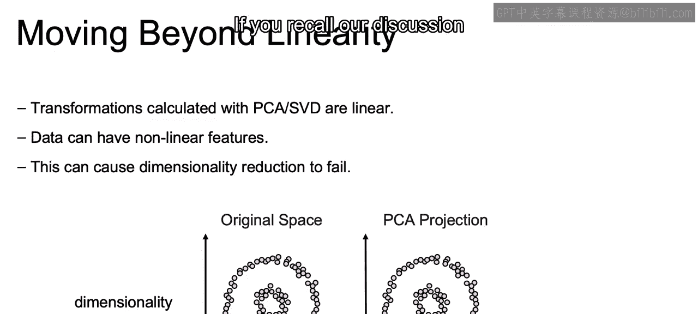
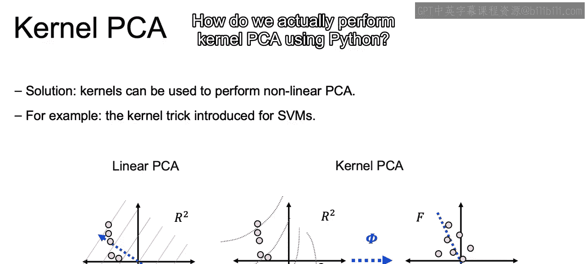
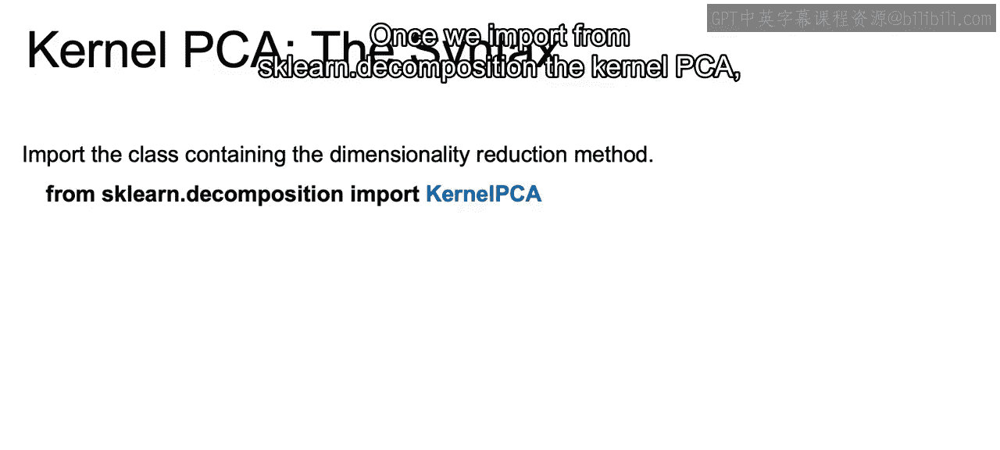
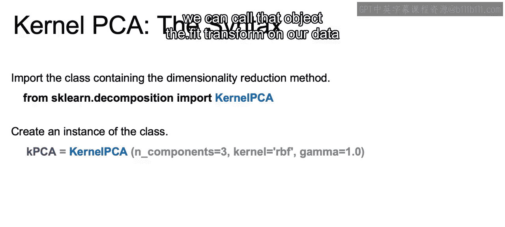
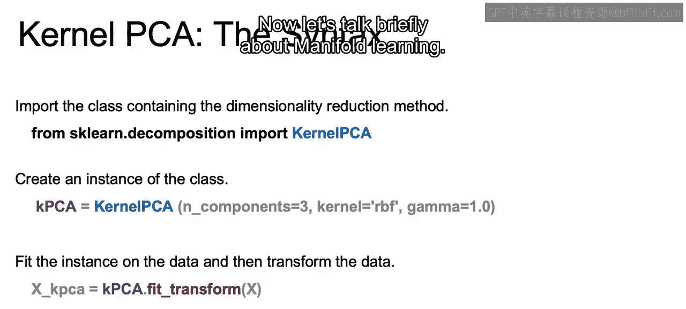
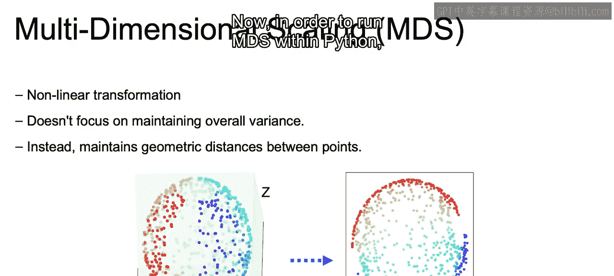
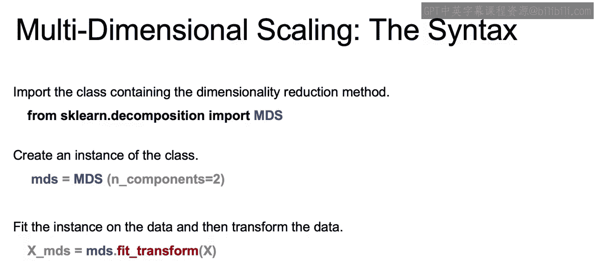

# 034：IBM《机器学习（无监督学习、深度学习和强化学习、毕业项目）｜machine learning》中英字幕 p34 33_核主成分分析和多维缩放.zh_en -BV1eu4m1F7oz_p34-

Now let's move beyond linearity to working with nonlinear transformations。

So what we've talked about so far with principal component analysis and singular value decomposition。

Everything that we were working with there were all linear transformations。

 so we're using linear transformations to map our original data set to a lower dimension。Now。

 data in general can very often have nonlinear features。

And when we work with nonlinear features and we try to perform PCA。

 this can cause our dimensionality reduction to ultimately fail。

So here we have this example data set。And we can see here we're doing a mapping from two dimensions to two principal components。

So it will end up not changing the space， but in general。

 as we try to map from higher dimensions to lower dimensions。And we have nonlinear features。

 We won't be able to maintain that variance while reducing the number of dimensions as we've done so far with linear PCA。

So if you recall our discussion during support vector machines。

 there are going to be kernel functions which we can use to apply nonlinear transformations to our data。

Now， if you did think back to support vector machines。

 what probably came to mind is with the kernel functions。

We're mapping up to higher dimensional space， and the goal here is to map the lower dimensional space。

But the key is that when you use these kernel functions and map a higher dimensional space。

 you're able to uncover nonlinear structures within your dataset set and use that to map down using a linear fashion similar to how youre able to then come up with a linear boundary。

😊，Once you map up those higher dimensions， you can use that linear PCA in order to actually come up with less dimensions。

So here we see from that original space that we saw earlier using kernel PCA projection。

 we're able to come up with a linearly separable space， so we're able to adjust the space。Now。

 in the figure here on the left。

We're going to be applying PCA directly and we see this curvature in our data。

And we wouldn't be able to maintain the total amount of variance if we just directly applied linear PCA。

So instead， we apply this kernel。Which will map our data to a linear space。

 and then we can reduce it down to a lower number of dimensions without losing the information that we would lose by squashing down our data on that original linear projection。

So how do we actually perform kernel PCA using Python。

 as usual we're going to import the class containing the dimensionality reduction method。

Once we import from SKAle。 decomposition the kernel PCA， we then initiate our class。

 and we're going to say the number of components we want what type of kernel we want to use。

 there's actually different kernels available， as there were with support vector machines。

As well as choosing the gamma and if you recall the gamma will identify how curvy or how complex you want it to be in regards to the nonlinearity of that original data set。

And then same as working with just PCA， we can call that object the dot pit transformform on our data set and we have our transform data set using the kernel PCA。

Now let's talk briefly about manifold learning。There is going to be another class of nonlinear dimensionality reduction。

And what we are working with here is going to be multidimensional scaling or MDS。 Now， MDS。

 unlike PCA， will not strive to preserve that variance within the data， so recall with PCA。

 the goal is to maintain as much of the variance within the original data。With MDS， instead。

 the goal is to maintain the geometric distances between each one of the different points。

So the figure on the left is supposed to be a sphere in three dimensions。And under MDS。

 it's map to a disk and the distances between each of the points in three dimensions is trying to maintained as we move down to these two dimensions。

Now， in order to run MDS within Python， we are going to import the class containing dimensionality reduction method。

 so from SKle。 decomposition again， we import MDS。We create an instance of the class as well as the number of components that we ultimately want。

And again， we just call the MDS and we call fit transform on our data set。

And then we will have X underscore MDS as our transform data set that is now it only has two columns or two features。

Now， other popular manifold learning methods exist such as ISOMap。

 which will use nearest neighbors and try to maintain the nearest neighbor ordering。In a way。Or TSNE。

 which tries to keep similar points closer together and dissimilar points further apart and can be very good for visualization。

And there are going to be several ways to do decomposition and generally would say try a few out。

 a good approach would be to try those out， and then perhaps if you're able to move down to two or three dimensions using EDA and visualization to see how well you were able to come up with clusters or maintain the amount of variance that was originally there。

Now that closes out our discussion here in regards to principle component analysis。

 as well as the different types of manifold learning。In the next lesson。

 we're going to go through a demo of using PCA in practice All right， I'll see you in the notebook。

