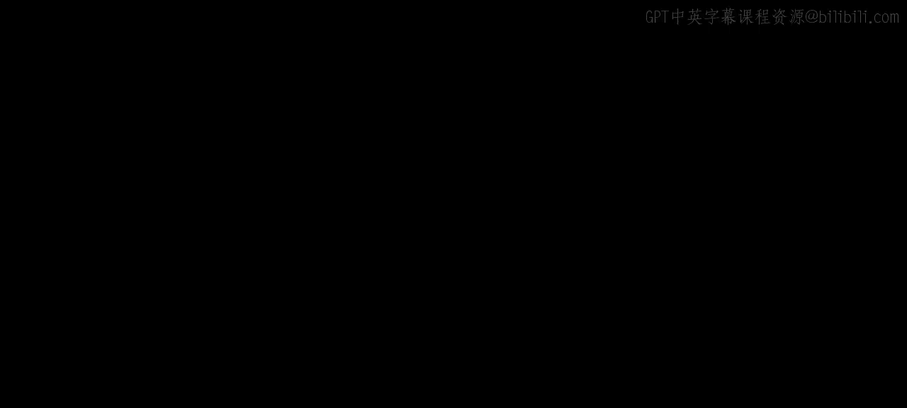

# 036：IBM《机器学习（无监督学习、深度学习和强化学习、毕业项目）｜machine learning》中英字幕 p36 35_非负矩阵分解.zh_en -BV1eu4m1F7oz_p36-

Now we introduce another way of reducing the number of dimensions。

 namely non negative matrix factorization。Now with non negative matrix factorization。

 we are still going to be decomposing our original matrix。

But this time we're starting with as input only positive values。

 so you can think word counts or pixels and image as examples of matrices with only positive values。

And then we decompose that original matrix of positive values into two matrices W and H。

 with both also having only positive values， so that's that non negative matrix factorization。

Now we can think of taking a term and a document matrix。

 so to create a matrix of the sort out of many documents。

 you can think of each one of your different observations or each one of your different rows as being a specific document。

And each column being a word。And the values for that documents for rows and。Wrote words for columns。

 each one of the values will be the word count or some other measure of the word for that document depending on how you pre process your text data。

We can then decompose this into how the terms each make up certain topics， and that's your W here。

And that number of topics will be of your choosing。

 similar to the choosing of components when we're doing PCA。

And then the H will be how to combine these new topics together to recreate our original documents。

Now， thinking of images， if we think back to PCA。PCA is highly recommended when you have to transform higher dimensions into lower dimensions。

 and you are okay to lose the original features in the process as new ones are being introduced。

So when we look at the breakdown of the components。

 it's going to be difficult to gain any insight into how they all combine to recreate that original image as each one of these new components are。

Composed of a weird combination of those original features。

Now with non negative matrix factorization， since we are only working with positive values。

And we can only add those values together， we can't subtract since everything's positive in both our W and H matrices。

The different components tend to have more of an intuitive feel。

 as we'll be adding together the shading of the eyes， the eyebrows， the nose， etctera。

 all together to recreate an image of our face as we see here。Now。

 nonne matrix factorization has proven to be powerful for word and vocabulary recognition。

 image processing problems， text mining， transcription processes， cryptic encoding and decoding。

 and it can also handle decomposition of non interpretterpreable data objects， such as video， music。

 or images。So why focus on a decomposition of only positive values。For one。

 since non negative matrix factorization only works with positive values。

 it can never undo the application of a latent feature。

 There's no cancelling out with negative values。 It's only going to be additive。

And thus each included feature must be important， as again， we can't cancel it out down the line。

Also， since its only positive values， this leads to features that may be interpretable。

 as they must all add together to recreate our original data。 So， as mentioned。

 for something like a data set of different faces， you may have the nose， the ears， etc ceter。

 and those will add together to recreate the face。Something to note is that because non negative matrix factorization has the extra constraint of positive values only if we end up in that original decomposition with some negative values。

 the algorithm will automatically truncate those to 0 and thus may not be able to maintain as much of our original information。

Something else to note is that unlike PC， there's going to be no constraint of only orthogonal vectors when we're working only with positive values。

 so that decomposition can thus have portions pointing in similar directions in n dimensional space。

So now let's briefly touch on how non negative matrix factorization will work with something like natural language processing。

So as input to our non negative matrix factorization for documents。

 you would pass in some type of pre process version of each of your documents。

 turning words into numeric values， can either use a count vectorizer for the count of words or the T F I DF。

 which is term frequency inverse document frequency。

 which will give you a value that gives less weight to more common words such as a or the or is within。

The entire range of all of your documents。We can then have the possibilities of tuning the number of topics that we ultimately want。

 as well as the means of pre processingces our text may want to remove certain stop wordss or frequent terms altogether。

And then our output will be how the different terms relate to the different topics。

And then another matrix telling us how to use those topics to reconstruct our original documents。Now。

 in order to actually use NMF within Python， the syntax will be very similar to what we've seen so far with the different decomposition methods。

 so from SK learn。 decomposition， we import NMF。We then create an instance of our class passing in the appropriate arguments so we say how many topics。

 how many different components do we actually want？And then we say， how do we want to initialize。

 Most of you will initialize as random， But what is important to note is that the method can be sensitive to the type of initialization。

 as we' have seen with other models， and the results will not necessarily be unique。

So we initiate our class NMF with a number of components。

 and then we can fit the instance and create a transform version of the data by calling nmF。

fi as well as nmF。transform in order to come up with our new data。Now。

 just to recap the different approaches that we went through。

Dimenssionalality reduction is going to be common across a wide range of application。

 and we have here some rules of thumb for selecting what approach you'd like to use。

For a principal component analysis， this will be great if you have a linear combination of features。

 you believe that you can create or maintain the amount of original variance。

 and that's your goal is to preserve variance by creating a linear combination of those original features。

😊，Colonnel PC A will be similar， except for assuming there is more of a nonlinear relationship。

 and we still want to preserve the overall variance within each one of our features。

Multidisional scaling， like PCA。With new transformed features are determined based on preserving distance。

 rather than maintaining variances as we did with PC A。

 So if maintaining the amount of distance is more important。

 which may be something useful if you want to visualize different clusters。

 this may be a better approach， than you'd want to use M S。And then finally， as we just discussed。

 is non negative matrix factorization， which is useful when you're working with only positive values such as working with word matrices or working with images。

Now let's recap what we learned here in this section。In this section。

 we discussed dimensionality reduction and how we can solve our problem of this cursesive dimensionality by coming up with a lower dimensional representation of our original data that maintains the majority of the information important to us in that original data set。

We then discuss principal component analysis or PCA and how we can use it to come up with new features created as a linear combination of those original features。

 or if we use kernel PCA， a nonlinear combination of those original features to maintain as much of the variance from that original data set as possible。

And then finally， we discussed non negative matrix factorization and how working with only positive values can lead us being able to come up with more intuitive and powerful representations of our original data in lower dimensions。

Now that closes out our lecture on dimensionality reduction。

 and from here we're going to move to a demo actually working with non negative matrix factorization using Python。

 All right， I'll see you there。

