# 039：IBM《机器学习（无监督学习、深度学习和强化学习、毕业项目）｜machine learning》中英字幕 p39 0_课程介绍.zh_en -BV1eu4m1F7oz_p39-

Hi， my name is Miguel and I am one of your instructors in our course for deep learninging and reinforcement learning。

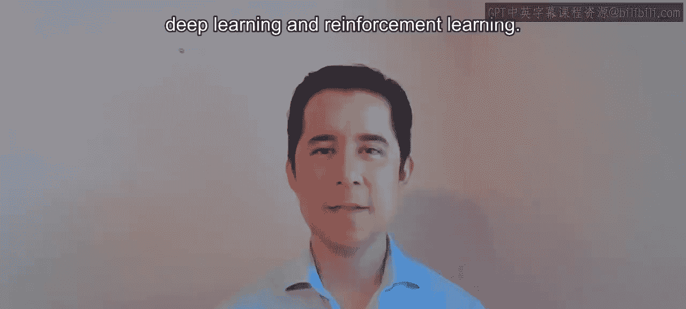

Deep learning is a very exciting topic because it powers most of our favorite AI applications。

 anything from self drivingriv cars to computer vision and speech to text recognition is using some shape or form of deep learning。

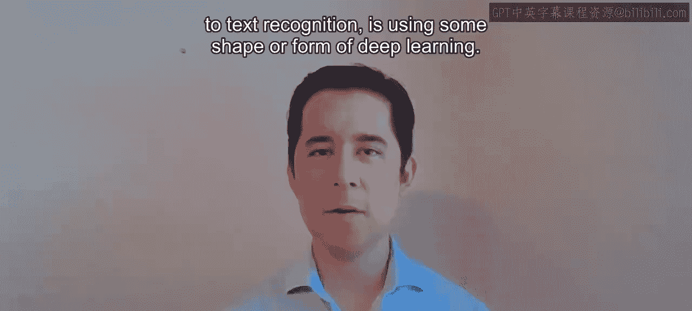

And it's really going to help you in all your classification tasks and even on supervised learning applications。

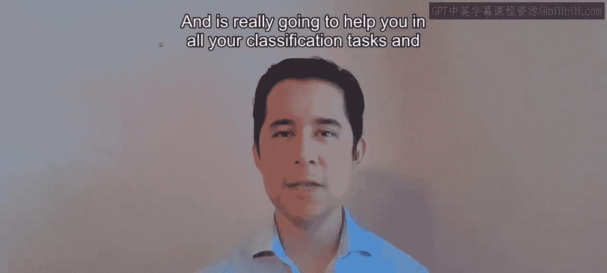

You will first start learning about neural networks， what they are， how they work and best practices。

 and then you will learn some deep neural network applications like the courseive neural networks and convolutional neural networks。

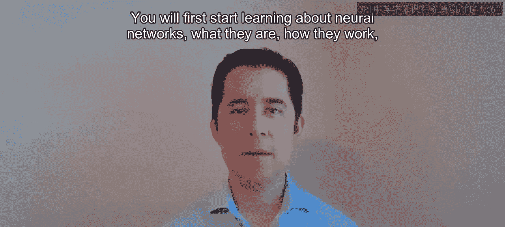

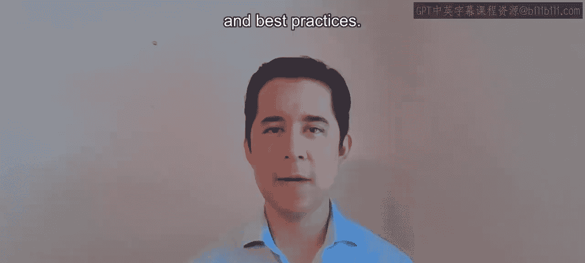

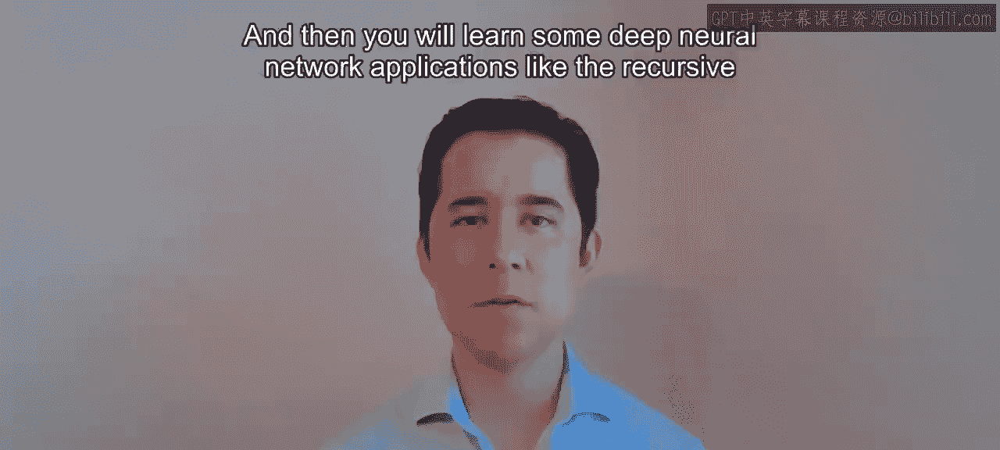

And you will wrap up learning some more modern architectures like。

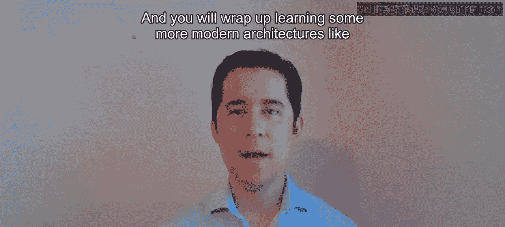

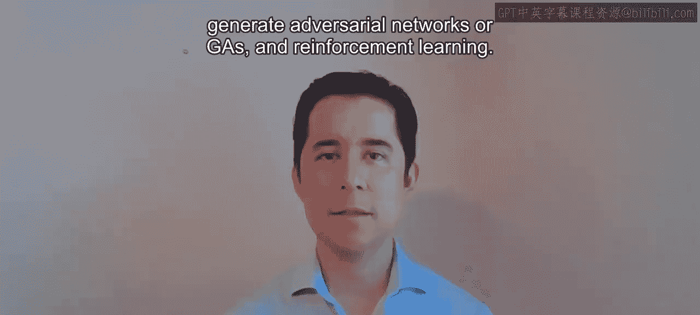

Gerrative adversarial networks， or GNS and reinforcement learning。

 which is one of the bigger promises。

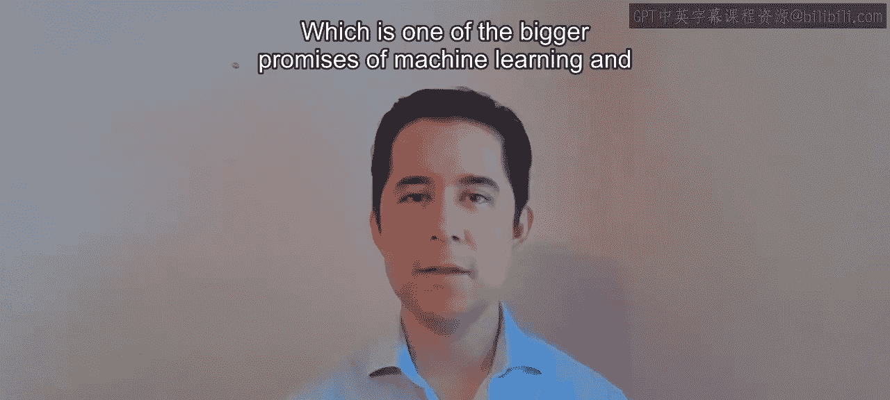

Of machine learning and artificial intelligence， even if it's very computational and data intensive。

 it holds big promises and it might be what the future holds for AI。

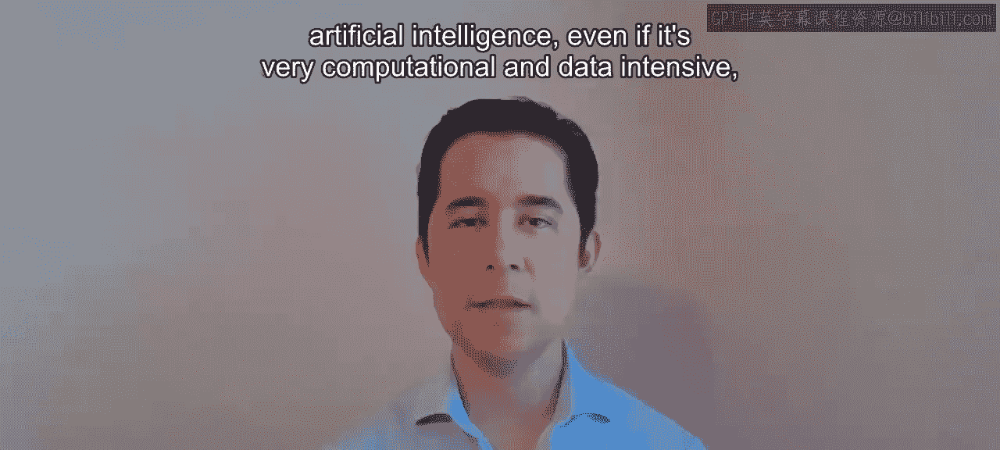

From all the IBM professional certificates and specializations。

 this course is one of the most advanced and complex。

 so make sure that you take enough breaks and if you need any help please don't hesitate to reach out to your instructors and peers。

 we' are here to help one another and we will go through this together。

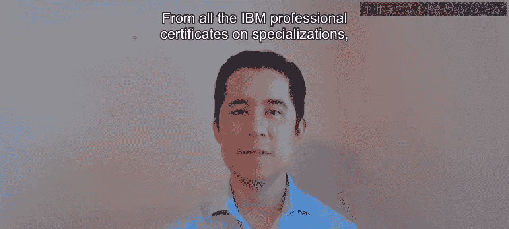

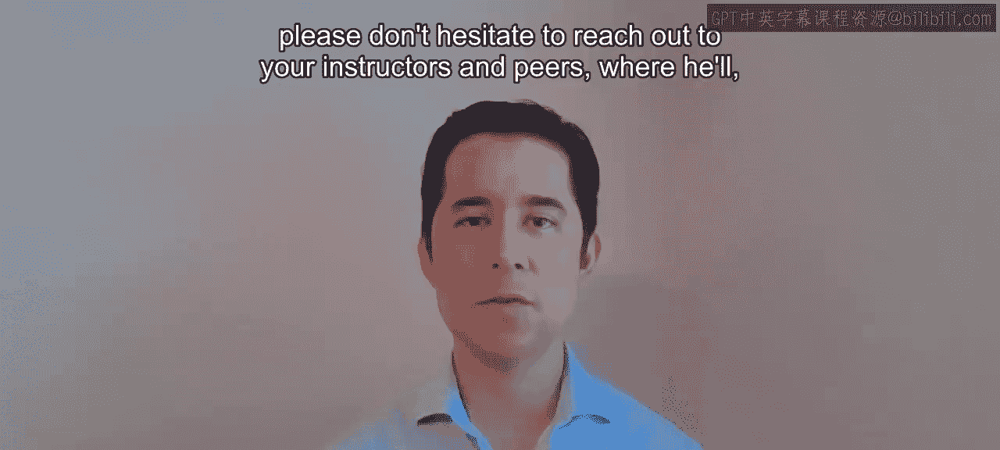

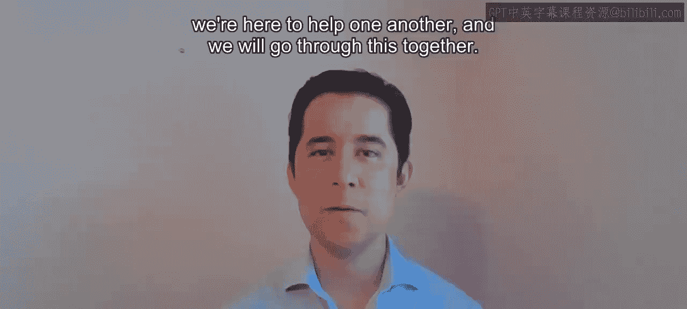

Another very important part of this course is the final project。

 it will really help you highlight your analytical and machine learning skills so make sure you post your solution online。

 it can be on a Github page， an online portfolio for the IBM communities。

 we really encourage you to post your solution out there。

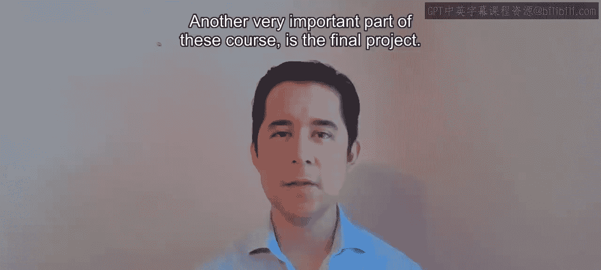

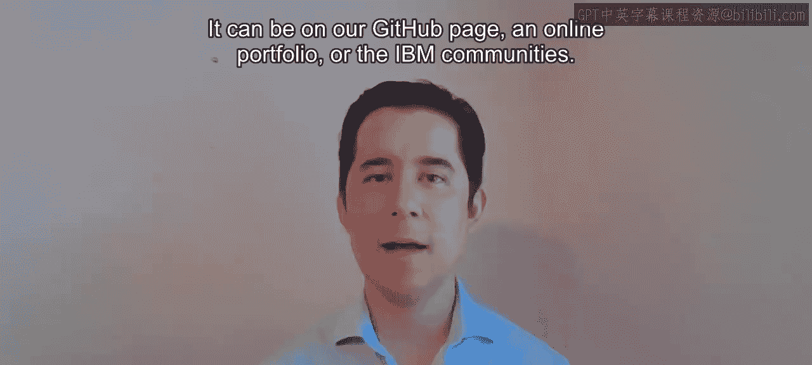

And with that， I will see you in the course， thank you。

