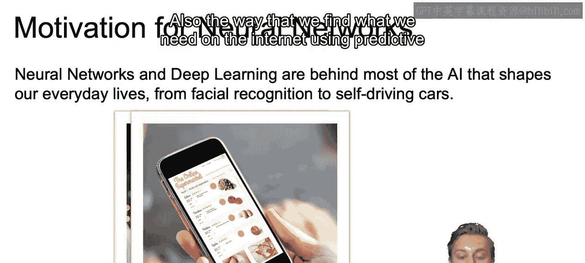
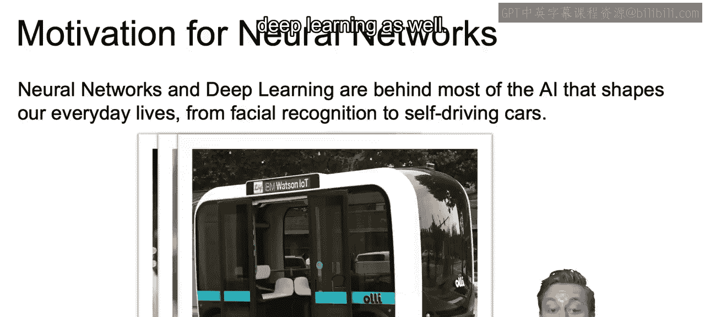

# 040：IBM《机器学习（无监督学习、深度学习和强化学习、毕业项目）｜machine learning》中英字幕 p40 1_神经网络简介.zh_en -BV1eu4m1F7oz_p40-

In this set of videos， we will introduce the basic concepts behind working with neural networks。Now。

 neural networks and deep learning are behind most of the artificial intelligence that shapes our everyday life today。

Think of all the cool features in our phones， ranging from face recognition to auto correctect to text autocomps。

 voicemail to text previews， also the way that we find what we need on the internet using predictive internet searches。

 content or product recommendations， and even self driving cars。

Also， many of the classification and regression problems that you need to solve at your business are going to end up being good candidates for neural networks and deep learning as well。

Now there are several Watson applications and artificial intelligence APIs that help you infuse artificial intelligence into your business。

Here we have some of the most used with links to live demos that you can explore here on your own。

 and as you go through some of these， think about ways you can use these applications within your business。

 whether it's identifying the pieces of an image， coming up with an efficient translation into a foreign language。

 summarizing and classifying comments or reviews of your product。

 as well as finding whether those comments that have positive， negative or perhaps a neutral tone。

Now it's often noted that the biology of the brain serves as an inspiration for the mathematical models that make up our neural networks。

The idea being that the brain functions by firing neurons along a chain where one neuron gets signals from prior neurons。

And according to the firings of prior neurons， the next neurons decide where to generate signals or not generate signals。

 according to those inputs。Those signals that were activated。

 then pass on signals down that chain to the next neurons。And by layering many neurons together。

 we end up creating a very complex model。Now， moving to the actual neural network。

 we can think of it as a complicated computation engine。

We're going to train it using our training data， so train our neuralNe model。

And then we'll use that trained neural net model to generate predictions using new data。

 so note here that similar trained test approach as we did with supervised learning。

 which will become of utmost importance as we create our neural networks。

Now that closes out this video in the next video we're going to dive into a single one of these cells to see how data flows in and how data flows out from each one from layer to layer Allright。

 I'll see you there。

