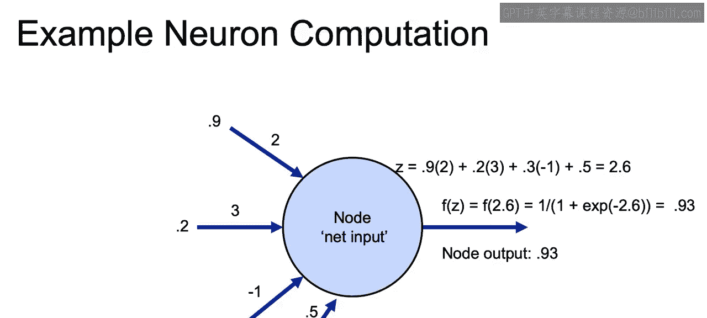
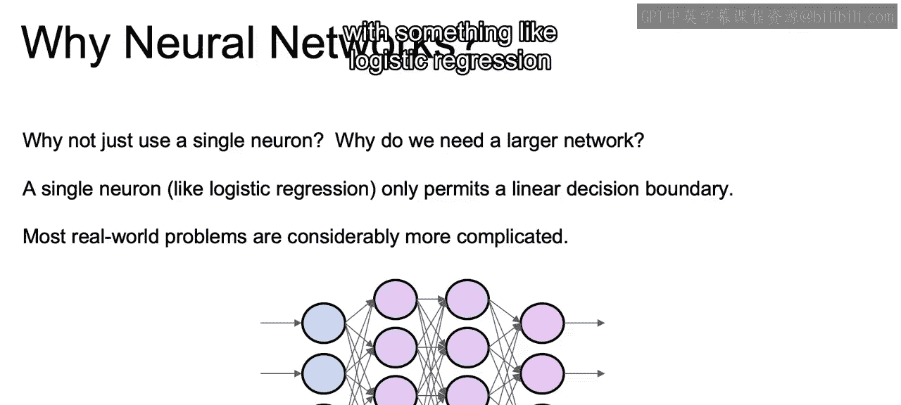
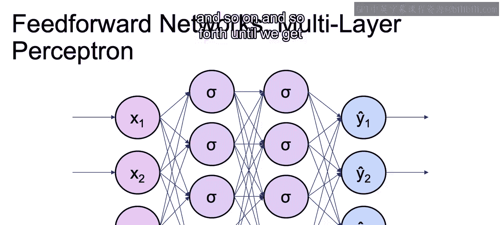

# 043：IBM《机器学习（无监督学习、深度学习和强化学习、毕业项目）｜machine learning》中英字幕 p43 4_神经元实战.zh_en -BV1eu4m1F7oz_p43-

So let's zoom back into this single node。When we're working with just a single neuron。

 what we have here is a perceptron。And this is the basis upon which all neural networks are built。

Now， note here that we have as before our input values x1， x2 and x3， as well as our intercepts。

 and then our weights and our beta that we're going to learn。And in this example。

 we're going to be using logistic regression using that sigmoid activation function that we just discussed。

Now， if we were to change and look at actual values just to make clear how this actually looks in practice。

We can have the values as inputs， imagine that we have a row with feature 1 equal to 0。9。

 feature 2 equal to 0。2， feature 3 equals to 0。3， and then our W1， W2 and W3 are 2。

3 and negative 1 with a B of 0。5。We can then calculate the actual z value。

That would be input once we have each one of these values。Into our activation function。

That activation function is 1 over 1 plus E to whatever Rz that we calculated was。

And we'd end up with a value of 0。93。And that would be the output of this particular node。

So our node output is 0。93。So why not just use a single neuron。

 why do we need to have a larger network where we have one stacked on top of the other？

If we have just a single neuron as we would， if we were just doing logistic regression。

 that would only permit a linear decision boundary。

When we move on to stacking one layer on top of the other。

We are able to come up with a much more complex decision boundary。

 and most of our real world problems will probably be much more complicated than just that linear decision boundary that we can learn with something like logistic regression or something with just one unit。

So in order to take our inputs and pass them through and get our different outputs as we see here。

 we'd be working with a multi layer perception， so we saw that one unit perception we add on each one。

And we see here that we have this feed forward structure。Where we have our inputs of x1， x2， and x3。

Those will each be inputs into the next layer if you look at each one of the arrows。

 x1 goes to each one of the different perceptions on that next layer， as does x2 and as does x3。

And then that next layer， the second layer， is connected to every value in the third layer。

 and so on and so forth until we get our output of y1， y2， and y3。

