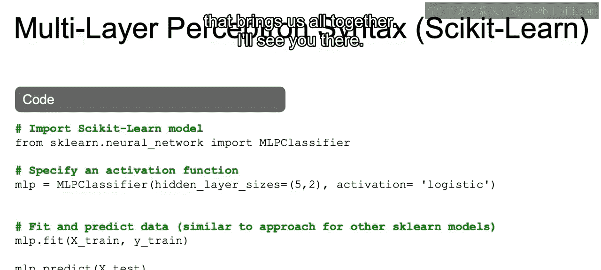

# 044：IBM《机器学习（无监督学习、深度学习和强化学习、毕业项目）｜machine learning》中英字幕 p44 5_使用sklearn的神经网络.zh_en -BV1eu4m1F7oz_p44-

Now in order to create the multi layerer perceptionion in practice， using Python。

 we're going to go over the SKL version of creating this neural network。

Now something to note is that we can make this simple multilayer perceptionron using SKLn。

 but as we move on to more complex models， you will see that we're going to move away from PsyitLarn and start working with a library called CAIS。

 but for now let's continue to focus on SKLearn， so as usual we're going to import from SKLearn here at neuralural network we're going to import the MLP classifier。

We then need to specify our activation function。So we pass in the different arguments while we initiate a class of this MLP classifier。

And some of the arguments that you see here are the hidden layer sizes。

 so this will actually be the sizes of each layer between your input and your output。

 so as we saw before we input x1 x to x3 and then we have certain amounts of hidden layers。

And we're saying here the size of each one of those hidden layers。

 So the fact that this tus only a size 2， that means that there's two hidden layers， one of size 5。

 one of size 2。 If we wanted3 and we wanted the third one to be of size 5。

 we can do5 comma 2 comma 5， so that's how the hidden layer sizes argument will work。

And then the activation function that we want to use。

 we've seen so far that we've only used the syigmoid function。By defaults。

 SKLn will actually use the relou function， which we'll learn a bit later。

 but because we want to stay in line with what we've discussed so far。

 we're going to set the activation equal to logistic here and logistic is just the same as setting equal to sigmoid。

We can then as usual， fit and predict given our data so we pass into our fit。

 our X train and our Y train， and then we can pass into our MLP。 predictd our holdout set。

 our X test and see how well we performed on this holdout set。

Now as closes out this video and in the next video we're going to go into some of the common terminology used for the multi layerer perception。

 as well as some intuition behind the basic math that brings us all together Allright。

 I'll see you there。

