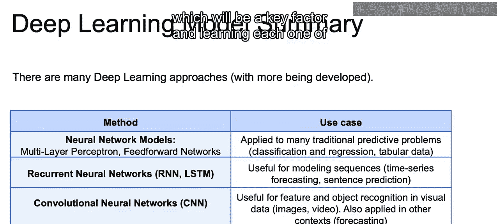

# 047：IBM《机器学习（无监督学习、深度学习和强化学习、毕业项目）｜machine learning》中英字幕 p47 8_主要的深度神经网络类型.zh_en -BV1eu4m1F7oz_p47-

Now， there are many deep learning approaches which we're going to discuss throughout this course。

 and along with these basic groupings， there's also much more being developed。So quick overview。

 we have the neural network models， which are just going to be your multi layerer perceptron and feed forward networks。

 and this is going to be applied to many traditional predictive problems such as just classification and regression that we've discussed so far。

We have recurrent neural networks， and we have here the class of RNN and LSTM long short term memory RNN is recurrent neural network。

 and this is going to be useful for modeling sequences。

 so this will be useful for time series where maybe each one of the different steps along the way are dependent on prior steps or sentence prediction where each one of the different words may be dependent on prior words。

We'll have convolutional neural networks or CNN， and that's going to be very useful for feature and object recognition in visual data。

 as it will take all the surrounding features and take them in as context moving forward as well。

 as well as being used at times for forecasting as well。

 where it can take points on either end or see some type of patterns within the data in order to predict future values。

And then it can also be used with unsupervised precha networks， with auto encoders。

 deep belief networks and generative adversarial networks， And there's going to be many uses。

 including generating actual images， labeling some outcomes， as well as dimensionality reduction。

 using deep learning， and we'll discuss many of these throughout this course。

Now that closes our introduction to neural networks。In the next video。

 we will begin to discuss the optimization that's needed in order to come up with our weights using gradient descent。

 which will be a key factor in learning each one of our neural network models。 All right。

 I'll see you there。😊。

