# 049：IBM《机器学习（无监督学习、深度学习和强化学习、毕业项目）｜machine learning》中英字幕 p49 10_神经网络介绍笔记本（选修部分）第2部分.zh_en -BV1eu4m1F7oz_p49-

Now in this video， we're going to discuss the limits of working with just a single neuron。

 So so far in the past video， we saw all the different ways that a single neuron would be able to handle coming up with the an gate。

 the or gate， the not ore and the not an gates。Now we'll see the limits when we work with the X or or the exclusive or gate。

And for those of you that have taken computer science courses。

 perhaps you're familiar with the X orgate， for those of you that are not。

The idea of the X orgate is to only pass true， if either one or the other。Of our inputs are true。

 but not both of them being true。 So we see if both are false， we return false， but also。

 if both are true， then we return false。 Only if exactly one of them are true。 Do we return true。

So can we create a set of weights such that a single neuron can output this property that we see here？

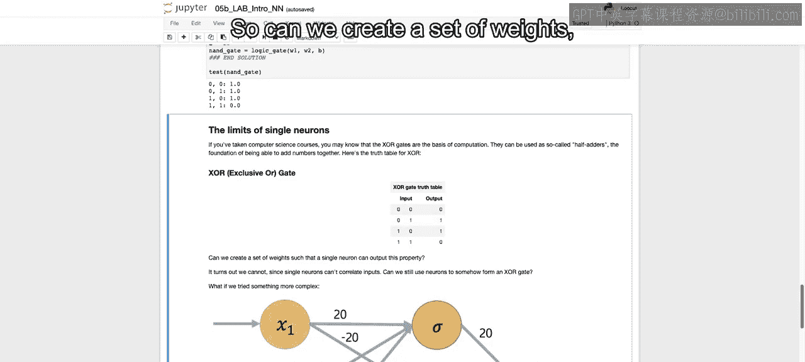

And it turns out that we can't。And。

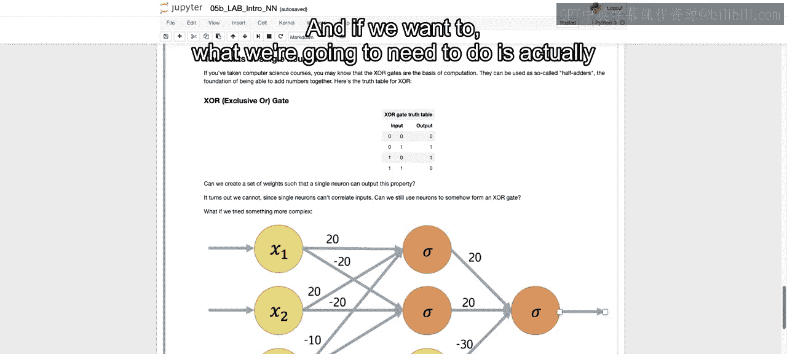

If we want to， what we're going to need to do is actually create another layer。

 So we'll pass in our input values of x to1 x2， as well as our intercept。

And then we'll create another layer as we do with our feed for neural networks。

And see how using two layers， we can come up with this X orgate。

So the concept is if it's going to be x or。We want one of the outputs。In the second layer。

To actually be equivalent to the orgate。And the other one to be equal to the not and。So， the idea is。

If we have。Either one or so x1 equal to 1 or x2 equal to1 or both equal to1。

 Then the or gate will return one。But it won't return one for the the only one it won't return one for is if they're both zero。

And then for the not ends。It will return。 The true value return one for all of them。

 except for both one and one being true。And then we can take the outputs of the orgate and the not and gate。

And in the second level， add on another end gate。And that will give us our XR function。

 So if we think about that， if we start with 0，0。Then that will pass 0 for the or gate。

 So then we'd end up when we take the end gate at the second level。

 no matter what if one of them is 0， then we automatically end up with a0。

 So that is correct in that both the inputs are 0。 and with our x or gate。

 as we see here in the table， it should be 0。Now， if one of them is a1 and the other is a zero。

The X or rate will return a1， and the knot and gate， which will return one for every single value。

 except for ans， will both be one。And in that second level， if we take the end of both one and one。

 we will output one， so we'll get the correct value。And then finally， we want a zero。

If both the x1 and the x2 are equal to 1 are both true。And are not endgate。If we have one and one。

 we'll pass through a0。 So even though our or gate would pass through a1。

 the and gate at the second level of the one and the0。

We'll end up ensuring that it ends up passing a zero。

So that will ensure equivalent to the X or final row that we pass out a zero。So again。

 the X or gate will just be a combination of an or gate。And not and gate。Which we learned just above。

 and then we can pass that through in the second layer with an end gate。

And that will output the correct output for our X orgate。 And we see that in practice。

 where we define our X or gate as the combination of an end gate of the output of。

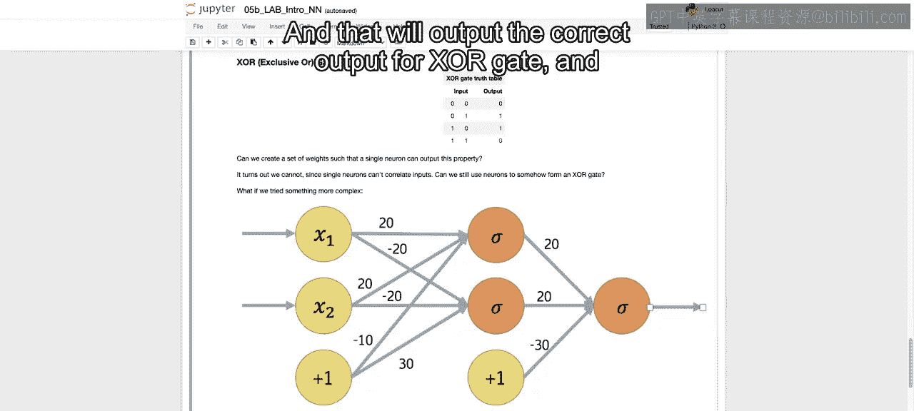

Both the or gate and the not and gate， we pass in that C And D。

 which will pass out the ones or zeros accordingly add on that end gate。 And when we test that。

 we get the output that we would expect where we have the0 for the both of them being false and is0 for both them being true and then true。

 if just one of them is equal to true。

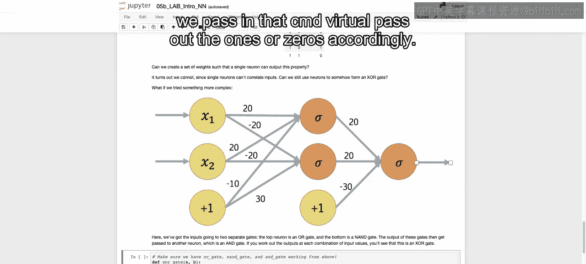

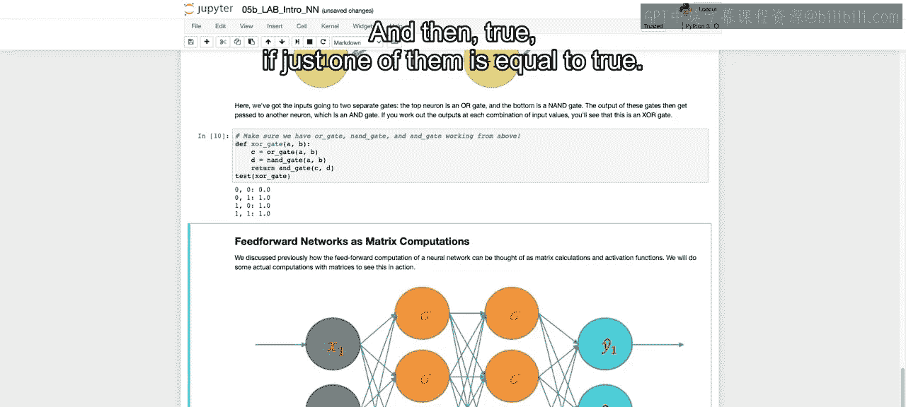

So that closes out our discussion in regards to working with that Xor gate and adding on the extra layer and saying how we can come up with more complex boundaries once we move to multiple layers。

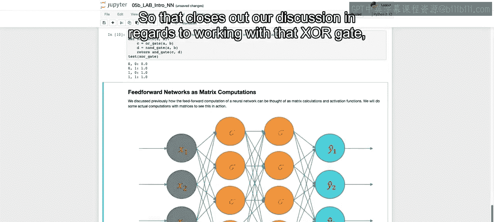

Now we discussed during lecture。The actual matrix weights， taking our input。

 how that's transformed into the first layer and then into the second hidden layer。

 and then eventually into our output。What we're going to do here is make that more concrete by actually coming up with some random weights as well as some random inputs and see how these matrix sizes transform as we go from our input through to our output。

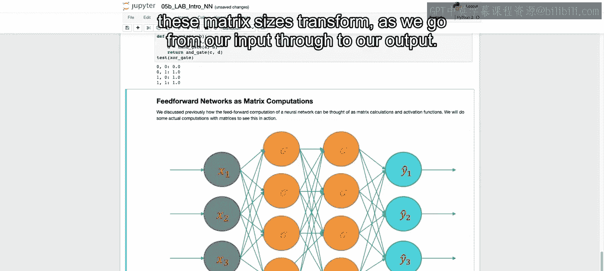

So here we're going to start with three weight matrices， W1， W2， and W3。

 representing the weights in each layer。

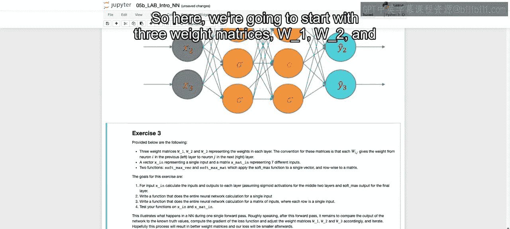

And the convention for these matrices is that W。 I J gives the weight from neuron I from the prior layer。

Two neuron J up until the next layer， so the weight of moving from I up until J。

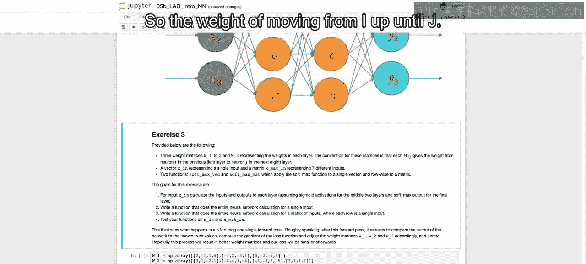

Now a vector X in is going to represent a single input。As we discussed during lecture。

 we discussed just working with a single input， as well as a full data set of inputs。

 and our X mat in is going to represent。What a toy version of a full data set with just seven rows。

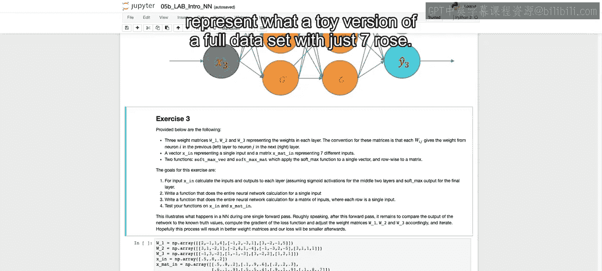

And the goal far exercise here is seeing four input X in。

 we're going to calculate the inputs and outputs to each layer。

 each layer as we move from our linear combination。

 which should output some z value and then taking the sigmoid of that value and then seeing how that's passed through to each one of the different layers。

We're going to write a function then that does the entire neural network calculation for a single input。

 do that again for a matrix of inputs， and then test our functions that we just created using our XN and our X Mattin。

 which is our toy dataset set。

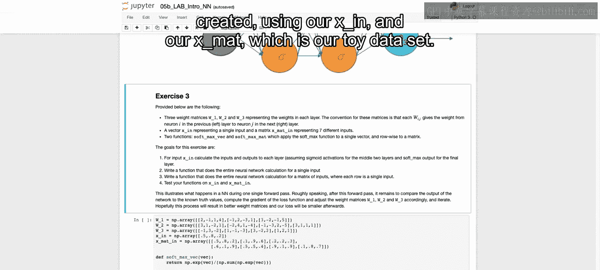

So let's look at this W1， W2 and W3， which will highlight for us how these actual weight matrices should look in the back end。

 Now this isn't learning the optimal parameters for us。

 but it's showing us just one step through the feed forward from the input all the way through to the output and when we get back to lecture。

 we'll talk about how we can actually optimize these weights。

So here we start with a three by four matrix for W1。We have three rows and four different columns。

W2 is going to be4 by4。And then column 3 is going to be4 by 3。 And while I say those numbers。

 you should be thinking of how we're transforming our three dimensional vector from x1 x to x3。

 we take our3 by4 matrix to expand that into a four vector and then keep that as a four vector by multiplying that by a 4 by4 matrix and then a 4 by 3 matrix to ensure that we have three outputs。

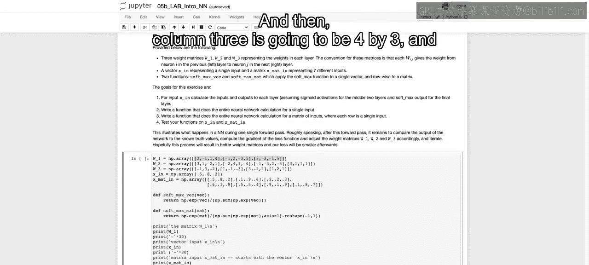

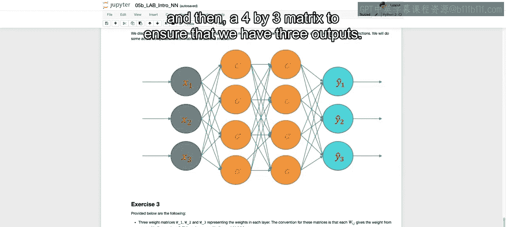

So that's the idea of W1， W2 and W3。So our input's just going to be these three values， 0。5。

 08 and 0。2。And then our toy data set， which is going to have seven rows。

 is going to also have the three columns where we have as the first entry。

 the same entry that we have our x in， but also seeing how this can expand to six more rows where each row will have the same amount of columns。

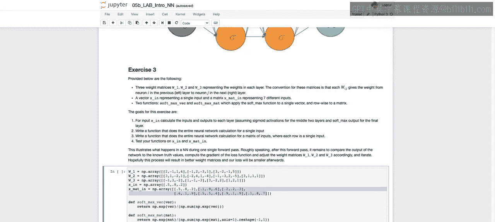

We're defining here the softm for a vector， which is just going to allow us to output probabilities for a single vector。

 and then we do the same for a full matrix。So we run this， and we see our output， as mentioned。

 that we have for our W1， a 3 by four matrix。

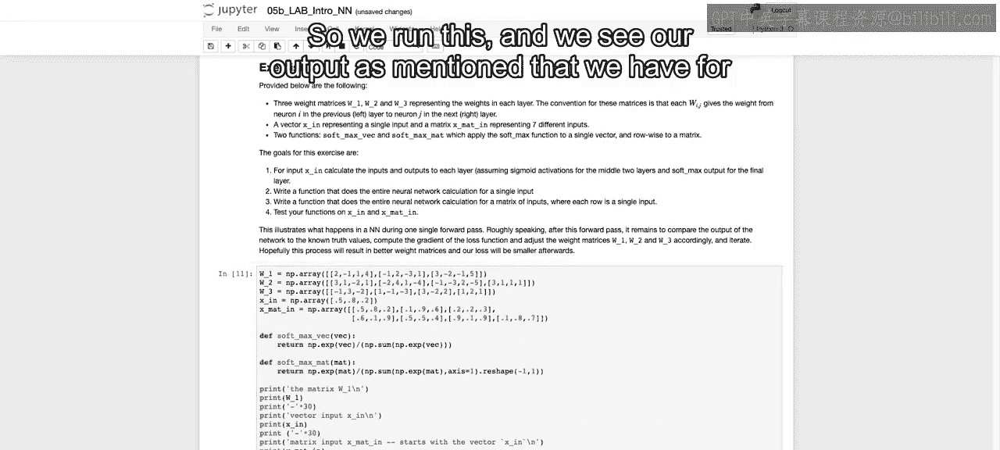

That's going to be multiplied by a row vector， so one by3 multiplied by a3 by4 should output a  one by four matrix。

 which should be our first hidden layer。And then we see the matrix for。

Our toy data set were as 7 rows。 And if we imagine this is a 7 by 3。 And when we multiply this by W1。

We end up in our first hidden layer with outputs for every single one of the different rows。

 So it'll be a 7 by 4 matrix。 and we'll see this in just a second。So if we pass in。

 let's first pass in here， just the X in。And we take the dot product。

Then as mentioned that we will get the linear combination here we're looking at Z2。

 which is going to just be that linear combination， taking the dot product of x in and our matrix W1。

 and we end up with this four vector， as mentioned。

We're then just going to take the sigmoid of that output， so we got the linear combination。

Now we take the sigmoid of that and we still have the same shape。

 but now it's the sigmoid of each one of those outputs。

And now that output will feed into the next layer。And again， at W 2。Was a 4 by  four matrix。

 And here we have a  one by four vector。 So we'll end up with a again R Z 3 being a  one by 4 vector。

And once we have that linear combination， we can again take the sigmoid。

 and that will be the output into the final layer， and Z4 will be the dot product of A 3 and W3。

 where again， W 3 is going to be that 4 by three matrix to ensure that it matches up with the one by4 matrix and outputs a1 by three vector。

😊。

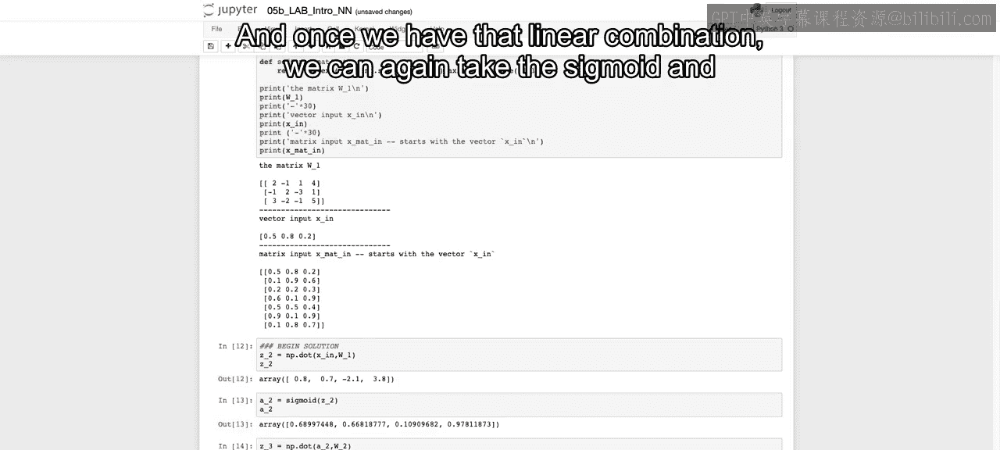

And then we take that Z4 and call a soft max to see probabilities for each one of the different values。

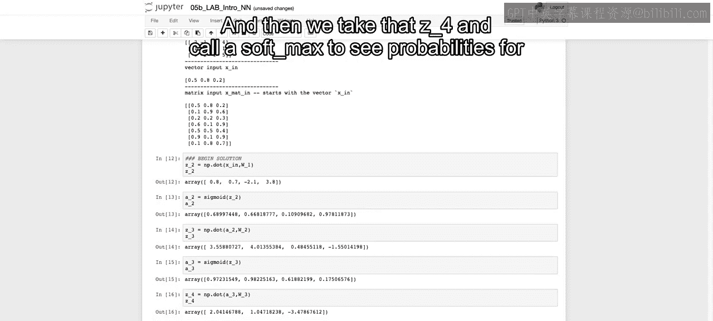

So we see that for the different classes that we predict that the first class is the most likely。

And that's the idea of feeding through this neural network up until that soft max to come up with a complex solution to our classification problem。

Now， quickly， I want to show you what this looks like if we are to pass in full matrix。

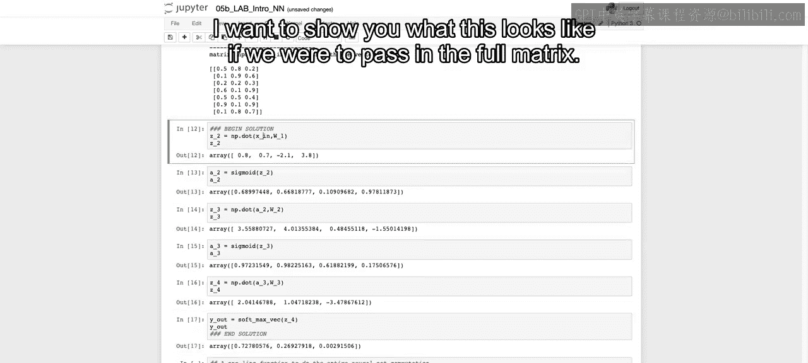

So we run X mat in。 and instead of it just being one row。

Now we have all seven rows being passed through。And then we have that 7 by 4 matrix。 We can take the。

Dot product of that output by the4 by 4。 And we still had that7 by 4 matrix。

Then we multiply that by our。

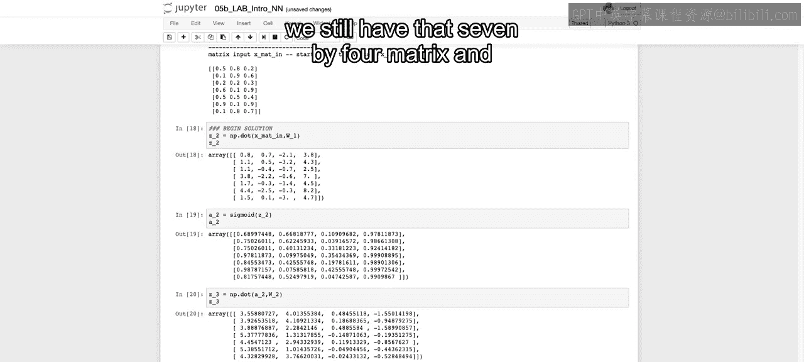

Then we take the sigmoid of that， excuse me of the Z3， so still the same shape。

 but now taking the sigmoid to each one of those values。

 we can then take the dot product so that we can get the output of the linear combination of each of those but only outputting three different values。

 and we can take the soft max， and then we can see the probabilities for each one of the different values from the output of that original matrix by taking the softm。

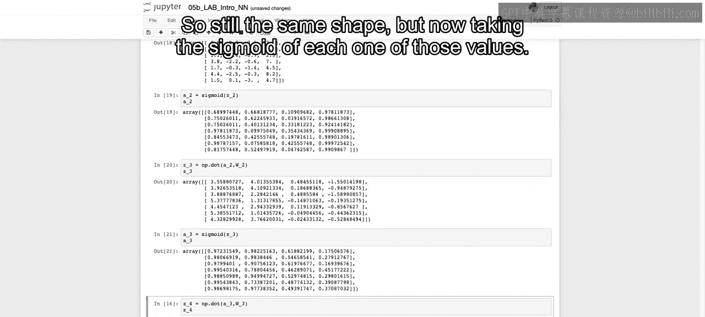

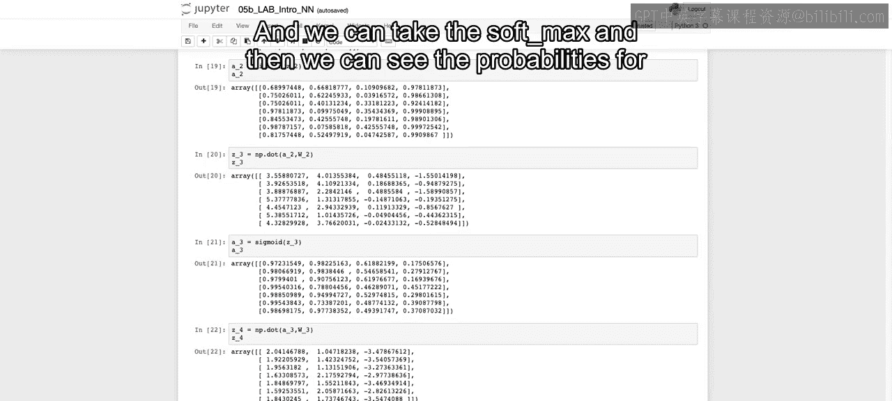

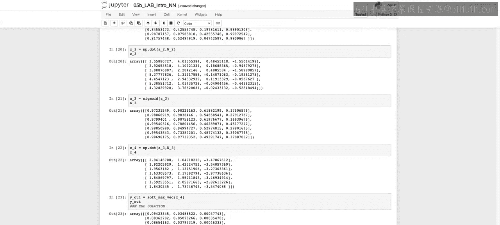

Now， just to see how that computes all the way through from beginning through to the ends。

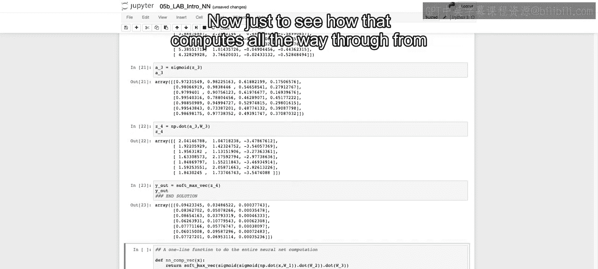

We create a function called the soft max Vc， which shall just be the。 You see what we pass through。

 the sigmoid of the sigmoid of the dot product of x and W1。😊，And W2， N W3。

And then we can do the same。 And just instead of passing in， it'll all be the same function。

 as we just mentioned， the X will work just as well， whether it's a matrix or just an input。

 We do create two different functions， and we can pass that out。

 and we can see that we have the solutions desired。

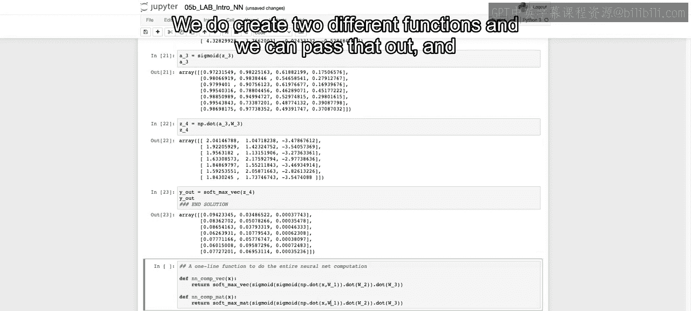

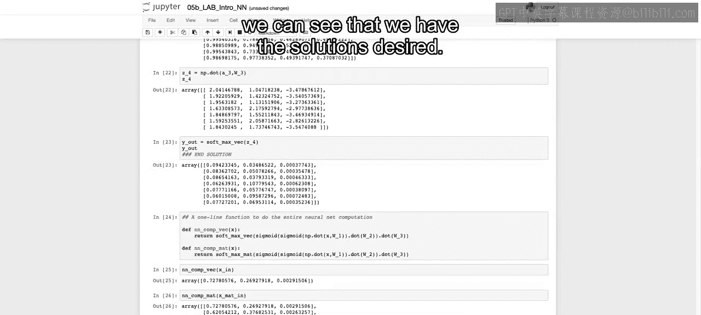

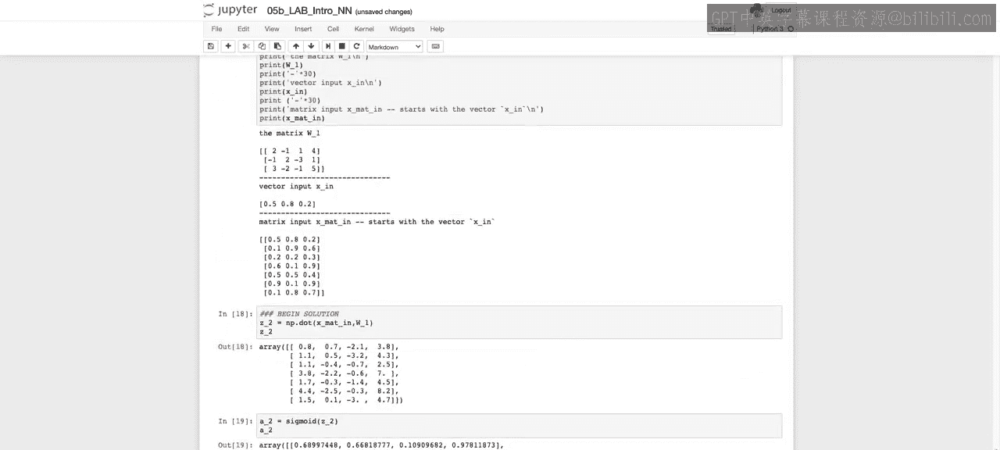

All right。 well， that closes out our video here。Working with。From beginning to end a neural network。

And once we get back into lecture， we'll discuss how to actually optimize this model so that we're not just looking at random weights。

 but the eventually the optimal weights using what we learned with gradient descent and then something called back propagation。

 All right， I'll see you there。

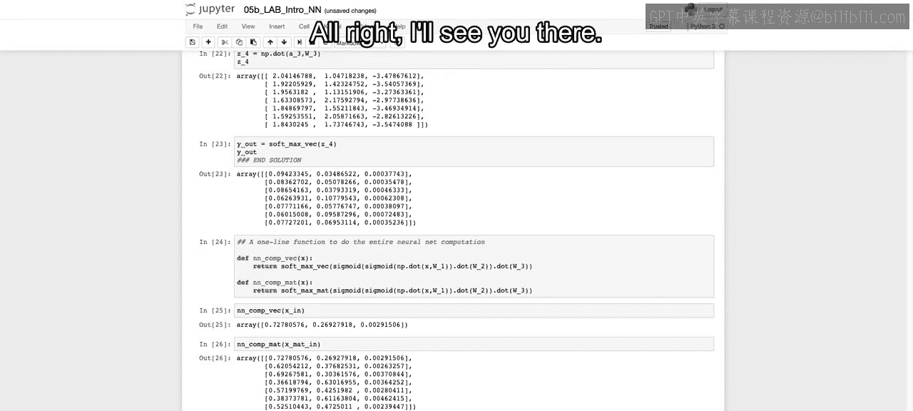

