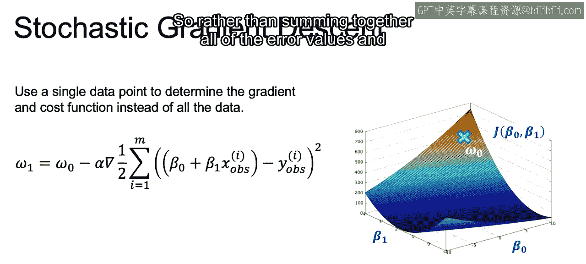
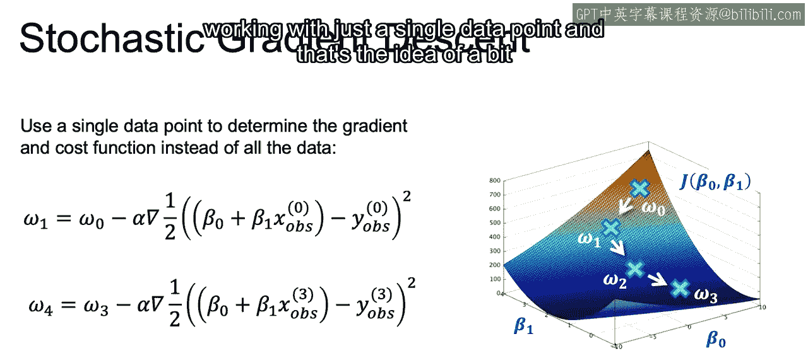
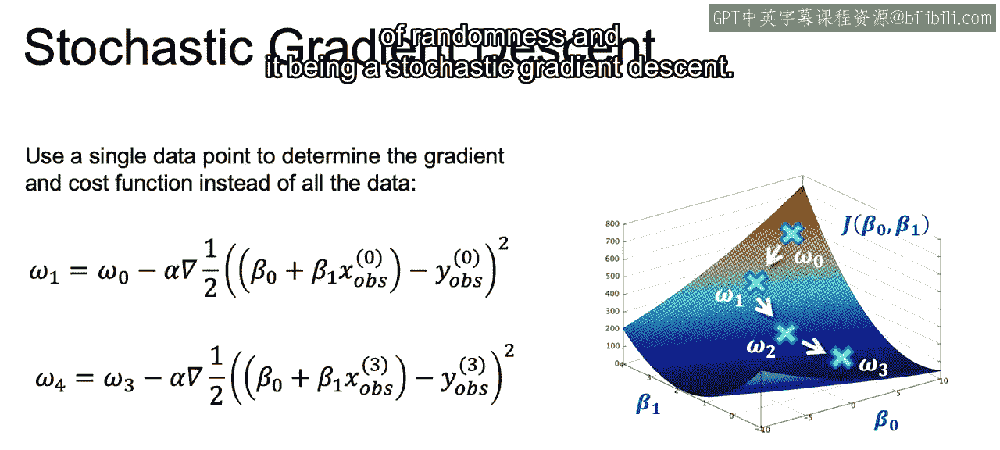
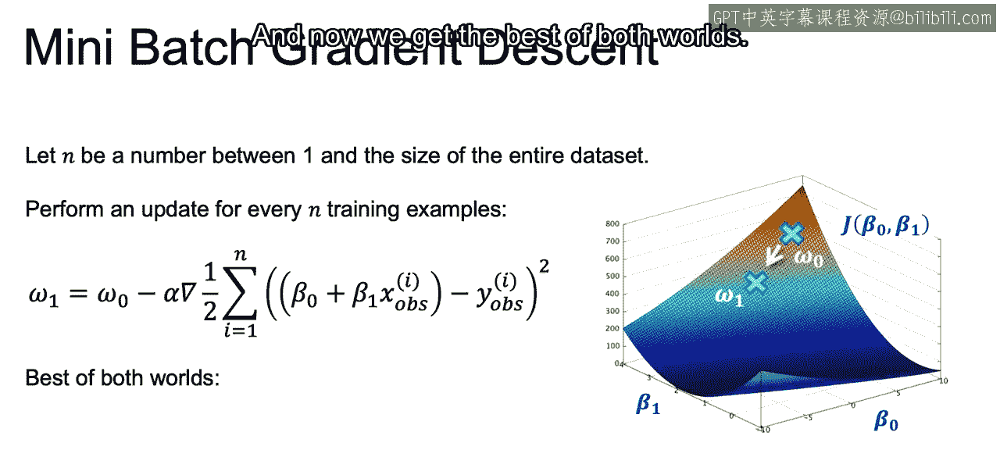
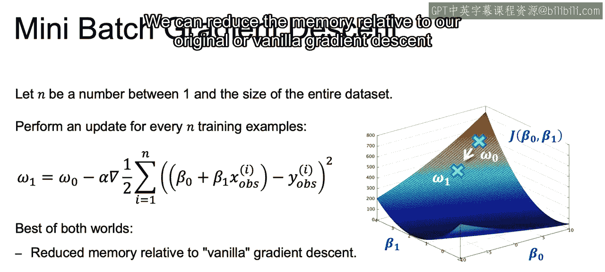
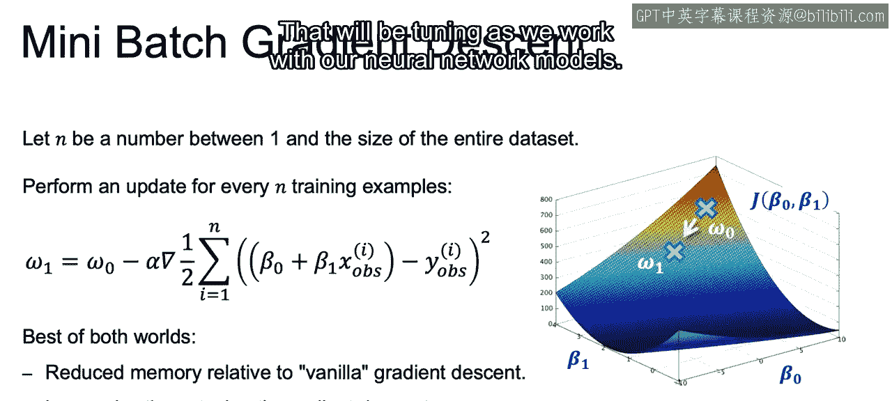
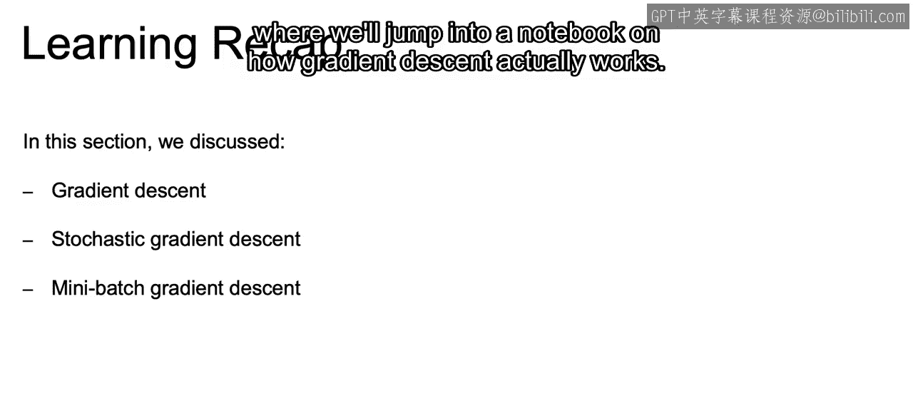

# 051：IBM《机器学习（无监督学习、深度学习和强化学习、毕业项目）｜machine learning》中英字幕 p51 12_比较不同的梯度下降方法.zh_en -BV1eu4m1F7oz_p51-

Now the concept of a stochastic gradient descent compared to that gradient descent we just discussed。

Is to speed things up by using only a single data point to determine the gradients and the cost function。

So rather than summing together all of the error values and then taking the gradients。

 as we did with that vanilla gradient descent。

We instead calculate our weights by subtracting from W n the gradient。

 given the error for just one value。 So if you saw above， we had the sum over all the values。

 and now， if we look above X observation and y observation。

 we're doing this just for one specific value。Then using this single point。

 we can again iterate through to continue to update the weights。

So we can use for W1 and each one can be a different random point。

 but we keep using only a single random point。And we keep updating our weights。

Moving down our cost function。And eventually， we end up hopefully near some global minimum。

 but that path is going to be much less directed due to the noise of working with just a single data point。

 And that's the idea of a bit of randomness and it being a stochastic gradient descent。

Now， finally， with mini batch gradients set。We can choose some value n between one and the size of the entire data set。

And now perform an update for every end training examples。So now。

 rather than summing over the entire data set or just one single observation。

 we are summing over a random subset of our original data。Saying our error。

And taking the gradient and moving down that line， given the gradients。For that subset of values。

And now we get the best of both worlds， we can reduce the memory relative to our original or vanilla gradient descent where we use the entire data set。

But it'll be less noisy and get to the optimal value much smoother than working with sarcchastic gradientant descent。

So that's going to be the idea behind mini batch gradientding descents。

 that n will be another parameter that will be tuning as we work with our neural network models。

Now， just a Rika。In this section we discuss gradient descent or full batch gradient descent where we went through every single row in our data set in order to update each one of our gradients。

We then discuss stochastic gradient descents and how we can take steps according to the gradient on each one of the single rows within our data set。

 So checking that error against every single row and then updating accordingly。

 and we discuss between the two how gradient descents may take a long time。

 but will move more smoothly， whereas stochastic gradient descent will move more efficiently。

 but maybe a little bit bouncy in regards to getting to that desired goal of our optimal value。

So the compromise was this mini batch gradient descent。

Where we reach that optimal value by not taking every single observation within our data set in order to calculate the gradient。

 not just taking a single value， but taking a mini batch taking， say。

 32 observations or 64 observations before creating an update using that gradient。

Now it closes out our video here on gradient descent。

 and we'll get a clear picture in our next video where we'll jump into a notebook on how gradient descent actually works。

 Allright， I'll see you there。😊。

