# 052：IBM《机器学习（无监督学习、深度学习和强化学习、毕业项目）｜machine learning》中英字幕 p52 13_梯度下降笔记本（选修部分）第1部分.zh_en -BV1eu4m1F7oz_p52-

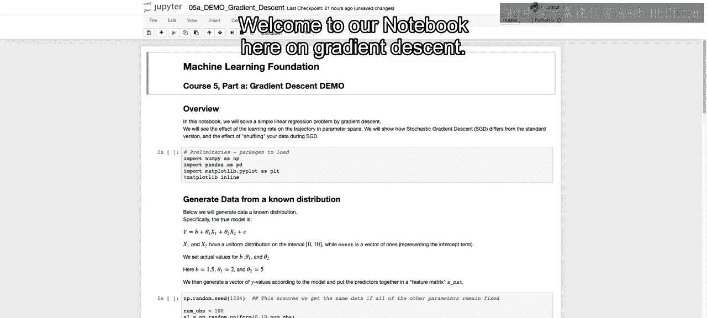

Welcome to our notebook here on Grant Descent。In this notebook。

 we're going to have an overview of working with gradient descent in order to solve the simple linear regression。

 as well as working with stochastic gradient descent。

 which we defined in lecture as just taking a single row and seeing the error and moving according to just the error on that single row compared to with vanilla gradient descent where we use the entire dataset set。

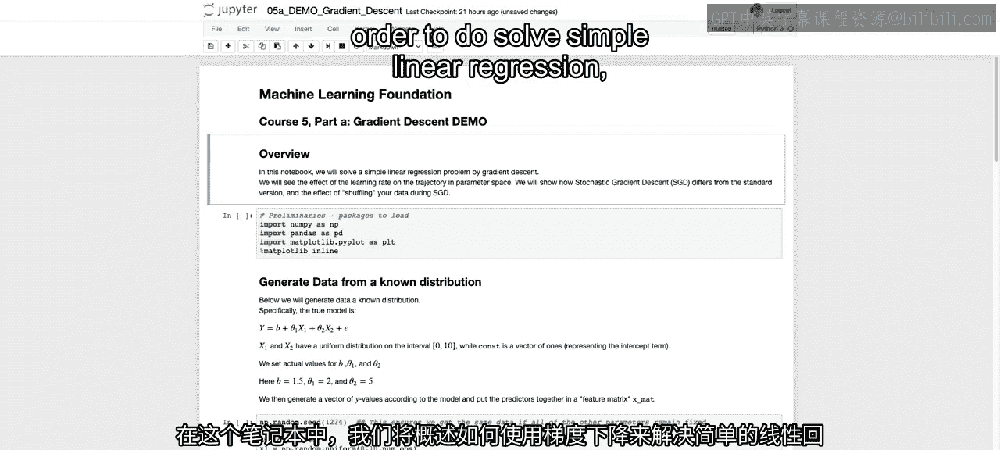

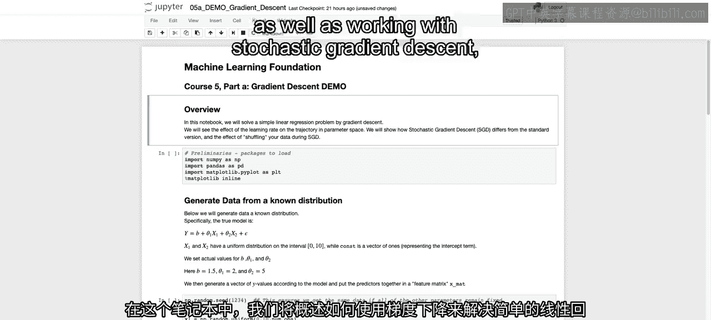

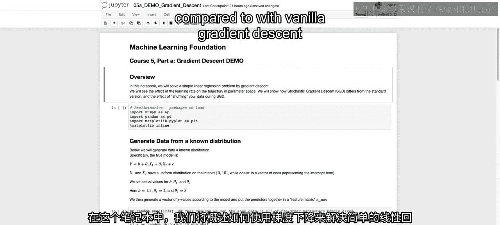

So to start off， we're going to import all the necessary libraries here just importing nuumpy。

 pandas and Matteplotlib。

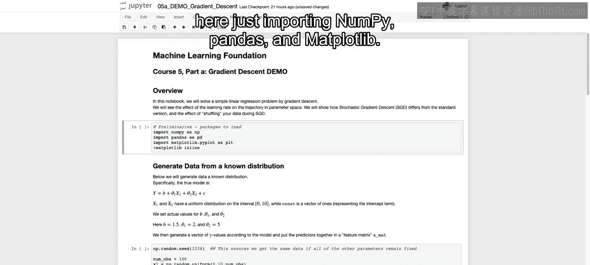

We're then going to generate data from a known distribution。

 so we'll know the actual values that we want to find when we do our gradient descent。

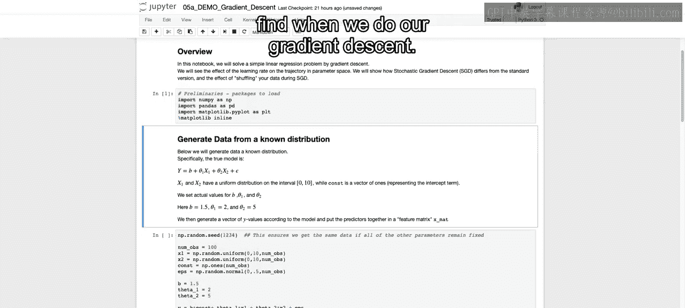

So if we think about just working with linear regression in general。

 what we're trying to solve for is some y where that y is equal to some betas or some different coefficients multiplied by our different values in our X data set。

So here we have y equals B， which is just our intercept term plus theta 1 times x1 plus theta 2 plus times x2 plus some error term。

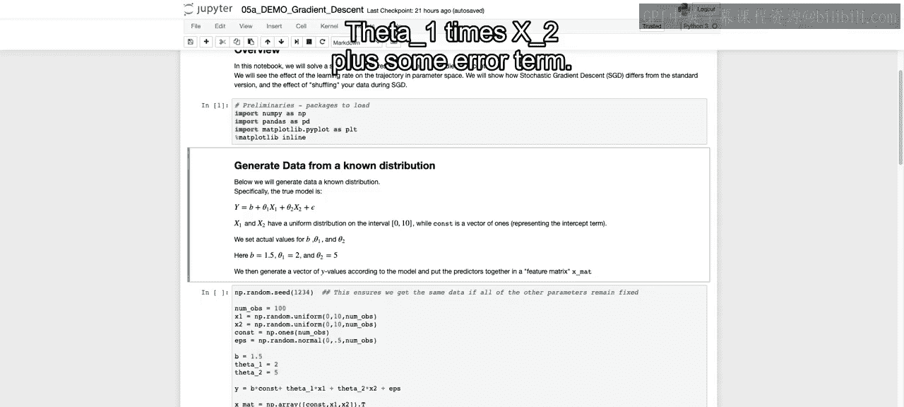

And in order to generate the data where we specify each one of the different thetas。

 we're going to have x1 and x2， each be random values between 0 and 10。

 where any value between 0 and 10 is equally likely to be picked since we're picking from the uniform distribution。

We're then going to actually set the values for B， theta 1 and theta 2， so B is going to be 1。5。

 Theta 1 is going to be equal to 2， and theta 2 is going to be equal to 5。

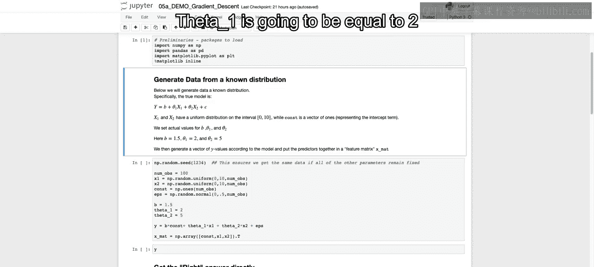

And then from there， we can generate our y values， as well as our feature matrix。

 which will have our X1 and x2 values。So how do we do that first thing we want to do is we're going to set the random C so that you back home are seeing the same solutions that we have here。

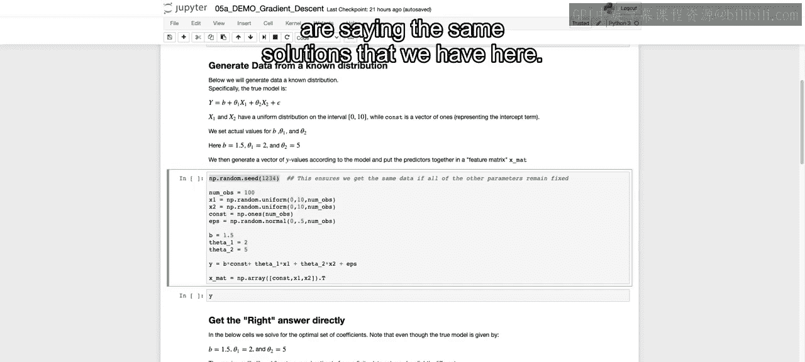

We're then going to say that we want 100 observations。

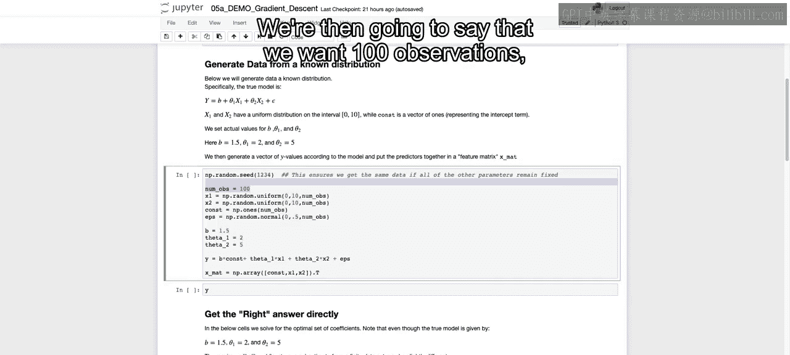

And we're going to pass that through as our x1s and our x2s are going to be random values between 0 and 10。

 So N dot random dot uniform。Values between 0 and 10。

 and we want 100 different observations between those values of0 and 10。

We set that equal to our x1 and our x2。And then for our constant term。

 we're just going to call NP do1s， which will just create an array of ones。

For a certain shape that you will define， and we just define it as a one dimensional array with 100 different values。

And then finally， we're going to add on that error term， if you recall up here。

 we also want to include the error term。 This is to ensure that doesn't fit exactly and we'll set that error term equal to just values from a normal distribution with a mean of 0 and a standard deviation of 0。

5。 and again， we want 100 different values。We're then going to choose our B。

 our theta 1 and our theta 2 to match with the values we define above。

And then y is just going to be equal to b times that constant term， which is just our ones。

Pta 1 times our x1 that we defined as random values between 0 and 10。And theta 2。Times x2。

 which is again， different values between0 and 10 plus that small error value。

We're then going to create an array out of our x1， x2 in our constant term。

So that we have our X matrix or our feature matrix。And we run this。

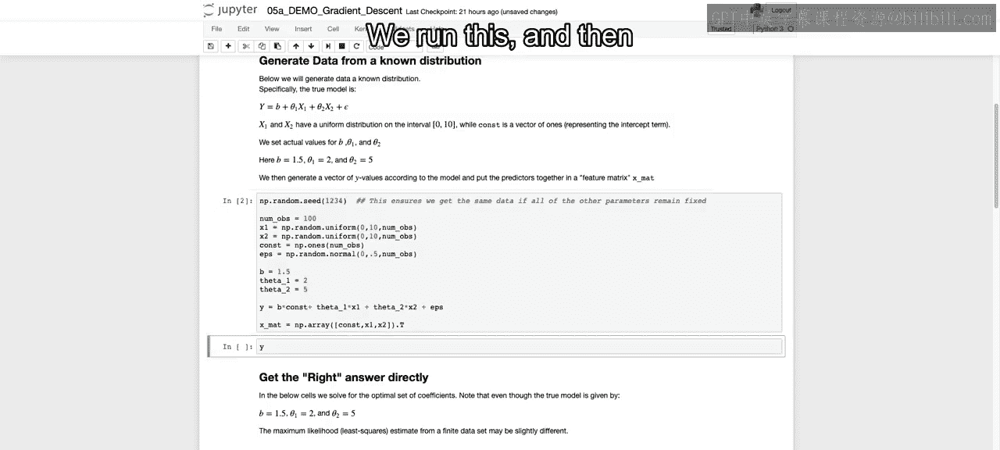

And then we can see what our actual y value is， and that should be some combination of if we look at this X met。

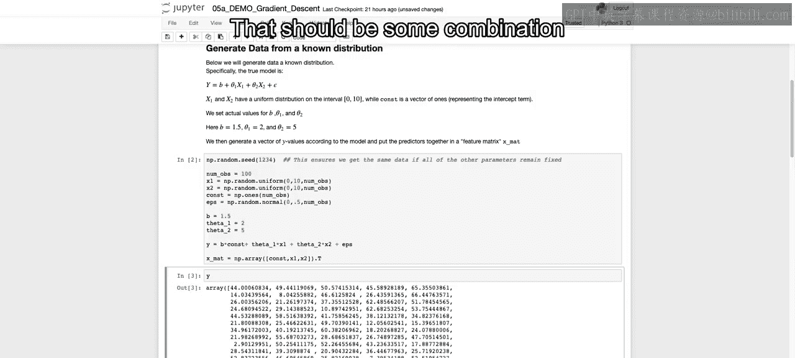

We should have。Something along the lines of two times this value and five times this value plus 1。

5 since 1。5 will just be multiplied by one， and we'll have that for each x1 and x2。

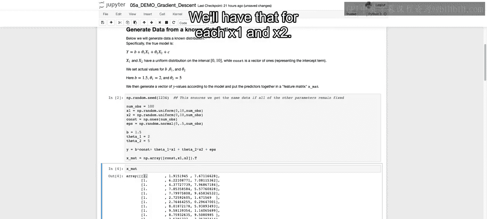

So in order to get the right answer directly， we can look at the closed form version of this model rather than using something like gradientding descent。

With linear regression， we can actually use matrix algebra to get the exact solution。

That will find the maximum likelihood or the least scores estimate for our data set。

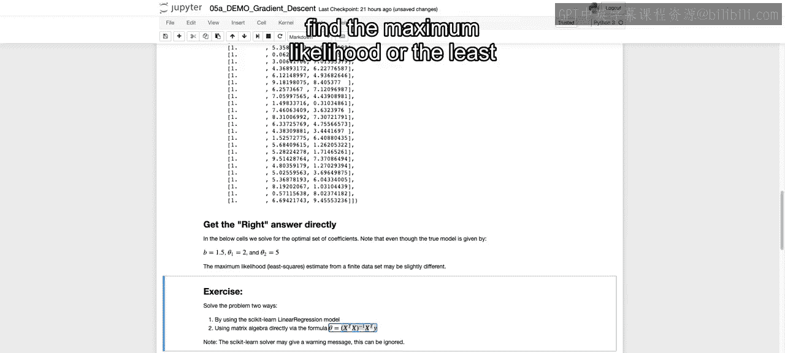

And that's just going to be this matrix algebra here。 It's not too important。

 All that's important here is to know that there's a close form solution and that for linear algebra。

 you do not necessarily have to use gradient descent to find each one of your parameters。

Now the reason why we introduce gradient descent。Is because when we're doing deep learning or even for many of our other models。

 we can't find this closed form solution and we'll need to use gradient descent to move towards that optimal value as we discussed in lecture。

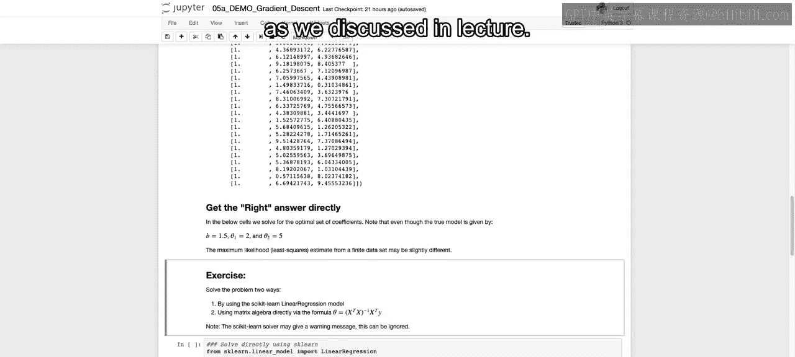

So here we're going to use SK Learn's linear Russian model。

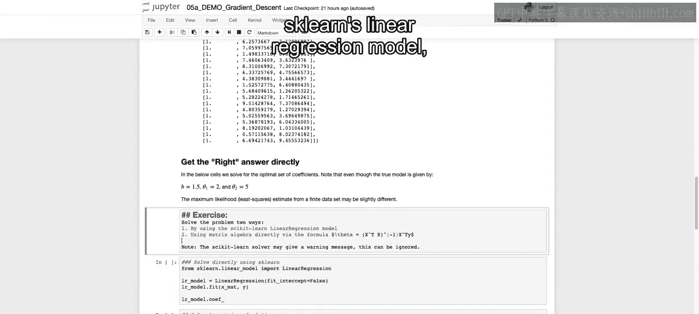

As well as also using the actual matrix algebra that we have defined here。

 which we can just pull out from Numpy。

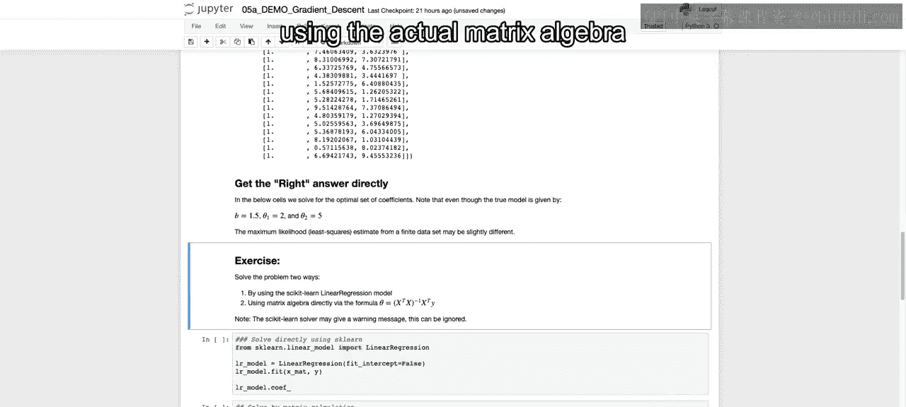

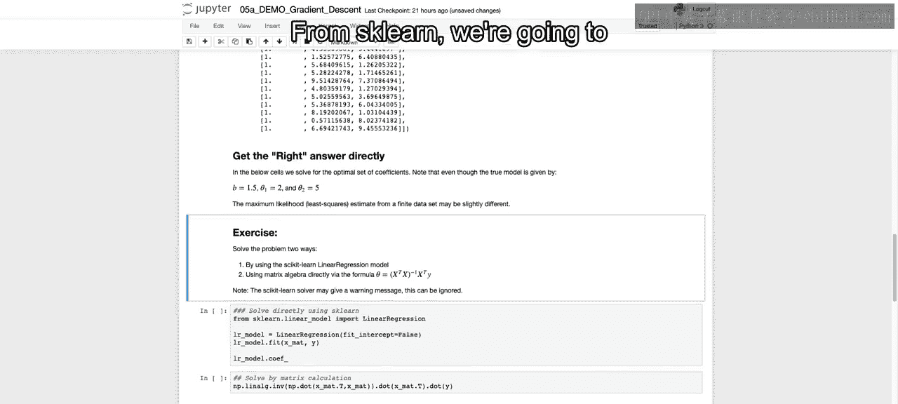

So from S K learn， we're going to import our linear regression model。

We're going to call linear regression we don't want to fit the intercept since the intercept's already included in our feature values in our Xmat array that we defined earlier。

 so we set fit intercept equal to false。

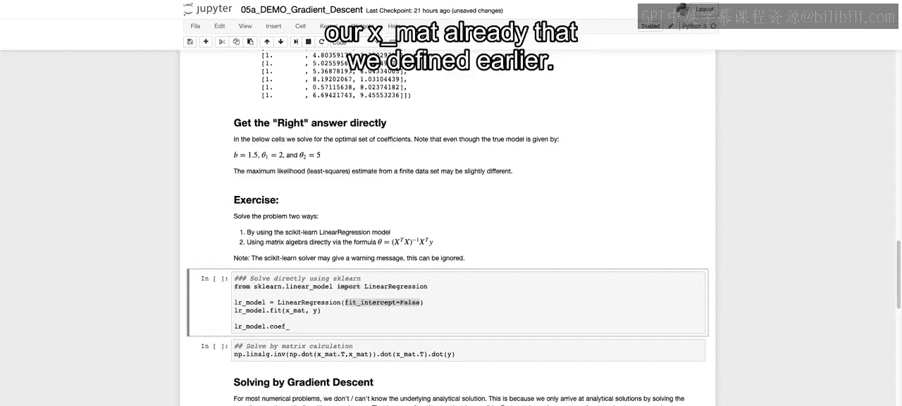

And then we can fit our x met and our Y and then see what our different coefficients that it comes up with are。

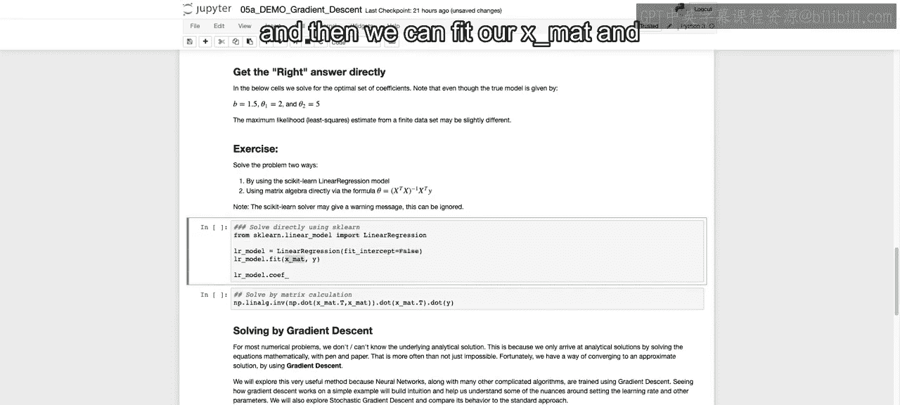

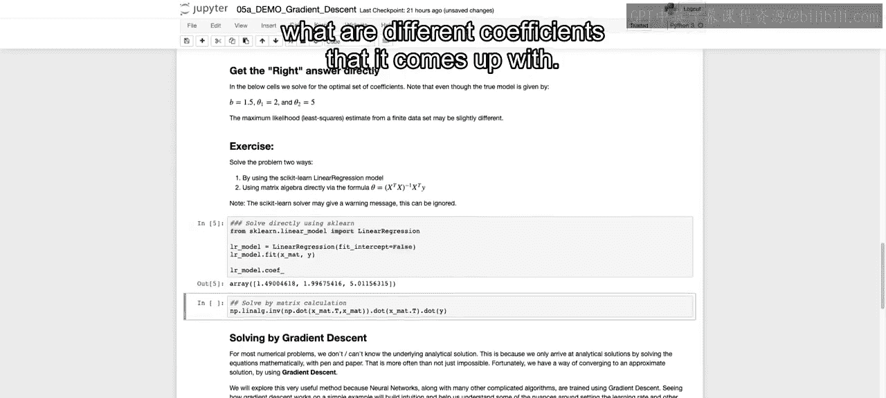

And we can see that it's very close to the values that we wanted for B of 1。5。

 theta 1 of 2 and theta 2 of5。

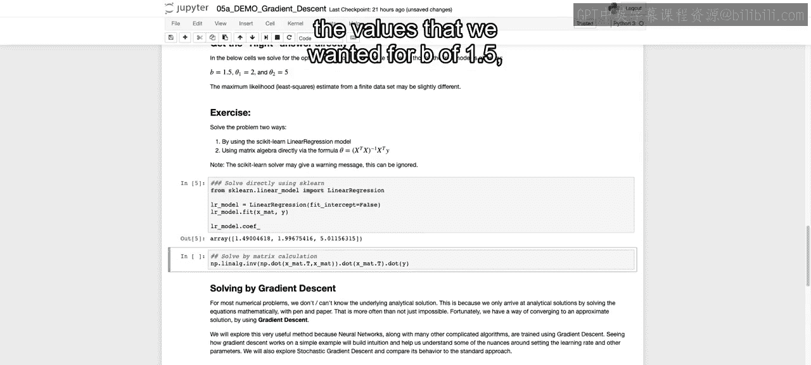

No。S K learn， the linear Russian model， will be using this closed form matrix algebra in order to solve for it。

 So we should get the same solution When we call out this equation， just using nuy。

 So that's just going to be the inverse of the dot product of the transpose and the value itself。

And then the dot product of that with x transpose， and then the dot product of that with y。

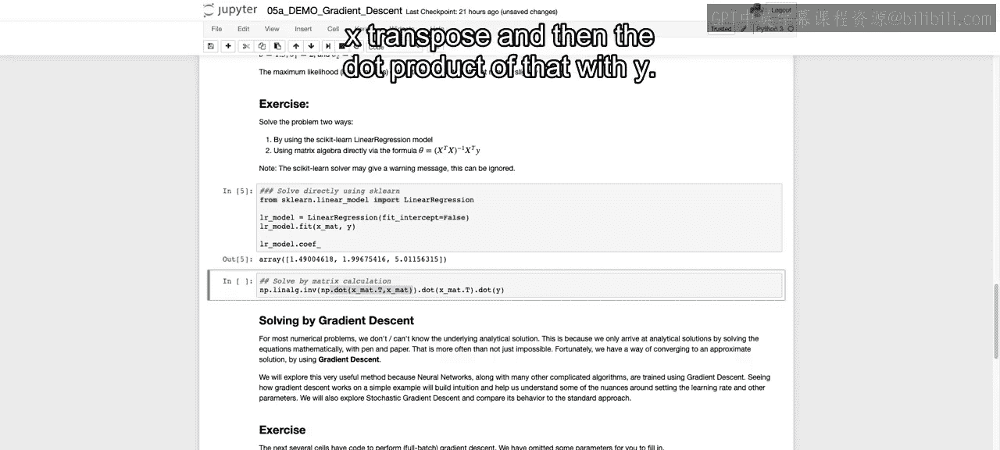

And then when we look at the solution that that comes up with again。

 it's exactly the same as what we just saw with linear regression from S K learn。

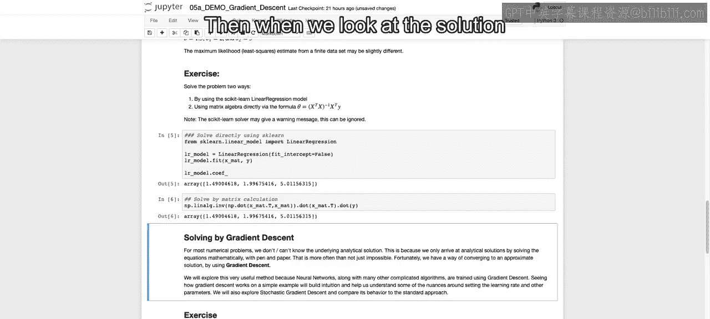

Now， that closes out this section of just getting an intro of the data that we're working with in the next section in the next video。

 we're going to discuss actually solving this problem using grade E descent。

 as well as how to visualize that process。 All right， I'll see you there。😊。

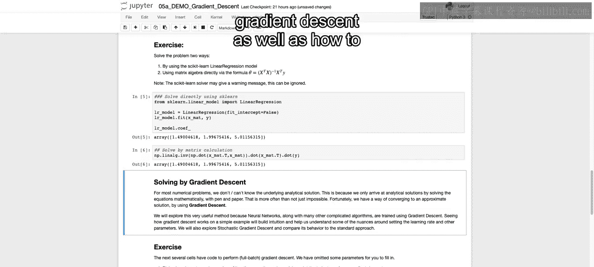

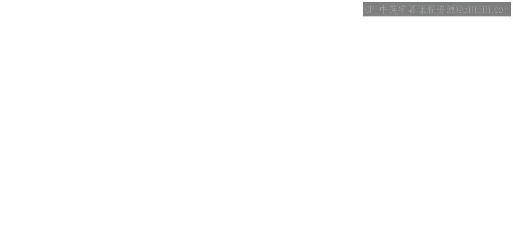