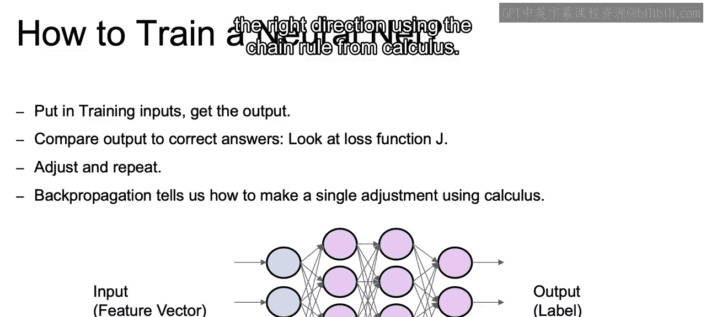
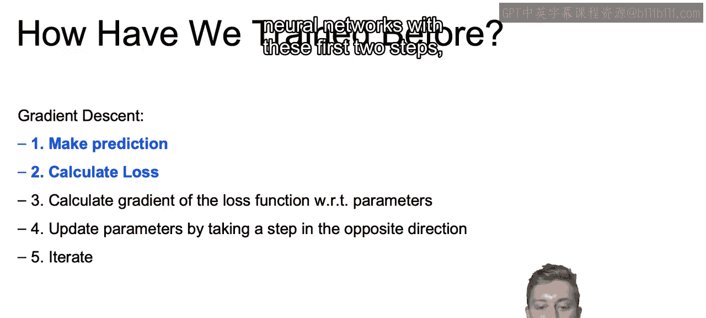
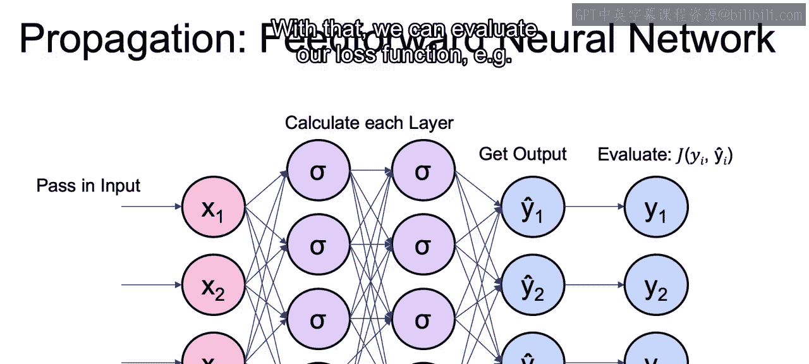
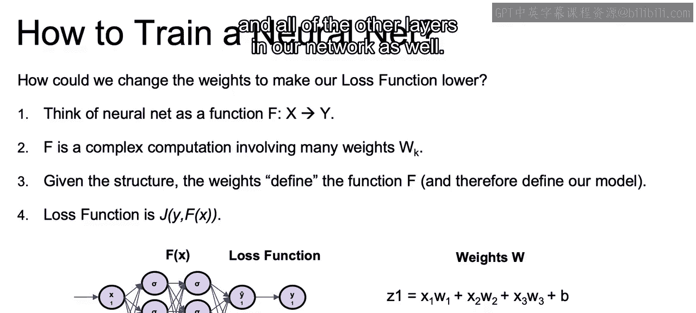
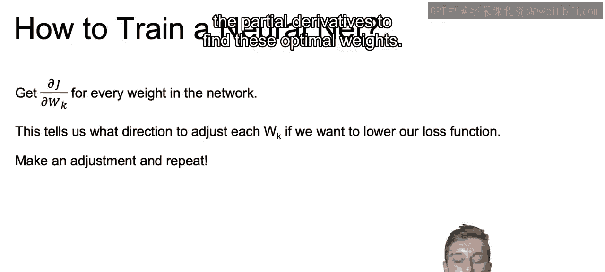

# 055：IBM《机器学习（无监督学习、深度学习和强化学习、毕业项目）｜machine learning》中英字幕 p55 16_如何训练神经网络.zh_en -BV1eu4m1F7oz_p55-

In this section we're going to go over the basics of back propagation。

 and that's going to be the magic that ultimately makes training these complex neural networks actually possible。

So what's the process of actually training our neural net？

We saw before that we start with some initial guests。

We then saw as well how to get a prediction by pushing that initial input through the feed forwardward network。

The next step is to compare our prediction to the actual value and calculate that loss function J。

 which measures our error。Once we see that air， we can adjust our weights accordingly and repeat the process。

So how do we know exactly how to adjust each one of our weights？

Back propagation is ultimately going to be that key framework that tells us how to make a single adjustment to our weights in the right direction。

 using the chain rule from calculus。

So how do we train our model before using gradient tos set？

We saw this event during the Gring Descent notebook。We made a prediction。

 given our initialized parameters。We then calculated the loss function for that particular prediction。

 given the actual values we were trying to predict。

We then calculated the gradient of that loss function with respect to our parameters。

 recall that this will be the direction of the steepest increase。

By subtracting that gradient value multiplied by some learning rate。

 we were able to move our parameters in the direction that will minimize our loss function。

And we iterate over and over with the number of iterations and steps predetermined by our model。

 And ultimately， our goal is to reach the optimal values that minimize our loss function。

So let's start off our discussion of this process for neural networks with these first two steps。

 making a prediction and calculating the loss。

So first we pass in our input values。We have initialized values for each of the weights。

 and with that， we calculate the different values at each layer。

AndThen we ultimately get our predicted output values for that given input and the given weights。

 And with that， we get to evaluate our loss function， for example。

 our squared error or our logistic loss。

So how can we ultimately change our weights to continue to lower that loss function at each iteration？

Let's think of the neural network as a single function F that takes as input X and output some value y。

The key to the complex computation that makes up this function F all comes down to the different weights represented as the arrows。

 the different arrows in our picture below。And given the structure of our neural networks。

 where the inputs are defined by our data sets and our activations will be predetermined when we create our model。

 the parameters that we are trying to learn are going to be those weights。

 and ultimately those weights will define that function F。And ultimately。

 our loss function will be a function of the true value Y and this function F with the input of X。

And if we focus in on just one layer， we can see how many different weights actually need to be calculated。

 So to get the Z value for just a single node in that first layer。

We'll need to learn the Ws for each input， as well as value for B for each input。And then again。

 another four parameters for the second node of that layer。

And through for every node within that layer。And then we need to also do this for every node in all of the other layers in our network as well。

Now our goal then， when we find the gradients is to find the partial derivative of each weight in respect to J。

 in other words， how much does a small change in the parameter affect our loss function J？Now。

 given the way that the gradient is calculated， this will tell us what direction to a each weight WK to lower our loss function。

And once we're able to do this， we can then just adjust and repeat。

So that closes out this first video， and in the next video we'll officially introduce the concept of back propagation and how it ties with its idea of using the partial derivatives to find these optimal weights。

