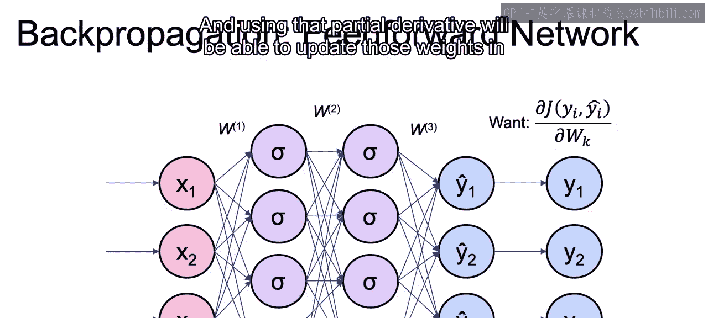
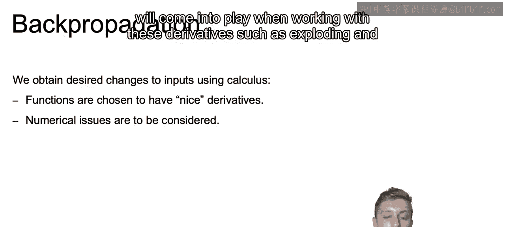
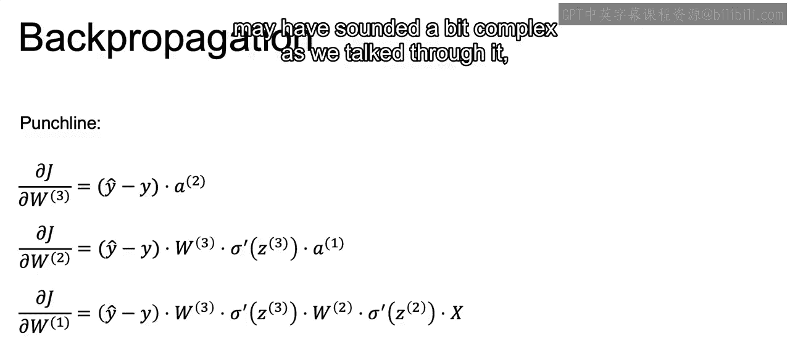
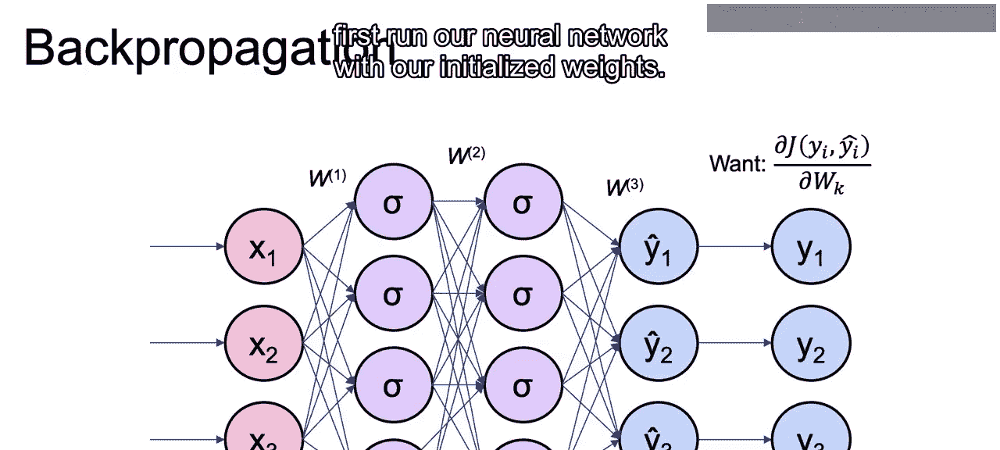
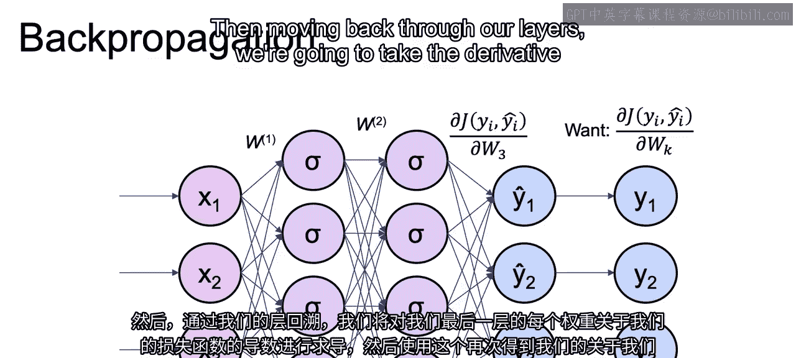
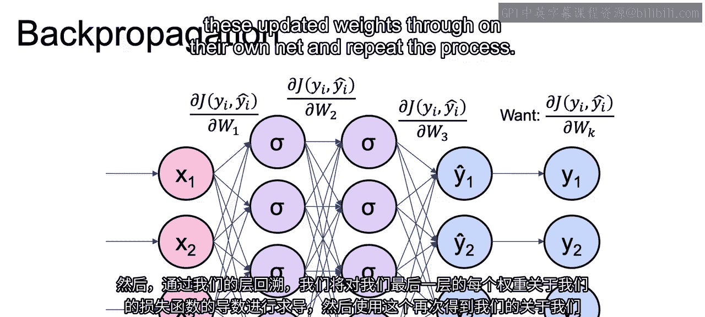
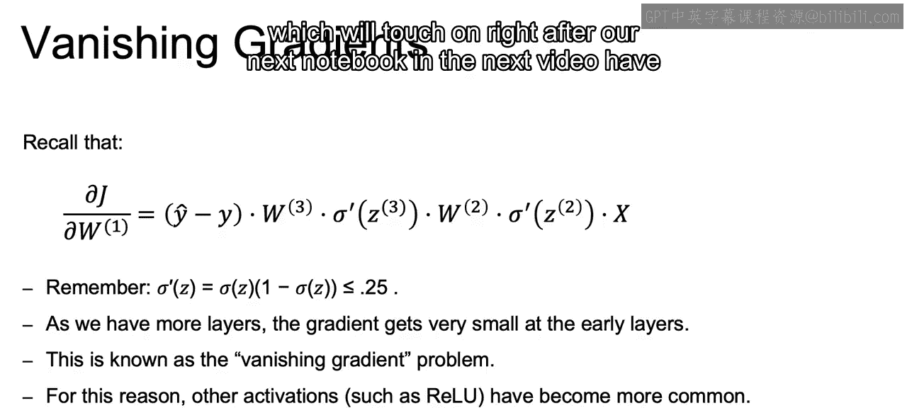
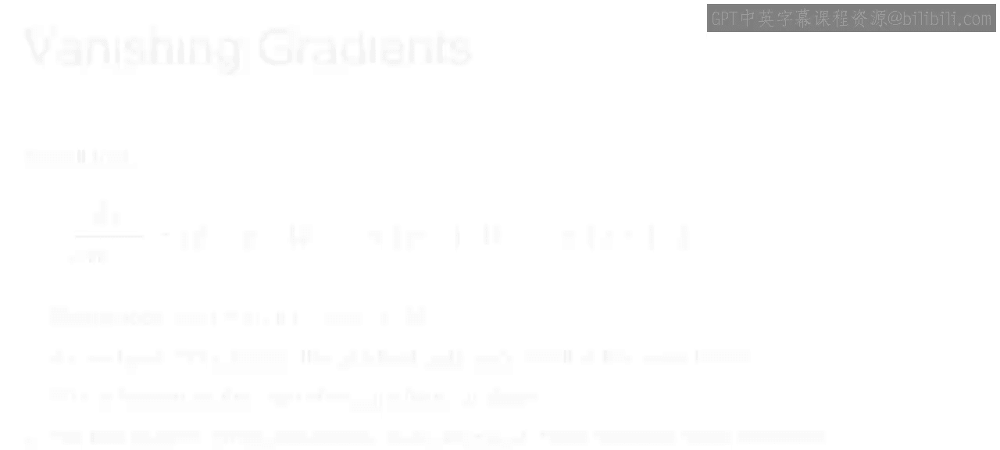

# 056：IBM《机器学习（无监督学习、深度学习和强化学习、毕业项目）｜machine learning》中英字幕 p56 17_反向传播.zh_en -BV1eu4m1F7oz_p56-

Now， getting into back propagation， what we're ultimately going to once。

 if you recall with the gradients。Is going to be that partial derivative in regards to each one of our weights and using that partial derivative。

 we'll be able to update those weights in the correct direction moving forward。

Now this idea of being able to use calculus to update our parameters is going to play an important role in how our neural network models are actually constructed。

Our functions used to calculate our y， as well as our loss function。

 are going to be chosen so that they have nice derivatives。

 As we saw earlier when we touched on the derivative of the sigmoid function。

And we'll ultimately need to also be aware of some numerical issues that will come into play when working with these derivatives。

 such as exploding and vanishing ingredientss， which we'll touch on later on。

Now with that in mind， we're going to think of the weights layer by layer。

 and nowre going to dive a bit into the calculations used when actually conducting back propagation。

So the values for the weights for that final layer in our neural network。

Will be updated using that partial derivative in regard to the weights of that final layer。

And that's going to be calculated by taking the dot product of our error turn。

 y hat minus y and the output from the prior layer that fed into our final layer。And then from there。

 in order to calculate the weights for the second layer， the layer before the final layer。

We take what we learned from that final layer and take the dot product of W of that final layer。

Multipliied by the derivative of the activation of Z。From that final layer again。 So this is， again。

 working with that final layer。 And with that， the dot product of the prior layer。

 And that's our a1 over here。And finally， we add on the further steps needed and take the dot product with X。

 our initial input。In order to get the derivative in respects to our initial layer。

And notice how these will be affected by our actual error term。

 so the larger or smaller errors will affect the size of each one of our gradients。

Also note that if we use the sigmoid activation function。

 that the derivative is the simple sigmoid of z times 1 minus the sigmoid of z。

And we're going to touch on this later on when we talk about the vanish ingredients。

And we will be using this in our notebook， and although it looks a bit complex and may have sounded a bit complex as we talk through it。

 we'll see in the notebook that they're actually quite easy to compute。

So the idea of back propagation is that we'll first run our neural network with our initialized weights。

Then moving back through our layers， we're going to take the derivative of each of our weights in our final layer with respect to our lost function。

Then use that to again， get our partial derivative in respect to our layer two of our weights。

And then our layer 1 weights。 Finally， and we'll use these to update our initialized values。

 and then again， feed these updated weights through our neural net and repeat the process。

Now I want to quickly touch on this concept of bench gradients that I discussed earlier。

Recall that this was the derivative of what we see here that we get for updating our three layer feed for our neural network。

What I want to highlight here is the fact that we are multiplying the derivative of the activation function of Rz so derivative of that activation function of Rz from all the other layers later in the network。

Now， with that， we want to re emphasizeha that our sigmoid function for our sigmoid function。

 the maximum value the derivative can take。Is going to be 0。25。 And you can run the math。

 But this is due to the fact that the sigmoid can only take on values between 0 and 1。

 And thus the max value it can take on would be 0。5 times 1-0。5。

 when we talk about the derivative here。 And that would equal our 0。25。

 which we're stating is the maximum。Now， if we think about this。

 the fact that point to5 is the absolute maximum。If we continue to make our network deeper and deeper and we continue to multiply by these small values。

 the gradient at these earlier layers， such as the W1 that we see here， will eventually get very。

 very small。😊，And this problem of the gradient in eventually getting incredibly small as we create these deeper neural networks。

Is what we call the vanish ingredient gradient problem。And for this reason。

Other activations such as Relo and others， which we'll touch on right after our next notebook in the next video。

 have become more and more common。

