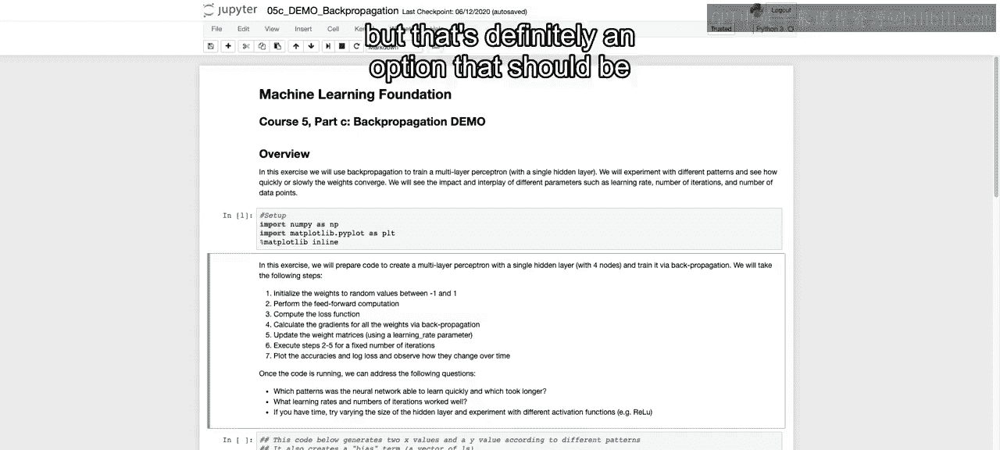
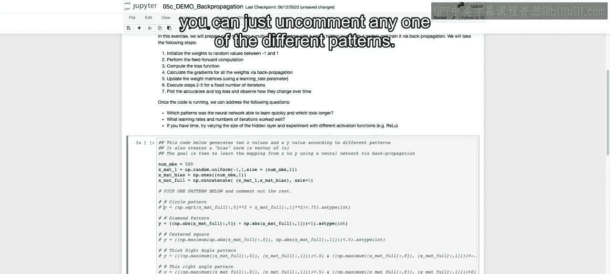
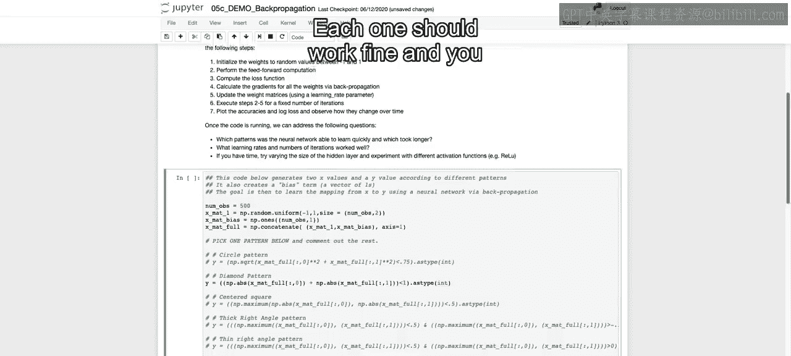
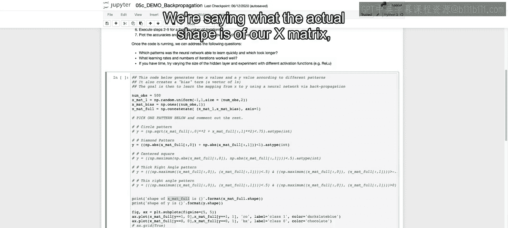
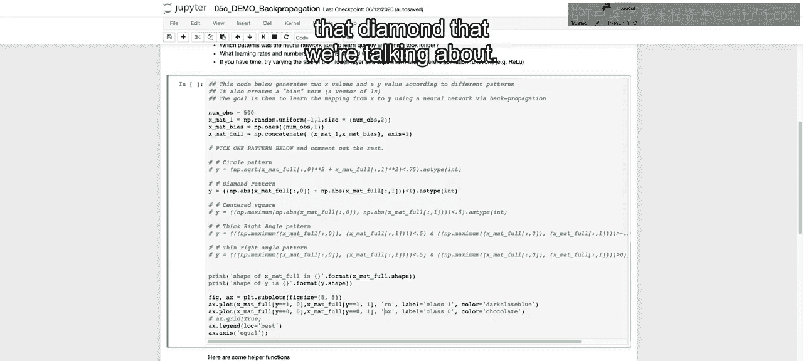
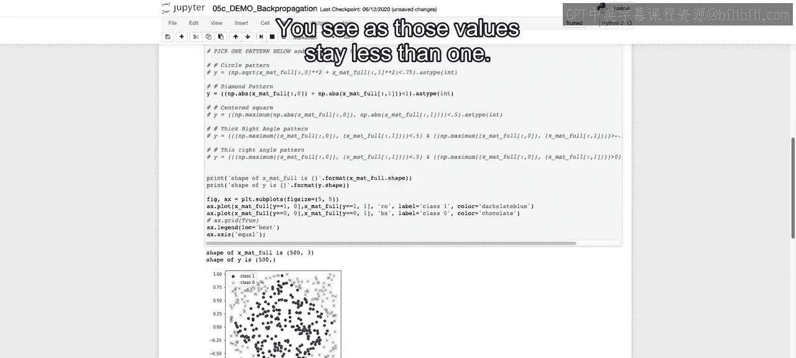
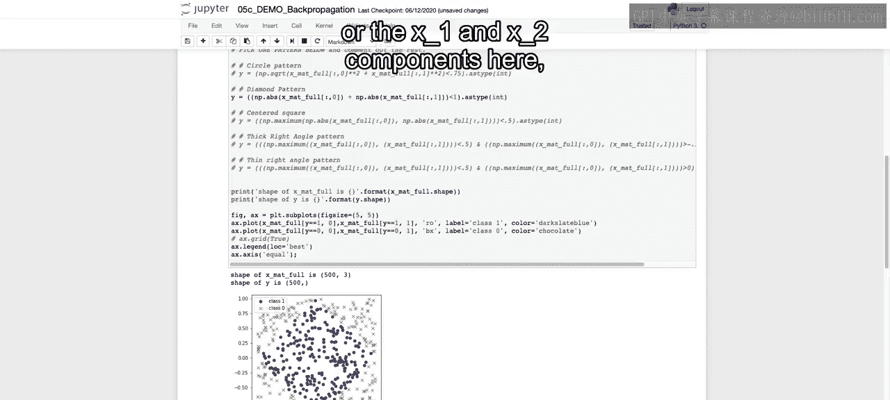
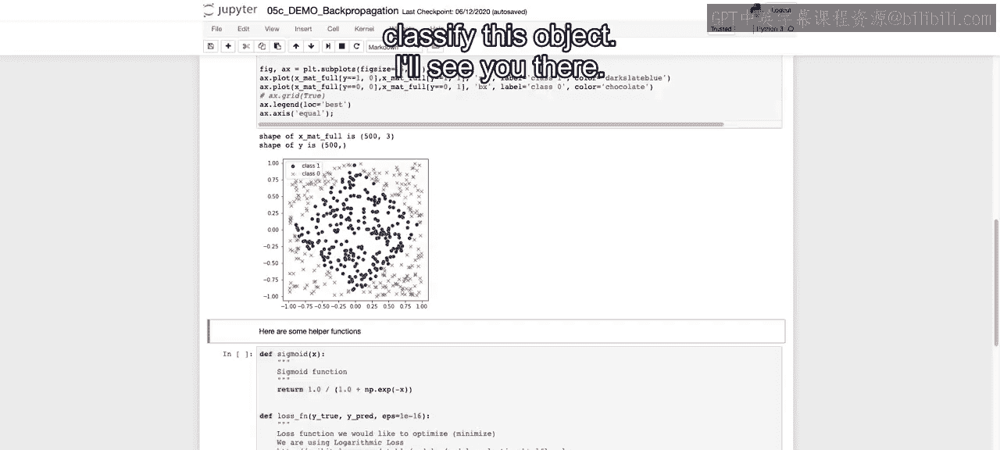

# 057：IBM《机器学习（无监督学习、深度学习和强化学习、毕业项目）｜machine learning》中英字幕 p57 18_反向传播笔记本（选修部分）第1部分.zh_en -BV1eu4m1F7oz_p57-

Welcome to our demo here on back propagation In this exercise。

 we're going to use back propagation to train a multi layer perceptron or our feed forward neural network that we've gone over in lecture。

Using just a single hidden layer。You'll have an opportunity on your own to play around with different patterns。

 we're just going to focus on one pattern here， doing a classification problem and you'll see that in just a bit and see how quickly or slowly the different weights converge。

And with that， we'll also see the impact and interplay of different parameters such as the learning rate。

 the number of iterations， and the number of data points that we're working with。So first thing。

 we import our library， and then just to give you a overview of what we're going to go over in this lesson in this exercise。

 we're going to prepare code。To create a multi layer perception with just a single hidden layer。

 And in that hidden layer， there'll be four notes。And train it using that back propagation。

And if you notice in the libraries that we just imported。

We're not going to be using the traditional deep learning libraries just yet。

 We're going to show you just using Numpy how to go through these steps of the feed forward and then the back propagation in order to learn the optimal weights。

So in order to do so， we're going to initialize the weights to some random values between negative and one and one。

 as we discussed again in lecture。We're then going to perform that feed forward computation through our neural net。

We'll compute that loss function at the end， and using that loss function will calculate the gradients for all of our weights。

 using back propagation， telling us in which direction to update the different weight matrices。

 using also our learning rate parameter， which we'll define。

 and then we'll execute those steps 2 through 5 for a fixed number of iterations that we'll define as well。

 And with that we'll plot the different accuracies and the log loss and observe how they change over time。

 And we'll be using the log loss here since we'll be doing a classification problem。😊。

And then once the code is running， you can address the following questions。

 which patterns was the neural network able to learn quickly and which ones took longer again。

 you can go through this on your own what learning rates and number of iterations worked well。

 and then if you have time， you can try vary the size of the he layer and experiment with different activation functions。

 including relo that we have here， which we'll discuss when we get out of this notebook。

 and that might take a bit more to play around， but that's definitely an option that should be available as you get more and more familiar with the code。

So with that， I'd like to walk through the code that we have here。

 we're going to start off with a certain number of observations。

 we're going to create our initial pattern here， So we're saying there's going to be 500 different observations in our data set。

 so equivalent of 500 rows。And then our X matrix。Is just going to be random values between negative one and one。

And we're going to have two different variables for our x matrix。

 so these are the two variables for our input values。And with that。

 we're also going to predeefine that bias term， which is just going to be a bunch of ones。

 We can catnate those two together。 And that's all the values that we need to learn weights for。

 So those are the actual values。 And for each one of those actual values。

 we will learn the optimal weights， given the two X values， as well as that bias term。

So if you'd like to do a different pattern， you can just uncomment any one of the different patterns we've done the diamond here。

Each one should work fine and you can look through each one of them。

 and we're going to print out the actual shape to see what this looks like。

But if you think about the diamond pattern that we are outputting， we have。

Values between negative one and one。And in our X map full。 So we're going to say we want。

The absolute value of each one of these。And if it's less than one。

Then we will market a certain value here where you would mark that as。True。

 and then anything greater than one would be false or 0 and1 once we make that as type integer。

 and that will allow us to classify whether or not it's in the diamond or not。

So if you think about the absolute value being greater than one when they're added together for random values between negative1 and one。

 that means that。Both of our first two x values have to add up to one the absolute values of them。

 and if it's greater than that， so if one values is 0。75 another one's negative 0。5。

 then that would be outside of the range because it's greater than one the absolute value of that sum。

 and we would be outside the circle and we'll see this in the graph in just a second。

So we're saying what the actual shape is。Of our x matrix， as well as our output y。

 which should just be one dimension。

XMap full should be 500 by3 since we're including the bias term。

And then we're just going to plot taking that XM full。We're going to plot these values。

Where are y value that we defined up here？Is equal to one？And we will mark those with O's in R。

 in red。And then for those that the y is equal to zero， so we're taking a different subset。

 we'll mark those with x so that we can see that diamond that we're talking about。

So you run this。And you can see our diamond here。

And you see as those values stay less than one。 So this is essentially。

 if you look at the bottom or the top corner， you see that or if any one of the corners。

 those are going to be the values of 1 and 0。 And then there should be approximately a straight line dividing between those that are less than one and those that are greater one。

 when you take the absolute value of each one of the x and Y components here。

 or the x1 and x2 components here。 and sum them together。

So we want to come up with this classification method using what we learned in regards to our neural networks。

 Clearly， it's not going to be a linear divider。 It's going to have to be a bit more complex than that。

 And in the next video， we'll walk through how we initiate each one of the functions that we need。

 as well as that feed forward and back propagation structure and start to learn the actual weights that we need in order to classify this object。

All right， I'll see you there。

