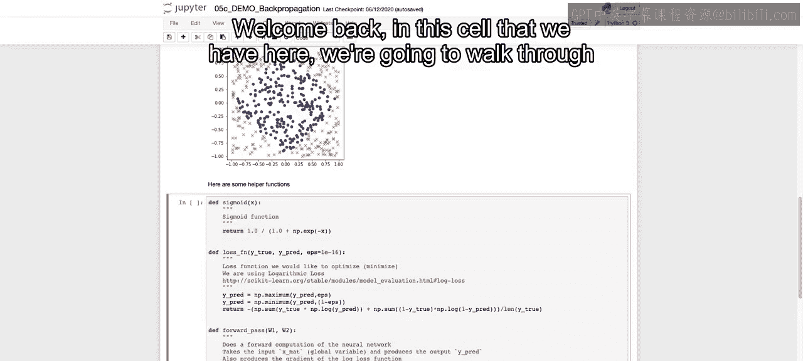
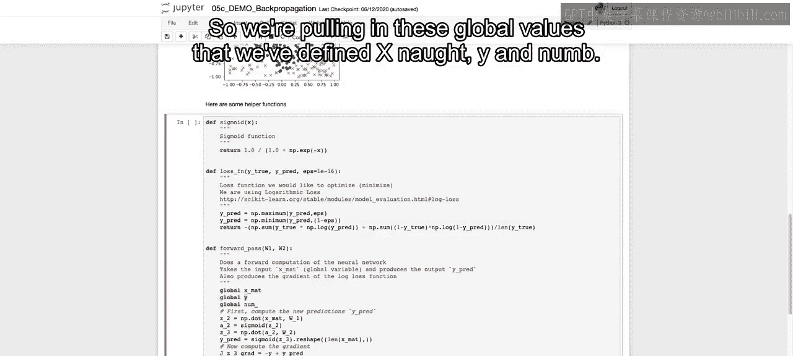
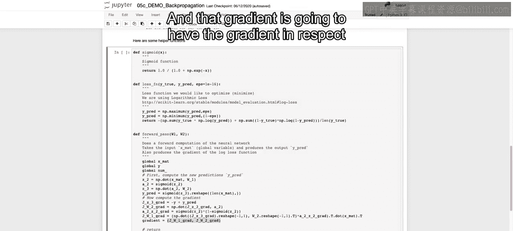
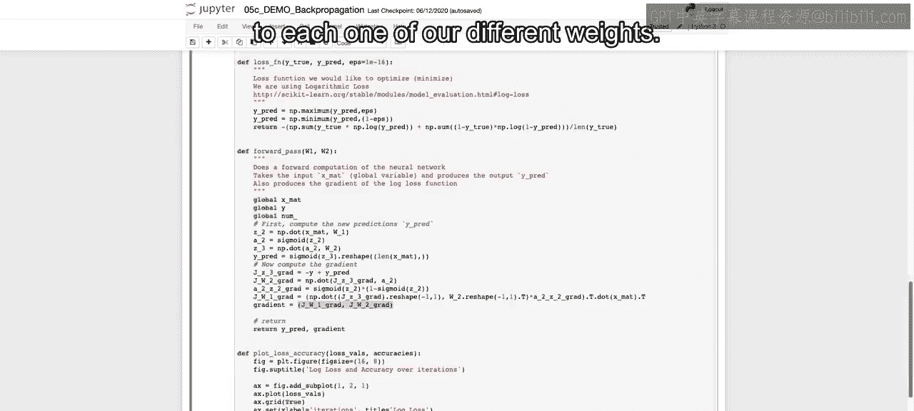
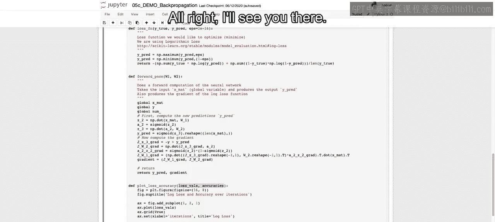

# 058：IBM《机器学习（无监督学习、深度学习和强化学习、毕业项目）｜machine learning》中英字幕 p58 19_反向传播笔记本（选修部分）第2部分.zh_en -BV1eu4m1F7oz_p58-

Welcome back。In this cell that we have here。We're going to walk through a bunch of the different functions that we're going to use throughout in order to make that feed forward neural net。

 as well as take those back propagation steps。So to start off， we define our sigmoid function。

 which you should recall from lecture， is just going to be one over1 plus e to the negative x。

Ex just being our input here， generally speaking， we'll be passing in that Z value in order to get R A。

 if you recall the symbols that we use throughout the lecture。

Then we're going to define our loss function。Passing in why true and why pre。

We also have this epsilon， which is going to be this very small value。

And the reason for that is just that we will tend to error out if we get exactly one or exactly zero for our prediction。

And as we see here， if our prediction， y pre is equal to 0， will take the maximum of that value。

And our epsilon， which is this incredibly small number。

 And we'll end up with that incredibly small number， rather than ending up with 0。

 And on the other ends， when we take the minimum between y pre and 1 minus that epsilon。

 If y pre was exactly 1， then 1 minus that epsilon will be 0。99， et cetera， something very。

 very close to 1， but not exactly 1。😊，Then once we have that。

We are going to compute the log loss function， which is just going to be the log of。Our prediction。

 the negative log of our prediction times y true。And if you think about why true。

 it's either going to be zero or one。So if this y true is equal to zero。

And you end up predicting zero。Then NP。 log of0 would be one， but this cancels out。

 so it'll be very low， the arrow will automatically cancel out and it won't count for that。

But if this value is 1， y true is 1， and you predict something very close to zero。

 then you'll end up with a higher value。And the same thing goes on the other end。

 if y choose is equal to one， then this will cancel out。But if it's equal to 0。

 then it will maximize this error because the log of 1 minus0 will be the log of1 and have that maximum value。

Now， when we。So that's our loss function， and that's going to be the log loss again because we're doing classification between0 and1。

We then want to define here our forward pass， and we're going to pass in our initialized weights W1 and W2。

 as well as our updated weights throughout， and we'll see how we do this in the next cell。With that。

 we're actually also going to be doing our back propagation steps here。

 so we're also going to be computing the gradients。

 or we're going to use the output of this to do our back propagation steps。

So we're pulling in these global values that we've defined Xmat， y and nu。

We're then going to compute the new predictions step by step here。

 So if we think about our feed forward neural net in order to get to Z2。

 that next step in our process， we just take the dot product of our matrix of our original inputs and W1。

 That'll give us Z 2。In order to get A2。We have to do our nonlinear transformation。

 which is going to be our sigmoid function on that Z2。 So first， we did the linear step。

 then that nonlinear step taking the sigmoid， and then Z3 is just going to be taking that output。

 and Z3 will ultimately be the last。Step， we set have to take the sigmoid before our prediction because we're only doing one hidden layer。

And we take the output from the prior layer， which was A2。And we take that with a dot product of W2。

And then our prediction is just going to be the sigmoid of that Z3。 and when we reshape it here。

 we're just making sure that it's only one dimension。Now to compute the gradient。

Given the loss function that we have defined。The gradient。Of Z， in respect to R。

 R loss function in respect to Z is just going to be negative y plus y pre。

Now this is in respect to Z before when we were looking at the loss function in the lecture。

 we were saying it in respect to that final output which would be A3。

 but here we're starting with Z3， we take that output of the gradient of J in respect to Z and we use that in order to calculate J in respect to W。

And that's just going to be。This J Z3， that prior gradient that we just calculated。

That and the dot products of A2。And then in order to calculate。

Here we're not calculating it in respect to Jabe or we're calculating the gradient。

Of A in respect to Z。And this just is going to be， if you recall what we do with that a value with the Z value in order to get a。

We are just going to see it's going to be the sigmoid of Z2 times 1 minus the sigmoid of Z2。

And that's just going to be again， that derivative of the sigmoid。

And then we're going to use everything that we've use。

That we've calculated so far in order to get the gradient in respect to W1。

Which is just going to be the dot product of that JZ3， which is what we defined up here。

We reshape it just to ensure it's in the right shape and that it's not a one dimensional array。

Take the dot product of that with W2 transpost specifically。And then we multiply it。

By this value that we have output over here。And then we take the dot product of the transpose of that。

With our original input in the transpose of that original input。

So we just go back through each one of the steps。Taking each one of the different gradients that we learned before。

 using back propagation to ultimately get the gradients。In respect to each one of our weights。

 W1 and W2。Which is going to be what we need in order to do our back propagation steps and continuously update each one of our parameters which are just going to be our W1 and W2。

And this function will return both our prediction， which we have defined up here。

As well as this gradient， which is going to be this tuple that we have here。

And that gradient is going to have the gradient in respect to each one of our different weights。

And then finally， we define this。Loss accuracy， this plot loss accuracy。

 which will just show us each one of the different loss values and the acuracies。

 and we create our initial figure。 We say what the title is going to be。

 and we're going to create a subplot。 So we're going to create two different plots， one for the loss。

 one for the accuracycuracies。 So ideally， the losses should be going down and the accuracy should be going up。

 And we're just going to call a dot plot。 So it's a very simple plot。

And then we're going to do that again for our acuracies。

So we have our loss values and our accuracies， and those are passed into the function。

So now we see all of the different functions that we have available to us。

And we're going to use those in the next video in order to do both our feed forward steps。

As well as our back propagation。 and then ultimately。

 once we do that and go through a number of iterations。

 see the output of the different accuracies and the different losses。All right， I'll see you there。

