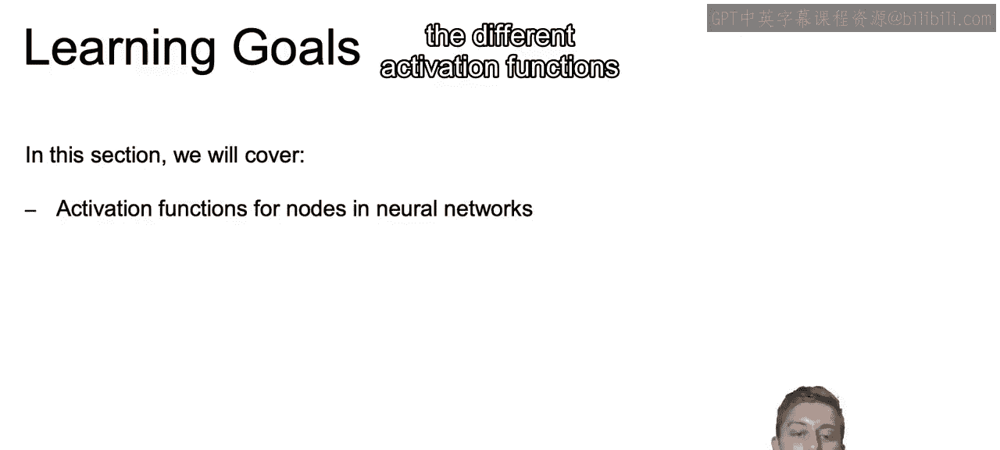
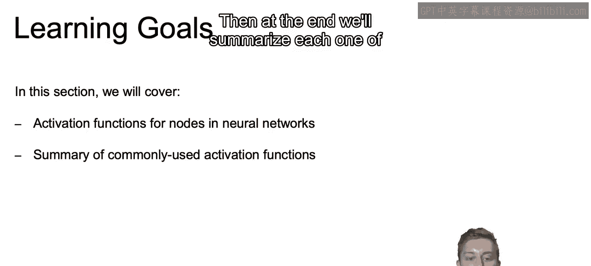
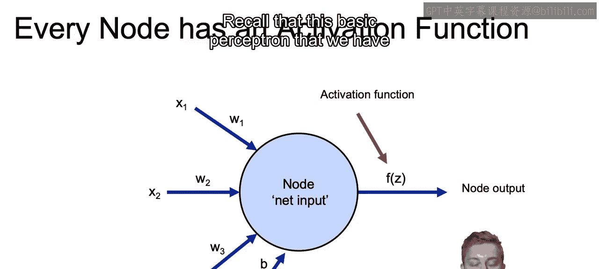
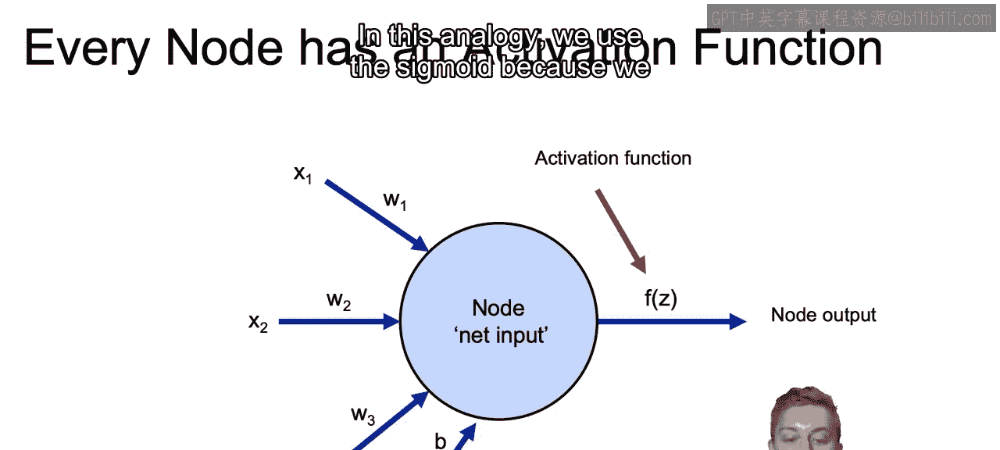
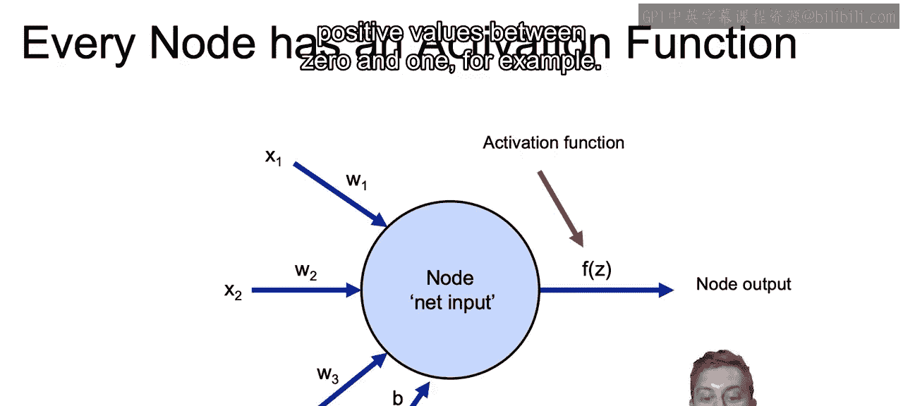
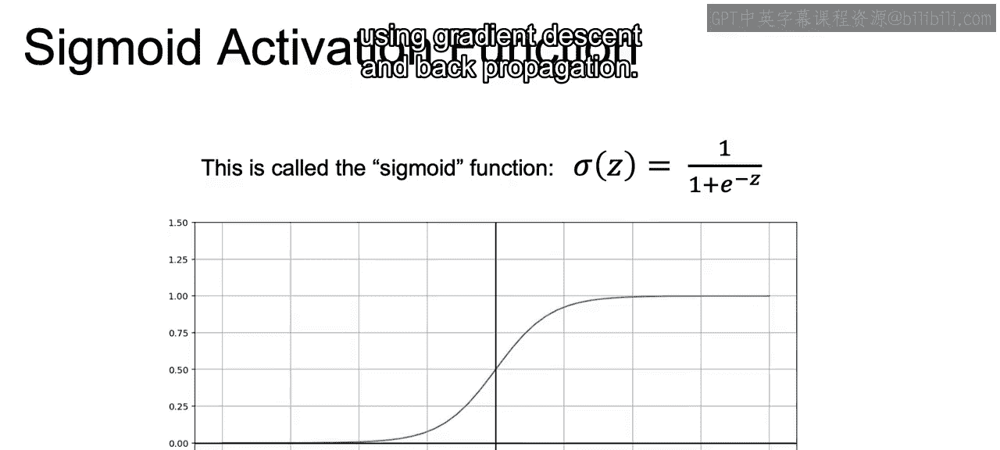

# 059：IBM《机器学习（无监督学习、深度学习和强化学习、毕业项目）｜machine learning》中英字幕 p59 20_sigmoid激活函数.zh_en -BV1eu4m1F7oz_p59-

Now let's introduce some other activation functions besides just working with the sigmoid function that we discussed earlier。

So let's go over the learning goals for this section。

In this section， we're going to cover the different activation functions for our nodes within our neural network。

And then at the end， we'll summarize each one of the commonly used activation functions that we discuss。

So recall that this basic perceptron that we have here is the simplest building block for our neural network。

 The classic perceptron model typically used a step activation function。

 so0 for values less than 0 and one for values above0 as we get that input that input z into our activation function。

Now the activation function allows more flexibility than just this01 step function as it's called。

And without this activation function in general。The model would be a linear model。

 so the activation improves our ability to determine nonlinear outcomes。In the next slides。

 we're going to discuss various activation functions and a great analogy building off of our basic statistical knowledge and what we have discussed thus far is that of thinking of logistic regression as linear regression with a sigmoid activation function。

 So recall that we have that linear regression and that linear combination of those past weights。

 and then we pass that through through a sigmoid activation function。

 and that's the same as working with our logistic regression。😊。

And in this analogy， we use the sigmoid because we want outputs between 0 and one。

 and we want a nonlinear model， and with deep learning models。

 we sometimes want more flexibility over which types of outputs we can consider。

 and we may not only want to emphasize positive values between 0 and 1， for example。😊。

So we're going to start our discussion of activation functions with that sigmoid function。

And this is the only activation function that we've discussed thus far。

Some advantages of this activation function are that it produces that simple derivative that we saw earlier。

And that it keeps the values between 0 and1 and technically never gets to exactly zero or1 as it goes to infinity or negative infinity gets closer and closer。

 but not exactly  zero on1。The disadvantage and the disadvantage that we discussed earlier and something that we can even see graphically here is that the derivative content to be a very low value。

 Now， what do I mean by the fact that we can see this graphically。

The derivative is meant to show us how much y changes with a tiny change in X。

And if we look at very small or very large numbers。

 we can see that the y value barely changes at all for x values between 5 to 10 or between negative 5 to negative 10。

 we can see that the y values are essentially flat。

 And this will get even worse for x values beyond 10 or beyond negative 10。

 So the derivatives are going to be very， very small。

So although the sigmoid function is easily interpretable and keeps values between0 and 1。

 it's very prone to this Spanish and gradient problem and thus will often lead to difficulty when trying to optimize using gradient descent and back propagation。

