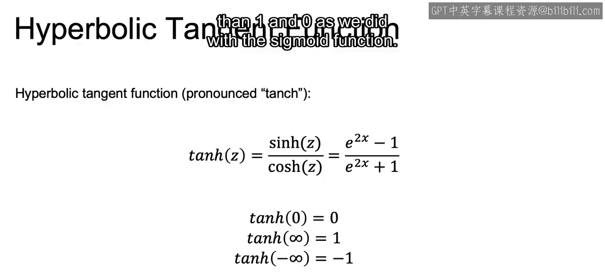
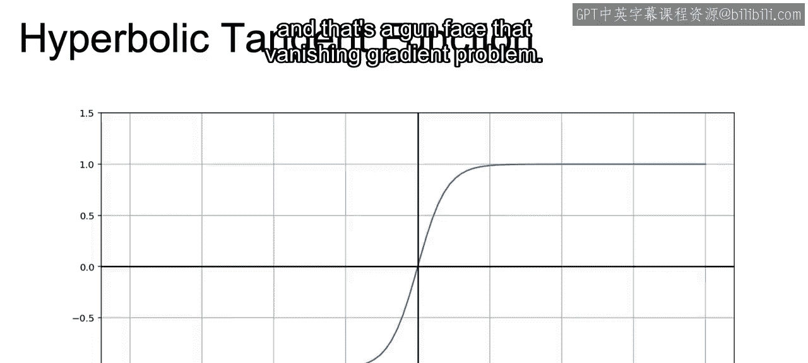
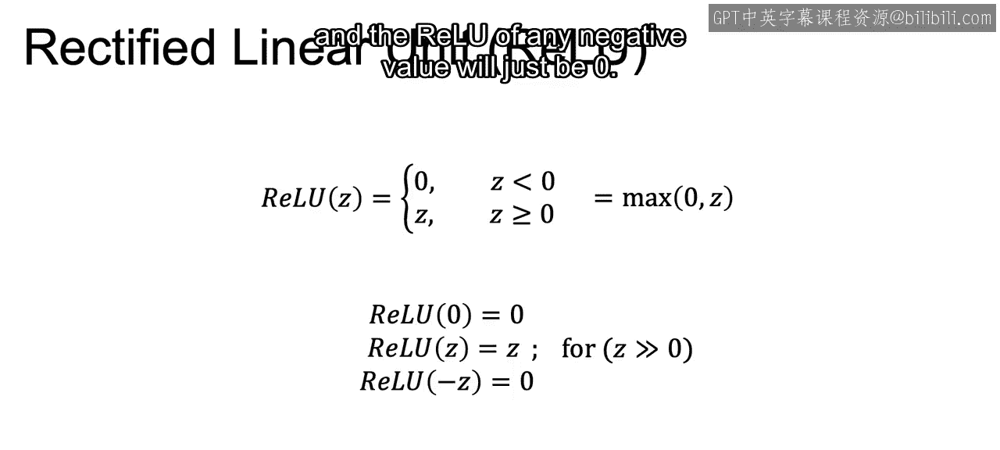
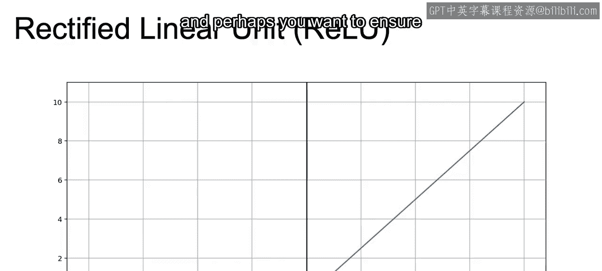
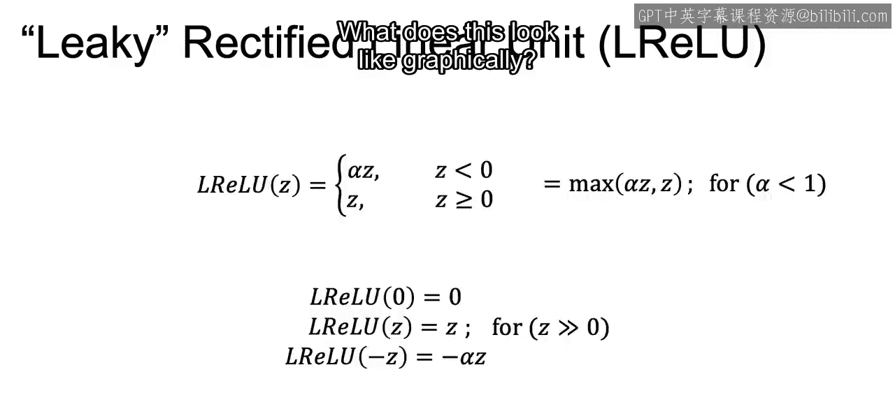
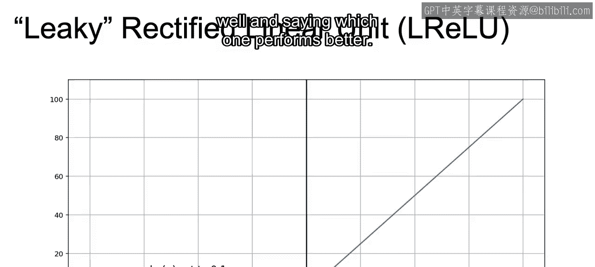
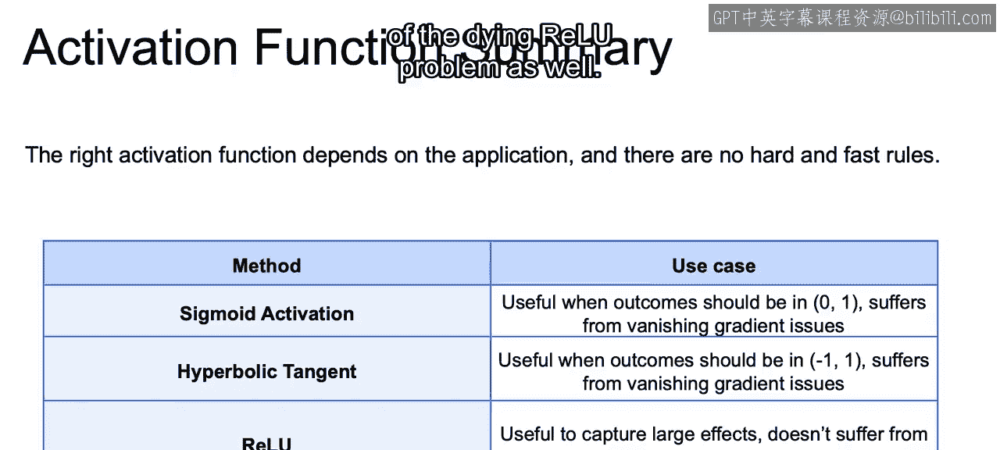
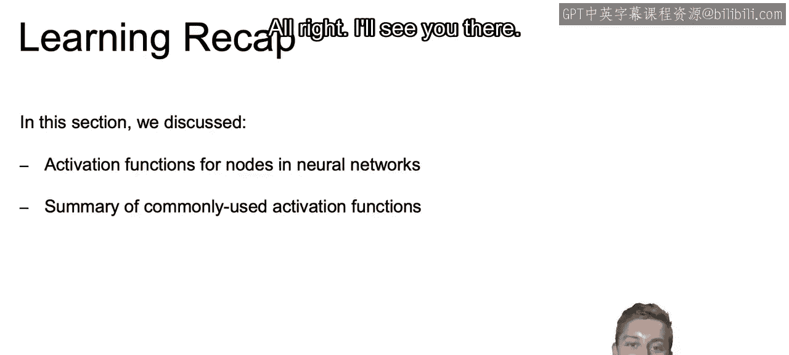

# 060：IBM《机器学习（无监督学习、深度学习和强化学习、毕业项目）｜machine learning》中英字幕 p60 21_其他常用的激活函数.zh_en -BV1eu4m1F7oz_p60-

Next we have the hyperbolic tangent function， so again we're going through our different activation functions。

Which is the equation that we have here， which is 10 H of z。

 which is equal to sine H of z over cosine H of z， which is just equal to e to the 2 x minus1 over e to the 2 x plus 1。

Now， what's important here is not the equation itself。But rather。

 some of the properties of this function。In a lot of ways it's going to be very similar to the sigmoid function that we just discussed。

 just a bit stretched out。So rather than with the sigmoid， where the sigmoid of 0 is equal to 0。5。

 the tangch of 0 is going to be equal to 0。And as we approach infinity and negative infinity。

 we approach one and negative one rather than。1 and0 as we did with the s white function。

So what does this look like？When we look at the graph of this function and we think about it in relation to the sigmoid function。

 we see that for values between negative 2 and 2。 we have a sharper slope。

 And thus the derivative is going to be a bit larger。I。e。

 a small change in X equals a larger chains than y。

 and gradient descent may be optimized or work a bit faster when working with this activation function。

And it's powerful if for any reason you want your values to be between negative one and one rather than between zero and 1。

But as we discussed with the sigmoid function。 and as we can see here on the graph。

 we still have that same problem of very small derivatives for higher absolute values。

 And thus a gun faced that vanishing gradient problem。

So in order to answer this vanish ingredient problem。

We have introduced the rectified linear unit function， or relo。

And this activation function is actually quite simple。For any z value less than0。

 we just return the value0， and for any z value greater than 0， we just return that actual value z。

So we're essentially taking the maximum value between the output Z and zero。

So really of zero is again going to be zero。Welo for any value of z greater than  zero。

Is going to be equal to Z？And the relieu of any negative value will just be 0。

 So what does this look like graphically。

We can see it here in thinking through this graph。 We can see that it is still nonlinear。

As we see this transition between less than0 and greater than zero， introducing that nonlinearity。

And as we can see on the right side of zero， we no longer have that tiny derivative causing us problems。

Then on the left side， rather than those tiny changes， there is zero change。

So these values will actually zero out particular nodes。Now。

 this zeroing out will allow for us to ignore nodes that may not be providing much extra information。

And thus may be more efficient than the sigmoid or hyperbolic functions that always maintain at least some information at each node。

Now， on the other hand。There will be no learning happening at each of those nodes that are being zeroed out。

 and perhaps you want to ensure some type of learning at all nodes。

With that in mind， we have the leaky rectified linear unit or Eery Lo。

And the way that this works is for positive values， the function remains the same。

So it's just going to be Z as your output。But for negative values， rather than simply zeroing out Z。

For z values less than 0， we multiply that negative value， that value z by some small number。

And that is the new output rather than just having zero。

So now our function is going to be the maximum value between z as we had before。

 and then rather than0， some alpha less than1 multiplied by z。

And recall that this is going to be smaller than Z itself if we're working with negative values right so any negative number multiplied by a value less than one。

Will be larger than that original negative number。So our outputs for L Relu are going to be。

Z for z equals zero。Z for any value， z greater than 0。And then for values less than0。

 for z values less than0， it will be alpha multiplied by that z。

So what does this look like graphically？

Now we can see width the graph for this function。We no longer have that zero value at any of our nodes。

This will solve that problem of nodes zeroing out throughout our network while keeping the advantage of a steady learning rate without that vanishing gradient problem。

Now， I would like to note here， just because it solves a potential problem that regular relo may have。

 This doesn't mean that lakey relos are necessarily better every single time。

They are better a lot of the time， but they aren't necessarily better all the time。

 Sometimes you may want a more efficient network that allows for zeroing out of some nodes。

And the best practice would be to try both starting with Relu or leaky Relu and then trying the other as well and seeing which one performeds better。

So to summarize。The sigmoid function is going to be powerful when we want outputs between 0 and 1。

 but will again suffer from that vanishished ingredient gradient problem。

 The hyperbolic tangent is useful if you want outputs between negative one and  one。

And perhaps a bit of a steeper slope， but also suffers from that banished ingredient gradient problem。

Rlo will solve a vanished ingredient problem， but potentially suffers from that dying relo problem。

 dyingying relo problem is what it's called。 and that's just that zeroing out of certain nodes。

And then finally， the leaky relo will also solve that vanish ingredient gradient problem that was introduced with sigmoid and hyperbolic tangent。

But also solves for that potential of the dying relo problem as well。

So to recap。In this section， we discussed the different activation functions that we just went over for nodes in our neural network and summarized each one of those commonly used activation functions。

Now， in the next video， we'll begin to introduce a topic that will be important for any machine learning problem。

 but especially so for deeper neural networks， and that's going to be fighting overfitting by introducing different regularization techniques。

 Allright， I'll see you there。

