# 061：IBM《机器学习（无监督学习、深度学习和强化学习、毕业项目）｜machine learning》中英字幕 p61 22_反向传播笔记本（选修部分）第3部分.zh_en -BV1eu4m1F7oz_p61-

So hopefully given the functions that we walk through in that last cell。

You've been able to think through how we would move forward through our neural net。

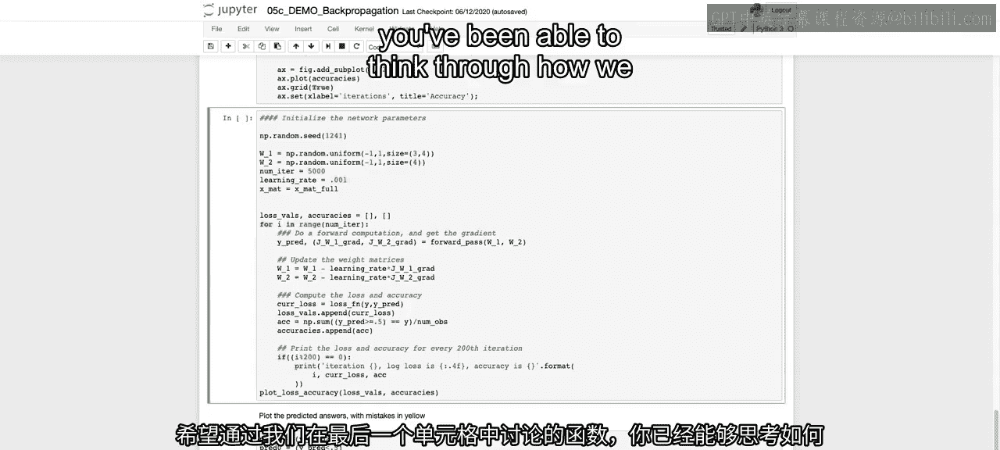

As well as how we'd use that back propagation and the output from our function。

 specifically from that forward pass， given our gradient and our prediction。

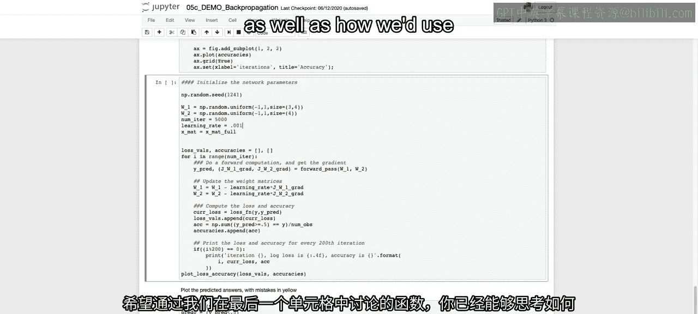

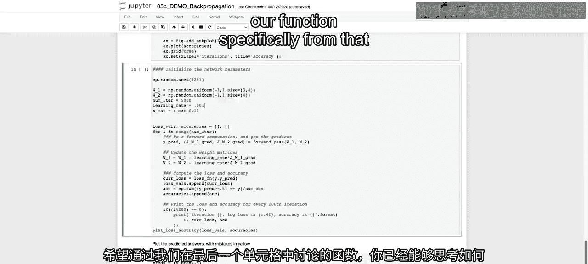

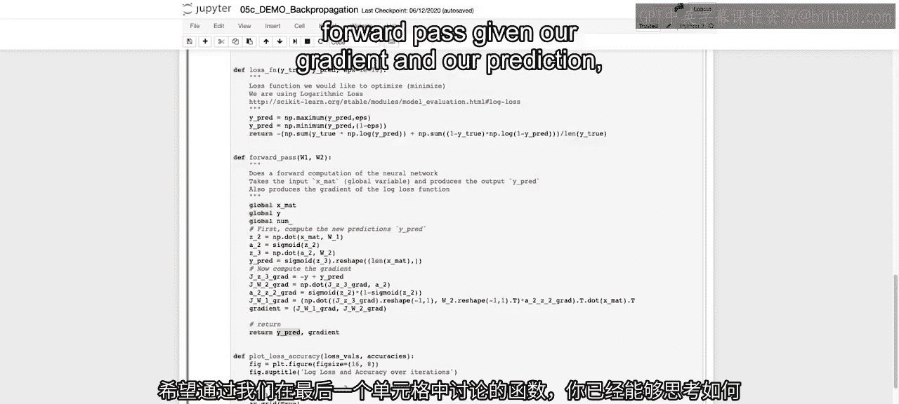

How we would actually go about using those outputs， iterating over a number of iterations。

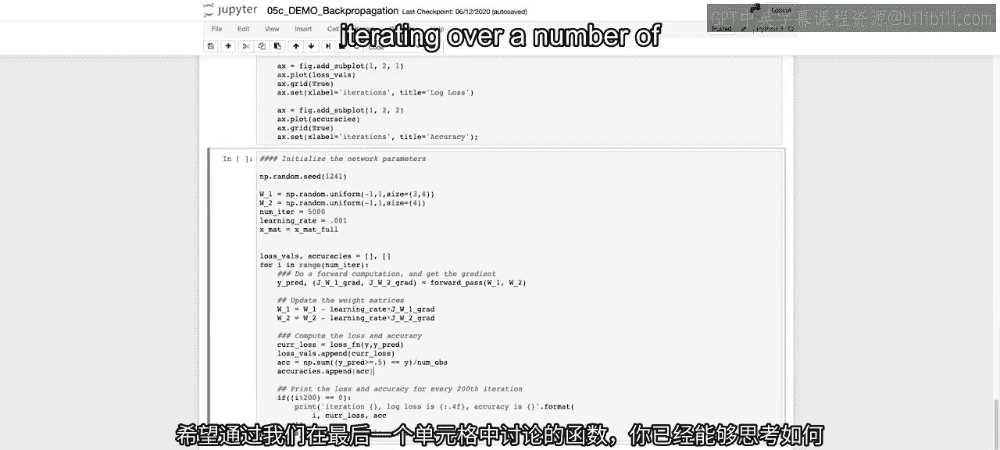

And updating our model。So with that in mind， hopefully you were thinking through it。

 we're going to walk through that code over here。So the first thing that we want to do is create our W1 and W2。

 again， those are just going to be random values here to start。

So there are going to be random values between negative 1 and 1。

 and if we think about the weights for w1， it should be a 3 by4 matrix since our input should have three dimensions。

 our two dimensions， x1 and x2， as well as our bias term， or including that in here。And then。

It's going to be by four since we'll have four nodes。

 and then that means that our W2 will have to just be of size  four。

And we are just going to have four because that's going to be our output after that。

 So when we take the dot product of our output with W2。

Then we'll be able to output just the actual values of a classification value of either one or zero。

We're going to set the number of iterations here equal to 5000 and our learning rate equal to 0。001。

And then we're just calling Xmat that Xm full so that we can pass it through。

Our loss valves and our accuracies are going to start off as empty lists。As we have here。

And then we're going to do our iterations。So for I en range number of iterations， 5。

000 different iterations。We're going to take our Y pre。

And our output gradients from our forward pass。So I talked about this just in the top of this video that this forward pass will output。

Both a prediction， as well as our gradient values and that gradient value output。

 if you recall from last video。

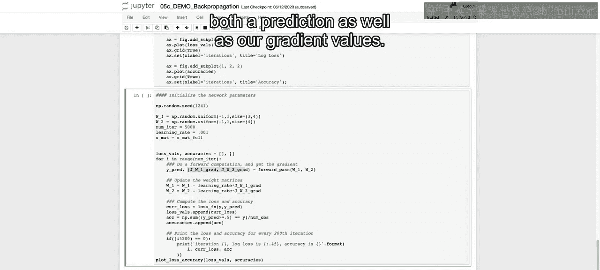

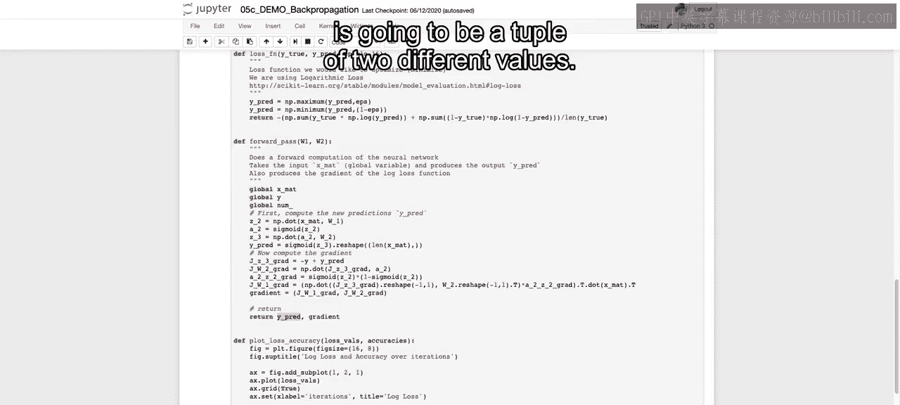

Is going to be。A tuple of two different values， so we're going to pull them out separately as JW1 grad and JW2 grad。

And then to update the weights。All we have to do is take that initialized value。

After the forward pass， which we've done with our forward pass and gotten our gradients。

 we can subtract out the learning rate multiplied by that gradient。

To take that small step in the right direction and updating both our W1 and W2。

We can then get what our current losses by calling loss function on Y and Y pre。

We then append that value to the loss vows， and then our accuracy is just going to be how many we predicted correct over the total number of observations。

And just because we're using the log loss again， our prediction will be some value between 0 and 1。

 It won't be exactly 0 or one。 So we just are going to。

Make them discrete values of0 or 1 by setting y pre greater than or equal to 0。5 equal to 1。

 and all the values lower are equal to  zero。And then we can append to our list of accuracies。

 that value of back， and that's just for our first iteration。

And then what we have here is that we're just going to print out at every 200th iteration。

 what the log loss was and what the accuracy is。And then at end。

 we can plot that loss accuracy once we've gone through every single iteration of those 5。

000 iterations。Now， coming back to this W1 and W2， we think about the fact that we have updated this after the first iteration。

Once we update it， we can then pass it back into this W1 and W2 for the For pass since we updated it as itself。

And we continue to update that and get closer and closer to that correct， to that optimal value。

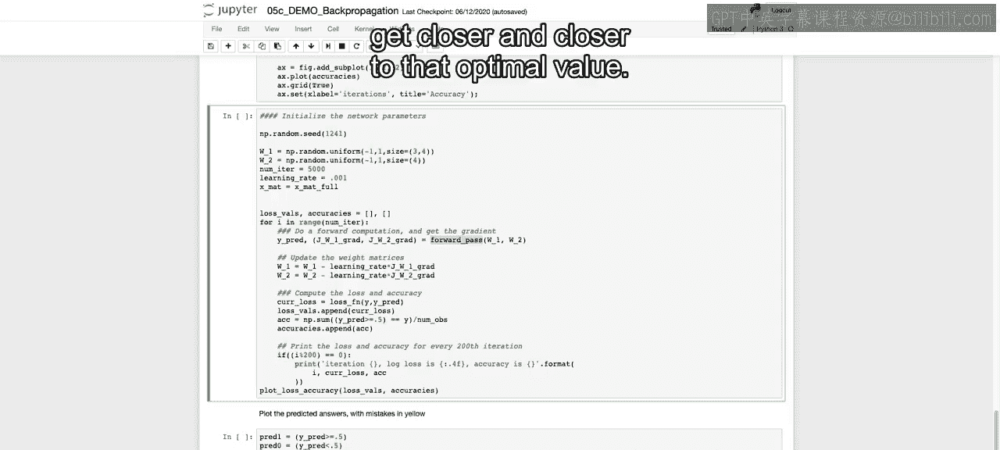

So we're going to run this。And we can see the outputs as we do。

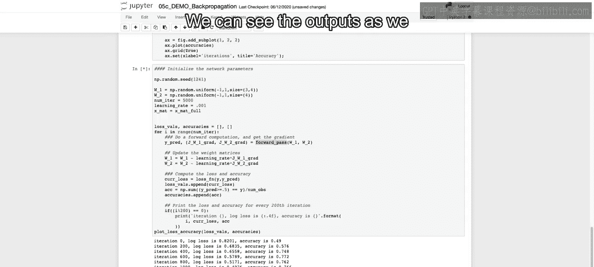

Different sets of 200 values， 20040 600，800 and so on。

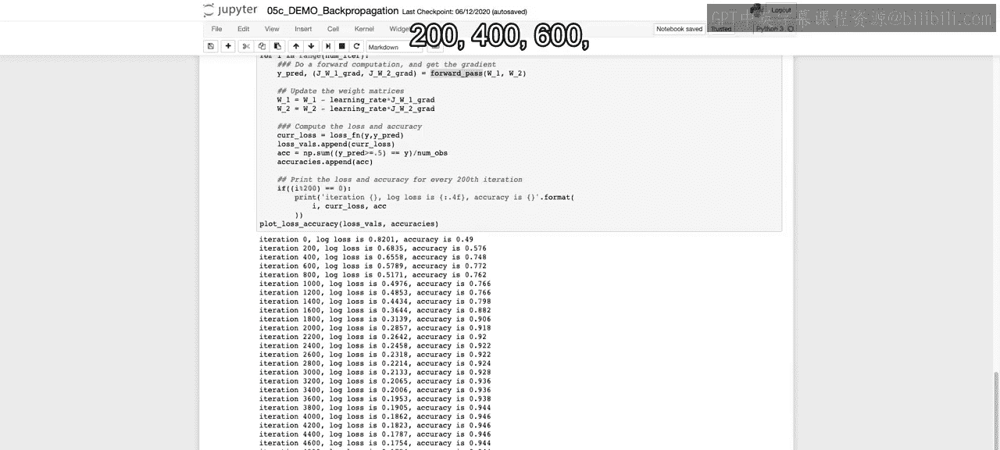

And we can see that that log loss。Goes down further and further。

 and our accuracy goes up proportionally。As we go through each one of the different iterations and we see here at the end。

 we end up with 4800 iterations and an accuracy of 94。4。

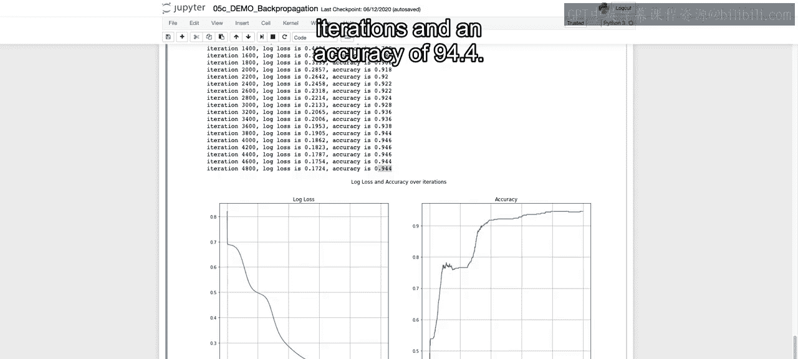

And you can play around with changing the learning rate。

 so if you imagine I made that learning rate real small， I want you to think about what would happen。

I'm going to run this。

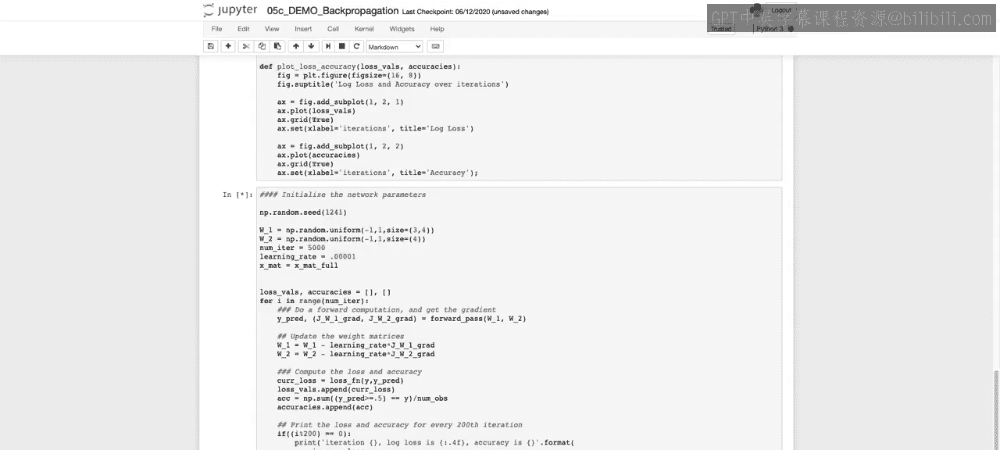

And we see that it is updating a bit too slowly。

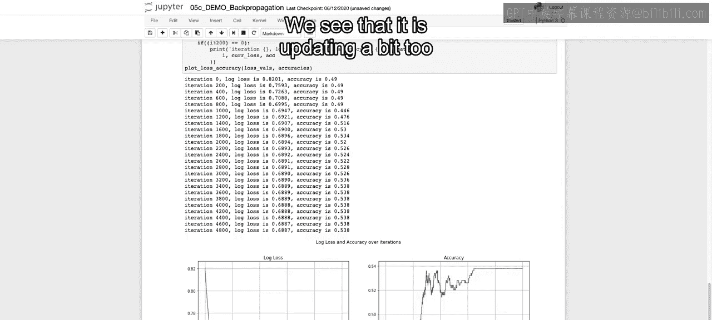

As we set that， learning rate incredibly small。And maybe even， yeah。

So we don't want to set it too small or too large。 we'll set this back to what it was before so that we can do the next step。

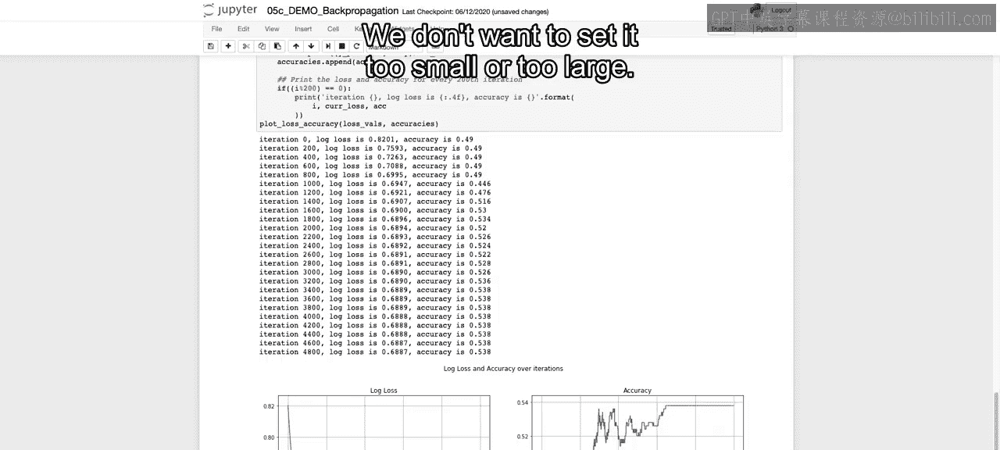

Which was。Zero，01。

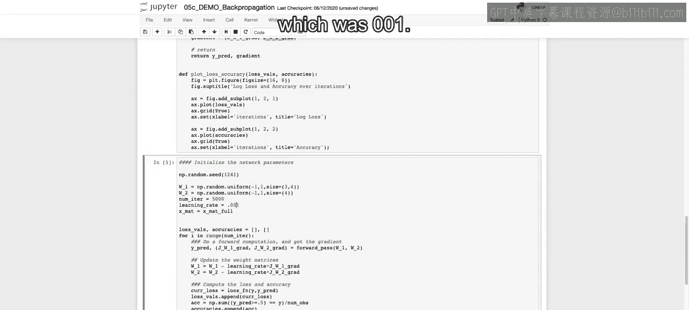

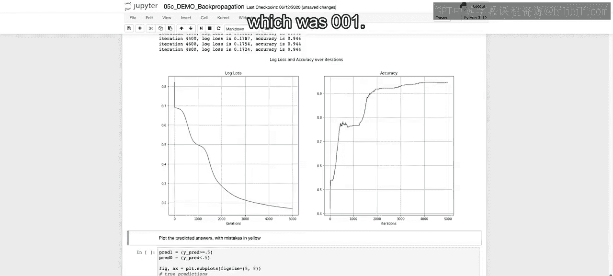

And then we can actually plot out where we got it correct and where we got it incorrect to see where on our diamonds。

We were more likely to have errors。So we run this and these plots should be simple enough given everything that we've learned。

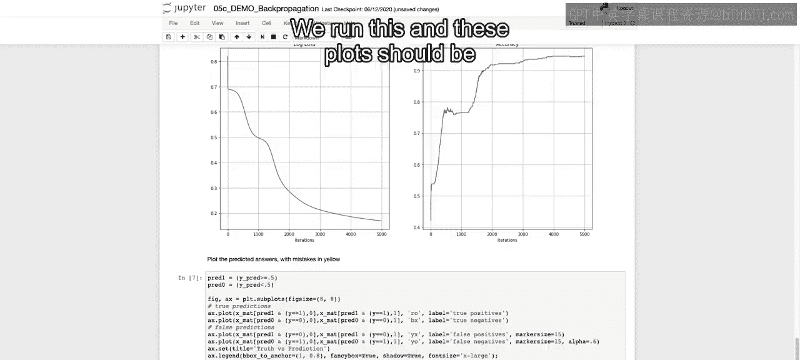

And we see the false positives and false negatives all tend to be right around these edges。

 So did a pretty good job of actually finding that classification boundary is just right along the edges。

 perhaps some or correct or incorrect。😊。

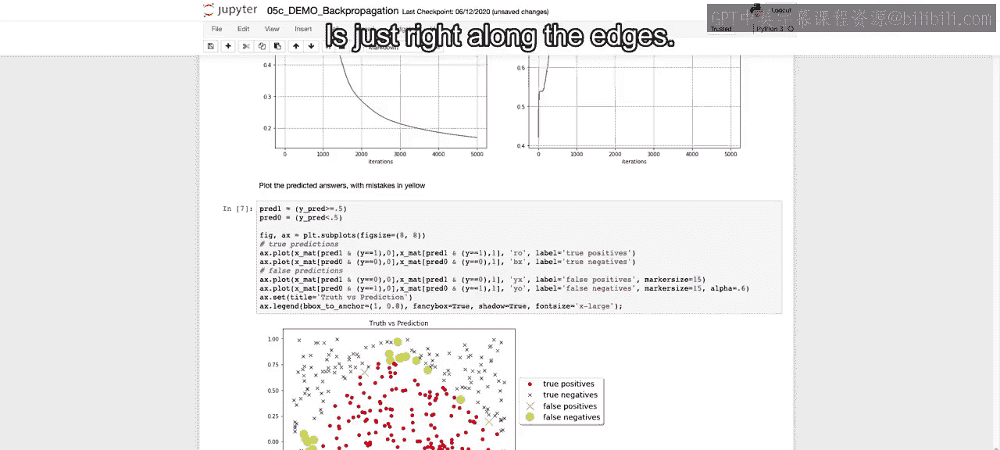

Now feel free to play around with different shapes to look at what type of errors come out。

 you see everything that we can do here within this notebook。

 playing with the different number of iterations， playing with the learning rate。

And then we discuss also that you can play around with the different activation functions。

 And you'd have to change here we have it to find a sigmoid。

 You'd have to pass in something else besides sigmoid。 And with that in mind。

 that's a smooth transition into what our lecture is going to be in our next lecture。

 which is just going to be discussing different activation functions。 All right， I'll see you there。

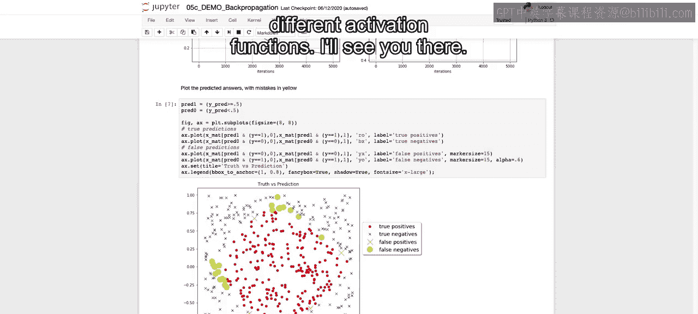

