# 062：IBM《机器学习（无监督学习、深度学习和强化学习、毕业项目）｜machine learning》中英字幕 p62 23_流行的深度学习库.zh_en -BV1eu4m1F7oz_p62-

In this video， we're finally going to introduce the actual Python library vary Kes。

 which we're going to use in order to build out our neural networks。

So in this section we're going to cover a bit of an overview of the different Python libraries that are going to be available in general。

 again we're just going to be focusing on what our title here was， which was Kara's。

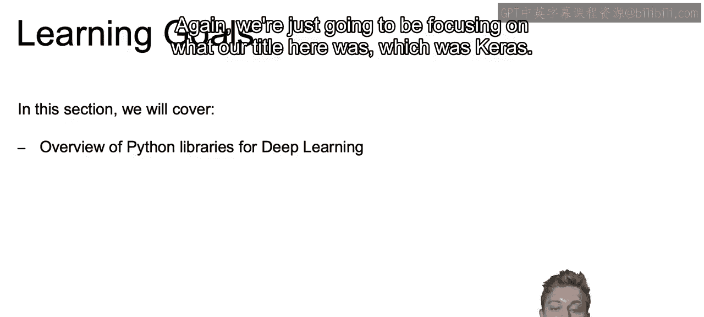

We're then going to show you how to set up a network structure using CAs。

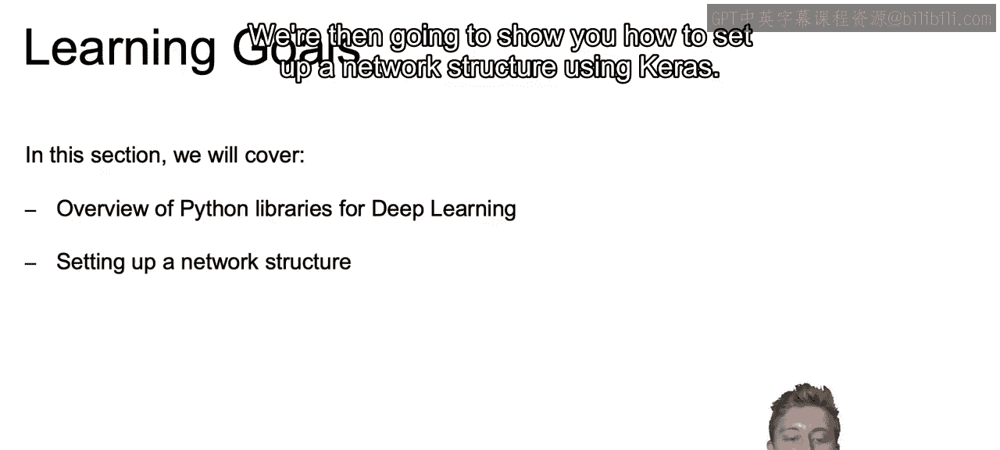

And then finally， from A to Z how to actually build out that model， and once we are able to do that。

 we'll jump into the actual code to create our first deep learning network within Python using KaS。

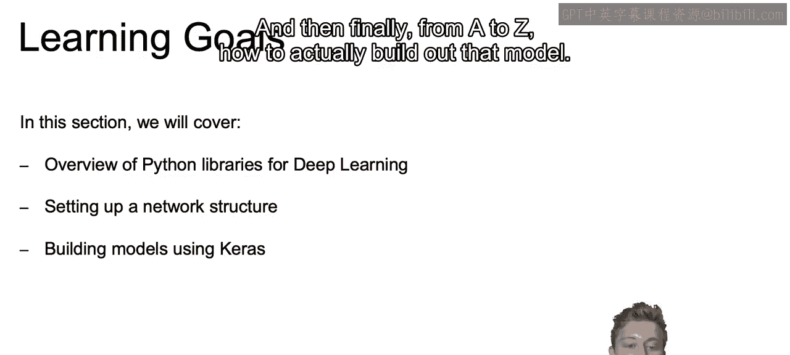

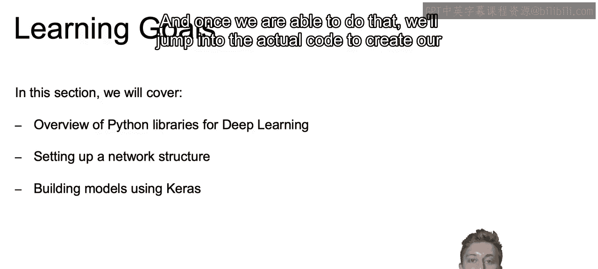

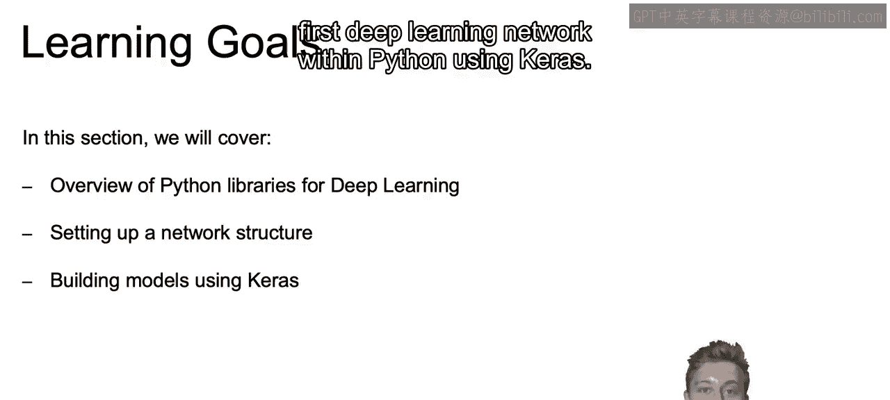

So what are some of the many Python libraries that are available to us if we want to do deep learning in general。

 So some of the most common libraries used include TensorFlow and TensorF is going to be built by Google and has now actually incorporated Kara's simplified syntax into that Tensorflowlow package。

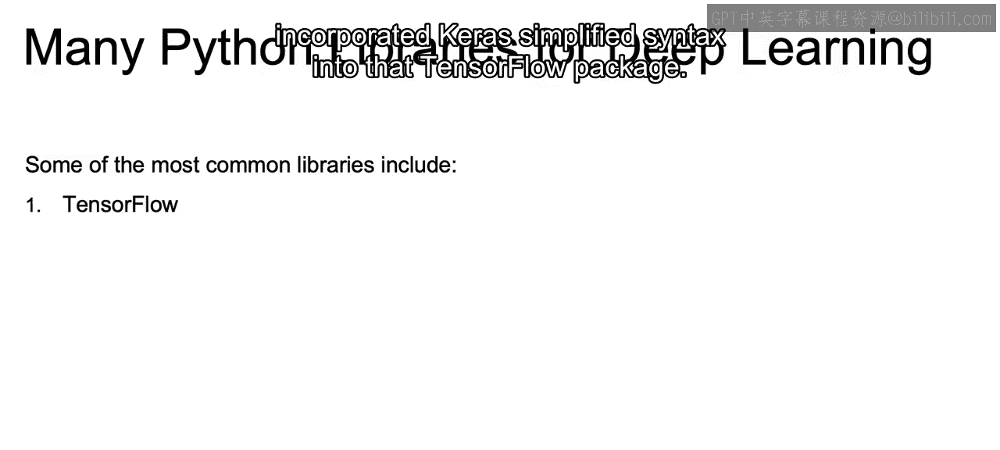

TenssorFlow was originally known as we talk through the different packages available as the more complicated steep learning curve version of a deep learning framework。

 but with his incorporation of Karas has made it a lot more accessible TensorFlow also has a larger community than most of the other packages that are available and is originally built off of what we'll talk about next。

 this package Theion Now Theiono is essentially。

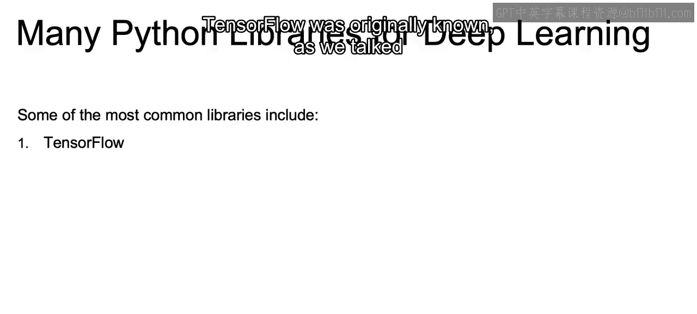

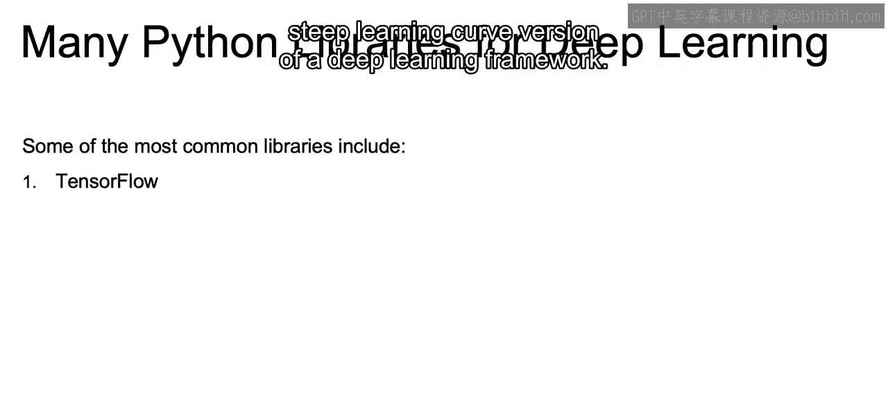

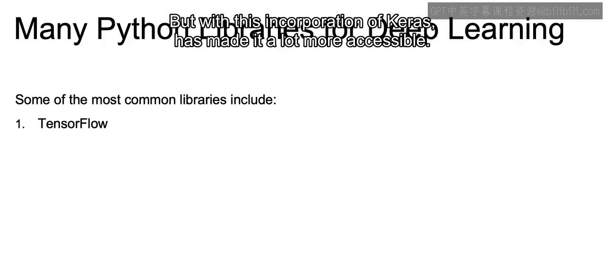

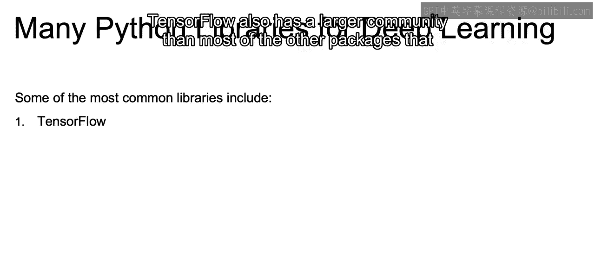

Dead as development has ceased back in 2017， but many academic researchers relied on piano and pianos considered somewhat of the grandfather of deep learning frameworks。

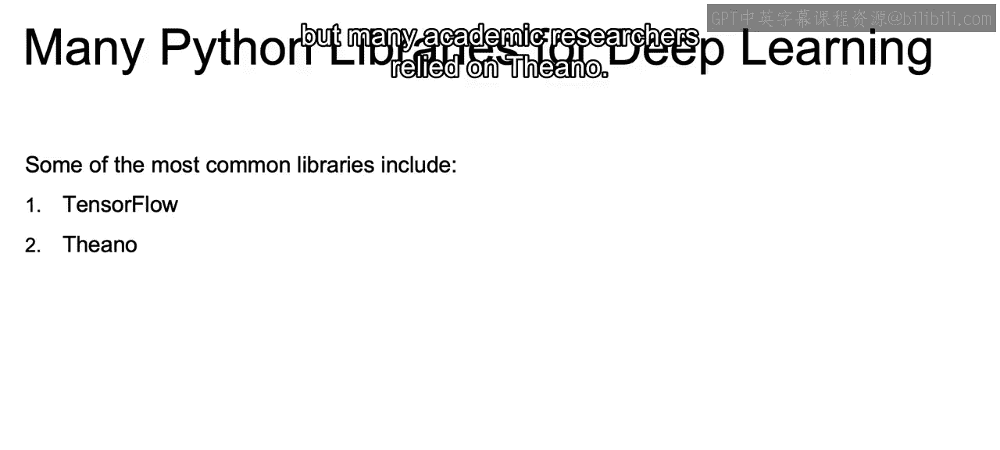

And then we have Pytororch and Pytororch also has a large gathering， a large community。

 and is currently a bit more research oriented compared to TensorFlow。

 which is a bit more into building out those AI related products。

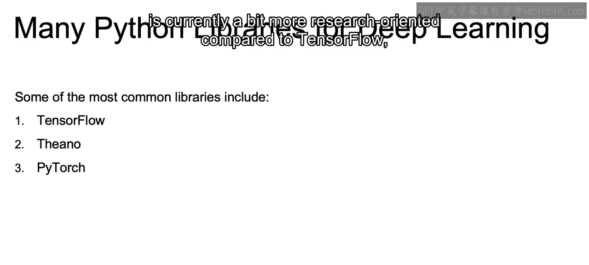

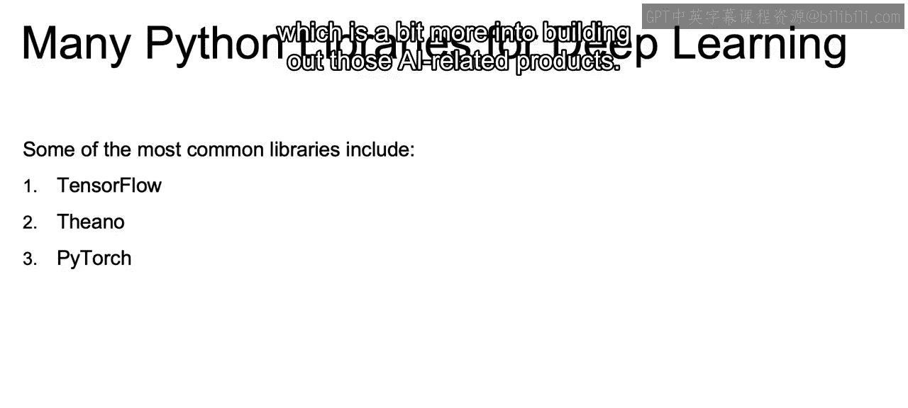

Pytorrchches developed by Facebook， again， also has a large community。

 was originally known for being more accessible than TensorFlow， but again。

 with that incorporation of Keras into TensorFlow。

It's now also very accessible， Tensorflow at。

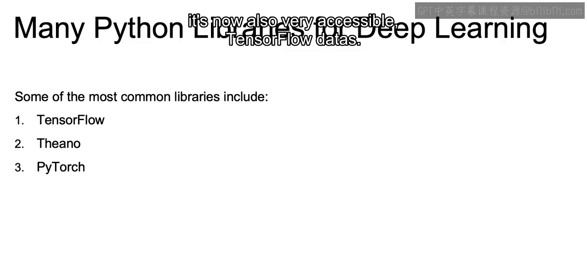

And then like we said， Karas is going to be that high level library， very accessible。

 like Python when we say high level， that means it's very close to English。

 and it can run either on TensorFlow or Theianu and with TensorFlow's incorporation of Karas into the TensorFlow package。

 it's most likely going to be running on TensorFlow moving forward。

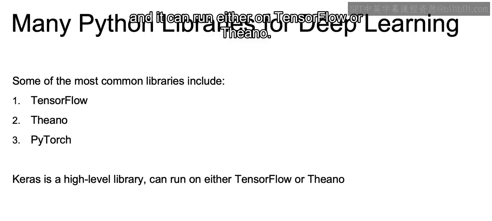

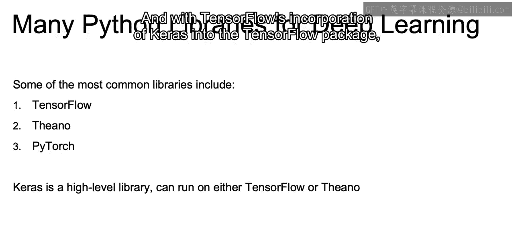

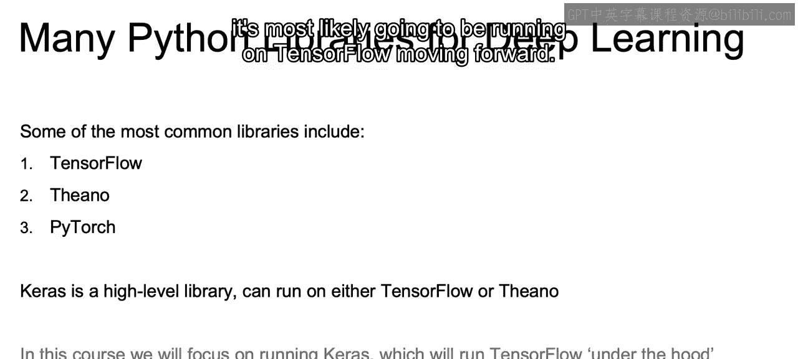

And on this course， we'll be focusing on running specifically on Cars through Tensor flow under the hood。

 so that's going to be what we will be focusing on and the code that we'll see throughout this course。

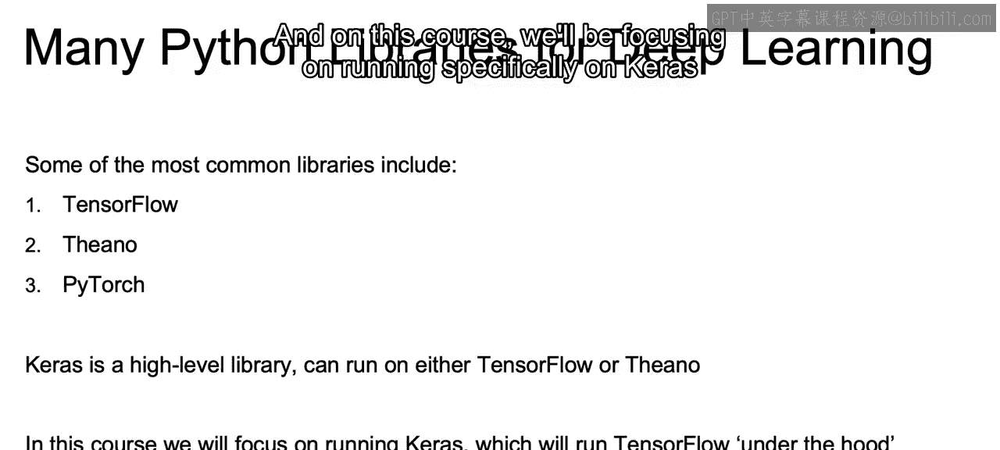

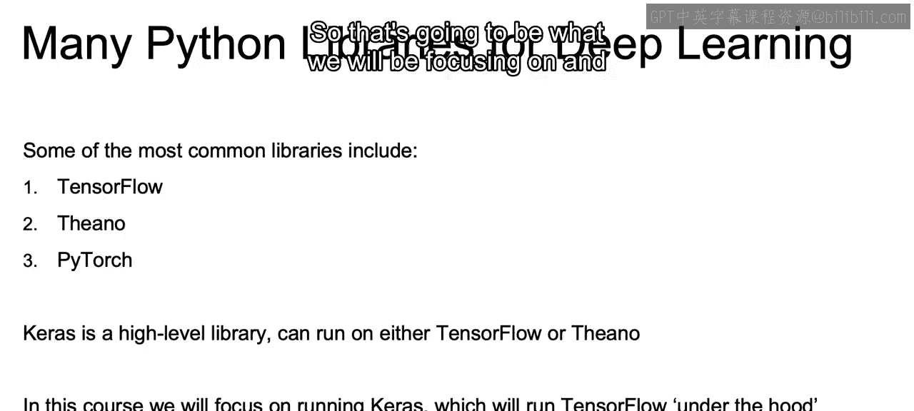