# 063：IBM《机器学习（无监督学习、深度学习和强化学习、毕业项目）｜machine learning》中英字幕 p63 24_典型的keras工作流程.zh_en -BV1eu4m1F7oz_p63-

So let's talk through the typical command structure when building out our deep learning frameworks。

So the first thing that we're going to want to do is to actually build out that structure of our network。

 how many layers do we want， how many nodes do we want in each layer。

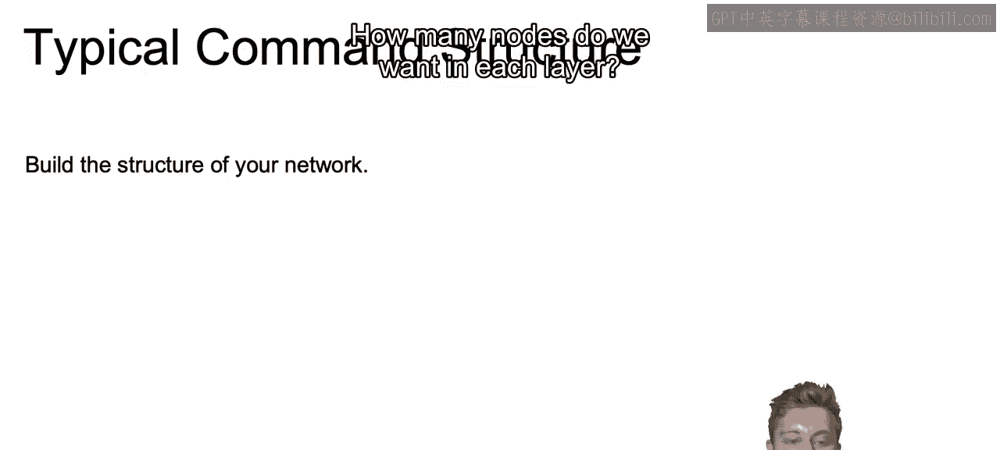

And then we're going to compile that model that we create， however many layers it is。

 whatever the specifics of each layer are， and we're going to learn more complicated types of frameworks later on。

 we're then going to want to compile that model and when we compile that model。

 we're going to specify the loss function that we're going to use at the end of our model。

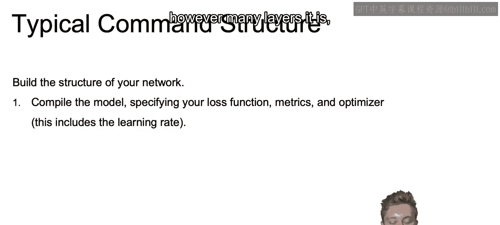

Different metrics that we want to track maybe accuracy， maybe loss functions， things of that sort。

 as well as the optimizer that we're going to use， and that's also going to include the learning rate that we use in order to specify that optimizer and that optimizer will be one of those that we discussed earlier。

 whether that's atom stochastic gradient descent， something with momentum and so on。

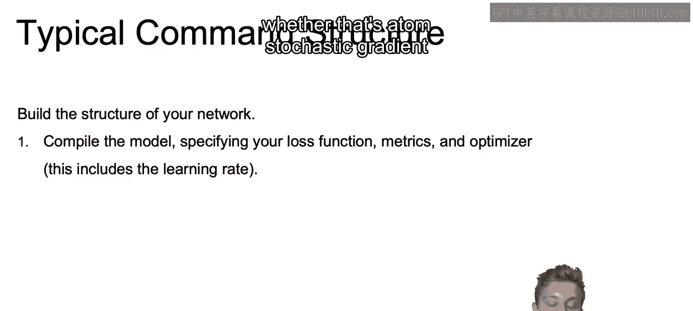

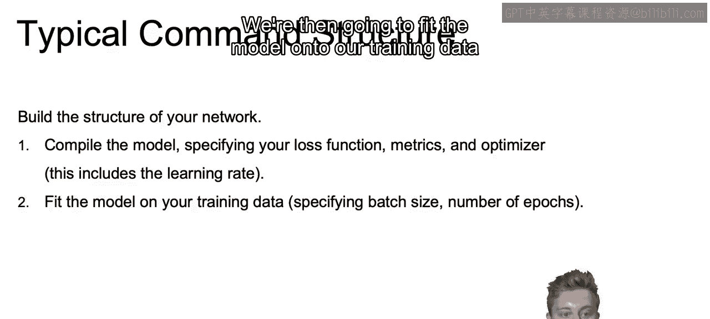

We're then going to fit the model onto our training data。

And when we fit that model we'll specify the batch size as well as the number of epochs。

 the number of times we'll run through the data set。

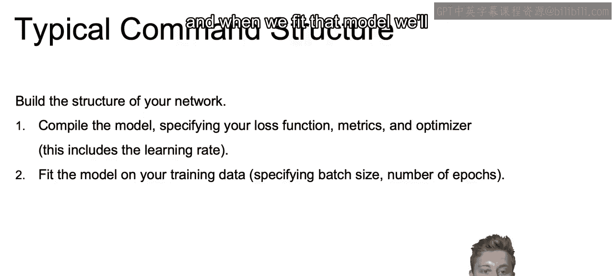

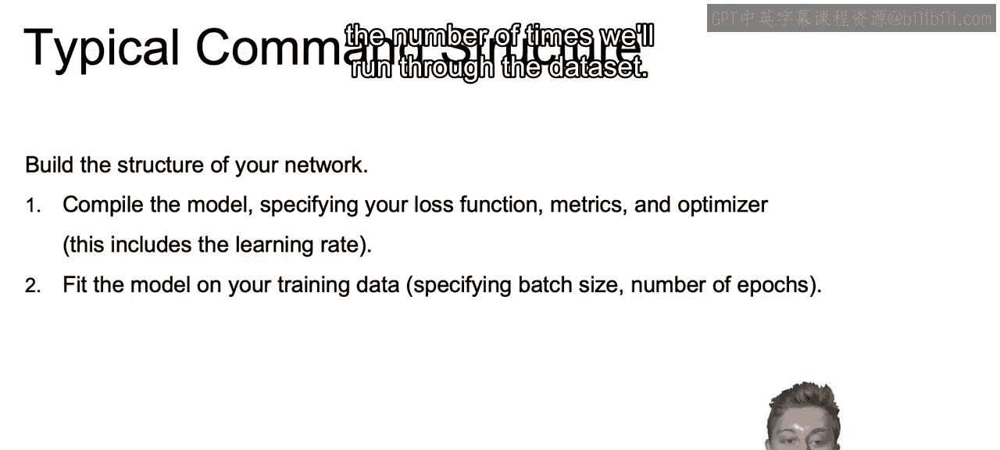

Once we do that， we'll be able to predict on new data once it's fit。

 once that model's already fit onto the training data。

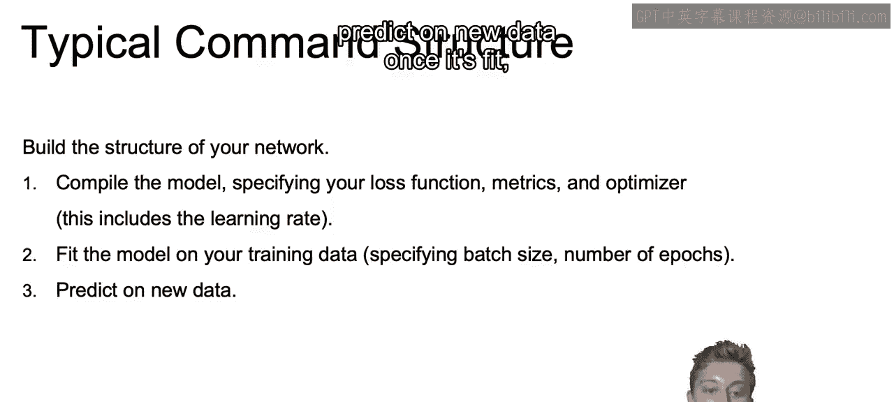

And then we can evaluate our results。

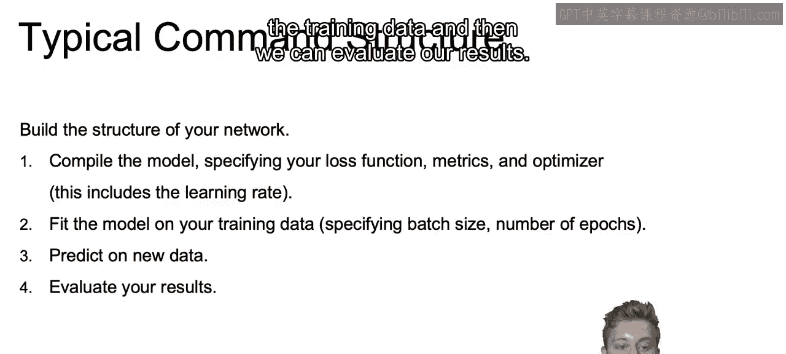

Now， when we work with Cars。

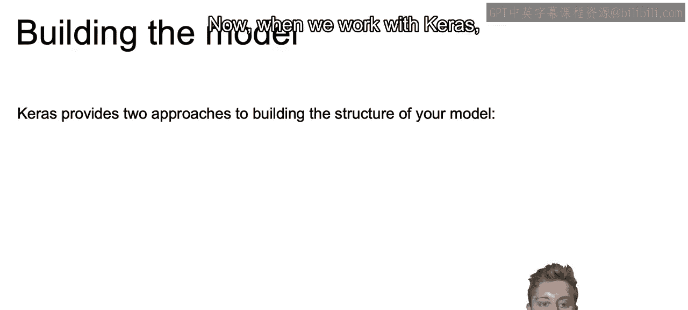

CAS is going to provide two approaches to building the structure of our model。

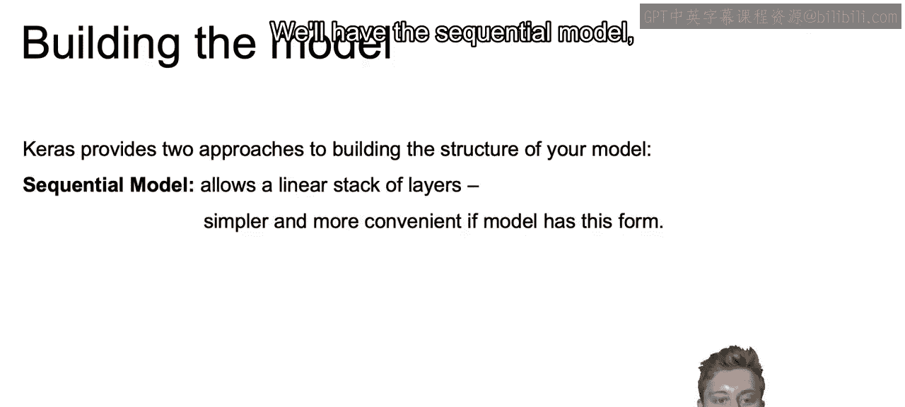

We'll have the sequential model， which allows for an easy to use linear stack of layers。

 It's going to be much simpler than the other version that we're going to talk about and more convenient if the model has a simpler。

 more relatable form that you're already used to， whether that's going to be the dense networks that we've talked about so far or later on just your typical convolutional neural nets or currentrent neural nets and so on。

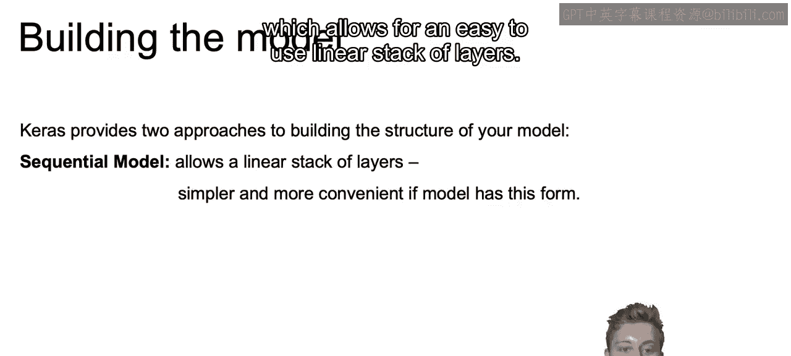

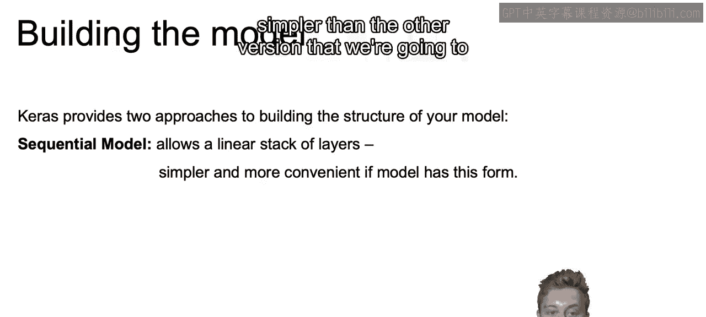

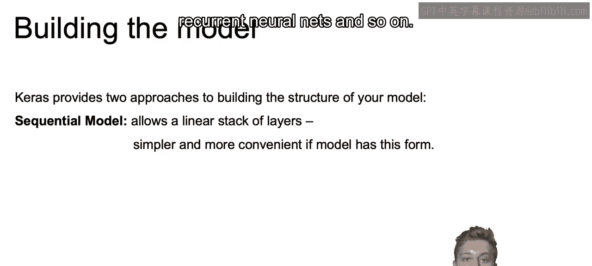

And then there's also the functional API， and that's going to be a bit more detailed and complex。

 but will allow for more complicated architectures。

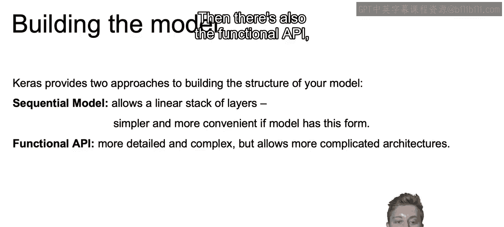

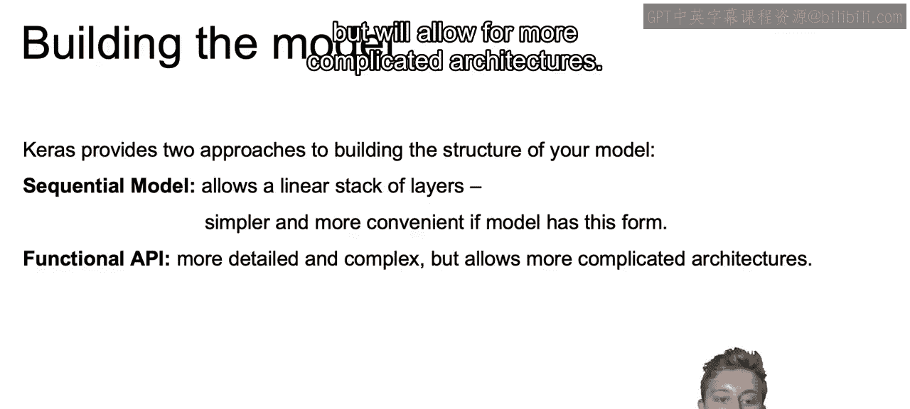

Now， probably given that you're watching this course， you're just learning this for the first time。

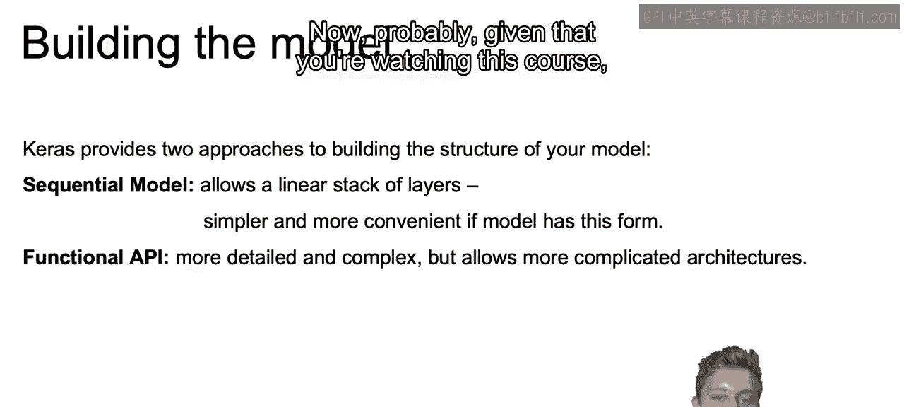

Everything that the sequential model is going to provide for you will probably cover everything that you need to know so far。

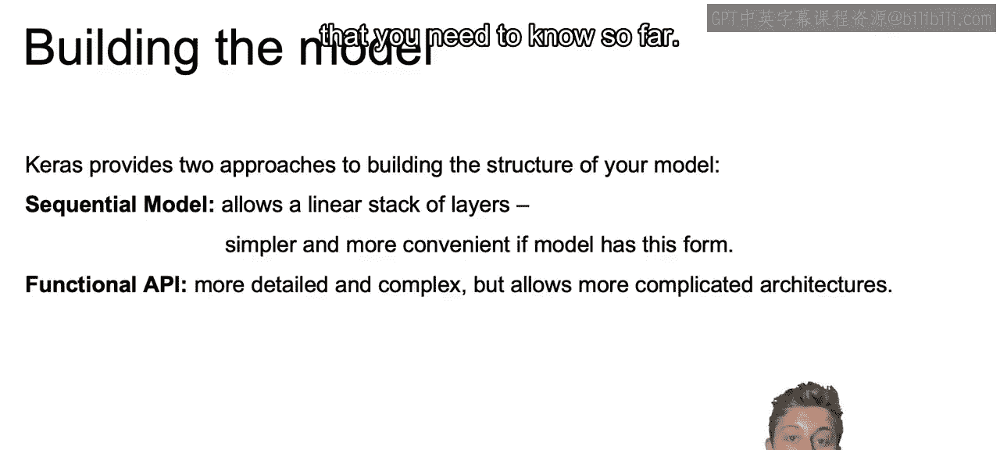