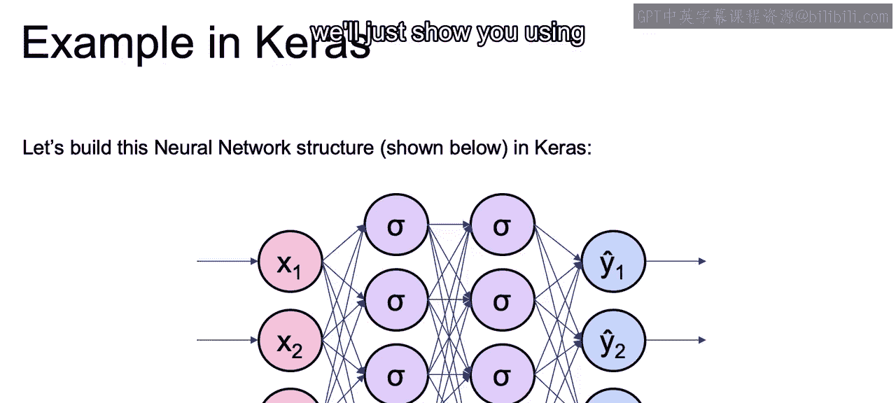
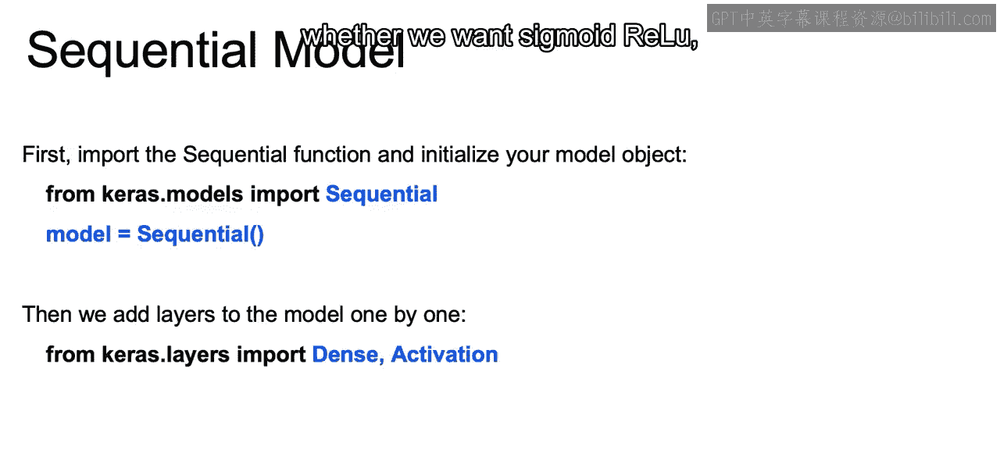
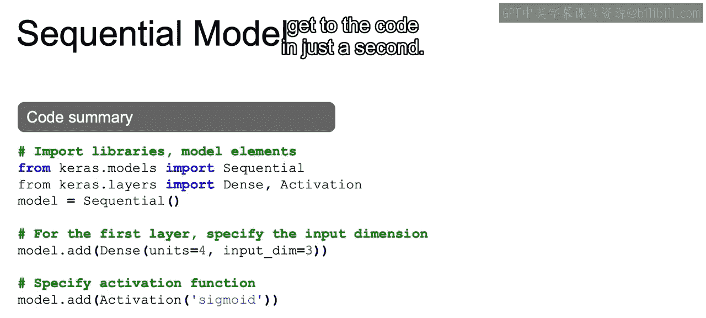
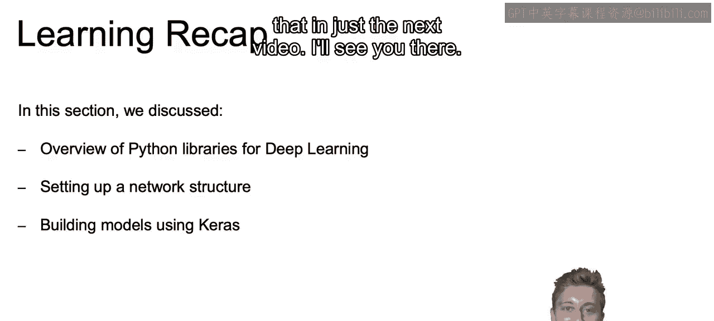

# 064：IBM《机器学习（无监督学习、深度学习和强化学习、毕业项目）｜machine learning》中英字幕 p64 25_在keras中实现示例神经网络.zh_en -BV1eu4m1F7oz_p64-

Now let's talk through how to actually write out the code and Cars to create this neural network that we see here。

So this neural network will take in an input of a data set with three different features， x1。

 x2 and x3。It will then have two hidden layers， each one with four nodes。

 or as we'll see in a second， they're going to call it units， but they're one in the same。

 so we have four units in each one of the different layers they are fully connected as we've seen so far in each one of our feed4 neural networks。

And then finally， we're going to have that output layer Y1， Y2 and Y3。 And here。

 as you see in the purple hidden layers， we're going to be using the sigmoid activation function throughout。

 and we can use different activation functions if we'd like。 but in this example。

 we'll just show you using the sigmoid activation functions。

So the first thing that you're going to want to do is import that sequential function and initialize your model objects。

 so from Cars dot models we're importing this sequential function。

Once we have that sequential function available， we just initialize our model by setting model equal to sequential and from there we can add on each one of our different layers with their specific activation functions to build out the remainder of our model。

 So right now we just have initialized model with no details involved。

We can then add layers to the model one by one。And in order to do so we're going to use these different types of layers here we're just going to stick with dense layers which are those fully connected layers and later on we're going to learn a bit more complex layers such as recurrent neural nets and convolutional neural nets and we'll discuss those later on but again we're just going to focus here on dense layers and then we can also add on our activations and with those activations we can specify whether we want sigmoid。

 relu， leaky rulu and so on。

So the actual code is going to look like what we have here and we have in that first step importing the libraries and the model elements we just discussed。

 so from the CAs dot models our sequential function， from CAs dot layers。

 our densets and activation function， then we initialize our model as sequential。

Then to add on our first layer。We're going to want to specify the input dimension。

 and that will just ensure that we have that first step correct and that we're putting on LeGgo blocks that actually fit。

So we call model dot add and we're adding on to that empty model， a dense layer。

 that fully connected layer， that layer is going to have four units or forwarder nodes。

And the input dimension。 So coming in to that hidden layer with four nodes。

 there's going to be three dimensions， and those represent the three features coming in。

We're then going to specify our activation function and we'll see as we do the code in a second that this could actually be specified while we add on our dense layer as well。

 and we'll see that when we write out the code， but just to make this easier to read and give you other syntax in order to add on the activation function。

 we add it on separately and we call model that add and we call activation。

 what type of activation do we want and we pass in sigmoid。

And then to add on further layers to make a deeper neural network。

We're going to have that input dimension already presumed from the previous layer so you don't have to keep writing out what the input dimension is。

And you can just call model dot add。 We want a fully connected network， and the units is equal to 4。

 and then model dot add activation sigmoid。 And we have created our second layer here。 Now。

 there's more steps to complete that model that we just saw。

 but we will walk through it in greater detail as soon as we get to the code in just a second。

So just to recap。In this section we discussed an overview of the different Python libraries available to build out these deep learning frameworks and that included TensorFlow。

 Fiono and Pytorrch currently Pytorrch and TensorFlow or the main competitors and we're going to be using TensorFlow specifically and to be even more specific。

 we're going to use the CAIS package as now available in TensorFlow and made TensorFlow a bit more accessible than it ever was。

We then discussed with that mind setting up an actual network structure using Cars as well as how to build out our models using Cars。

 and we discussed that briefly and with that as promised just a second ago。

 I said we're going to go a bit deeper into actually building out those networks using Cars and we're going to see that in just the next video All right。

 I'll see you there。

