# 066：IBM《机器学习（无监督学习、深度学习和强化学习、毕业项目）｜machine learning》中英字幕 p66 27_keras笔记本（选修部分）第2部分.zh_en -BV1eu4m1F7oz_p66-

Welcome back and hopefully at this point you're excited to finally build out your first neural network so here we're going to build just a single hidden layer neural network we're going to have again that input of eight variables and we're going to have one single hidden layer with 12 nodes。

Now， something that we didn't touch on for neural networks。

 which we'll touch on in the next lecture that we do after this notebook。

 is that it's going to be important to actually scale your data before building out your neural networks。

The reason behind this will have to do with how gradient descent works and how it will update certain weights differently depending on their scale。

 and we'll get into that in the next lecture， but for now note that you're going to want to scale your data before performing your neural networks。

So we create our normalizer with that standard scalar。

We then create our Xtrain norm by calling fit transform on our Xtrain。

 and then we have our X test normalized by just using transform。

 not fit transform again because we want to ensure that our holdout set is indeed a holdout set and that we're actually using something that we learned from the training set that we should have had available to us。

And here we build out our first model。As we discuss in the lecture， Model one。

 we initialize our model， we call it sequential。We're then going to add on。Our first layer。

 which will be 12 units。That's going to be the default first value， our input shape。

 we just have to say how many actually you don't have to specify the number of rows。

 but the number of columns is going to be what's important。And then。Like I said during lecture。

 we can skip a step that we saw when we walked through the actual syntax。

 and we can actually include this activation within this model dot ad as we add on that dense， right。

 This is still part of that dense layer。 If you look at where these parentheses actually close out。😊。

So we set our activation here equal to sigmoid。And we showed other options that are available to us。

 and we could use Adam or Relu or leaky Relo and so on。And then to close it out。

 we're just going to be condensing those 12 nodes into one node to predict some value between0 and 1。

 So we add on one dense layer that's fully connected to those 12 nodes。

And we set the activation equal to sigmoid again because we wanted to output a value between zero and one。

So you run that， we've initialized our model and we can call model 1。t summary。

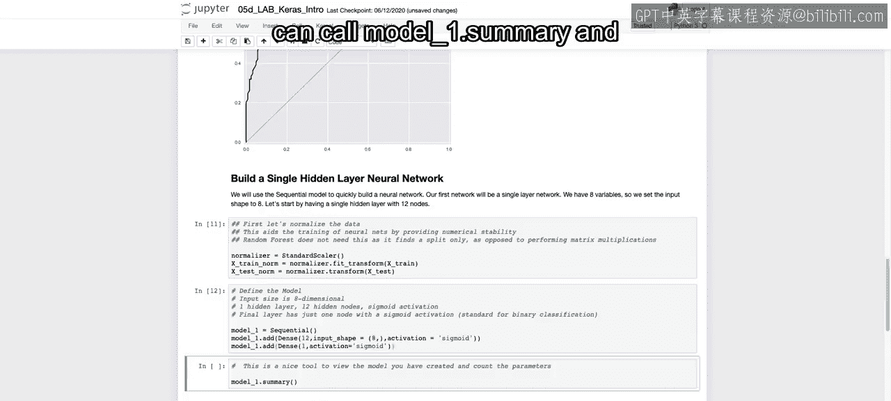

And get some of these nice details about our actual layers and how many weights there are going to be。

So if we look here， we see the total amount of parameters that we need to train and how many we need to train at each layer。

And we see that we have 121 total parameters and 108 at the first layer and 13 at the second layer now。

I would advise for you to pause and try to think through why there are 108 parameters and 13 parameters。

 so I'm going to give you a second here to pause。Assuming you paused and thought this through。

The reason why we have 108 parameters at that first layer。Is going to be， we have8 input features。

And then we have that fully connected to each one of the 12 nodes。So if you think about that。

 you'd originally think maybe something like 8 times 12。 But we also have that bias term。

So it's going to be nine units actually connected， so 9 times 12 is going to give you your 108。

And then to get to the next layer， again， you're going from 12 down to  one。

 so it's going to be fully connected to that one plus the bias terms， so you have 12 plus that one。

 and that's going to be equal to 13， which is why you're going to have to learn a total of 121 different parameters。

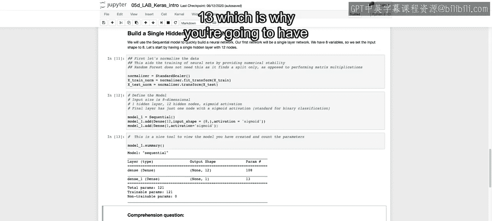

We're then going to compile our actual model。And this is going to be our first time seeing how to actually compile that model using this specified optimizer。

 our loss function， and the different metrics that we want to track throughout。

So we call model 1 do compile。And we say SGDs， we're using stochastic gradient descent。

 which we imported earlier。Our learning rate is 0。003。

 and we can change that learning rate to make it faster or slower。We then have our loss function。

 which here is going to be binary cross entropy， so that's binary either 01 and cross entropy if you wanted something that's going to be categorical。

 so across many different categories then you'd use categorical cross entropy if you want to do something that's going to be continuous then you can do mean squared error。

 which is MSE and then we save the metrics that we want to track and here we want to track accuracy and then it'll automatically also track the loss function throughout。

And then we're going to actually save the run history and we'll see how this becomes useful throughout。

 and that's going to be the output， one of the outputs from our fit。

 and we're going to fit to our Xtrain norm to our Y train。

 and then what we can actually do is pass in our validation data。

 pass in our test set to see how we're performing on that holdout set as well as we fit to our training set。

And then we set the number of epochs， the number of times we want to run through our data set。

 and we set that equal to 200， so it's going to run through the full data set 200 times。

And at each one of the different steps。

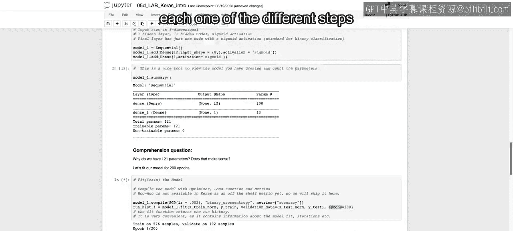

It's going to say each one of the different epochs。

How much are we increasing our or decreasing our loss？

How much are we increasing our accuracy and how we doing on that validation loss that hold out set。

 How are we doing overall。So I'm going to pause the video as I'll take just a second and I'll see you as soon as it's done running。

Oh， it's done running。It's only 200 epochs that we're able to run through。

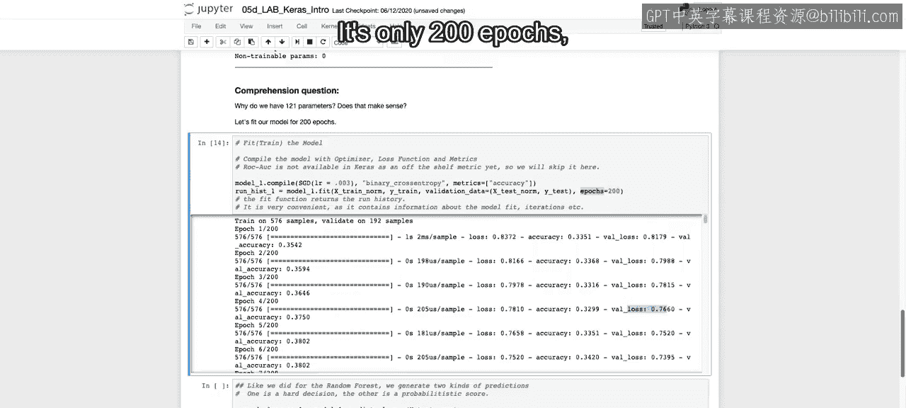

And then like we did for random force， we're going to generate two kinds of predictions。

 one's going to be that hard prediction and the other one's going to be the probabilistic score。So。

We have predict our different classes， Model 1 do predict classes。

 which will be available to us once we fit the video once we fit the model。

 and then we have our just predict once we fit the model again， that being model one。

So we have our different predictions and we can see for our different classes。

 we either have zeros or ones。

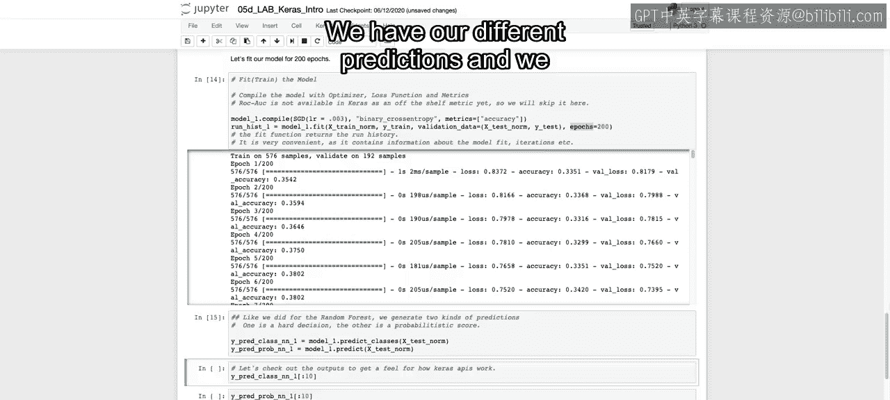

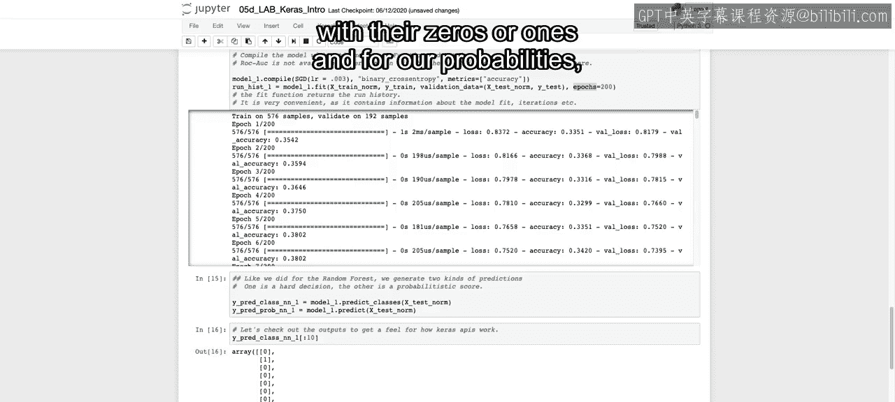

And for our probabilities， we have some value between zero and1。And that differentiator。

 as you look at this， is just going to be whether or not it's greater than 0。5。

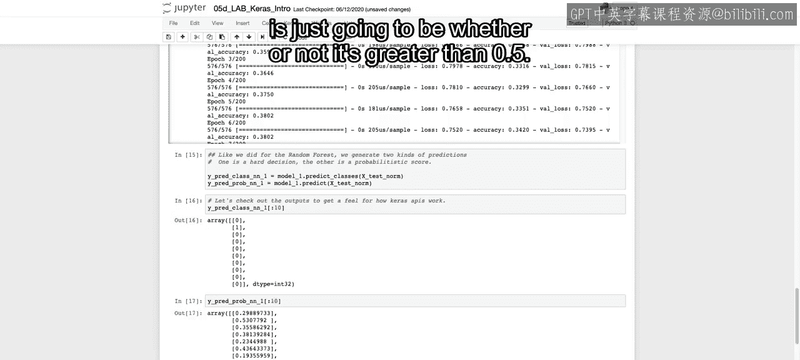

With that。We can then create our R O AU curve。 We created a function earlier that will allow us to do this。

 as well as looking at our different accuracy scores。And our R O C AU scores。

So let's see how we did compare to our baseline model， we see if you recall earlier。

 we did a little bit worse， and it's hard to tell exactly from the curve。

 but we can see the ROC AUs 0。782 whereas before somewhere around 0。8 and our accuracy is 0。729。

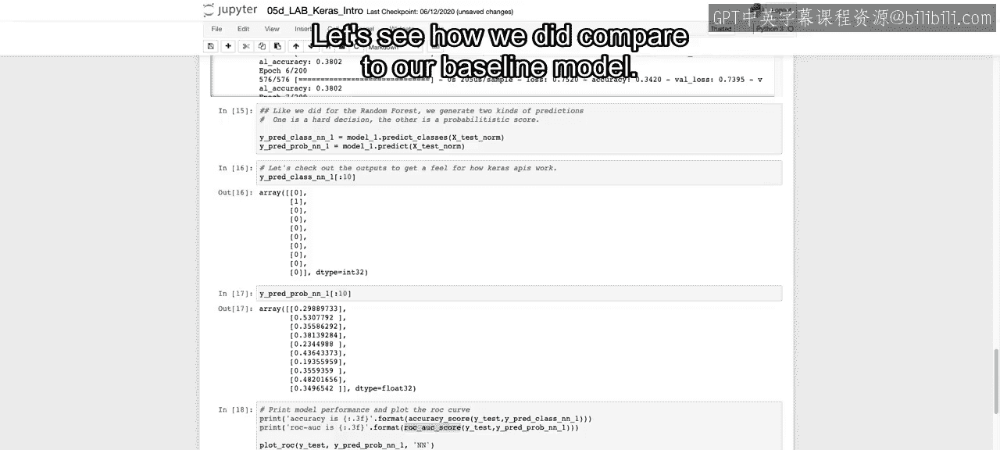

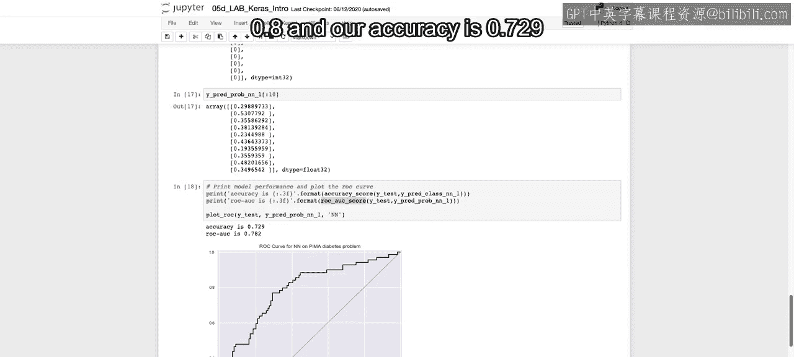

So that's going to be our first neural network model and there may be some variations due to， again。

 we randomize that initialization， so there is some randomness involved in creating these neural net models。

 so you may not get the exact same result， but hopefully you have between 75 and 85 here we did a little bit worse percent accuracy and our Auc agains a little bit worse than between 0。

8 and 。9， but you may end up with a higher value depending on your initialization。

And then when we save that history from that fitting of the model。

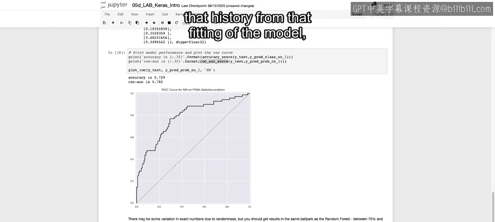

What we actually did is we were able to get this dictionary。So run hisist1。

 if we just look at this and look at the type that we have， this is the initial output。That we saved。

And this is going to be that history's object that Kas makes available to you。

And that's going to have with it。This history attribute， which is just going to be a dictionary。

And as we just saw， that dictionary has certain keys and those keys are going to be。

The actual loss and this is going to be the loss at each one of the different epochs。

 the accuracy levels at each epoch， the validation loss。

 so for that holdout set what your loss was and then your validation accuracy。

And that's only because we specified that we want to track accuracy when we first created our model。

 when we compiled it here。

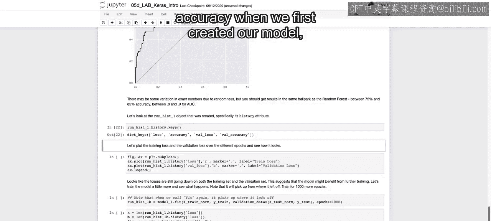

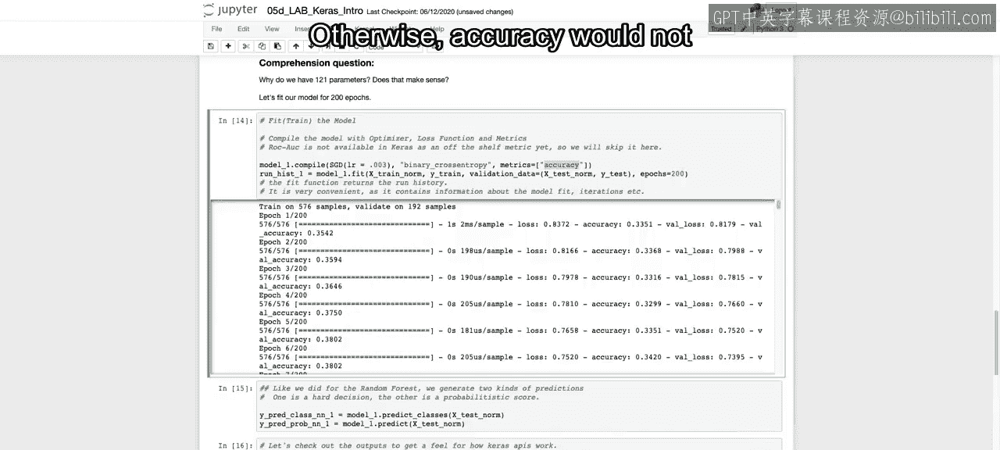

Otherwise， accuracy would not be available within this dictionary。

So once we have each one of these things， the loss， the accuracy and validation loss。

 we can actually plot these out。So we initiate our figure and our axis。

 and then we call run history do history loss。To get the different loss values at each one of the different epochs。

 And that's going to be in order as it train。 so it should get lower and lower。

 And then we can also get our validation loss。 and we'll plot that in either red or blue。

 So red's going to be the loss on the training function。

 So that should always be going down as it gets closer and closer to fitting exactly to our training set。

And then our validation loss， hopefully was getting smaller， but could have possibly increased。

 meaning that we overfit our data set。

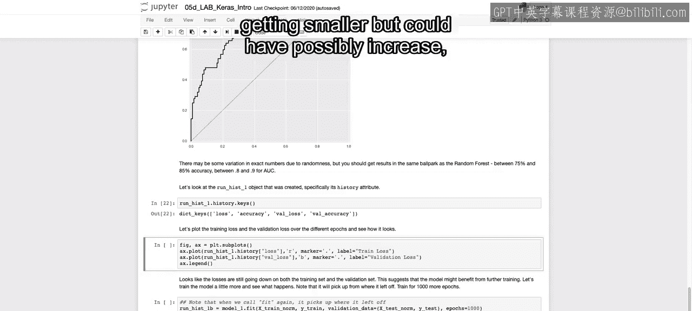

And here we see that they're both kind of still going down on both the training set and the validation set。

 and this suggests that the model might benefit from further training。So running through more epochs。

So with that in mind， let's train the model a little bit more and see what happens。

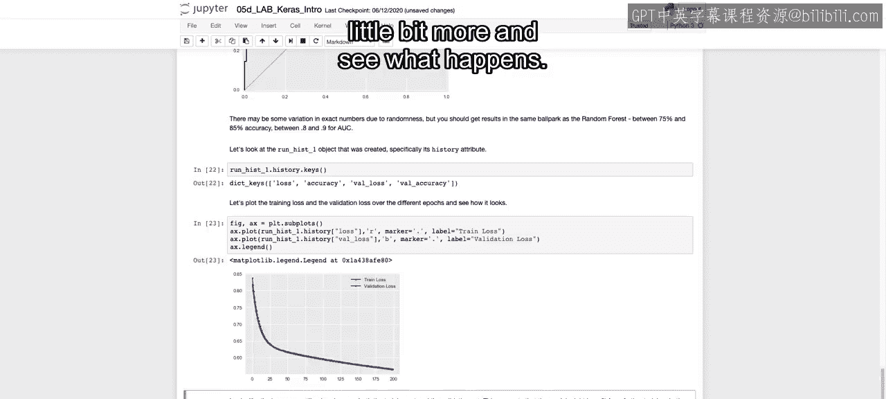

And something to note is that it will pick up from where it left off so it'll continue to train given where it left off at these 200 epochs。

So we're using that same model one that's already been compiled and fit once。

 and we're going to run it for another thousand epochs。

I will run this and then again I am going to actually pause a video here and well come back once it's done running as this will take approximately five times as long since it's five times as many runs through the data。

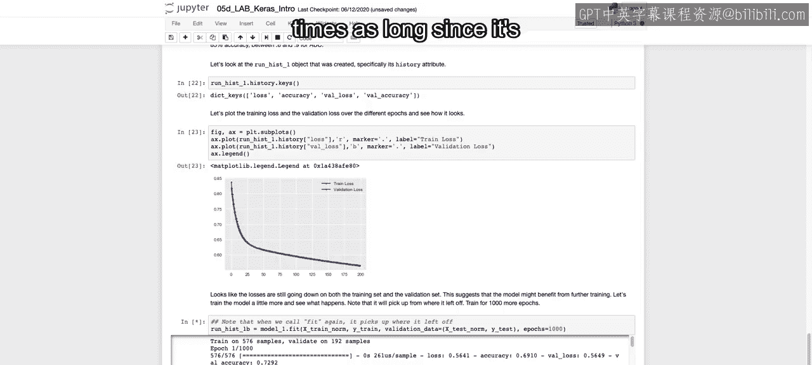

All right， that may have taken a couple minutes to run。

 but now it's run through all a thousand epochs。And we want to see what kind of improvement did we get？

And recall， as we fit on that training set that validation error should keep going down。

 that accuracy should continue to go up， whereas for that validation set for that holdout set。

 it's possible that we start to overfit and that we tend to actually have that loss function go up or the accuracy go down。

So we're going to plot first we're going to call n and that's the length of our original runht if you see our output here was called run hist 1b。

So if we look at our original runht， we'll say the length of that was n， which is our first 200。

 and then 1B should be the next 1000。And then we're going to plot for range n and taking run hist1 and get that loss function。

Again， just for that first 200 epochs， and we plot that in red。

And this is for the training set again， if we just say loss， if we want to see the holdout set。

 we say vow loss， which we'll see in just a second。And then for n through n plus M， so from 200 to 1。

200， we're going to look at the additional loss， how much are we able to improve that loss function。

 how much it was able to decrease as we did 1000 more epos。

And then we're going to do the same thing for the validation loss， so before we do red and hot pink。

 and that's going to be our train loss and then blue and light sky blue so that we can differentiate between the first run and that second run。

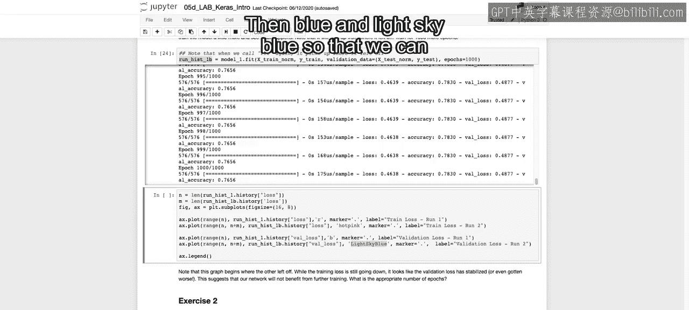

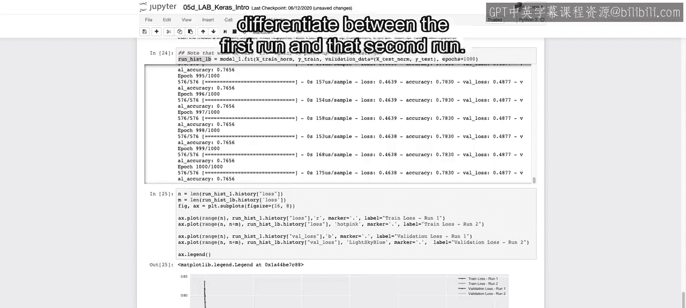

So we plot this out。And we see it continued to decrease after 200。

 and then we see the validation loss to actually also continue to decrease。

 but really start to flatten out and the training loss decreased even further not at that same rate as it began to fit and perhaps overfit a bit to that actual data。

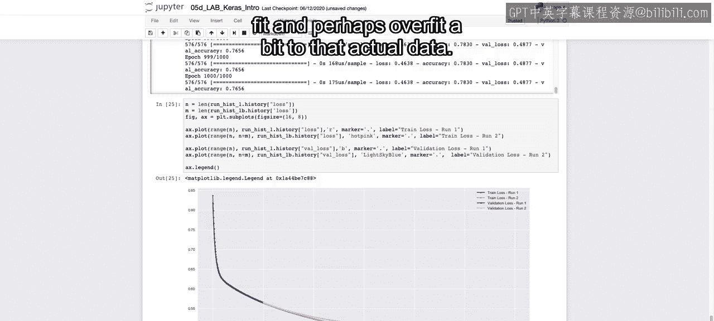

So that closes out our first neuralNe model， playing around with running it through different epochs。

 seeing that plot and the output once we fit that model。

 and in the next video we're going to try and play around with different models。

And see what kind of effect that'll have on overall accuracy as well as how fast it'll be able to fit All right。

 I'll see you there。

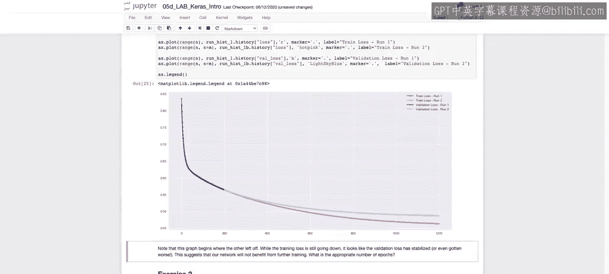

