# 068：IBM《机器学习（无监督学习、深度学习和强化学习、毕业项目）｜machine learning》中英字幕 p68 29_优化器和动量.zh_en -BV1eu4m1F7oz_p68-

Now let's talk about optimizers， so in this video we're going to discuss different optimizers available to us when learning the appropriate weights for our given data and our neuralNe model。

So far we've discussed different approaches to gradient descent that vary the number of actual data points involved in each one of our steps in our gradientcent steps。

 such as a single data point in srcasastic gradient descent。

 a subset of data points with mini batch gradient descent。

 and the entire set with full batch gradient descent。Now， no matter what we use。

 they all have that same update formula to find the optimal weights。

Our weight at the next iteration is going to be equal to the prior weight minus the gradient times sum learning rate alpha。

But there are actually several variants to the step of updating the weights that will give us better performance。

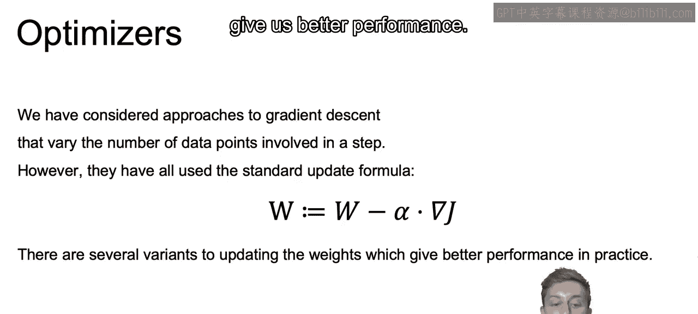

And these tweaks to the updating step will all be built around improving further and further from this original formulation that we see here。

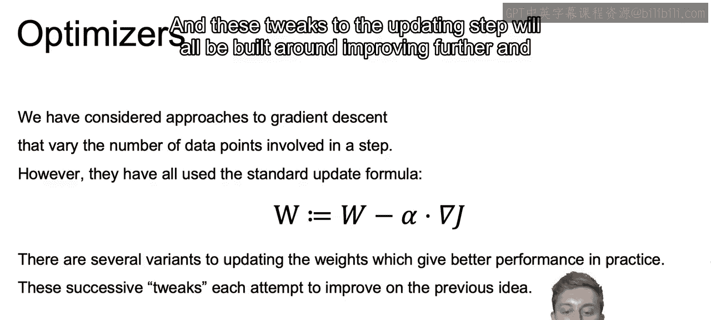

And these different methods of updating the weights or optimizing these weights are going to be called optimizers。

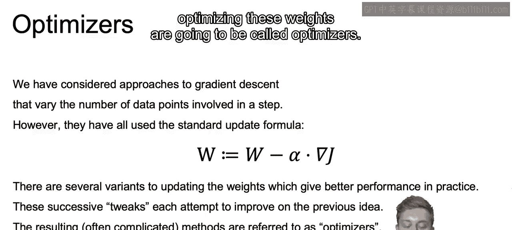

So let's start with the concept of momentum。With the regular gradient descent。

 you'll generally move slowly towards your optome and you can be changing direction fairly frequently。

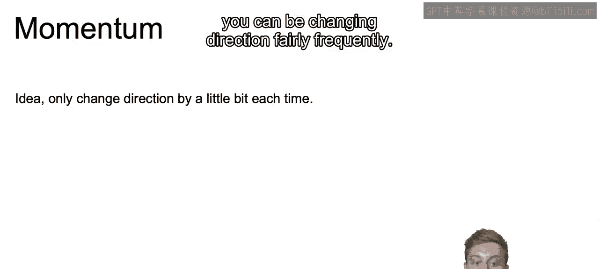

Now with momentum， you're going to smooth out this process。

And you do this by taking somewhat of a running average of each of the steps and thus smoothing out that variation of each of the individual steps for regular gradient descent。

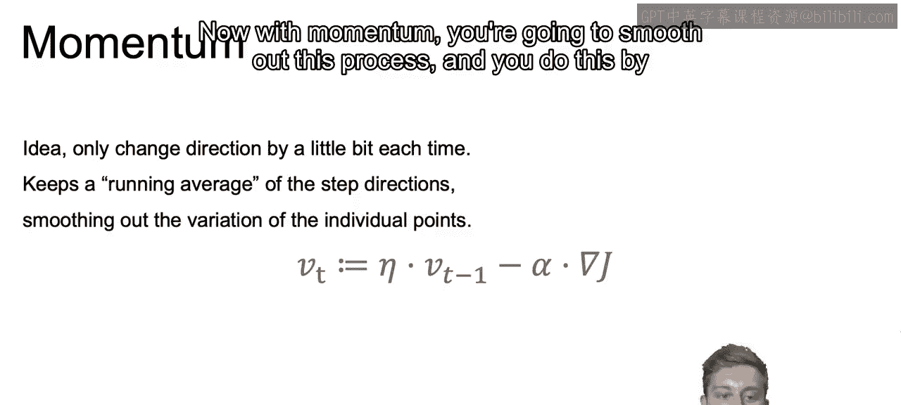

So if we look at our formula， we see that rather than just updating our weights with that gradient。

We also look back to prior values to smooth out these steps。

So this V at step T that we have will incorporate some amount of V at time or at step T 1。

As well as the current gradient at the step that we are at。With this in mind。

 our end value here is going to denote our momentum hyperparameter。

And the larger the value is for that momentum hyperparameter。

 the more we are going to be smoothing out our values。In other words。

 the more we are incorporating past values into our running average。

And we'll be giving values less than one in general。And a common value chosen here is going to be 0。

9， but again， if you want smoother steps。Use a higher value， otherwise use a lower value。

Also worth noting。If you want to look at perhaps further reading on your own in regards to momentum。

 often that term n is going to be replaced by beta。

 so beta is going to be the common nomenclature for that value。

And the alpha is replaced by one minus beta。So n is going to be replaced by beta and the alpha that we see here that we're used to using as that learning rate is going to be 1 minus beta。

And when we choose our n and our alpha in practice。

 we may want to keep in mind using this relationship， so if we choose an n equal to 0。9。

 you'll probably want to use an alpha around 0。1。

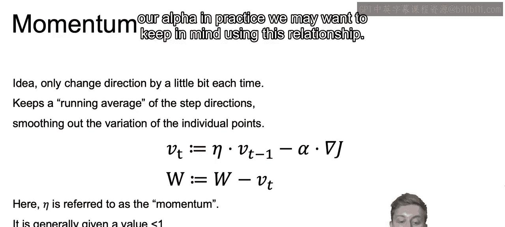

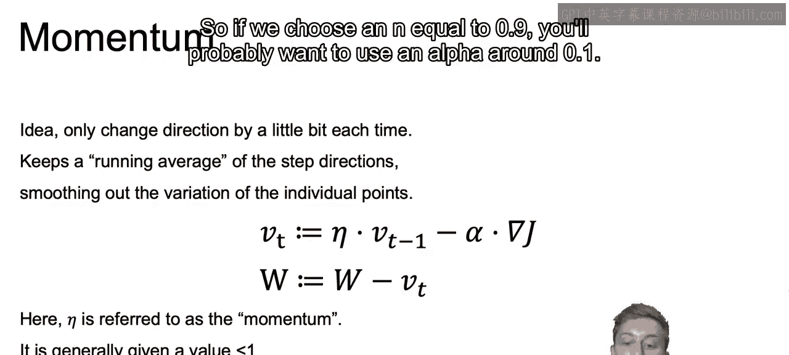

So just to show this in terms of a picture。For gradientd descent。

 we can see that we take small steps that can fluctuate quite often。

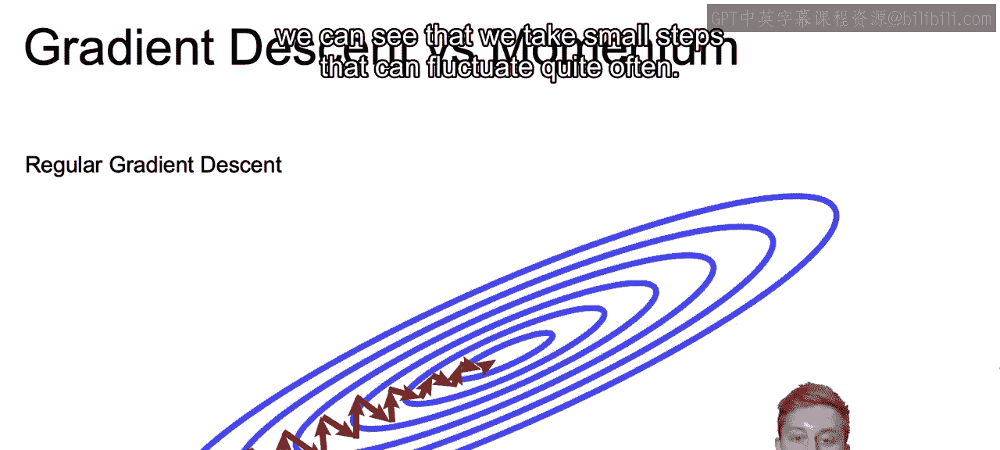

Now with momentum。We tend to smooth out those steps。The fluctuations aren't going to be as dramatic。

And the steps can get much larger as momentum is gained。

Also worth noting is that momentum can cause you to actually overshoot your optimum value。

But the momentum will shrink at this point and you should be able to come back to that optimal value as we see here in the picture。

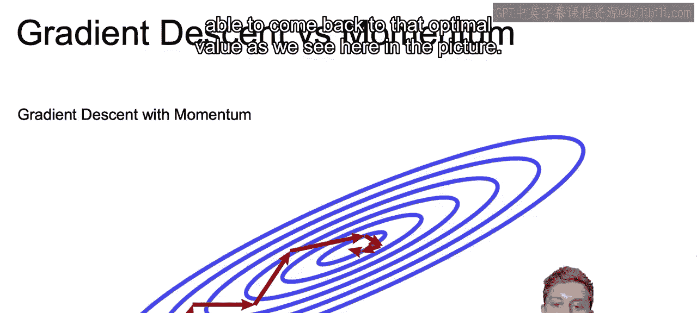

So the idea with Nera momentum， which will build off of the momentum we just learned。

 is going to be that it'll look and control for this problem of overshooting。

 and they'll do so by looking one step ahead。

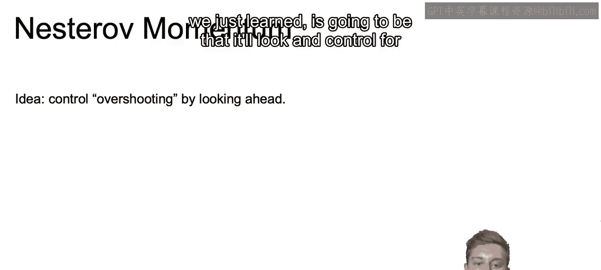

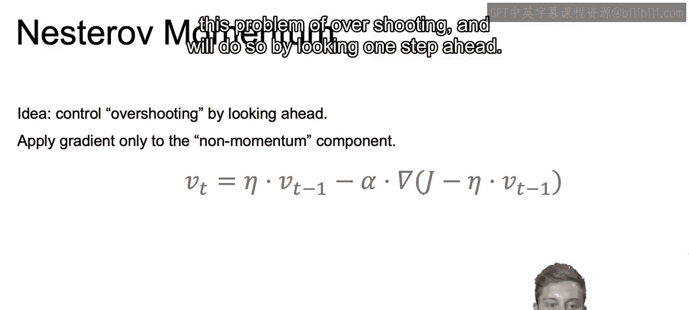

So now rather than just taking the momentum and taking into account the gradient at the current step。

We take the momentum and the gradient at the step with that momentum accounted for。

So you see rather than just taking the gradient of the cost function as we did before。

 we take the gradient of the cost function with n times to the Vt minus1 time step before accounted for。

And this will work because generally speaking， the momentum vector will be pointing in the right direction。

 so it'll be a bit more accurate to use the gradient with the momentum accounted for than the gradient at that original position。

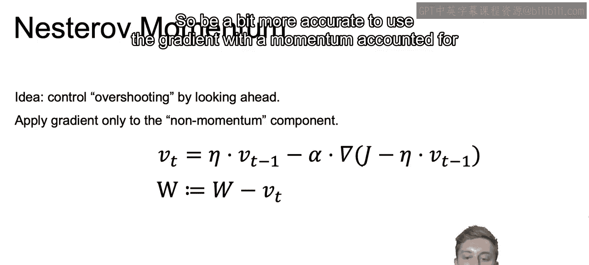

So if we think of standard momentum steps， we see that by using the past steps。

We can take larger steps that are closer to the correct direction。And if we separate out now。

 just that momentum term in our last equation。This is going to be the direction that it actually takes。

And then taking the gradient with a momentum accounted for， as we do with Nerov momentum。

We have this extra correction in the right direction。

And the nest offset move even more smoothly towards our optimal value。

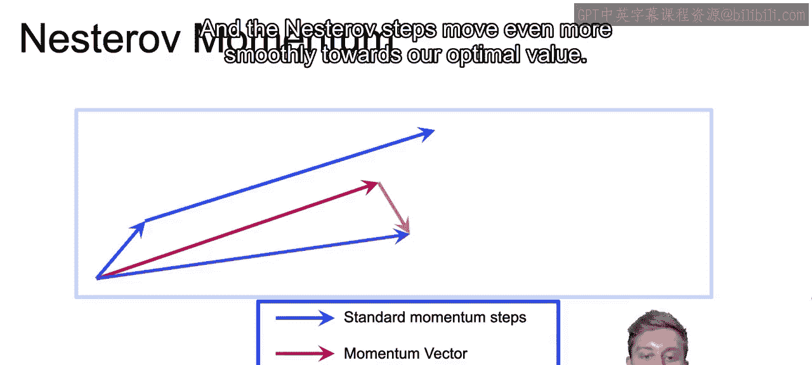