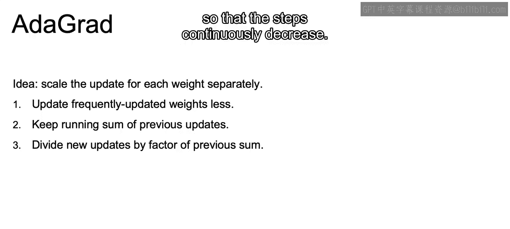
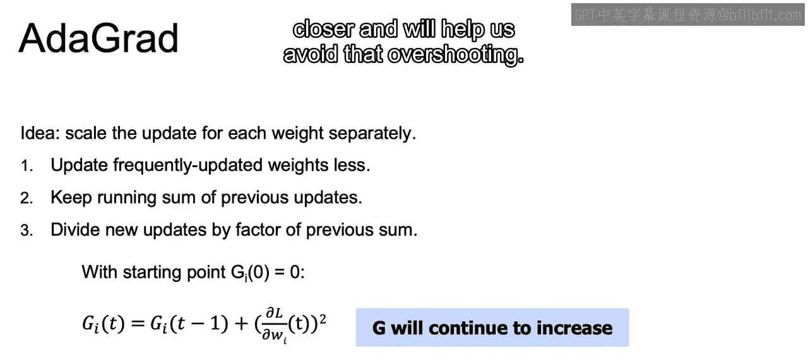
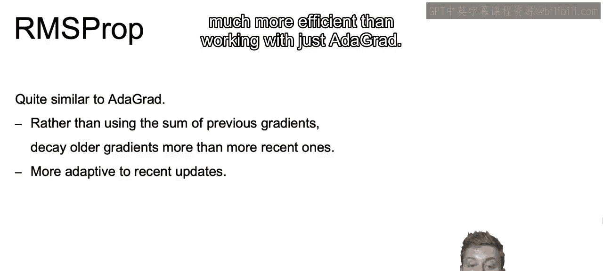
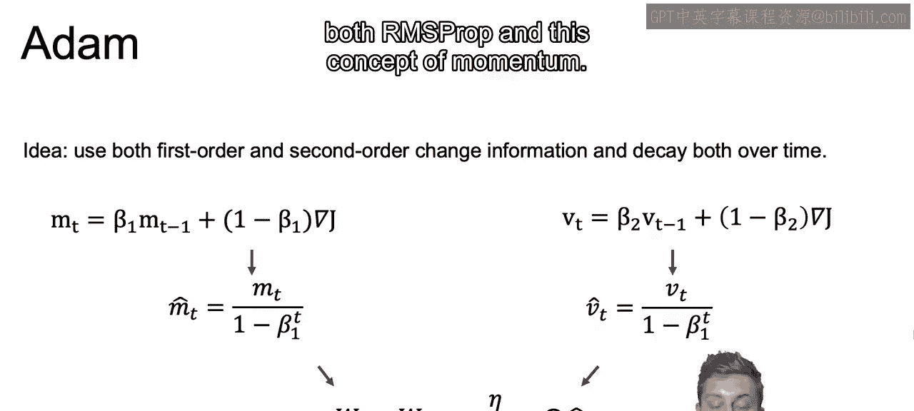
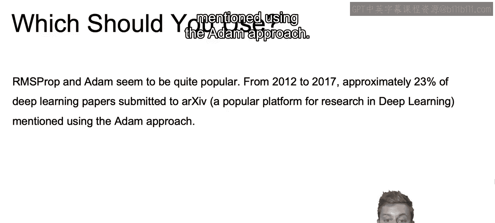
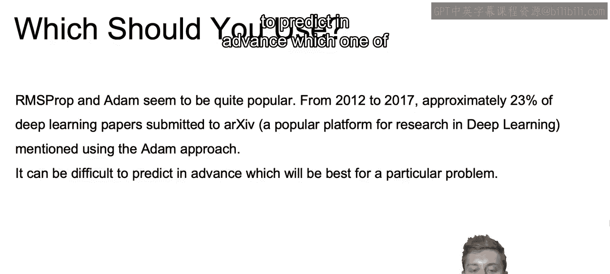
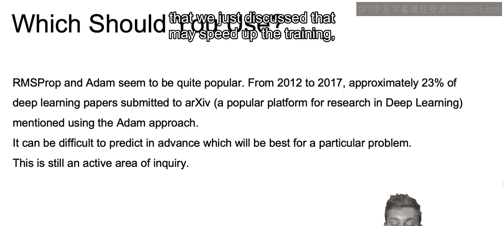
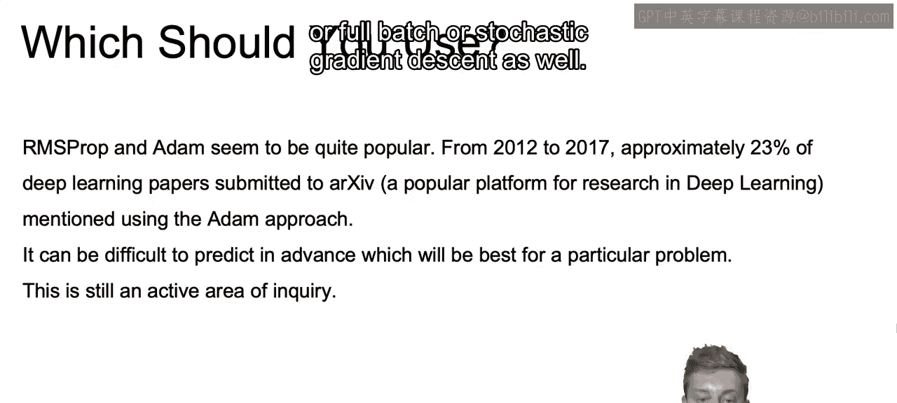
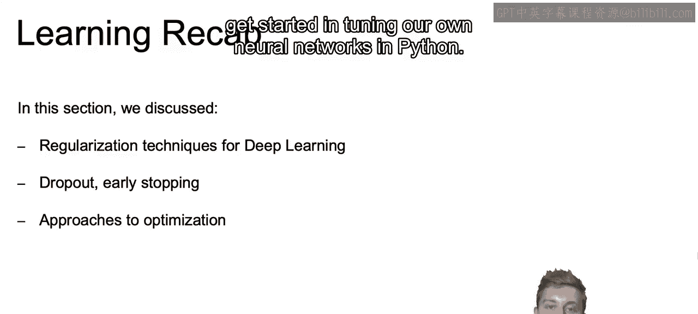

# 070：IBM《机器学习（无监督学习、深度学习和强化学习、毕业项目）｜machine learning》中英字幕 p70 31_流行的优化器.zh_en -BV1eu4m1F7oz_p70-

Now let's move a bit away from this concept of momentum and talk about the Addgra optimizer。

 which is short for adaptive gradient algorithm。The idea here is to scale the update for each weight separately as we do our grading descents and we update our weights。

So what will this do？What this will do is it'll update frequently updated weights a bit less。

And while updating。It will keep a running sum of each of the prior updates。

And then any new updates will be scaled down by a factor of the previous sum so that the steps continuously decrease。

 so let's look at what this actually means。

The key difference when we do add agrad compared to our normal gradient descent。Is this term G？

And this term G will continue to increase， as we'll be starting at zero。

 and we'll keep on adding squares of that derivative that we see here。

 and obviously squares will always be positive， so G will continuously increase。

Then in order to update W， rather than just using the learning rate。

We use learning rate divided by the square root of this G value。

And since G is continuously increasing。We know that the learning rate will continuously decrease。

 and this will lead to smaller and smaller updates at each iteration。

So as we get closer and closer to the optimal value。

 that learning rate will shrink as we get closer and will help us avoid that overshooting。

Now I'd like to move on to another optimization method， namely RMS prop。

 or root means square propagation is what that's short for。

Now we're working with a very similar functionality as the outergrad that we just discussed。

Except that rather than just using the sum of our prior gradients。

 we're going to be decaying older gradients and giving more weight to more recent gradients。

And this can be similar to the functionality that we use for momentum Now we're just using that weighting that we discussed for momentum except for the learning rates。

And this will allow for updates to be more adaptive to recent gradients and is usually much more efficient than working with just Aiggrad。

And then finally we have this concept of atom， this optimizer atom。

 which is for adaptive moment estimation， don't worry too much about what it's short for。

 but this will combine both the concept of momentum and this RMS prop that we just discussed putting them both together。

So on the left side here， we have values similar to momentum。

 If you recall our discussion during momentum， we're just going to be' replacing our n with beta 1 and our alpha with 1 minus beta 1。

 which can be used for the momentum in our past formula as well as we discuss。

Now we didn't get into the math of RMS Pro， but I did mention that it'll work similar to the formula for momentum。

 which is what we see here to the left。So to the right for RMSs props。Our BT value。

 which synthesis for Rs Pro portion， is specific to our learning rate。

We'll have a very similar update to give most weight to the most recent values。

Now I'd like to note here if you're trying to figure out how to default each one of these values beta 1 and beta beta 2 by defaults。

 beta 1 will be 0。9 and beta 2 will be 0。999 and they generally do not need to be played around with too much。

 but you can play around with them bit if you find that you're not getting to the optimal model。

Now there's going to be a bit of bias built into each of these terms。So for M T。

 you're going to want to correct that bias by dividing by 1 minus B to the T。

 And this is meant more for correction towards the beginning。 As you can imagine， as T is growing。

 the larger T is， the smaller B to the T will be。 Itll continue to shrink as T grows。😊。

And then we do the same for VT。Which， again， is the RMS prop portion。And finally。

 we update our weights using our special learning rate scaled for VT that we just calculated。

 multiplied by our momentum term entity。And there we have it。

 our atom Opr combining both RMS Pro and this concept of momentum。

Now， which one should we choose between each one of the optimizers that are available to us？Now。

 RMS ProP and Adam have become quite popular and from 2012 to 2017。

 approximately 23% of deep learning papers submitted to this popular platform for research in deep learning。

 mentioned using the at approach。

Now， it can be difficult though， to predict in advance which one of these approaches will work best for a particular problem。

And this is actually still an active area of inquiry in deep learning research。 Now。

 I would say it's important to note that while atom speeds up the optimization process tremendously。

And usually does a fairly good job at finding optimal solutions。

 there are going to be times when it does have trouble conversion。

And there are actually even different versions of at that have been implemented in that have been discovered recently。

And with that， I would say。Whether using different iterations of atom or other optimizes that we just discussed that may speed up the training。

 if you're still having trouble with convergence， I would note to at least try using just regular mini batch gradient descent or full batch or srcchastic gradient descent as well。

So just to recap。In this section， we went over why it's so important to have regularization with deep learning models as these complex models are powerful enough to fit almost exactly to our trading data。

 and with that in mind， we went over different regularization techniques。

 such as what we've seen in Ridge with adding on a penalization term for higher weights within that cost function。

😊，As well as as we see here in the next bullet using dropout so that our models aren't over reliant on particular pathways through the network。

 as well as early stopping， where we may be checking against a validation set as we train to prevent our overfitting。

And finally， we discuss different optimizers available to us beyond that regular gradient des set。

 including using momentum， RMS prop， or combining the two using atom。

Now that closes out this set of videos in the next set of videos。

 we'll review some of the extra pieces to keep in mind when building out our actual neural networks that will close out all we need to know to get started in tuning our own neural networks in Python。

All right， I look forward to seeing you there。

