# 071：IBM《机器学习（无监督学习、深度学习和强化学习、毕业项目）｜machine learning》中英字幕 p71 32_训练神经网络的细节.zh_en -BV1eu4m1F7oz_p71-

In this section， we're going to cover some final missing pieces to keep in mind before starting to look into actually coding up our own neural networks。

Now let's go over the learning goals for this section。In this section。

 we're going to cover some of the details of training neural network models。

 and a lot of this will be reviewed， as we'll go back over stochastic gradient descent。

 as well as other batching approaches and important terminology and the reason why we do this is because once we start to actually implement our neural nets in Python。

 we'll actually have to de tune each one of these different parameters as that we're going to discuss here。

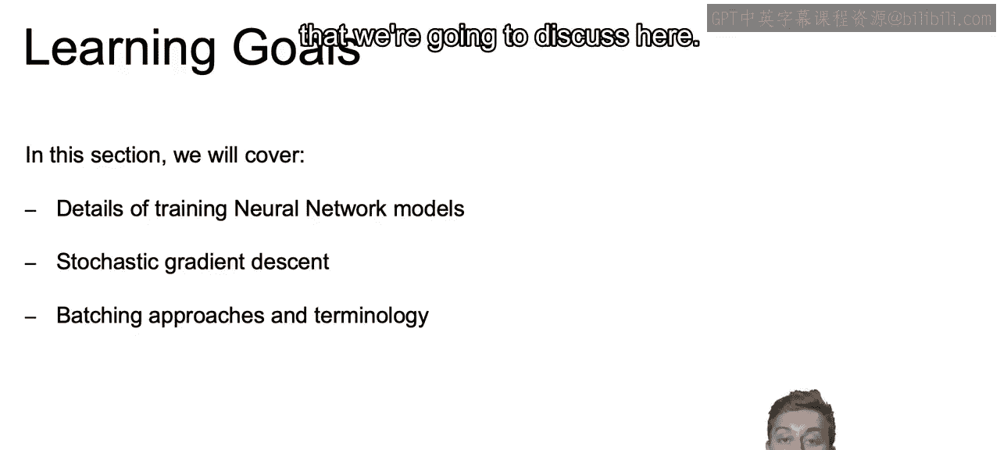

So given our different data points within our data set。

We now know how to compute the derivative for each one of our weights。

And we went over different options on how to use that derivative to update our weights using different optimizers。

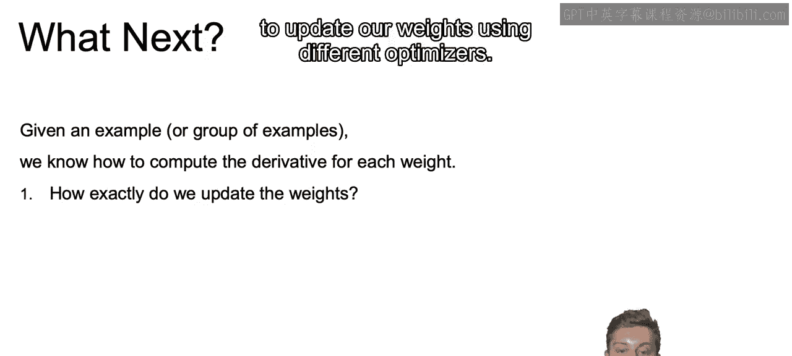

And now I want to review how often we should actually go about updating our weights。

As this is going to be something again that we're going to have to tune when creating our neural net models in Python。

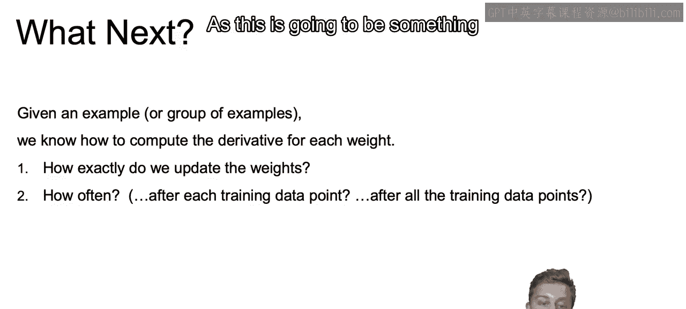

So what do I mean by how often we need to update our weights？

Or going back and reviewing this idea of using all of our data set， part of our data。

 or maybe even just a single row。So in our classical approach。

 we'll be getting the derivative for the entire data set。

And we'll use that derivative to update our weights。So we're using the entire data set。

The pro of this is that each step will be informed by all data。

But the con will be that this contentt to be very slow。

 especially as that dataset set grows very large。

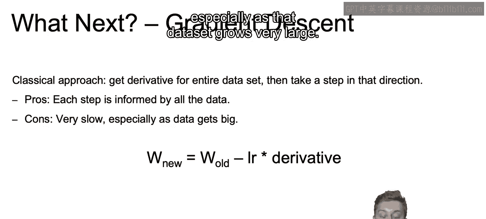

Now on the other end of the spectrum， we again have stochastic gradient percent。

And with stochastic gradient descent， we get the derivative at just a single row at just a single point and take a step in that direction。

This means that the steps may be less informed， each one of those individual steps。

 but you'll ultimately take many more of those steps as you run through your entire data set。

And the hope is， and the idea being that with us being able to quickly take more steps。

 it will ultimately balance out any missteps you make along the way。

With the idea that you can take missteps at every iteration。

 you probably want a smaller step taken each time so you don't veer too far away in the wrong direction。

And also since it won't be perfectly fitting to the entire data set。

This will also help in slightly regularizing your model as well。

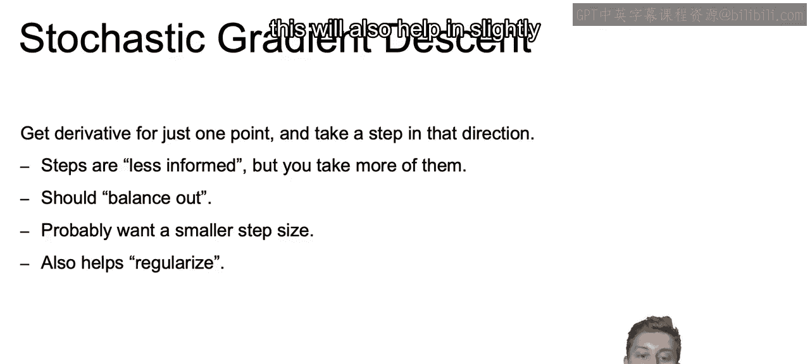

And then we have our compromise using mini batch gradient descent。

And here we'll get the derivative using just a subset of our data set and then take a step in that direction。

 according to the derivative of that subset。The typical mini batch size will tend to be 16 or 32 rows and you can tune this approximately the more rows that you choose。

The slower it may take to learn again， think about the sarcastic gradientding descent being a single row learning very quickly。

 so the larger you have to learn that derivative on， the slower it may take。

And the idea of this compromise is meant to strike obviously a balance between the extremes of that full batch gradient descent and storcchastic gradient descent。

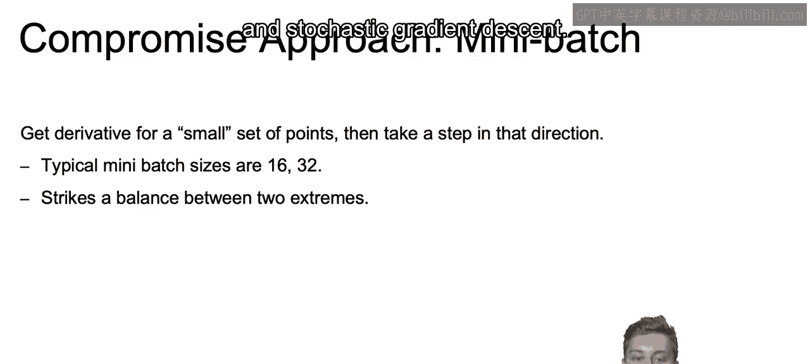

Now， just to hammer this all home， let's visualize each of these approaches in comparison to one another。

 So we see all the way to the left ear。Faster and less accurate steps and all the way to the right will have slower and more accurate steps。

 and I want you to think given everything we just discussed。

 where stochastic gradient descent will fall， where mini batch gradient descent will fall and where full batch gradient descent will fall。

So all the way here to the left。As I hope you predicted on your own。

 we're going to have a stochastic gradient descent where we'll have faster， less accurate steps。

And then we see the zigzag going as it tries to optimize the model。

Then on the other end of the spectrum。We have full batch gradientding descent。

 which is going to be that slower but more accurate steps taken。And then finally。

 we have our compromise in the mini batch gradient descent， where it falls somewhere in the middle。

 it's not quite as fast as stochastic， but faster than full batch。

And it's not quite as accurate as full batch， but it is more accurate than stochastic gradientdiant descent。

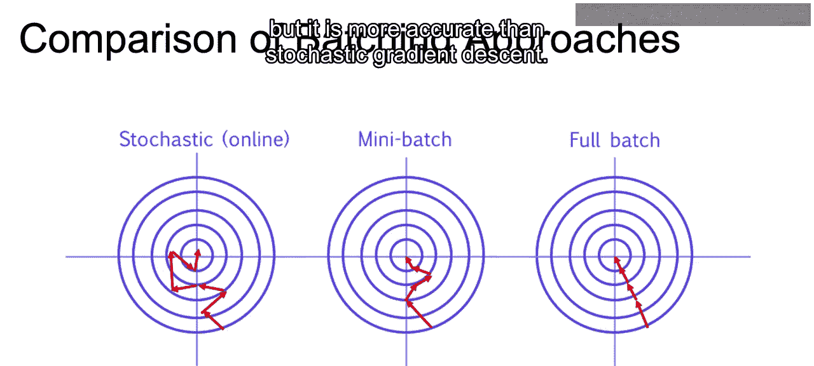

Now， just to review some batching terminology， we have full batch using the entire data set to compute the gradient before updating。

 we have mini batch， which uses a smaller portion of the data。

 but more than just that single example that you would use with stochastic gradient descent。

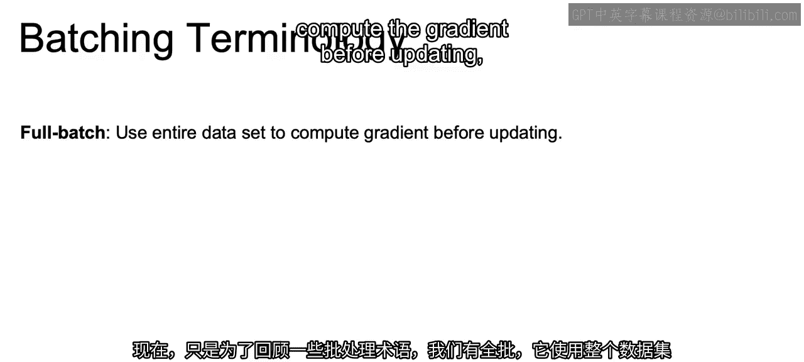

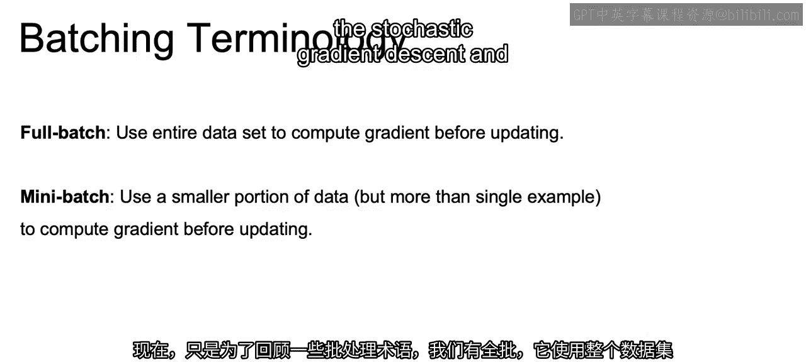

And then we have stochastic gradient descent， which just uses a single example to compute the gradient before updating。

 though sometimes something to note as you do some learning on your own。

 people actually will use SGG to refer to mini batch。

 so be aware of that as you start to read your own literature in regards to choosing your batch size。

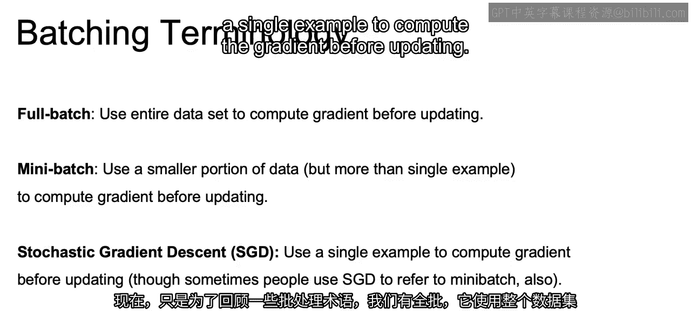

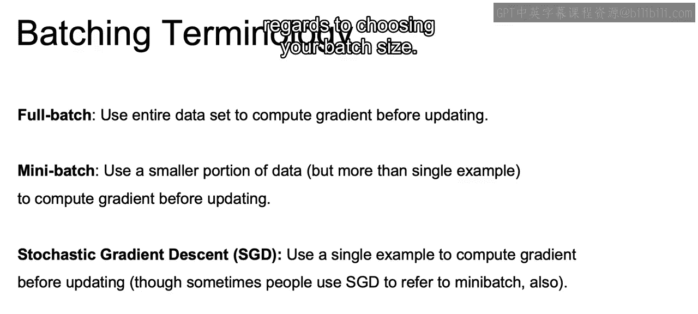

Now， another piece of important terminology is going to be this idea of an epoch。

And that epoch is going to be one of those hyperparameter that you're going to have to tomb when you are actually implementing your neural nets in Python。

And it refers to a single pass through all of the training data。 Now， what do I mean by that。

If we think about a full batch gradient descent。There would be one step taken at every epoch because we're setting how many times we're passing through the data。

 sort into every single step we pass through all the data， we do a full epoch。In SGD。

In sarcastic gradient descent。There's going to be n steps taken per epoch。

 So we're going to take as many steps as there are rows in the data set every time you run through an epoch。

 because， again， an epoch just means that we have ran through the whole data set。

And then with a mini batch， theres going to be n the number of rows divided by the batch side。

 number of steps taken per an epoch。 So if you just think about the data set being 360 rows and we say batch size of 36。

 we will take 10 steps at every single epoch。

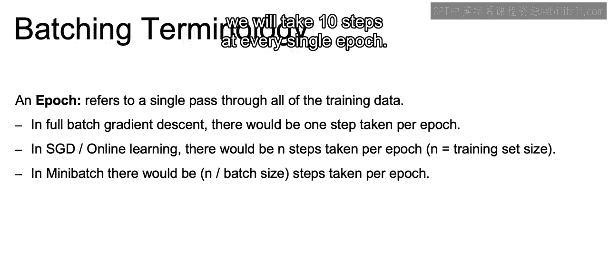

And when training， we often refer to the number of epochs that are needed for that model to be trained。

 and that's going to be an important hyperpar that we're going to tune as we try to create our own neuralNe models in Python。

So that closes out this video and in the next video。

 we're going to discuss another piece of terminology worth understanding。

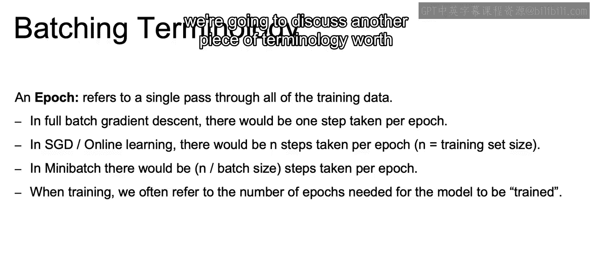

Namely data shuffling。

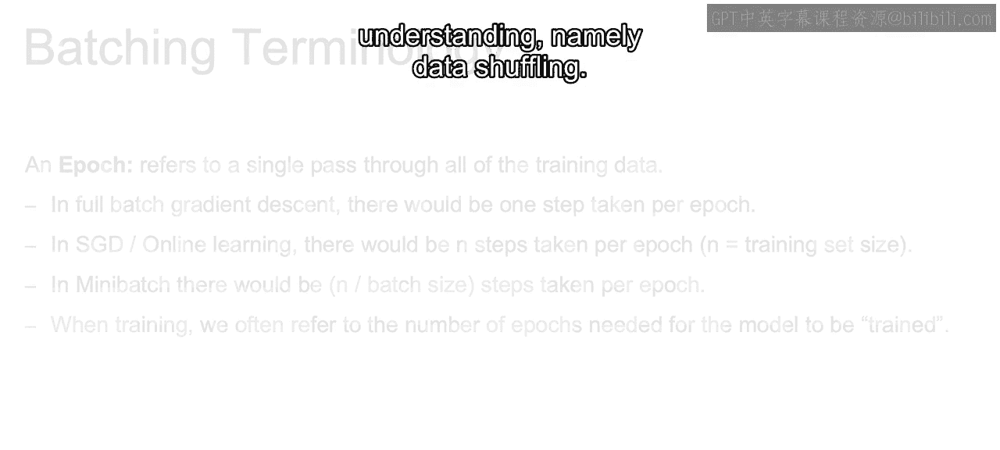