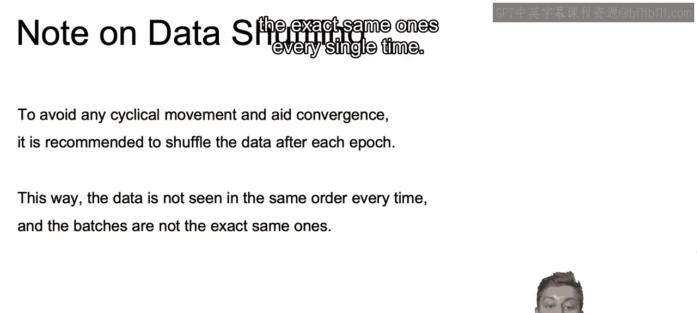
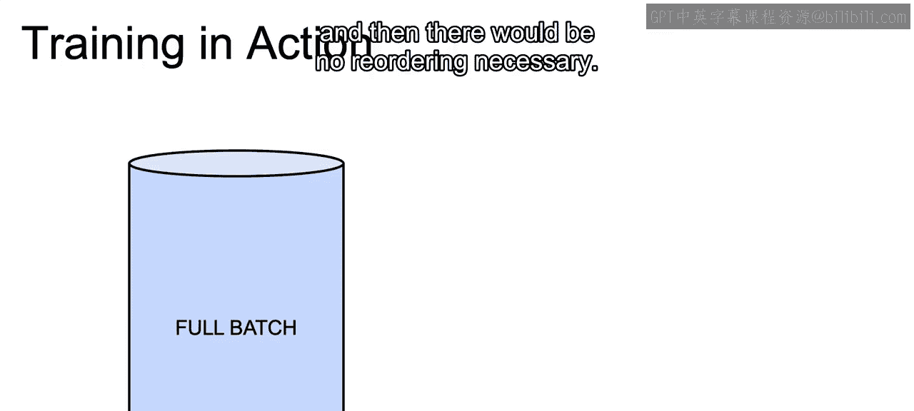
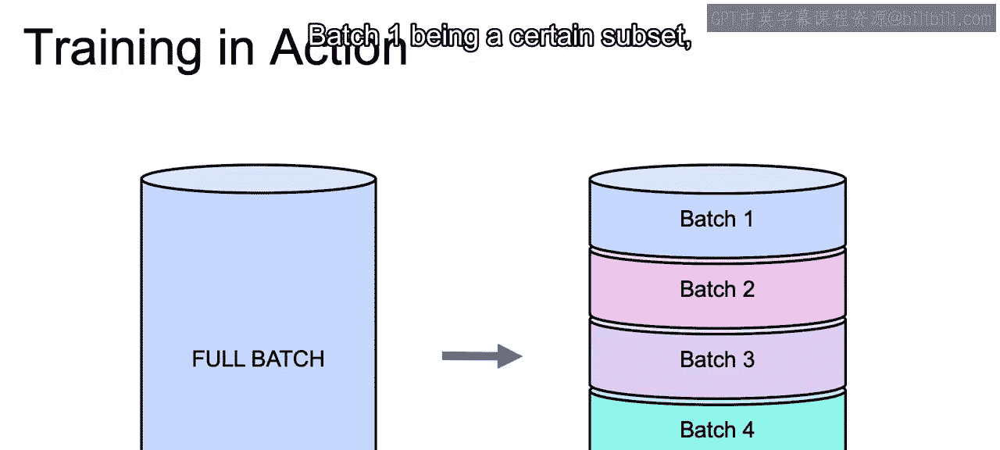
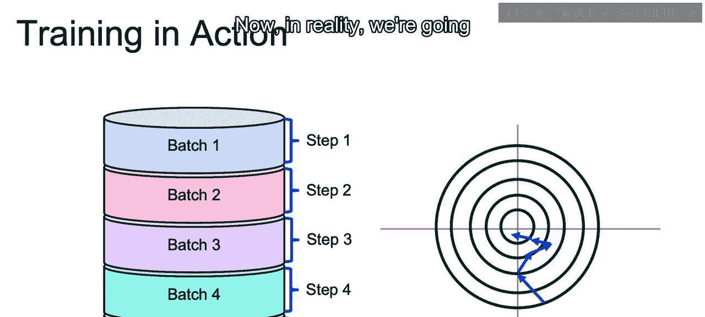
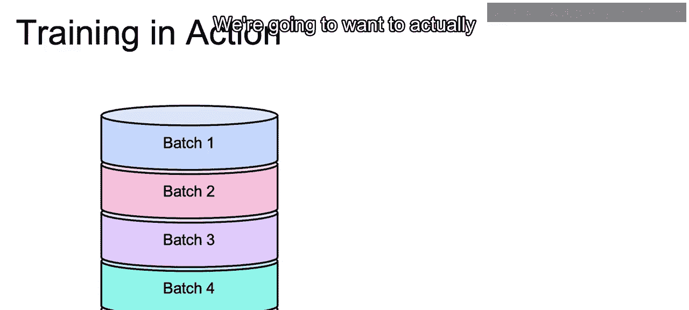
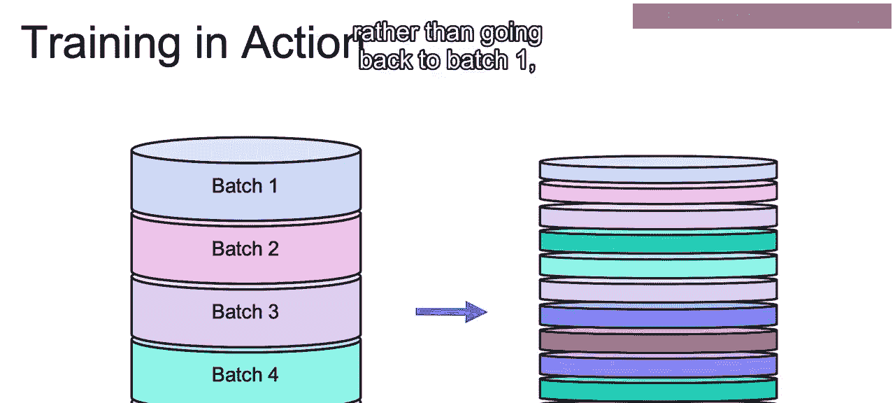
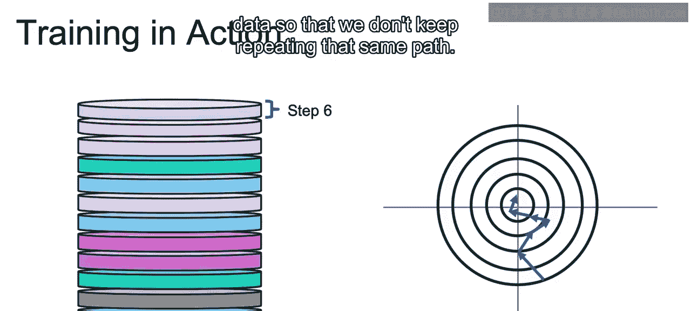
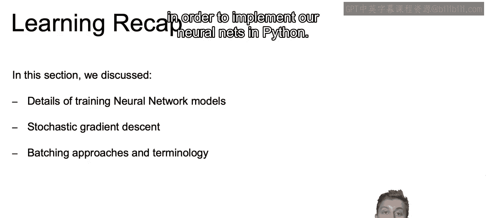

# 072：IBM《机器学习（无监督学习、深度学习和强化学习、毕业项目）｜machine learning》中英字幕 p72 33_数据洗牌.zh_en -BV1eu4m1F7oz_p72-

Now in this video， let's discuss the concept of data shuffling。

So if we think about stochastic gradient descents or mini batch gradient descents。

 we'll be going over a subset of our entire data set。So to avoid any cyclical movements。

 so to avoid us going down the same path as we do our gradient descent every time and to aid convergence。

It's recommended to shuffle the data after each epoch。By doing so。

 the data is not seen in the same order if you think about again。

 mini batch gradientdiant descent or stochastic gradientdi descent so that not you're looking at the batches in the same order every single time。

And the batches are not going to be the exact same ones every single time。

So let's go over what this actually looks like。Now， if we were to do full batch rating descent。

Then we would run through the entire data set， that would be a single epoch。

 and then there would be no reordering necessary。

Now if we are to split this into multiple batches。As we normally would with mini batch gradient descent。

 for example。There's going to be a specific ordering that we'd split it up into with batch one being a certain subset。

 batch two being a certain subset and so on。

And then recall that at each one of these batches， we find the derivative and use that to move our weights towards the optimal value。

So at each batch， we're taking another step， moving closer and closer towards its optimal value。

And once we run through the whole data set， then we've run through a single epoch。Now， in reality。

 we're going to run through more than one epoch。

We're going to want to actually have multiple run throughs of the data set。

 And just to see how many runths we have here， we split it up into a bunch of slices。

 this is meant to represent， even though it's the same length。

 multiple epochs through our full data set。

And you see that there's not that same ordering of the different colors。

 The colors are a bit random here， as after that first epoch。

Rather than going back to batch 1， it's going to actually start with some other random batch。

 And that batch doesn't even have to be the same batch that we had before。

And that will be the next step and will keep running through until we reach that optimal value。Again。

 the idea being that we shuffle around our data。So that at each step。

 we are going to be looking at a different subset of data so that we don't keep repeating that same path。

Now that closes out this video。Now let's recap what we learned here in this section。In this section。

 we discussed the details of training neural network models。

 specifically working with different types of batching。

 such as we see here stochastic gradient descent or mini batch gradient descent or full batch gradient descent。

And with those different batching approaches， we discuss important terminology such as working with Epochs and understanding that an epoch is just one run through the data set and depending on whether you're doing stochastic。

 mini batch or full batch gradient descents， you will make a certain amount of steps。

Towards your optimal value at each epoch。And then we discuss this idea of shuffling。

 where if you're going to use mini batch or stochastic gradient descent。

 make sure that you're not just repeating the same steps over and over again at each epoch。

Now that closes out this video in regards to the fundamentals that we will need。

And in the next video， we'll actually introduce the library that we'll be using in order to implement our neural nets in Python。

 Allright， I'll see you there。

