# 073：IBM《机器学习（无监督学习、深度学习和强化学习、毕业项目）｜machine learning》中英字幕 p73 34_转换.zh_en -BV1eu4m1F7oz_p73-

So now I'd like to discuss actually scaling our inputs。So in our discussion of back propagation。

We briefly touch on the formula for the gradient used to update the values of our weight W。

And this will I promise tie back into scaling our input so just hold tight。

 but in order to update our weights， we take the partial derivative in respect to W and we get。Again。

 y hat minus y， which is that first partial derivative and the dot product of a。

 whatever that input was from the last layer。

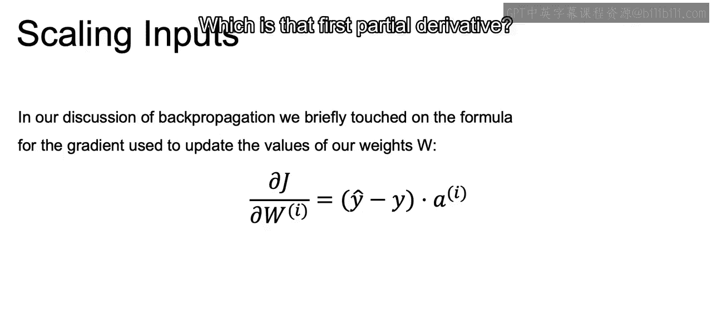

And at each iteration of gradient descent。W new， our new W is going to be that W old minus a learning rate times this partial derivative。

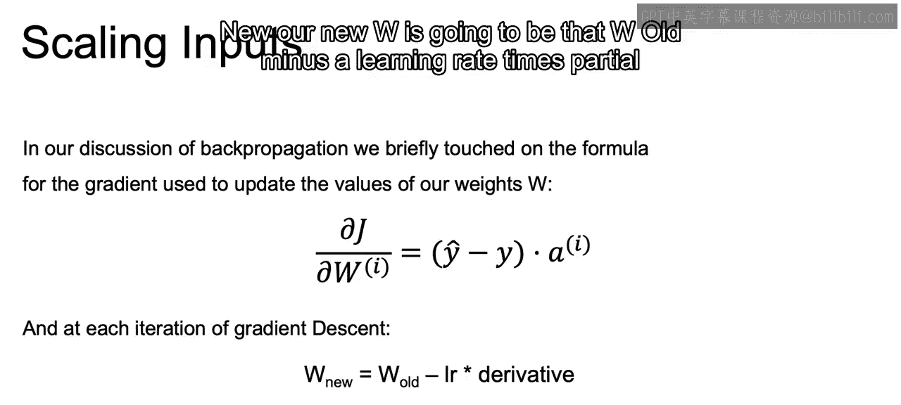

Now， when I equals zero， we are using the input values of x of those actual inputs as part of the derivative to update W New。

So those input values at that first layer are going to play a large role。

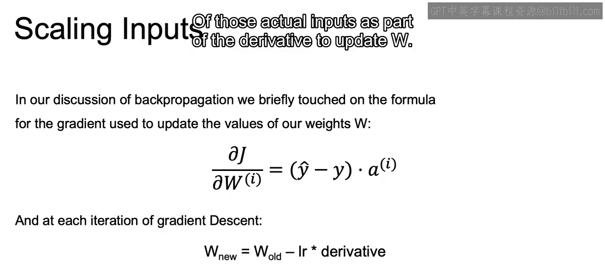

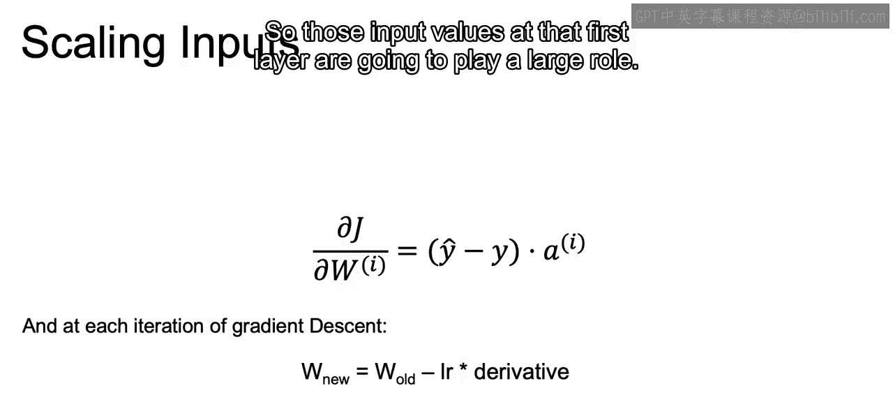

And this is going to mean that if we don't normalize the input values。

Those with higher values。Are going to update much more quickly than those with lower value。

Because again， we're using the AI from that prior step in order to update our values。

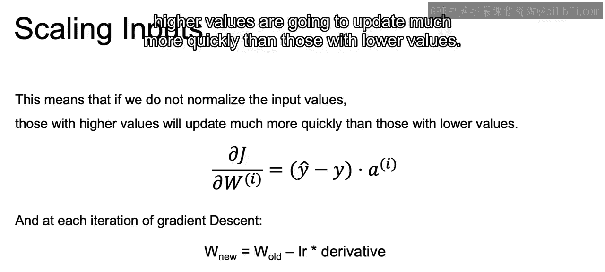

So if we have them on different scales， higher values will update quickly and the lower values will not update as quickly。

 throwing off the way that we update our actual models。

 right this imbalance can greatly slow down the speed at which our model actually converges。

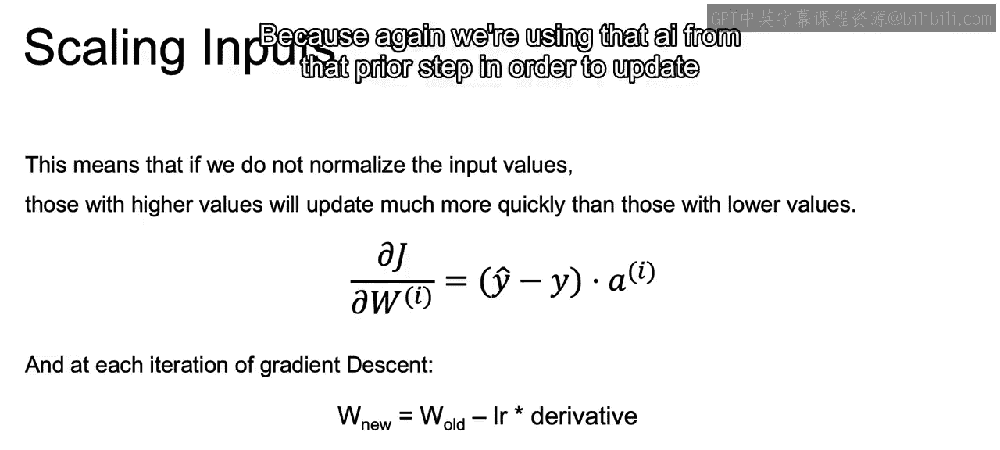

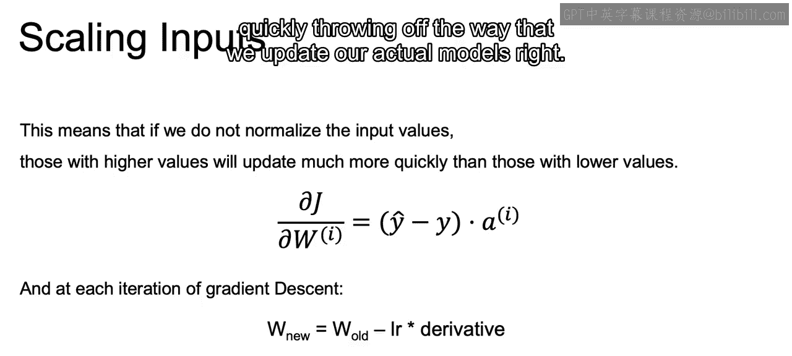

So for that reason， we need to scale our inputs and different ways that we can scale our inputs that we've discussed in prior courses is the linear scaling to the interval between0 and1。

 which is going to be our midmac scaling， which is X minus x min over X max minus x min to ensure they're all between 0 and1。

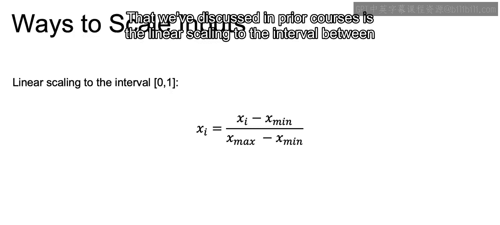

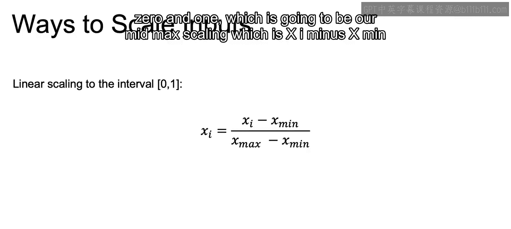

Or we can do here linear scaling to the interval between negative  one and 1。

 which is just going to be two times X I minus x min over x max minus x min minus1。

 and that just ensures that you have values between negative 1 and1。And again。

 we could also use that standard scalar， sometimes we want these values between zero and1 or between negative one and one。

 because if you think about using the sigmoid function or the hyperbolic tangent function。

 that will allow for each one of our inputs and outputs to stay on that same scale。

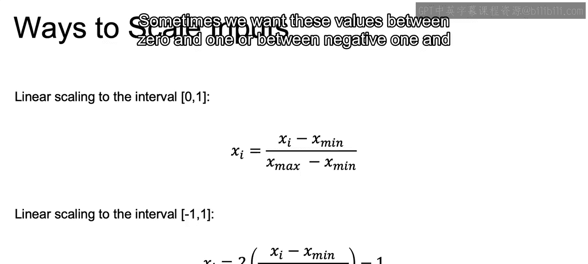

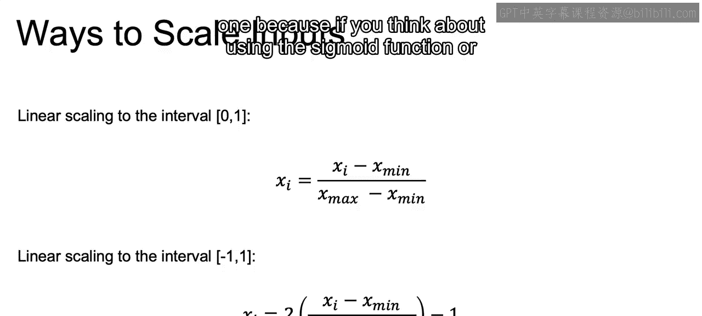

So let's recap what we learned here in this section。

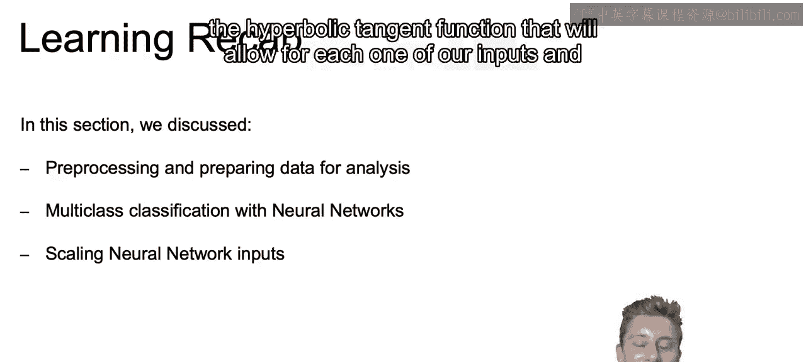

In this section， we discuss preprocessing and preparing our data for our neural net models。

 and with that we introduced how we can do multiclass classification with neural networks using that one hot encoding as well as the softmax function。

 and then we discuss the importance of scaling your neural network inputs to ensure that you have balance updates of each one of your weights。

 and we talked about how you can use different scalar similar to the Minmac Scalar or the standard scalealar to ensure that each one of your values on the same scale。

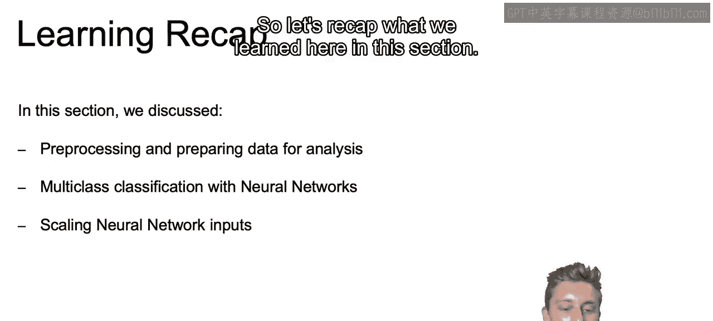

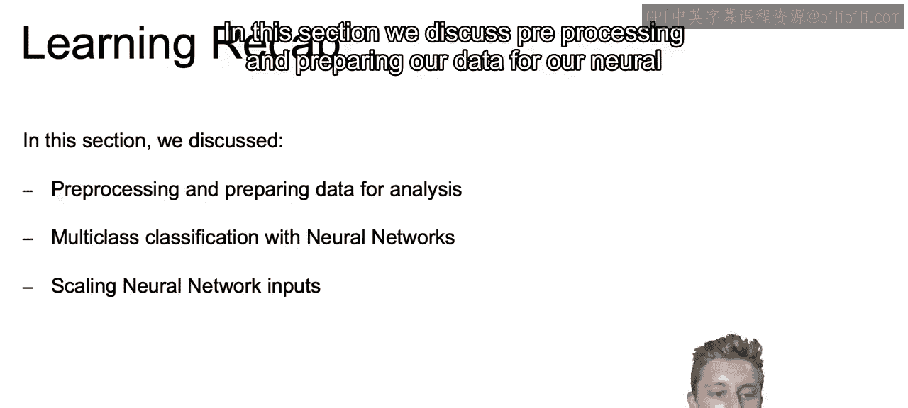

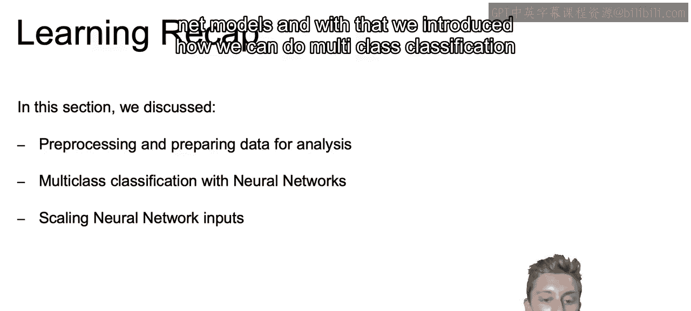

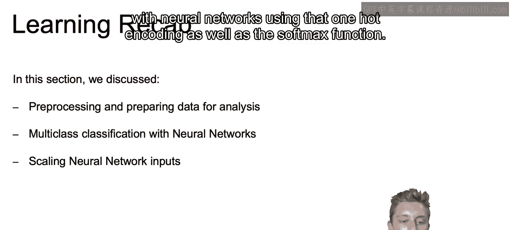

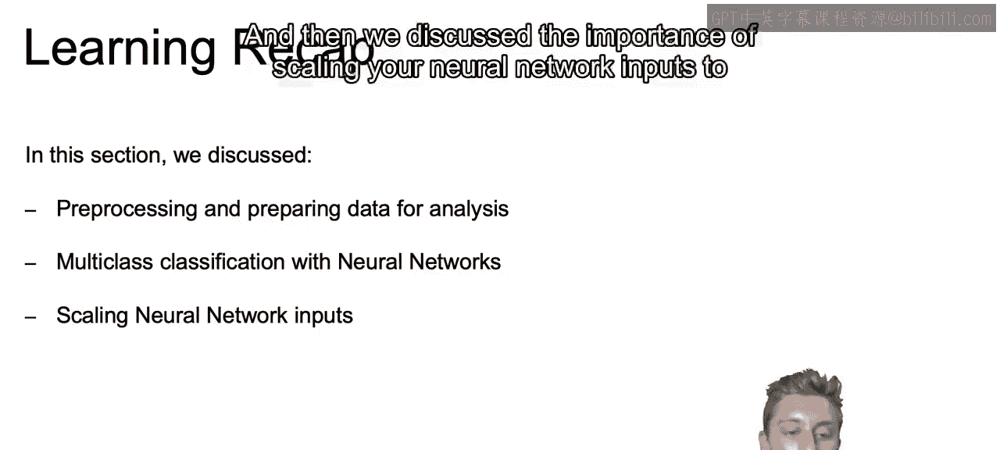

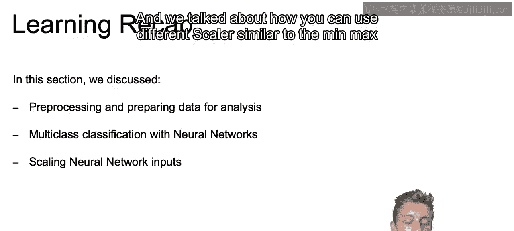

So that closes out our discussion here on different transformations that are important for your different neural net models。

 and in the next section， we're going to introduce our first different type of model framework for our neural networks。

 namely convolutional neural networks Allright， I'll see you there。

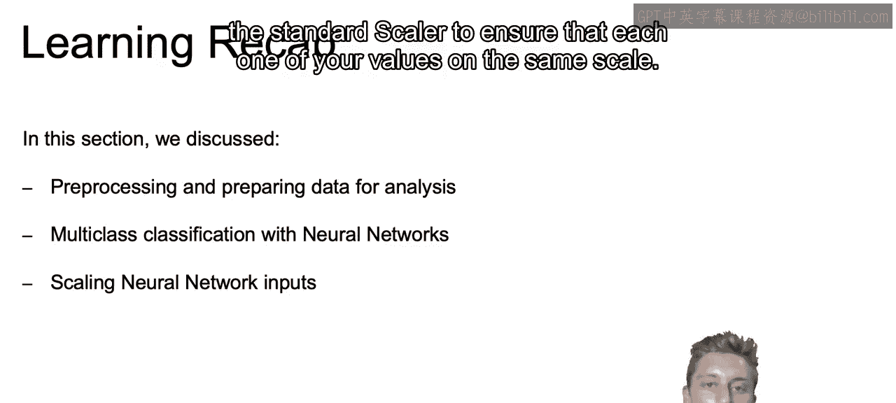

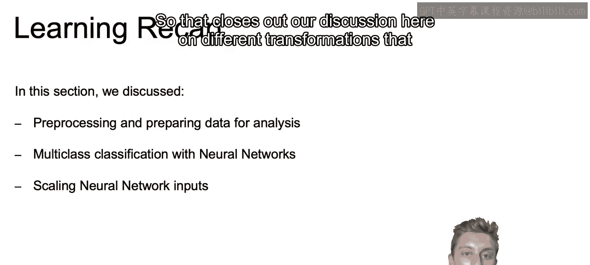

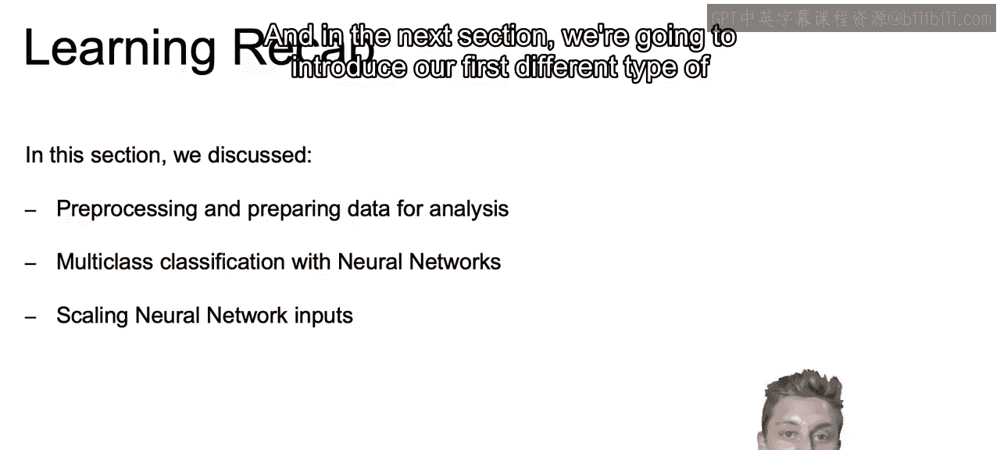

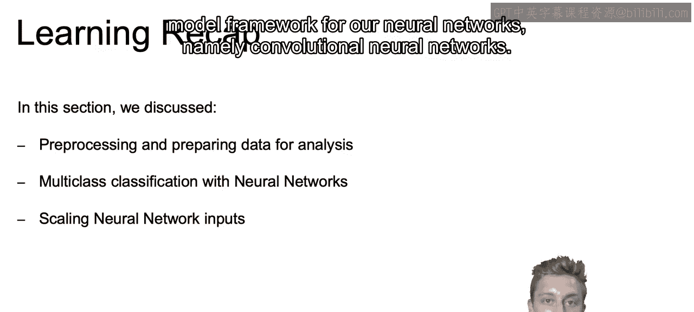

