# 076：IBM《机器学习（无监督学习、深度学习和强化学习、毕业项目）｜machine learning》中英字幕 p76 37_图像数据集.zh_en -BV1eu4m1F7oz_p76-

Now， fully connected image networks， thinking about the number of pixels in image as that starting number of features。

 all being fully connected to the next hm layer。

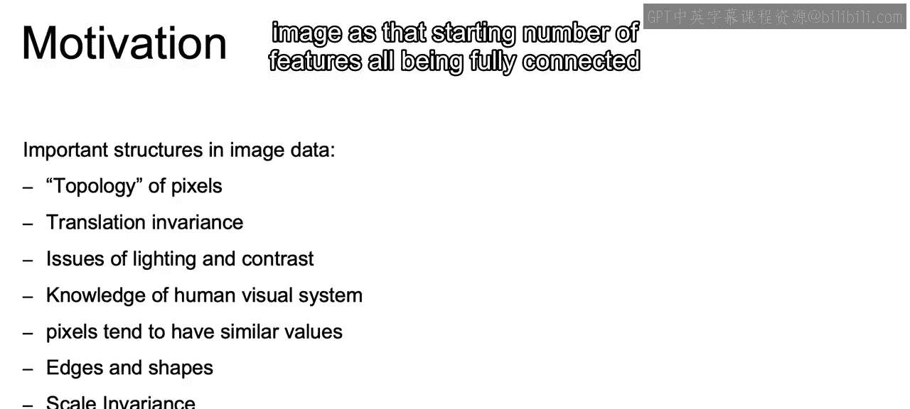

Would tend to require a vast number of parameters。

And taking advantage of these structures that we're discussing here will end up meaning fewer parameters。

So if we think about this Ms image that we're going to see。

 that's going to be 28 by 28 pixels on the gray scale， and that's what we see here。

 We have this example of the Ms image。

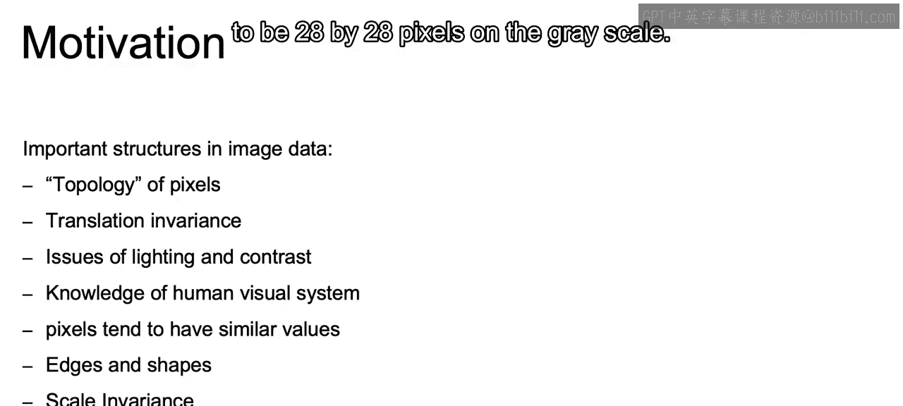

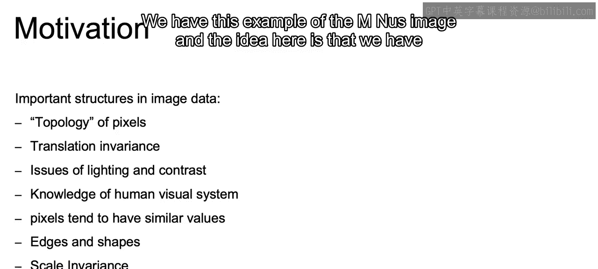

And the idea here is that we have these handwritten digits ranging from zero to nine。

 and we want to use deep learning to predict whether that handwritten image is a four。

 here or a five， six， seven， etc。

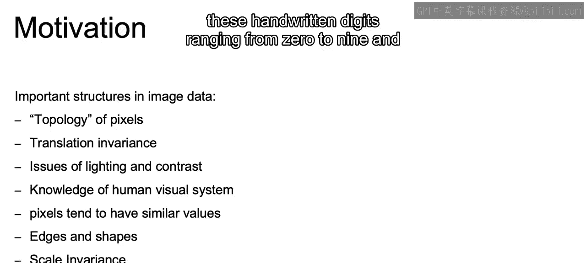

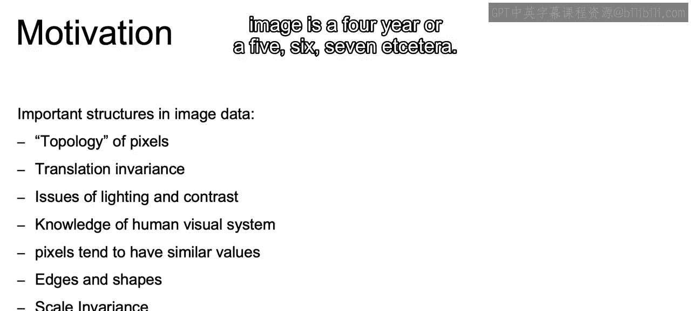

Now this is an endless image on the gray scale。

An average color image， on the other hand。Will typically contain 200 by 200 pixels。

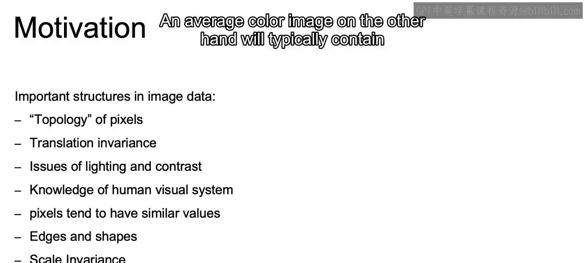

With three different color channels， red， green and blue。

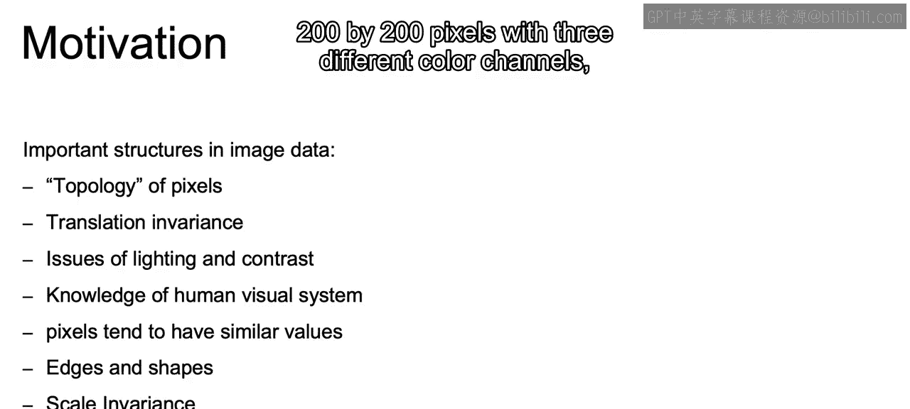

For a total of 120，000 values or 120，000 features to start out our network。

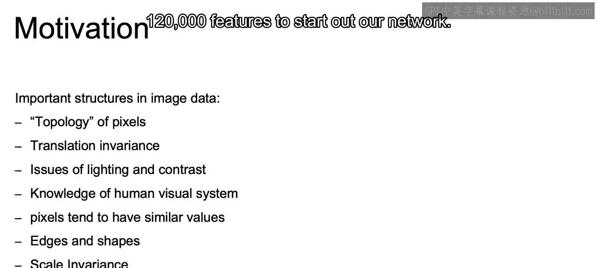

So if we imagine with that fully connected network， we will have to start off with at least 120。

000 weights just on that first initial or 1 120，001 if you include the bioer。

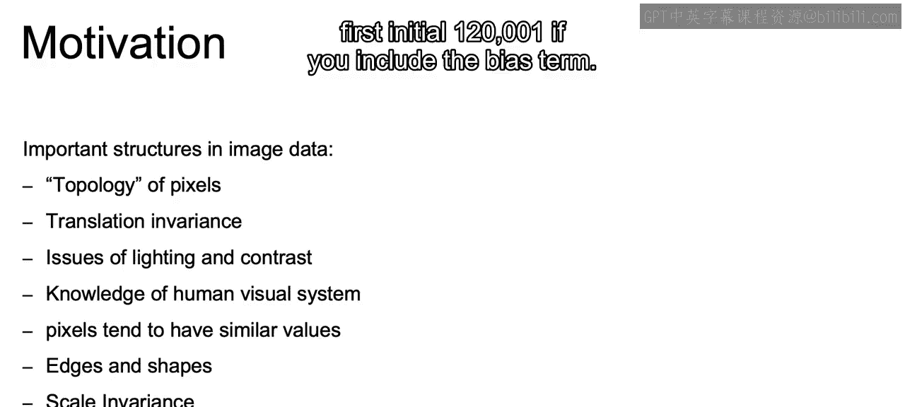

And you can even imagine a single fully connected layer would require this incredible amount of weights if we're talking about that layer being something more than one or close to what we are talking about the size of that input features。

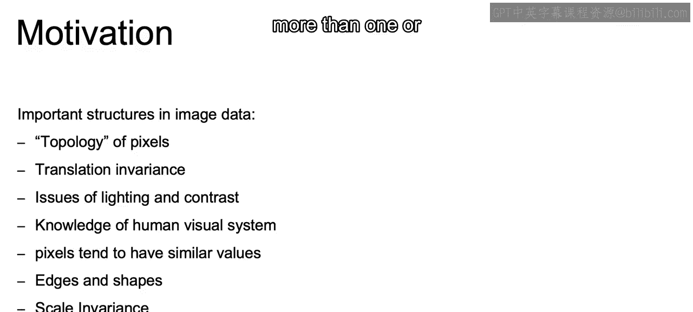

So with this many weights， that variance would be incredibly high with a very high likelihood of overfitting to your data。

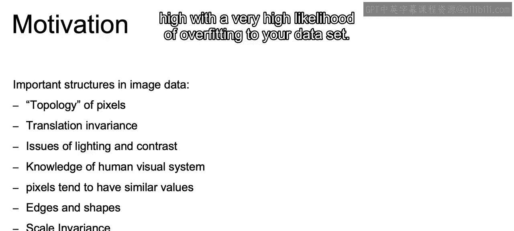

With that in mind， we're going to introduce a bias and in this case。

 a bias in relation to that fully connected network such that the architecture will be adjusted to look for certain kinds of patterns。

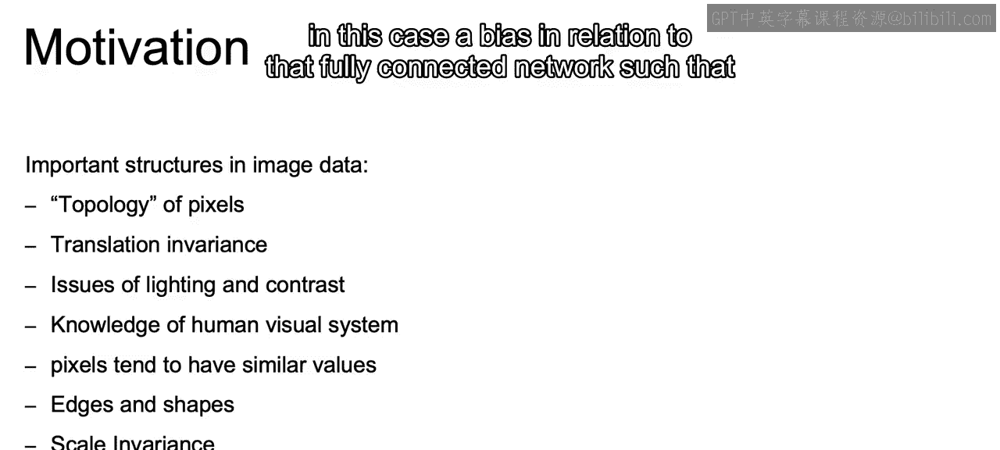

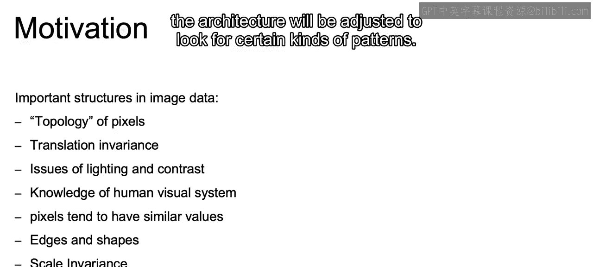

Now the motivation behind this new architecture is that different layers can learn certain intermediate features。

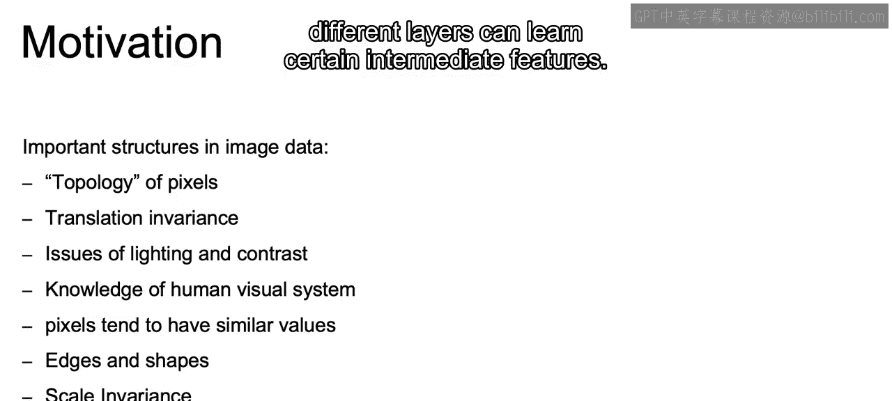

So we can start off with edges which then build up into shapes。

 which that can then be built into relations between different shapes even。

As well as identifying different textures within images， and if you think about this buildup。

 the relationship between the different pixels will be needed to make the identification of the slightest edges or these types of textures that we're talking about。

So an example of this buildup of features can be understood by thinking about the identification of a cat。

 which has features such as two eyes that are certain distance and angle from one another。

 as well as having the texture of cat fur。

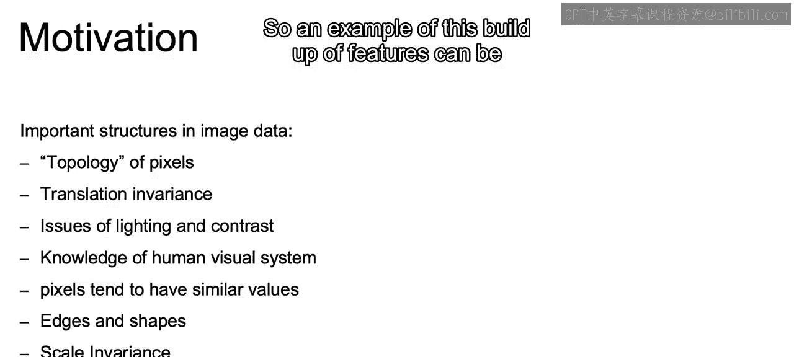

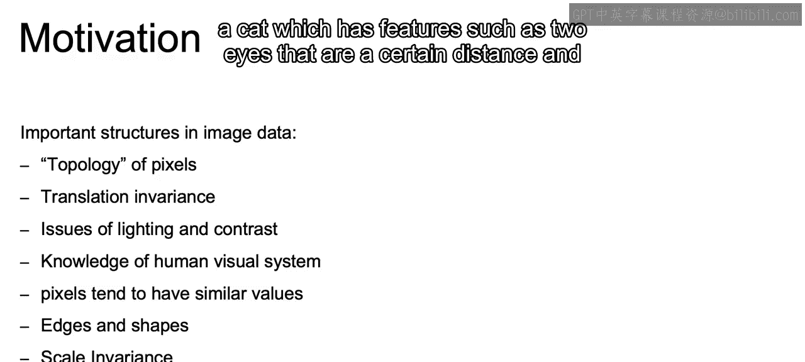

So to identify just an eye， which would have to be a building block to get to two eyes of a certain relation。

 we would first need the building blocks of a dark circle。

 that pupil inside of another circle or an oval shape since it's a eye。

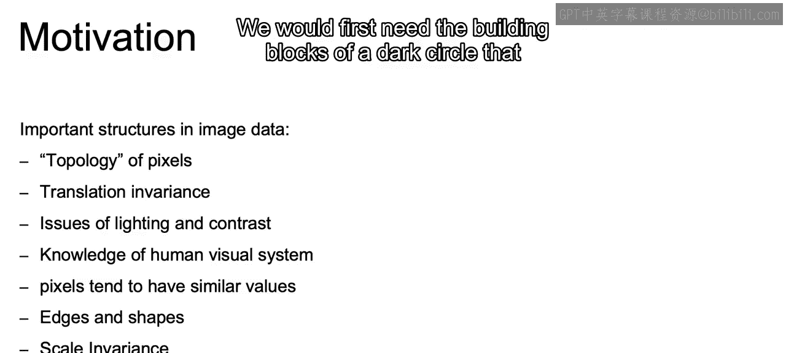

And that circle will be built from a combination of lower level features such as edges。

 and the cat fur should also be made up of these lower level edges in a particular pattern。

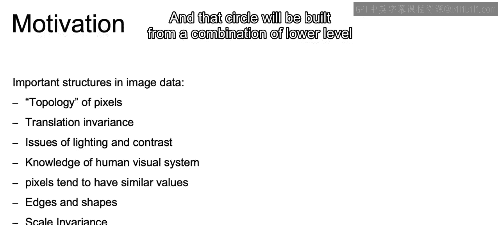

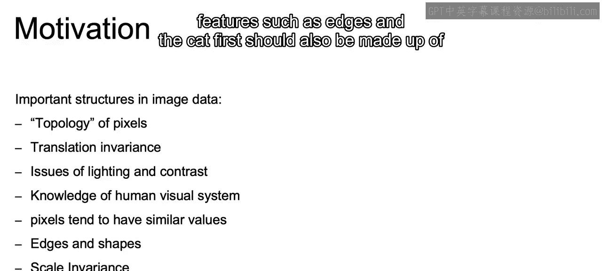

So that closes out our video providing this idea of that motivation behind that convolutional neural network。

In the next video， we'll talk about kernels in the actual convolution function that's going to make this all possible。

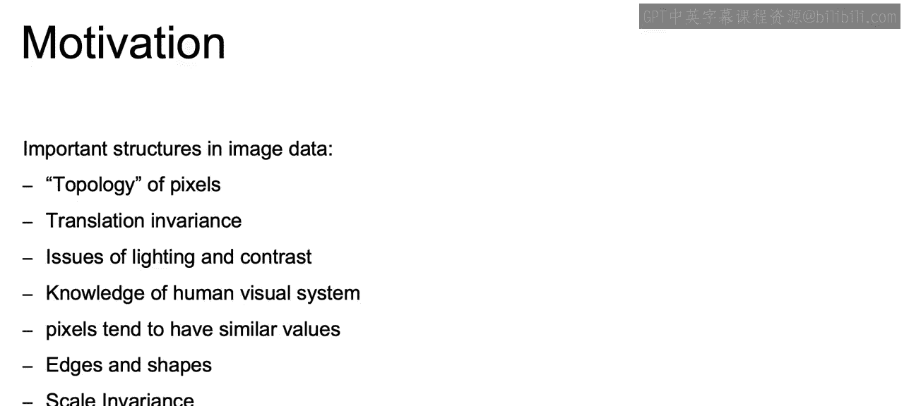

好。