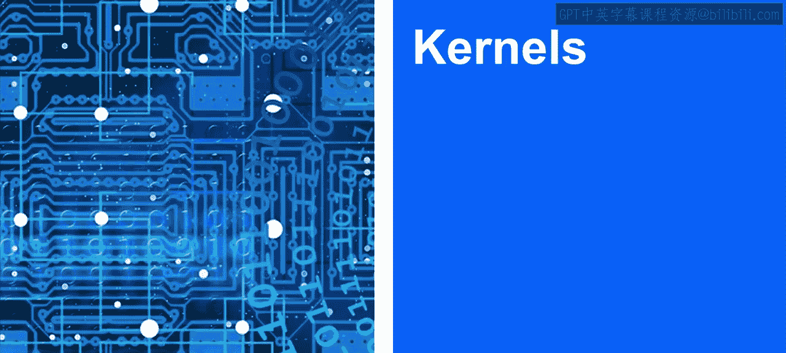
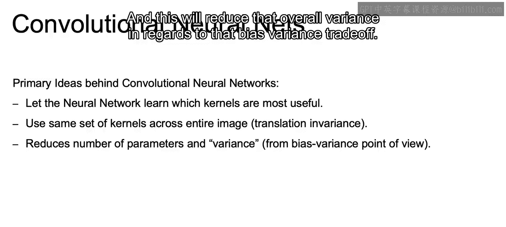

# 077：IBM《机器学习（无监督学习、深度学习和强化学习、毕业项目）｜machine learning》中英字幕 p77 38_核.zh_en -BV1eu4m1F7oz_p77-

So in order to capture this relationship between our different features。

 those features being the different pixels within our image， in order to capture this relationship。

 we're going to make use of kernels。Now， a kernel is just going to be a grid of weights。

That's going to be overlaid on a certain portion of our image centered around a single pixel。

Now once that kernel is overlaid on that portion of the image。

Each weight from the kernel is going to be multiplied by the pixel and remember that pixel is just going to be some number。

 so multiplied by that number beneath it。And the output over that centered pixel。

That we're going to get by overlaying this kernel on that portion of the image is just going to be the sum of all of those multiplications of the kernel and its respective pixels。

 and that's going to be the convolutional operation and that's where we get this name for our convolutional neural nets。

And this method of using kernels is going to be what allows us to capture the relationships of nearby pixels to detect blurred portions of images。

 sha portions， edges， etc。So let's look at an example of this in action using a three by three kernel。

So if these are going to be the different values for the pixels and say our image in this example is just three by three。

And then what we have here is our kernel。We want to think about how would we calculate the output？

And note that overlaying a three by three kernel on a three B3 image will only output one single value。

 and that one single value will be at the center of what will ultimately be our output matrix。

 which we see here to the right。So the key will be to overlay that kernel。On top of the image。

And now， in a way， it's just going to be like a dot product where we will take。

Starting at that first row。Sell by cell。We'll take the three multiply it by negative one。

 right That's the top left corner times the top left corner of the kernel。

 and then two plus2 times 0 plus1 times 1。 And you see we multiplied each value with its respective point within the kernel across that first row。

 And we keep adding that up row by row。 So we look at the second row。

 we do one times negative22 times 0 plus three times 2。 do the same thing for the third row。

 So now we have nine different multiplications all being added up。

Each one with their respective values in the kernel， similar to how we would work with a dot product。

 we add those all together and we end up with this output value at too。

And the way this will work when you're working with an actual image is the original input will probably be something larger than three by three as we see here。

So what we do is we just slide over that kernel that we have using that same kernel。

 slide it one over to the right。And by sliding it over one to the right。

 that would provide the output to the right of that two value within our output matrix。

 And similarly， if we had a larger input， again， it's not a3 by three input。

 we can slide that kernel one cell down。And do all the multiplication， take that dot products。

 and we would have the output within our output matrix right below the two because we slid it down one and we'd slide that kernel across every single space that it can throughout our input image。

Now you can think of the kernels as feature detectors。So here we have a vertical line detector。

 and there are some good videos on how the soul help you detect an actual line using matrix similar to what we see here using that convolutional function。

 But the basic concept is just that as you move this filter along some type of vertical edge。

 assuming you have that vertical edge and run that convolution and get your output。

 You end up being able to highlight that there is an existence of this vertical line。😊，And similarly。

 we can overlay the filter that we see here and detect a horizontal line。

Or use this filter that we have here， run it across and detect any corners that we may have in the image。

And the point being that we want to take away from here is that each one of these different kernels will be able to detect edges。

 whether they're vertical， horizontal， diagonal corners。

 or other combinations of features that may be important。Now。

 these different filters that we just introduced are powerful to have some type of intuition of what a filter can be。

 but in reality， the network will find those most useful kernels for you。Also， I'd like to note。

 we'll probably set up our framework so that we learn many different kernels， not just one。

 but all every single one of these different kernels will operate across that entire image。

 and this is what allows for that translation and variance， so it doesn't matter where in the object。

 where the object is within an image， whether that object is flipped or what the size of that object is。

And then also compare to our fully connected architecture。

If you think about just having as many different kernels as we have and each one only having nine weights。

 this going to require much less parameters to learn。

And this will reduce that overall variance in regards to that bias variance trade off。

