# 078：IBM《机器学习（无监督学习、深度学习和强化学习、毕业项目）｜machine learning》中英字幕 p78 39_彩色图像的卷积.zh_en -BV1eu4m1F7oz_p78-

Now， to bring this all home when you're working with images， generally speaking。

 most of our images will not just be on the gray scale， but rather have color。

And for a color image should be represented numerically。It will be。 It will have to be  three。

 generally speaking， most common is three，2 dimensional arrays， all stacked one on top of the other。

 As we see here， where each one of these two dimensional arrays represents either the red scale。

 the green scale or the blue scale respectively。

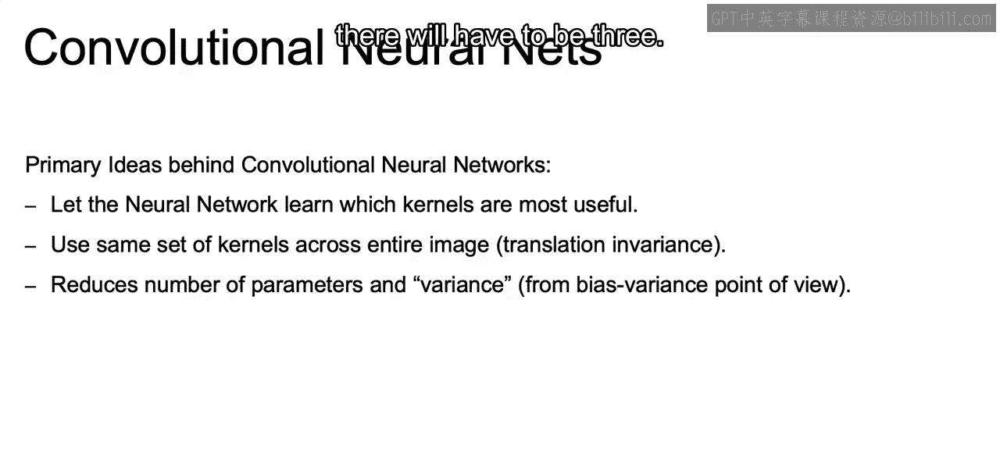

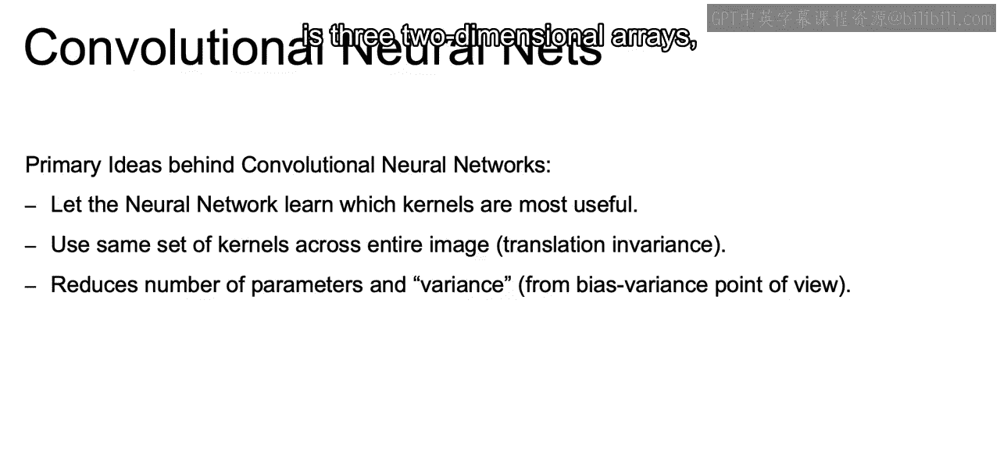

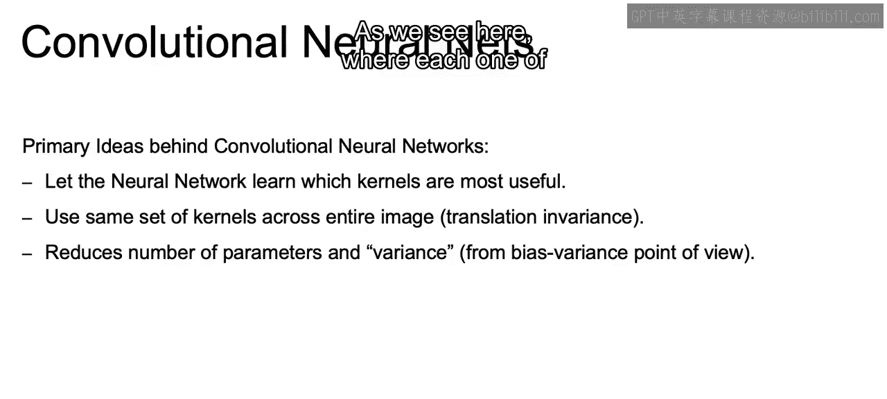

Now to move our kernels to three dimensions。

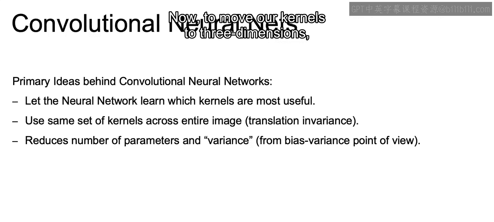

Rather than using the convolution operation， using just this kernel that's three by three。

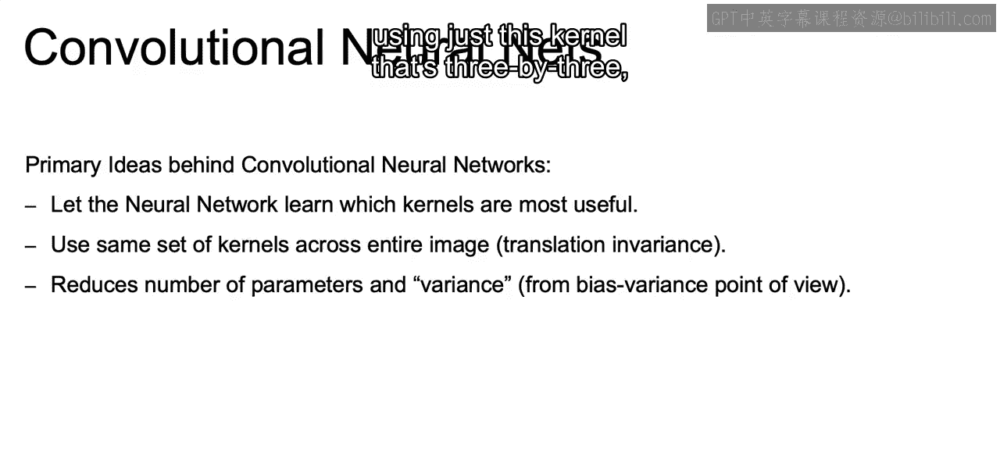

We're going to use convolutions on a filter， filters the term once we move up to three dimensions。

 which may be three by three by3， so it's going to be three，3 by three kernels all stacked together。

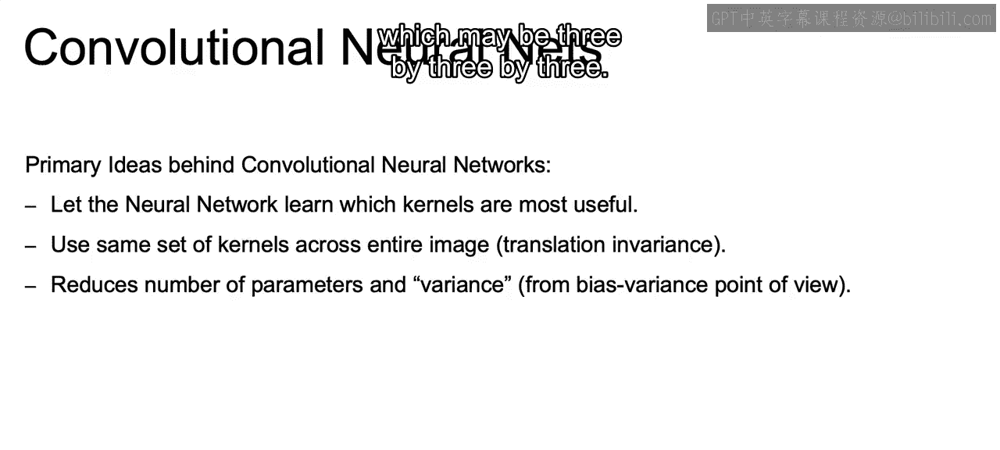

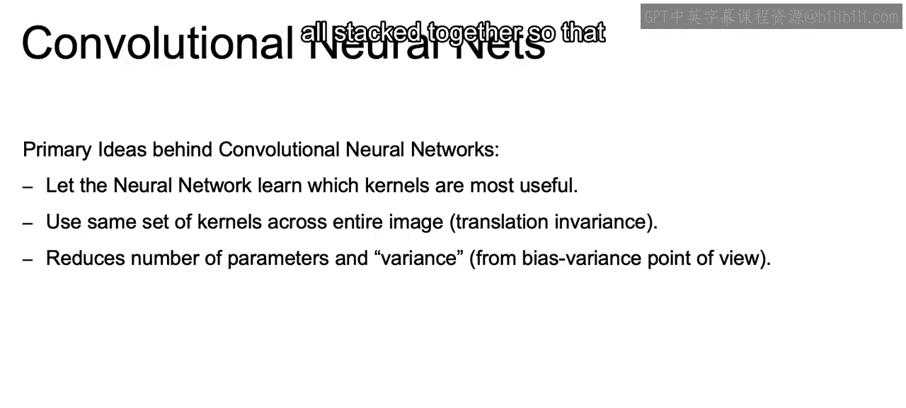

So that instead of having nine multiplications added together to get our one output。

 we had the sum of 27 multiplications。

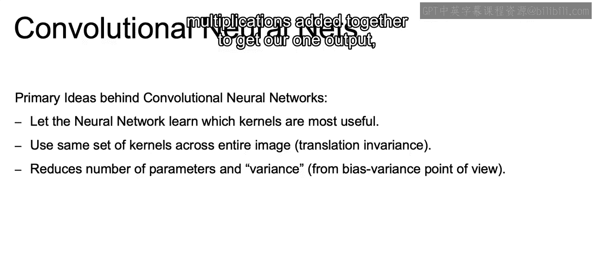

9ine and you can think about the filters that we learned where we'll have nine for each one of these different dimensions。

 so9 for red，9 for green and9 for blue， and we get we multiply those respectively to each one of their different components within that input image to get our one centered output。

 so we're adding together 27 different multiplications。

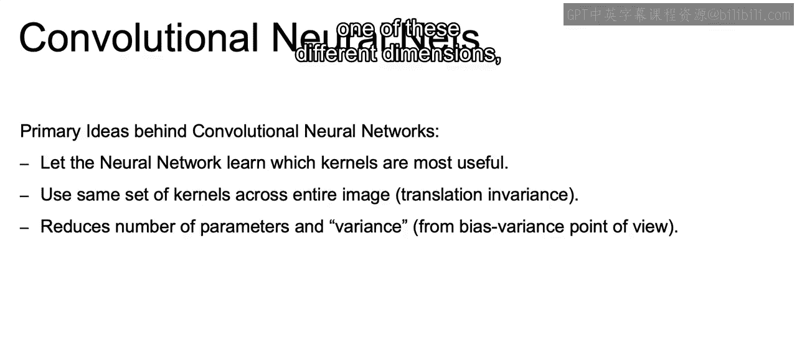

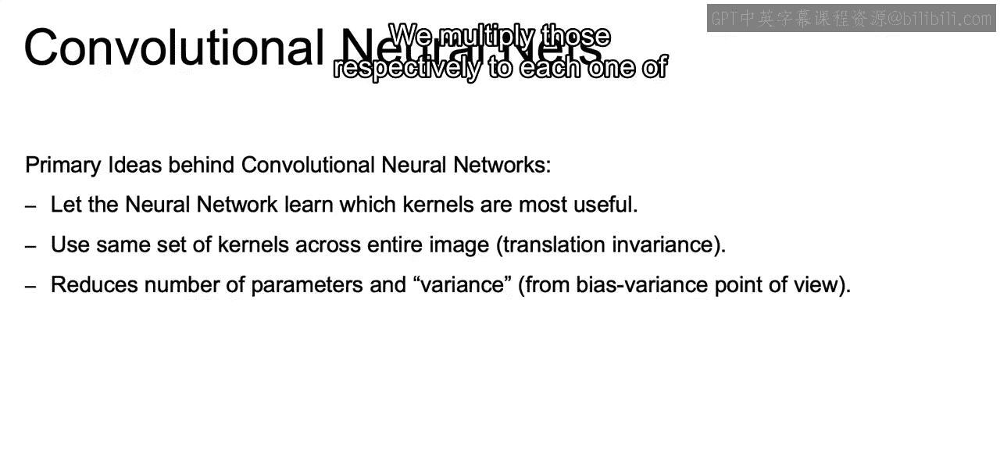

So once we use that filter， we end up with just a。

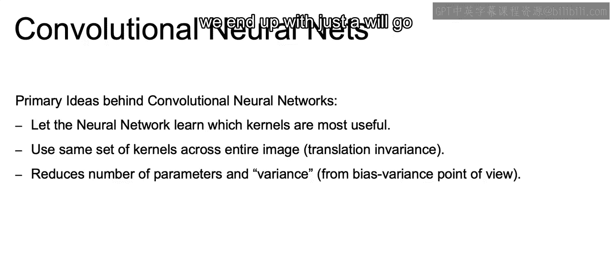

We'll go back to two dimensional output rather than these three dimensions。

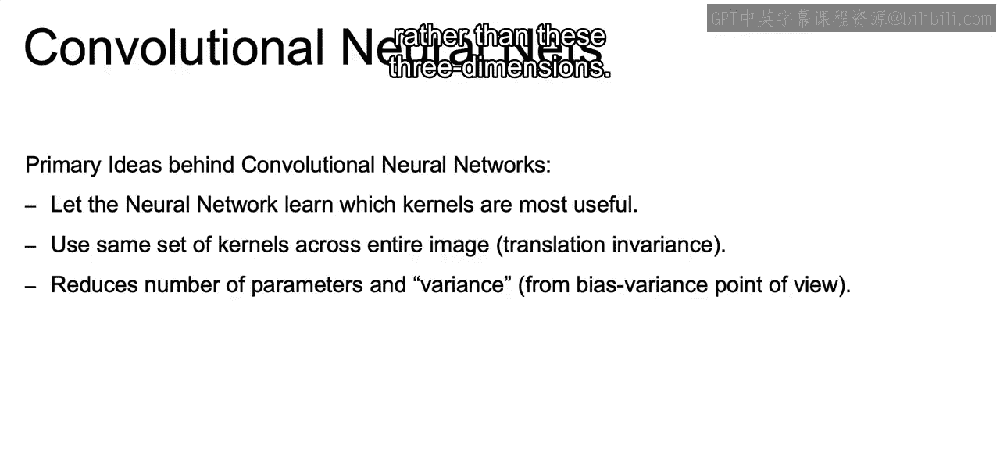

Now， something that you may have noticed as we went through this idea of working with convolutions。

Is that when we work with these centered values and we're trying to output centered values？

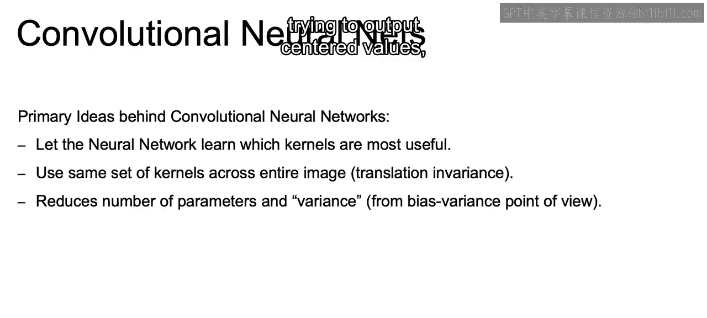

The edges of our image and the corners of our image tend to get somewhat overlooked。

So in the next video， we're going to address this problem and introduce the concept of padding。

All right， I'll see you there。

