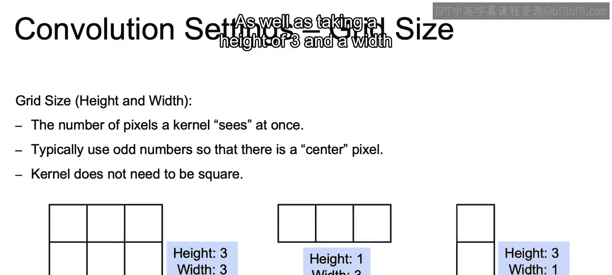
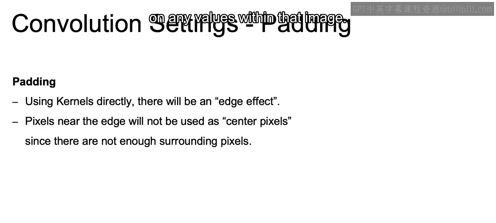
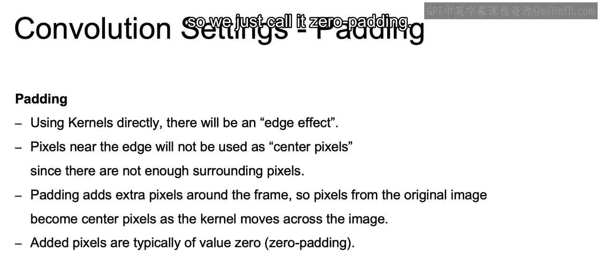
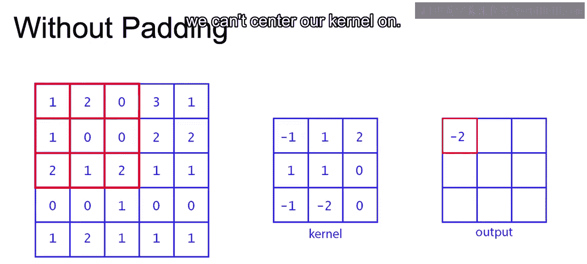
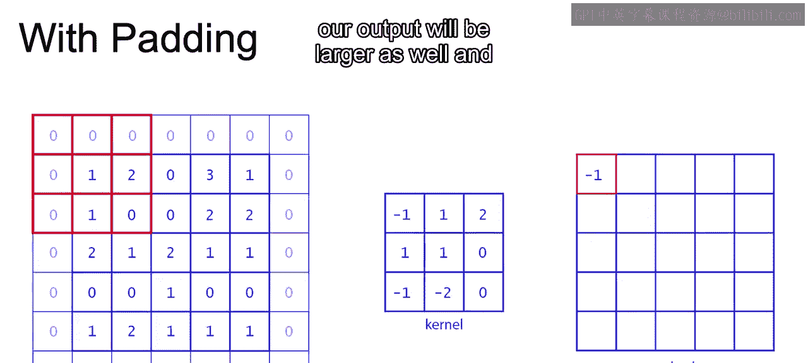
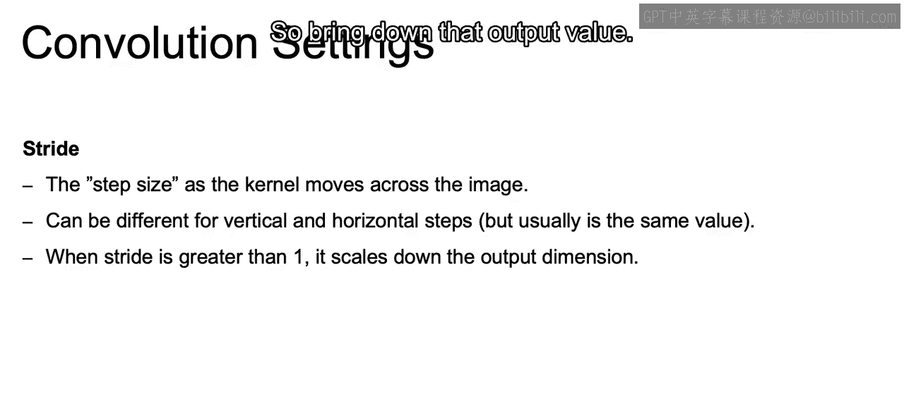
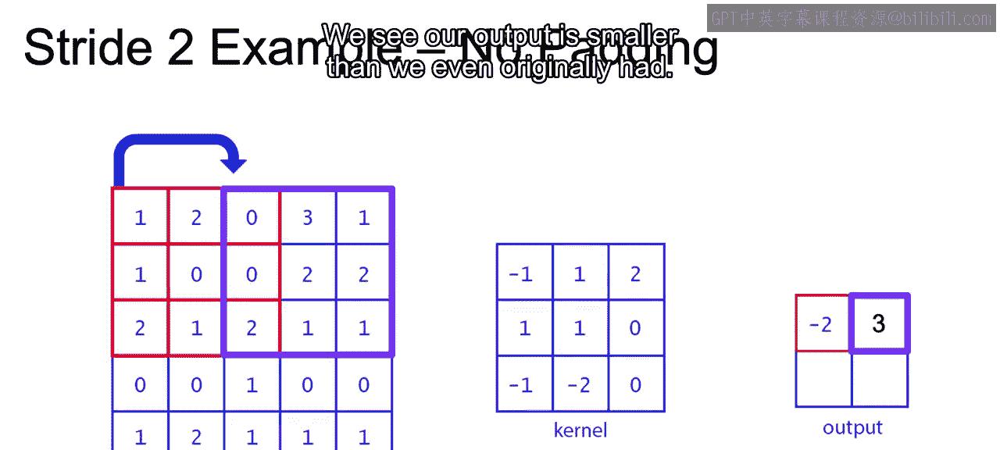
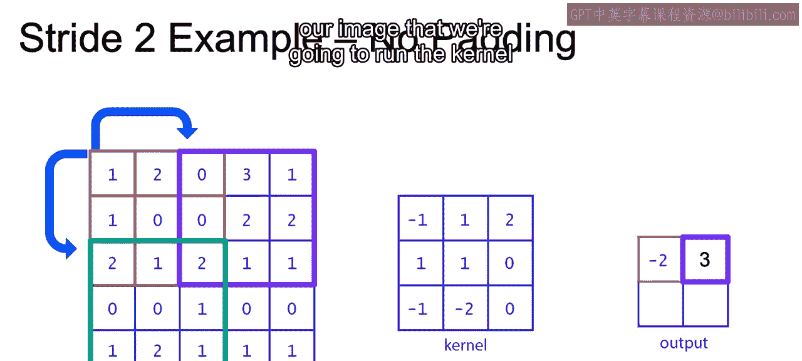
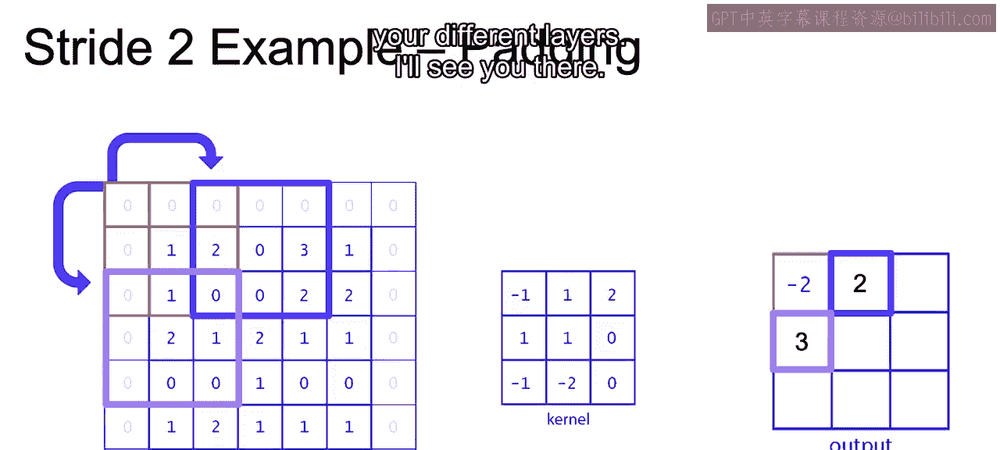

# 079：填充和步长.zh_en -BV1eu4m1F7oz_p79-

So before we get into this idea of padding。I do want to discuss a bit about the grid size of our kernels。

And the grid side is just going to be a way of specifying the number of pixels that a kernel sees at once。

And typically we're going to want to use odd numbers so that there's going to be some center pixel。

 but that's not necessary when you move your kernel across your image。

 just will be a bit easier to compute and best practices。Also the kernel does not need to be square。

 again， that will be typically what is used as square kernel。

 but you do have the options of using non square kernels as well。

So this is our square kernel that we have here with a height and width of three。

And then if we think about kernels that aren't square， we have here height 1 and width 3。

 and we can move this along our image as well。As well as taking a height of three and a width of one and moving this along our image。

Now， I discussed before that as we move a kernel across our image。

 it's possible that we do not put as much weight along each one of the edges。

 and that's going to be this edge effect if we use kernels directly onto our images。

 the corners and the edges will not have as much play in allowing us to identify what that object is。

So the reason for that is that pixels near the edge will not be used as center pixels。

 since there are not enough surrounding pixels。So if you think about having something like a 3 by three kernel and you try to center it on that top left corner。

You won't be able to because you have that three by3 and the center of that three by3 will ensure that the top and the left of that kernel will not be overlaid on any values within that image。

So the idea is to pad and padding adds extra pixels around that frame。

 around the frame of your image so that pixels from the original image。

Along the edge becomes center pixels as the kernel moves across that image。

And those added pixels are typically going to be zero valued， so we just call it zero padding。

So to think about this example。First， I want you to look at our original input。

 which is going to be our original image。Then I want you to look at the shape of our kernel。

 so we have the shape of the original input， the shape of our kernel。

 and I want you to see the shape of our output。So as we move this kernel along the image。

 and we move it to the right and we move it down， we won't be able to capture every single value。

 So the output will actually be smaller than our original input and also。

We won't be able to center around that one in that top left corner or the two right next to it to the right。

 or even the one below at anything along those edges， we can't center our kernel on。

Now， with padding， we add on these zeros around each one of the edges。

And we're able to actually center now on that top left corner。

 on that one and get the output value that we see to the right。

Another thing that I want you to notice is that we're still using that 3 by  three kernel。

 But now with padding， because we now have a larger input， if we take into account the padding。

 our output will be larger as well and closer to the size of that original image。

Another thing that we can tune when creating our convolutional neural nets is going to be the stride or the step size as the kernel moves across the image。

 So we said that it'll keep moving across the image。 Normally， if you said it at its default。

 it will just move over one at a time。 So along that image。

 that square will just move over one to the right。 Then another one to the right。

 until it gets to the end。 Then it will start back all the way to the left。

 just one cell down and then move along the right again。 That's going to be your step size。

And you can even set that to be different for vertical and horizontal steps。But again。

 usually you're going to use the same value and that will be the defaults and what you'll see throughout。

And when that shriide is greater than one。 If we think about the output that we would get as we do these convolutional operations。

😊，Our output， if we skip over2， rather than just doing a stride of one。

 our output will have to be smaller because we're multiplying We're doing less convolutional operations throughout the rest of our image。

 So bring down that output value。

So here we have an example of strideide equal to two， so rather than just moving over one。

 that kernel moves over two spots。And the next output would be 3。

 And we see our output is smaller than we even originally had。

And then our vertical is also going to be moving down to。 So once it got to the end of the image。

 it moved down to， we now have our new。Part of our image that we're going to run the kernel over and we get our next output。

 which is just going to be zero。

Now， we can combine this with padding as well and still have this stride equal to 2。

 This will be our first。Convolutional operation ending up with negative2。

 We then move over2 to the right， and we have our next。Operation， which will output two。

And then we can do the same thing， moving down to。And you see， again。

 that our output will be much larger， well， not much larger。

 just a bit larger as we add on that extra padding。Now that closes out our discussion of padding。

In the next video， I want to introduce to you the idea of adding on depths so that you can actually pass through multiple kernels at each one of your different layers。

All right， I'll see you there。

