# 080：深度和池化.zh_en -BV1eu4m1F7oz_p80-

So as mentioned in prior videos， in images， we often have multiple numbers associated with each pixel location。

Thinking about that pixel location in two dimensions。

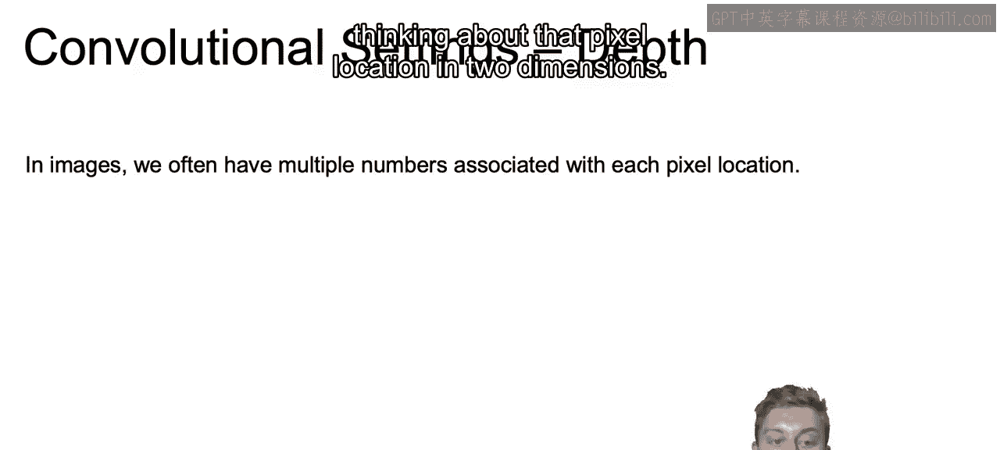

And these different numbers in that same location。Are generally going to be referred to as the numbers for the different channels。

And examples of this include RGB， which is just the red。

 green and blue channels that make up an image， and we saw this a bit earlier on your computer screen。

And then you have a little bit less commonly CMYK or cion magenta。

 yellow and black for printing images rather than just displaying them on a screen。

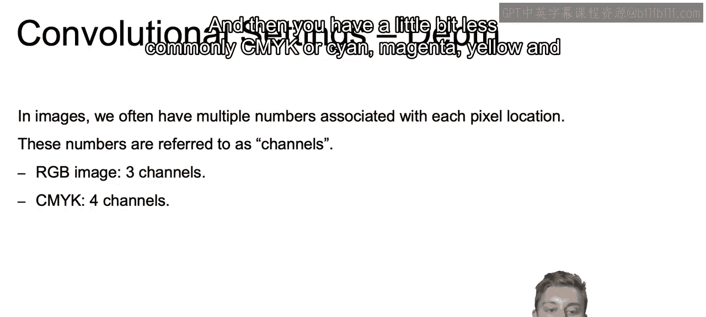

Now， the number of channels that you have within your image is referred to as the depth of that input image。

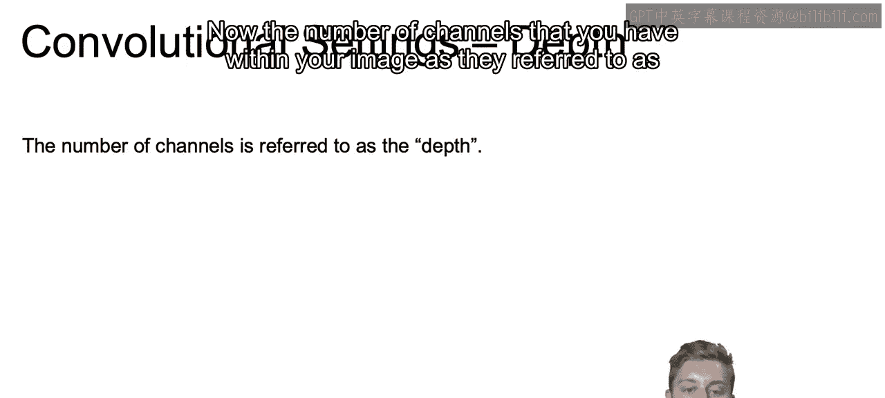

And the filter itself will have a depth the same size as the number of input channels。

So your filter will be as deep if youre working with RGB as there are channels。

 So there would be a depth of three。

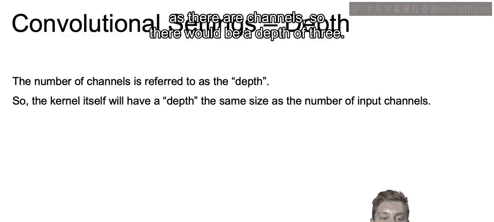

So an example of this is if you're working with a5 by5 kernel on an RGB image。Then that kernel。

Well how many weights？It'll have five by five by three because it'll be for each channel equaling 75 original weights。

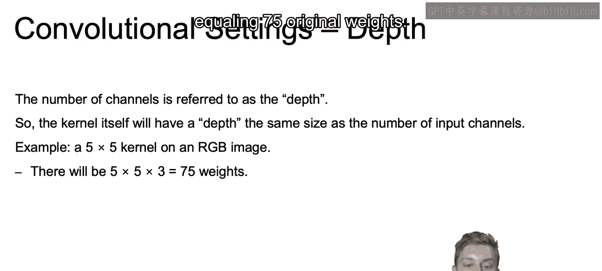

Now， the output from the layer。

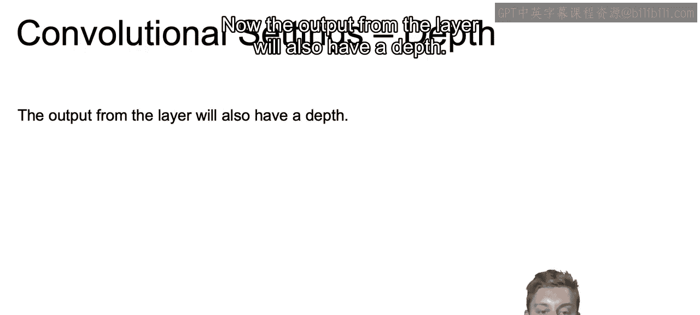

We'll also have a death。So the way that that works is the network typically train many different kernels。

Again， each kernel will go over the entire image。And even though we're working with three dimensions here with our kernel。

 when we talked about， for example， about five by5 by three。

That's still going to output a single number。 So each kernel outputs a single number at each pixel location。

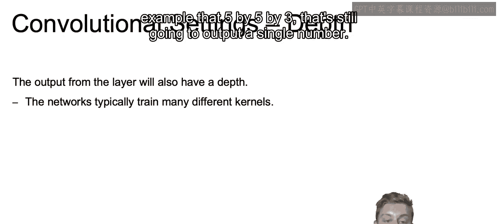

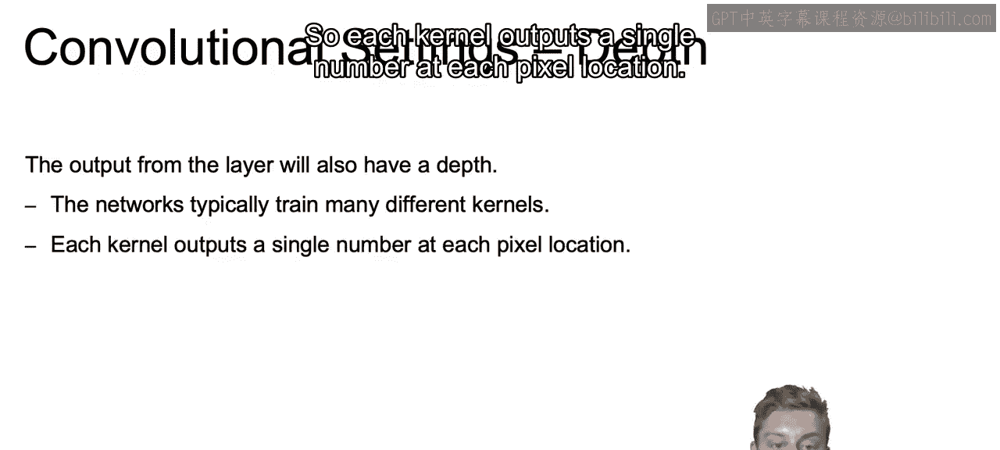

But。You can have many kernels， so if you add 10 kernels in a layer。

 the output of that layer will have a depth equal to 10。

And that's because we don't want to be confined to only working with a single kernel that can only detect a certain pattern。

10 kernels allow us to detect 10 different patterns。

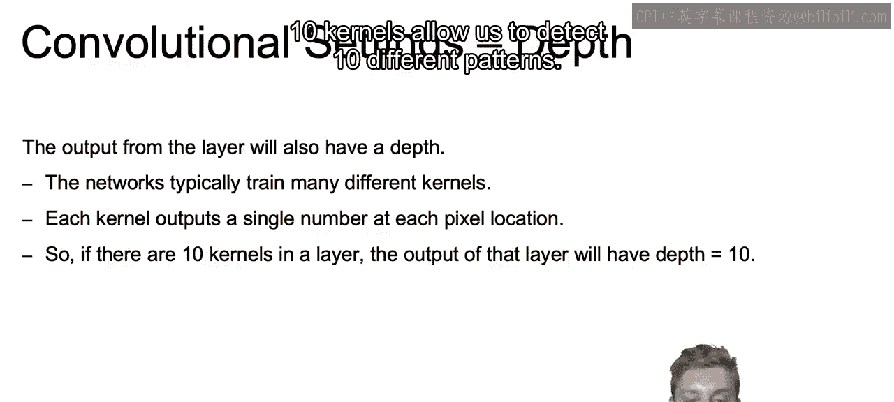

So how is that going to work？So if you look all the way to the left， top left。

 we have our original image。And in that original image。

 we're starting off with a 32 by 32 by 3 image。And that's going to be the data from that original image。

 We have the three there， and that relates to the red， green and blue dimensions。

 And then each one will be 32 by 32 for the red， for the green and for the blue for each individual channel。

And then in the next layer， we see that we have a 32 by 32 by 10。Layer。

 and that means that our depth is equal to 10。So how do we get that debt equal to 10？The 32 by 32。

 each one of those 32 by 32s， will represent a single kernel。

So we see that we have that kernel that's five by five by three。

If we were to take one section and run that convolution operation。

 then we get that single data point that's one by one by one。

And we can do that by moving that 5 by 5 by 3 kernelel along the entire image。To get the next output。

 to get that pink slice that you see within that three dimensional cube in that second layer。

So that's how we get one single layer out of the 10。 And since there's 10 different filters。

 if we look down to the image in the bottom row。We have another filter and green。

And that green filter moves along our image and produces another one of those 10 layers。

 and each one of our different filters will produce a different layer。

Now I do want to note that if you are using a5 by5 by3 filter and that's moving along your 32 by 32 image。

Then you probably need some extra padding so that your next layer will still be 32 by 32。

 and you'd also have to take minimal strides as you actually go about moving from 32 by 32 to another layer that's also 32 by 32。

But the idea is that the number of filters you have will be the depth of the next dimension of the next layer。

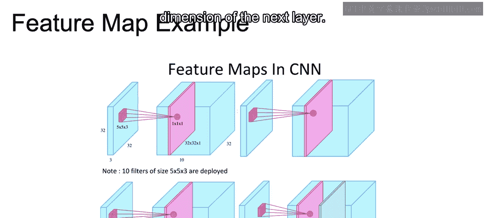

So now I want to introduce another concept that's important in convolutional neural nets。

 and that's the idea of pooling。And pooling will reduce the image size by mapping a patch of pixels to a single value。

So that will shrink the dimensions of the image。And it's not going to need any parameters。

Though there are different types of pooling operations。

 but every single one of those different pooling operations will be something like a max or an average where you're just going to take whatever values our output and take the maximum value or the average value。

 whatever it is。

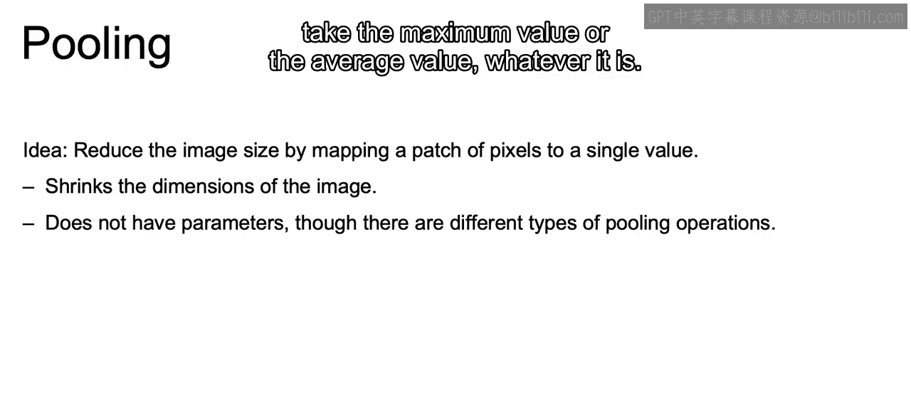

So speaking of the different types of pooling， we have max pooling。

And with max pooling for each one of our distinct patches。

That pooling will represent the maximum for that patch。

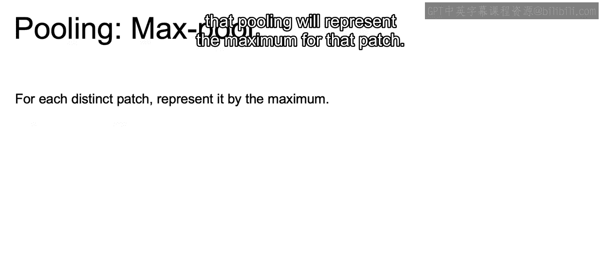

So an example here is we're using two by two maxpo and we take our original image that's four by four。

And we split it up into each one of these two by two squares。

And we get the max value within each one of those scarces to reduce the size of that data set to that 8154 that we see on the right。

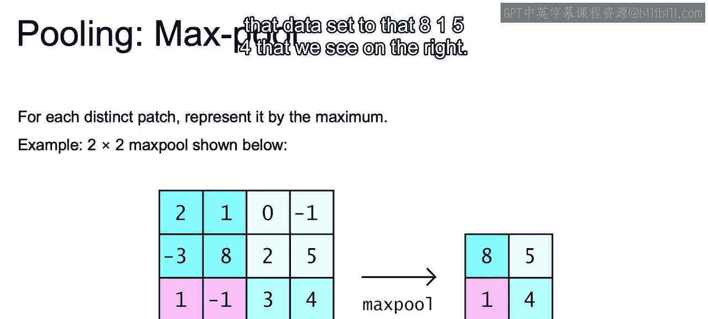

And then the average pool is self explanatoryates in the name。

 whereas we take the each distinct patch and we get the average。

 and we can see again how we perform similar to what we just did before。

 but rather than taking that max value， we take the average value。

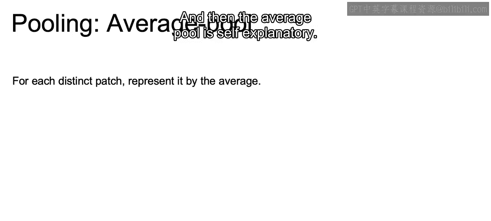

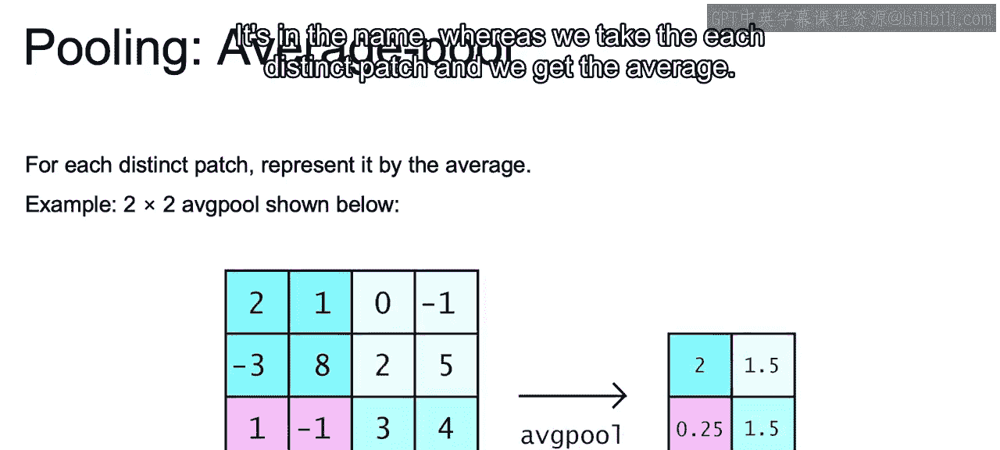

I would say taking the max value is generally much more common practice in regards to what you'll be using when you actually pull together your data。

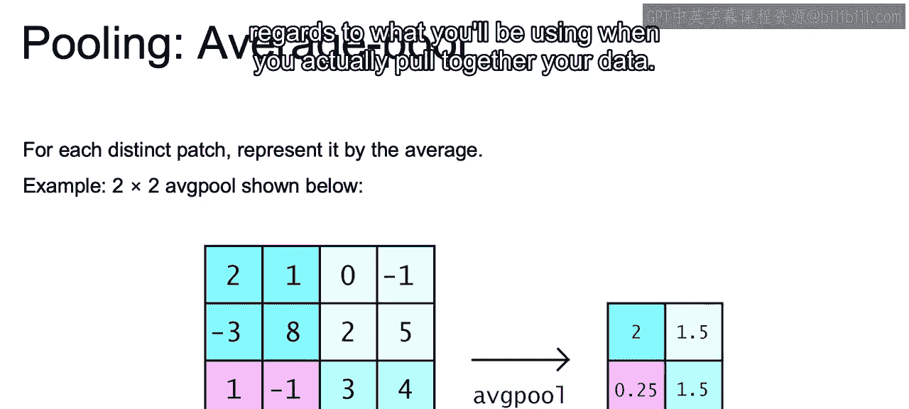

So just to recap。In this section， we gave you an idea of what convolutional neural networks are。

 what that convolutional operation was and how we can use things such as the filters and the kernels in order to come up with our next layers within our network。

 we discuss the original motivation， and why we would want to have a certain type of framework when we are working with image data specifically and how we can even use RGB using an image with three dimensions。

 where one of those dimensions is the number of channels in order to actually come up with our next layer。

And with that， we discuss things such as the grid size and how we'd use that grid size to move along our image。

 adding on padding so that we wouldn't have to lose information along those edges。

 the idea of pooling to reduce the number of dimensions。

 whether that's max pooling or average pooling， as well as this idea of depth where each one of your different filters will add to the depth of the next layer。

Now that closes out our discussion here on convolutional neural nets。And in the next video。

 we are going to have a notebook where we'll actually see convolutional neural nets in practice。

 All right， I'll see you there。😊。

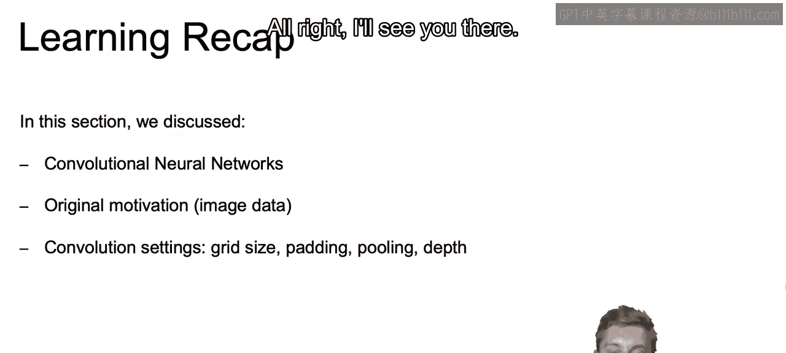

