# 081：IBM《机器学习（无监督学习、深度学习和强化学习、毕业项目）｜machine learning》中英字幕 p81 42_CNN示例笔记本（选修部分）第1部分.zh_en -BV1eu4m1F7oz_p81-

Welcome to our notebook here on Convolutional neural Nes。

Here we're going to be using Python to build out a convolutional neural nets in order to classify images using this famous C4R 10 data set。

 and this C4R 10 data set is going to be 60，000 different images each 132 by 32 pixels and their color images so they will also have a certain amount of depth if you recall from lecture。

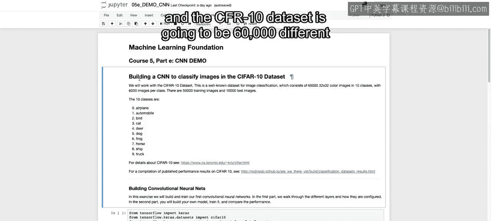

And each one of these different images will be one of 10 classes， either airplane， automobile， bird。

 and so on。Now， in order to build out our convolutional nets， we're going to have to introduce。

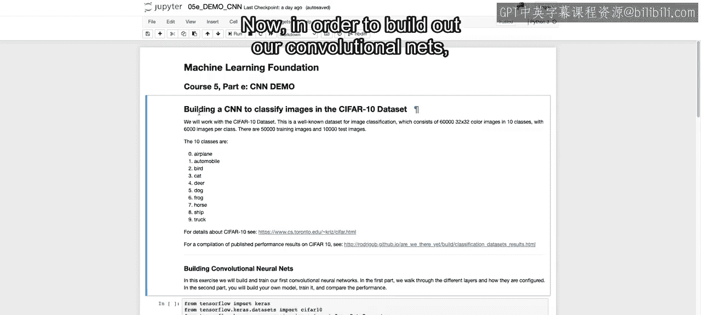

New parts of Kas， new functions， and new layers that we hadn't used in our prior notebook。

So we introduced the sequential model， we can still use that at some point we will have to use that dense connected layer similar to what we did with that fully connected layer。

We can also use dropout in order to regularize and ensure that it doesn't overfit。

 we'll have our different activation layers that we can use as well。

 whether that's relu or sigmoid or hyperbolic， whatever it is。

 and then we also have this flatten layer。And this flatten layer will be important as we move from our convolutional layers to our dense layers。

 and eventually， in order to make some type of prediction。

 we're going to need to flatten it out and then have that dense layer connected to that final prediction。

And then we're also going to import this comp 2D in this max pooling 2D。

 which will allow us to build out our convolutional layers as well as our pooling layers that we introduce in lecture。

Now to get our data， we imported earlier this CR 10 from the CARAS data set。

 so this is actually within the CAAS library， we have this data set available。

 we call load data and when we load data that will give us two tuples our training set as well as our test set and the X and Y values for each。

Now we're going to print out the shape of our training set。

 as well as the number of samples of both our training and test set separately。

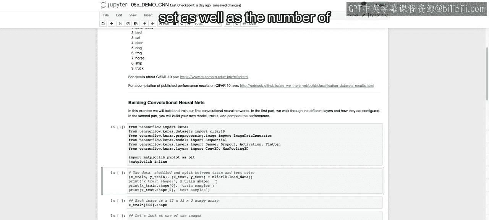

no。There's going to be 50，000 train samples and 10，000 test samples。

So we'll be training on those 50000 train samples， and then we can ultimately test on that。

 Hol that set on that 10000。But what I want to look to is the shape of X train。

And if you think back to the what we've been working with so far。

 and those were not image data that we were working with。Here you see that we have four dimensions。

The first dimension is going to be the number of rows are the numbers of samples that we're working with。

 and that's 50，000。

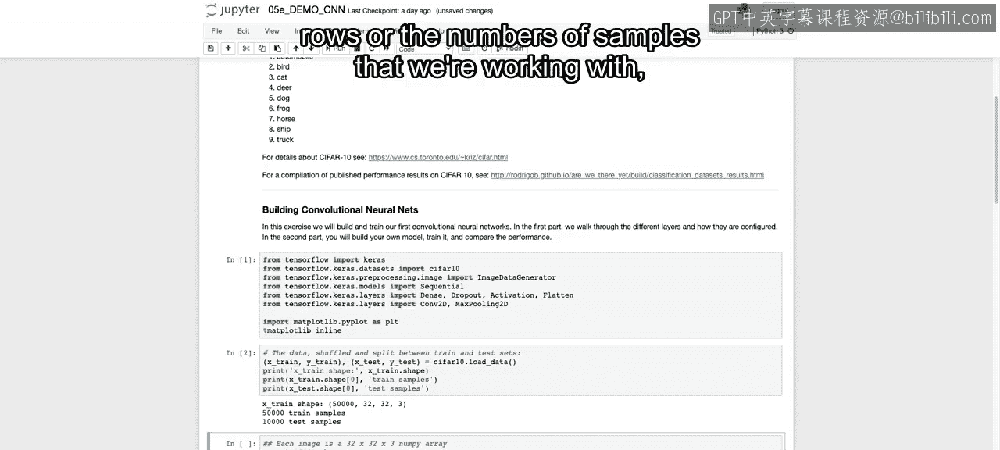

And then the next one is going to be the height and width in terms of the number of pixels of our images as well as our depth。

And that's why we have the 32 by 32， and then by three for the red， green and blue different layers。

And we can look for each individual image that we have this 32 by 32 by 3 shape。

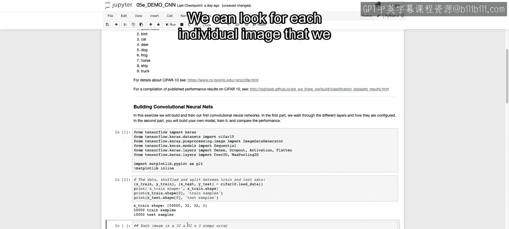

And that's just going to be a bunch of numbers from zero to 255 for each one of these different colors。

 red， green and blue。And we can see that these actually represent actual images。

 So we see here that this is of class 9， if we call Y train and just 444。

 and then we can look at the x train， which is going to be the actual image itself without the label。

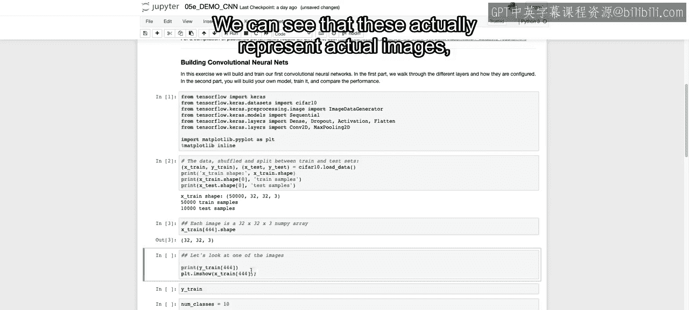

And we see that it's actually going to be a real image。 Now， it's not a high definition image。

 If we think 32 by 32 pixels， I will not be a high definition image。

 but we can tell here that we have a truck。 and hopefully our convolutional neural net will be able to pick up the fact that it's going to be。

😊，Tirers and the large back and whatever other features there are that build out the truck。Now。

 if we look at our Y train originally， we see that it's just a bunch of numbers。

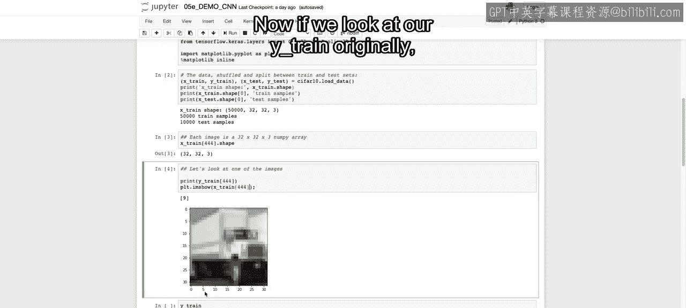

Each one representing a different category。And as we discussed in lecture。

 we often need to take something that's categorical in maybe many different categories and turn that into a categorical variable doing one hot encod。

So Kas has functionality built in to change this output into that one hot encoded version of the output。

In order to do so， we just call Kas。utils。2 categorical and we say， what the？

Set is that we want to change the categorical and the number of classes in that set。

 which is going to be equal to 10。We run that。And now if we look at that Y train that we had above。

 which we see was nine。

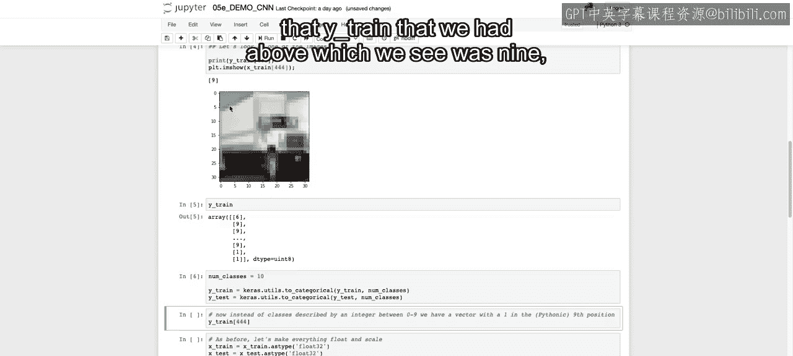

The new value is going to be that one hot encoded version was zeros everywhere except for in the nine spot。

Then we're going to want to make sure all of our values are flow and scaled down to between zero and one。

So recall that all of our different pixels will be values between0 and 255。 So if we divide by 255。

We ensure that all of our values are going to be between zero and 1。

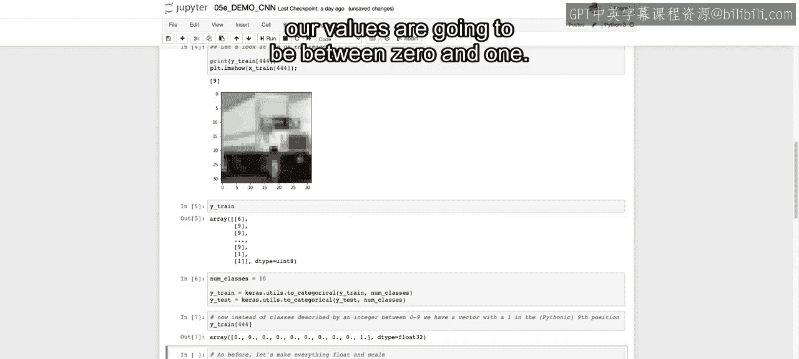

No。

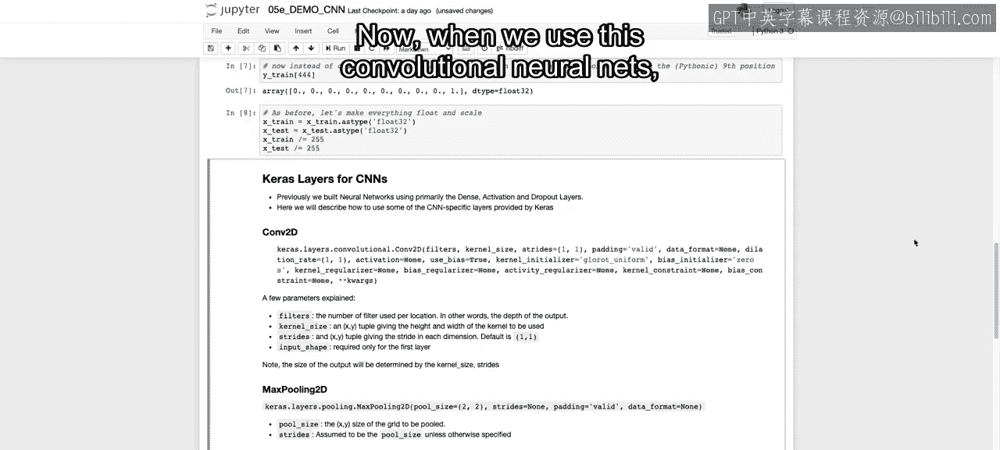

When we use this convolutional neural nets， when we create these layers， these convolutional layers。

We call just same as we did with dense， we call Com 2D。

And we want to ensure that we understand the different parameters that we can pass through so that we can specify exactly what kind of convolutional net。

 what kind of convolutional layer we want to use。

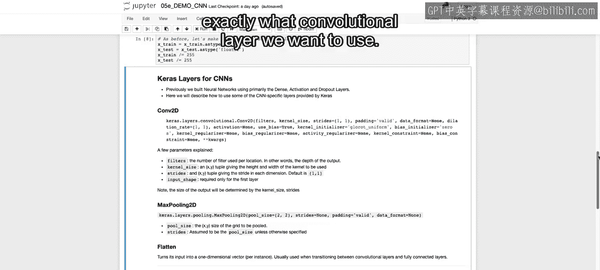

So thinking back to lecture。Some of the important parameters that you should know。

 it's going to be the filters。And that's going to be the number of filters used per location。

 so in other words， that's going to be the depth of your output。

Or the number of kernels used if you think about， again。

 that depth we recall in lecture we had at one point a depth of 10。

 and that was because we had 10 different kernels that will output a depth of if we set 10 of 10。

 if we set filters equal to 10。

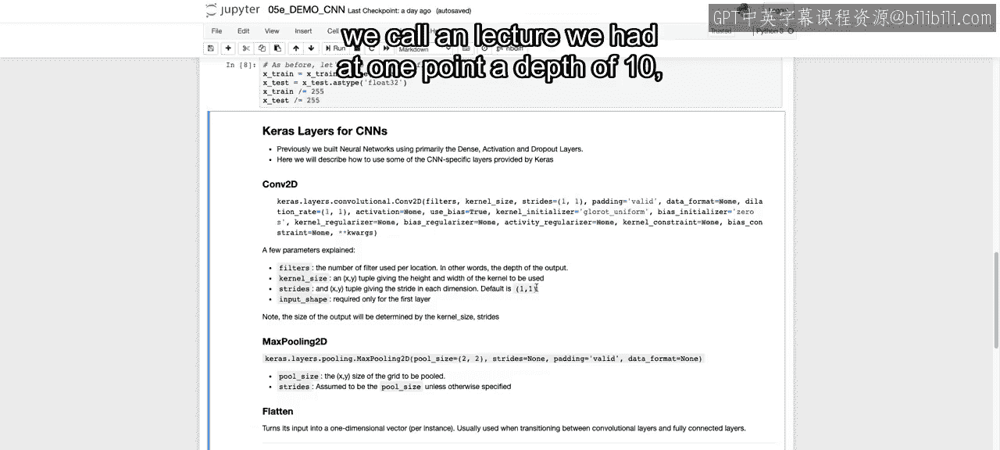

Then we have our kernel size， which will be a tuple giving the height and width of the kernel used。

 and you can specify that height and width to be different。 If you just pass through one number。

 it will assume a square， and I would say stick with squares to start。

 you can try playing around with other values， but those are going to be best practice for the majority of your starter material。

Then we have the strides， so that's going to be how you move along those kernels along your image。

And whether you want to move it one at a time， going from left to right or two at a time。

 going left to right， as well as up and down。 So the first value is going to be the stride going left to right。

 And then the next ones going to be up and down。And then you're going to want your input shape。

 which recall we passed through and we had our dense neural network。And that was just one value here。

 If you just recall what we've pulled out in terms of the shape of a single image。

 that's going to actually be three dimensions。And we want to ensure that it fits within that first layer that we specify to ensure that that's correct。

And one more thing that I want to point out that's not here is the padding。

When we set padding equal to valid， that means that we are not having any padding。

 and it'll stop as soon as the right， if we're moving from left to right。

 as soon as the rightmost part of our kernel hits the edge as we move along those shs。

So if we imagine that we have a six by six image and our kernel is。5 by 5。

 Then it'll only move to the right once， and then stop。

And then if we set padding equal to and we'll see this later on same。

 then that will pad on some extra zeros， generally speaking to make sure it'll be just one set of zeros around。

 but maybe it's even and out there might be two on one side and it'll be padding with zeros。

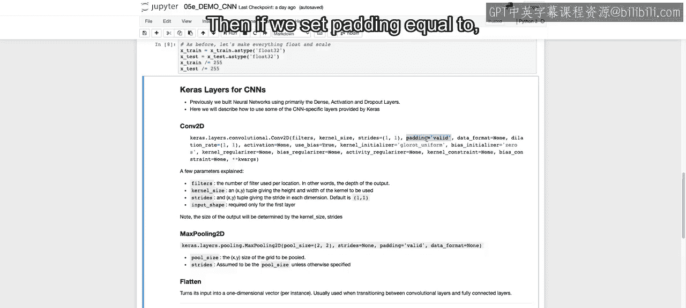

And then again， we have this flatten layer， and that turns our whatever input it has into a one dimensional vector。

And that will allow us once we do that to transition between the convolutional layers and those fully connected layers。

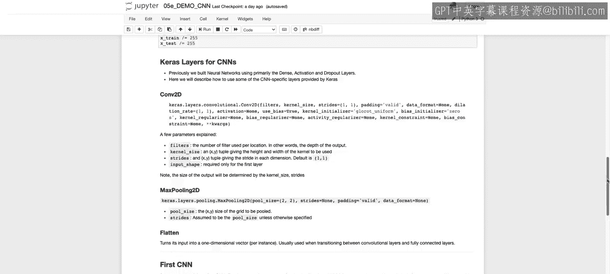

So we have here the initialization of our model using the sequential function。

So we're going to be using that sequential API again in order to build out our model。

We then add on our first comp 2 D layer。And this is in the ordering that we saw above。

 and we can see if we just call shift tab， it's called it a couple more times。

 we can see that we're setting the number of filters， so the depths also going to be equal to 32。

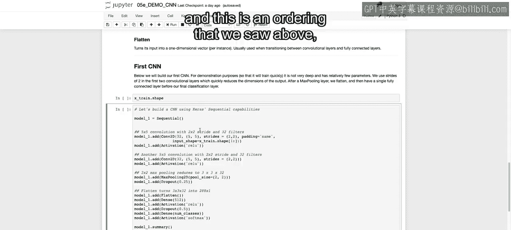

Our kernel size is going to be5 by5。We're not going to use the default for strides。

 we're going to set that to two by two。We're also going to add on padding。

 so there's actually going to be padding on this layer。Rather than the defaults of leaving it as is。

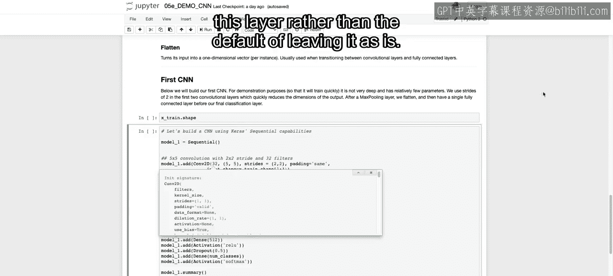

And then we specify the input shape， and if you recall the shape of our x train is going to be the number of different samples we have than the actual shape。

 and if we say one through， then we're just specifying the shape of a single object。

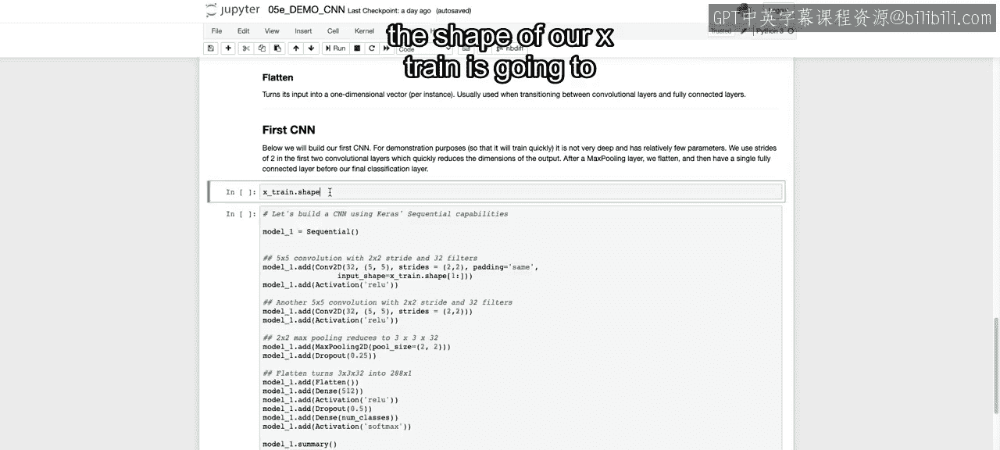

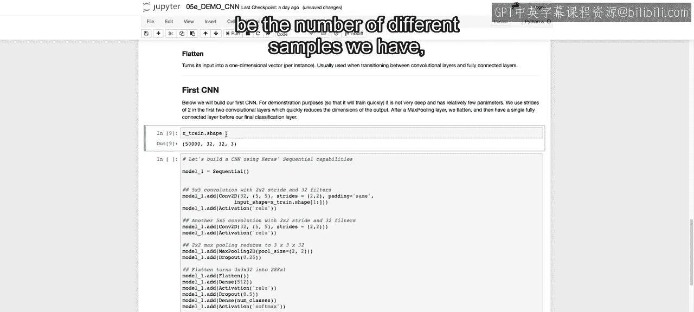

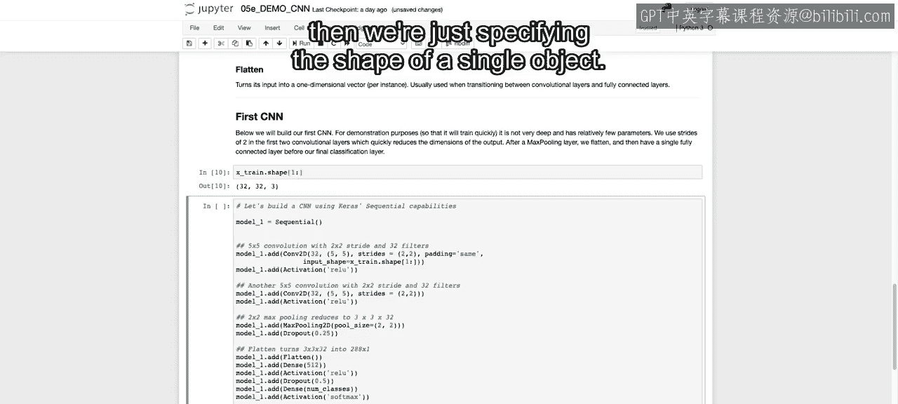

So we added on that convolutional layer， we then have our activation。

 which is going to be relo to ensure that we have that nonlinearity。

We then add on another convolutional layer， again setting the number of filters equal to 32。We are。

Going 5 by 5 in regards to our kernelel and recall that if we do 5 by 5。

 then we're moving along our image， and that will keep continuously reduce the size of each one of the layers as we move across。

 especially since our shs are 2 by 2。We then add on another activation layer。

We can then do our max pooling， which will just take the max of a certain grid and we're setting that pool side equal to 2 by 2。

 So we're going to reduce very quickly the size of our layer。

We then also going to introduce some dropout to add a bit of regularization。

We then flattened that out。So that now we're working with just a one dimensional object rather than that three dimensional object that we were working with in the earlier layer。

We can then do。Add on a dense layer so that we have one fully connected layer again， call relu。

 so we have a nonlinearity again called dropout for some extra regularization。

And then we're going to add on that final dense layer。

So that our output is equal to the number of classes we have。

 because ultimately if you think about our neural network it needs to specify。

 it needs to predict one of these 10 classes。And then we set our activation equal to softm as we do when we're trying to predict amongst multiple categories。

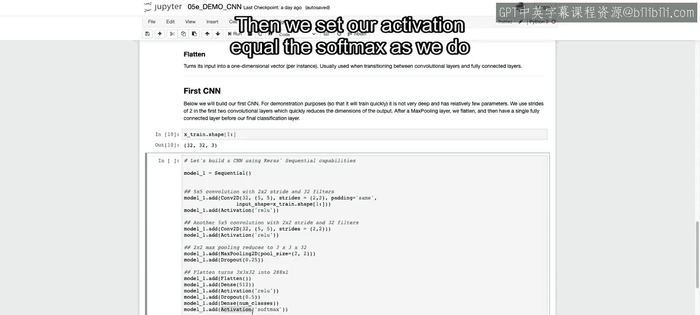

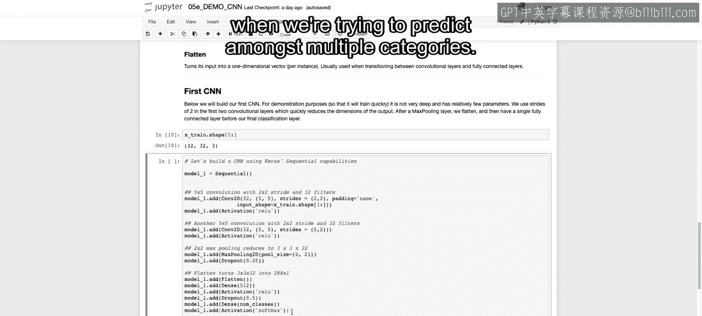

And we can call the Model1。t summary。

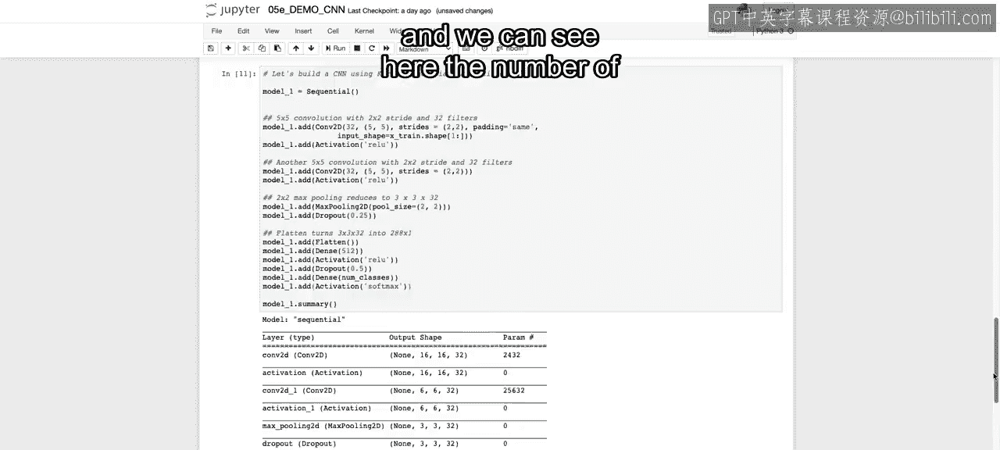

And we can see here the number of parameters at each step。

And we can see that our output shape is going to reduce at each one of these steps。

 So reduce at first to 16 to 16 by 32。 We kept the depth at 32 at both steps。

 Then we have 6 by 6 by 32。 We called max pooling， and that reduced it to 3 by 3 by 32。😊。

And then we had our dense layer and you see there's a ton of parameters there and recall that these dense layers are going to have a lot more parameters and be a lot more variance。

Than we would have with our convolutional layers。 We have one more dense layer。

 and then our final activation。😊。

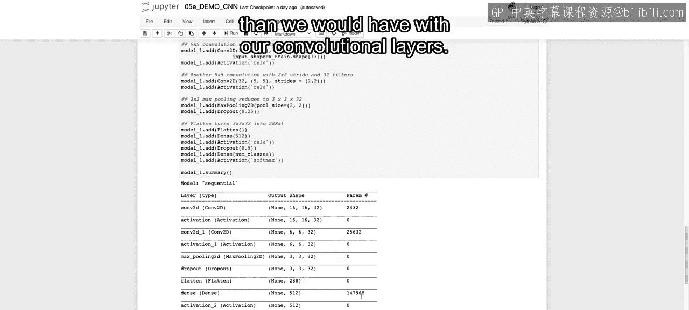

We can then specify our batch size。As well as the optimizers we're going to use。

 So we're specifying we want the RMS prop optimizer with this learning rate。

 and we can specify the decay if you call from RMS Pro。And then with that。

 we compiled using categorical cross entropy rather than our binary cross entropy。

 We can specify the optimizer。Metrics are want to track。

And then actually fit our model with the batcht size， specifying the number of epochs。

 We have our validation data to see on the holdout set how it does。And we can shuffle equals true。

 And that'll just be in regards to， as we optimize， we want to shuffle our data throughout。

 So I'm going to let this run and we'll come back once it's done running。 I want to warn you。

 this may take some time。

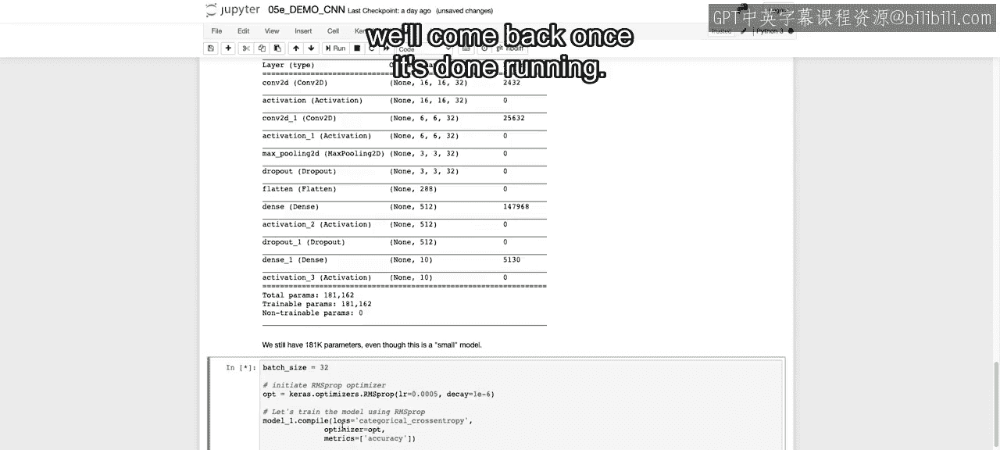

So that should have taken maybe five minutes， maybe a bit longer in order to run。

 and we can actually see the timing for each epoch as we ranm through。

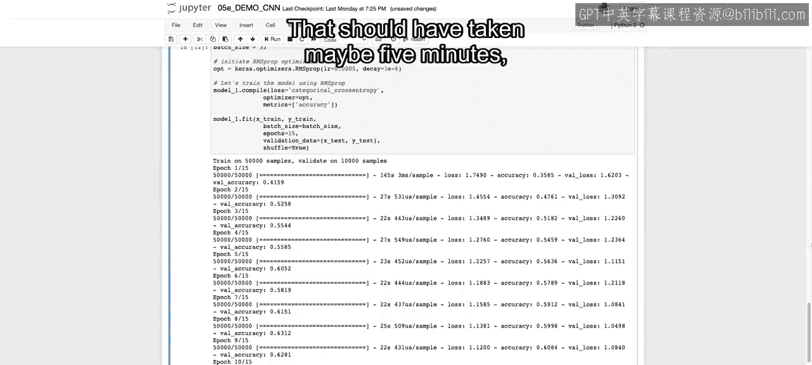

And we have here the 15 different epochs。And we can see that the loss on the training set continuously went down for each one in 15 epochs。

And we didn't save it as we did before so that we can access that history key。

 that history dictionary， but we can see what happened at each step。

 and we can see that we're tracking that validation loss and that goes down for the first number of epochs and then around here we see that it starts to fluctuate where it goes down back up down again on that validation set looking from 1。

049 to 1。08， and then we can see that the accuracy rather than continue going up starts to fluctuate as well。

On that validation set， but it continues to increase。For that training set。

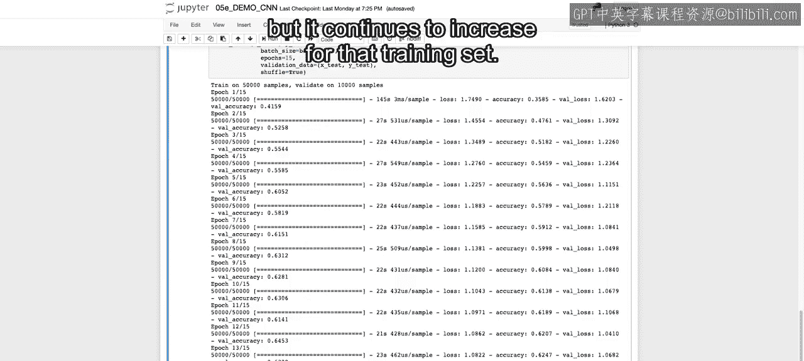

Now， if we wanted to do any type of prediction， we can do the same thing that we did in our last notebook by taking that model。

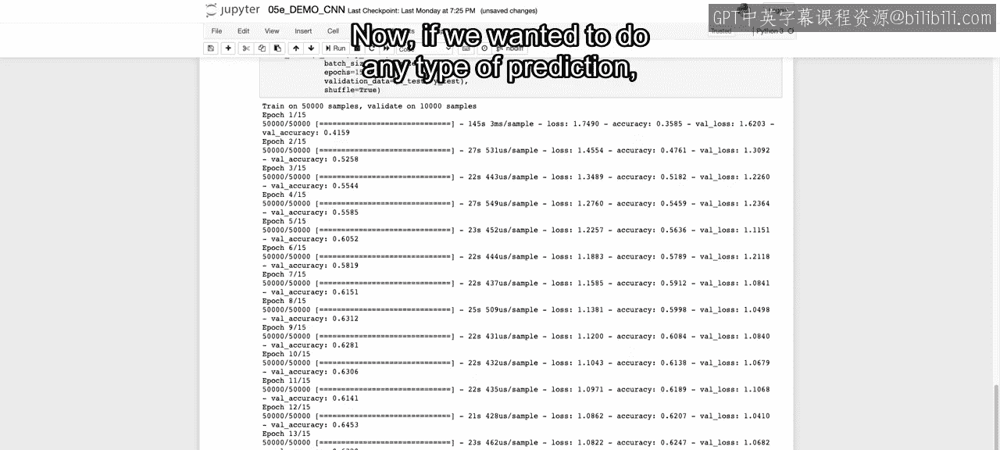

And calling if we want the probabilities， we can just do dot predict。

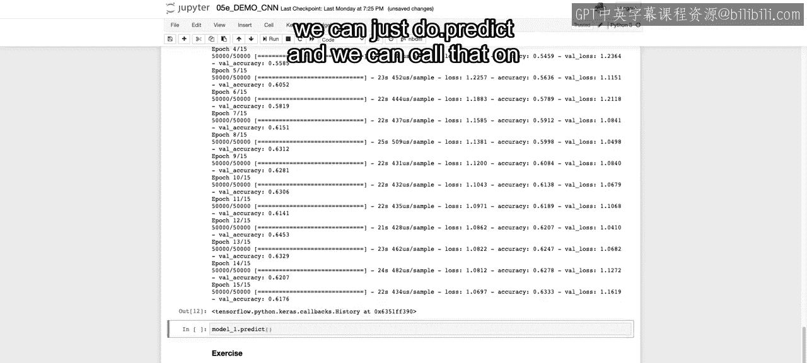

And we can call that on our X test。And we run that。

 and that'll give the probabilities for each one of the different classes。

 If we want to predict the specific class， we can just call not predict classes。

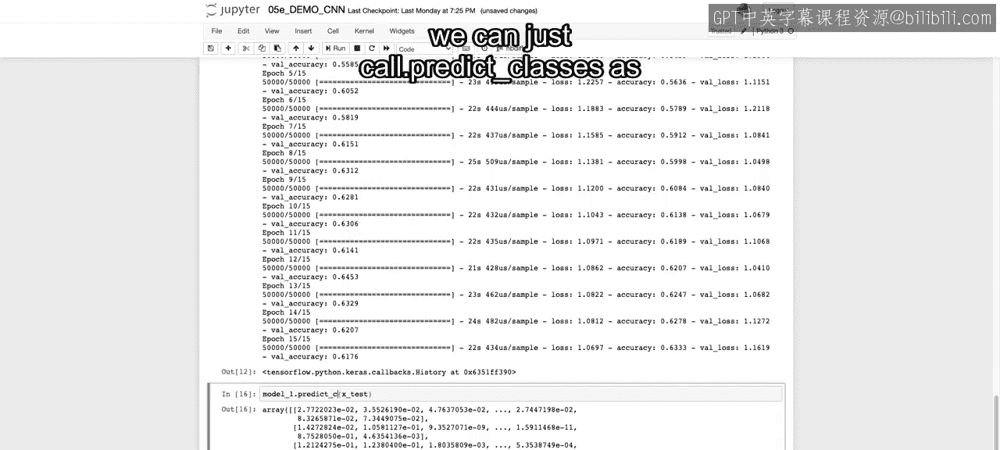

As we did before， and we see here that as a prediction for each class。Now， if we recall。

 if we wanted to test our accuracy， let's say， or any other metric， whether we want to look at the。

 well， I would say if we want to look at the accuracy or something else that requires that actual prediction。

If you recall our Y test had been converted to this one hot encoded version of Y test。

So we'll have to take the inverse， take it back to what it was originally。 and in order to do that。

 we can just。Pull in numpy。And call NP。org max。And that'll just say。

 where's the maximum arguments you have to specify across axis 1。And when we call that。

 we can get each one of the actual values， and we can see from what we have here。

 it probably predicted correctly for 388 and 507， the accuracy score should be what we have here。

 but we can actually test this， we can import from SK learned metrics， our accuracy score。

From escalar metrics。Accuracy score， and then we can take that accuracy score of。What we have here。

 these are the actual values。And then our prediction that we have here。

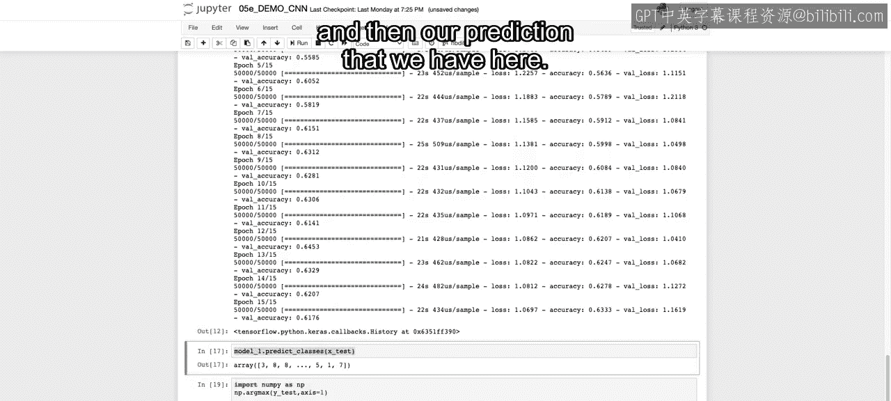

And we have that same value 0。6176， since that was used as a validation set。

So that closes out that first exercise and in the next exercise we will walk through building out a different convolutional neural net and see if we can make any improvements on our current model All right。

 I'll see you there。

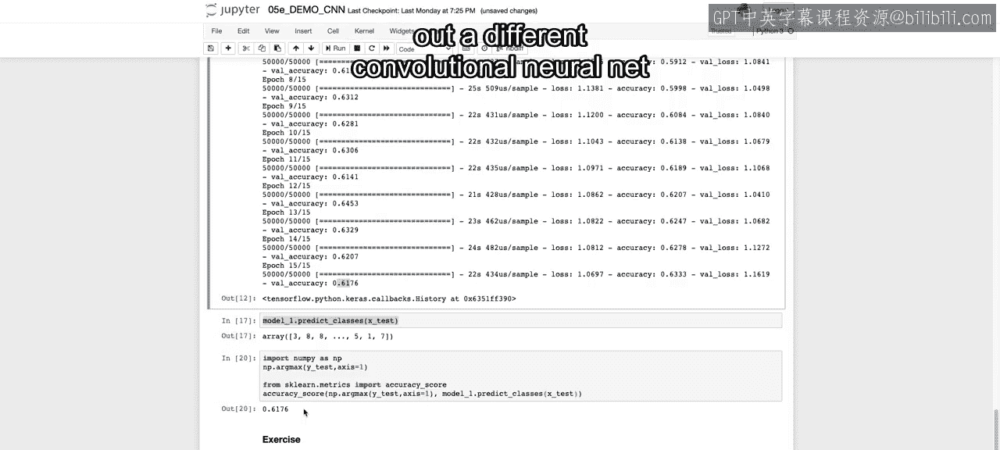

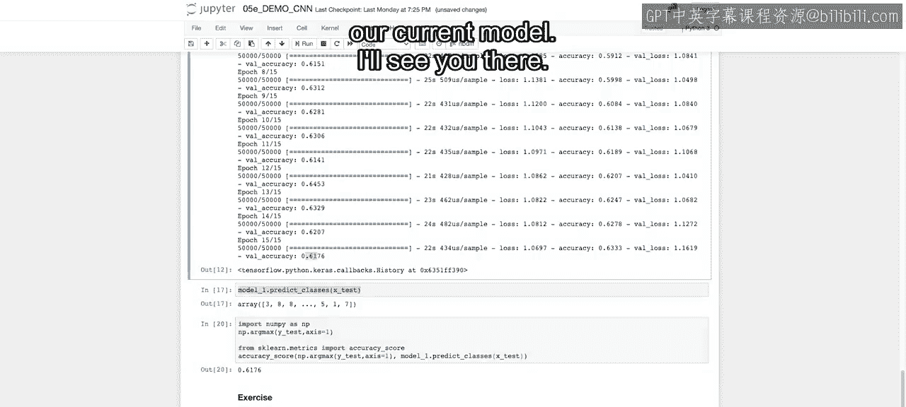